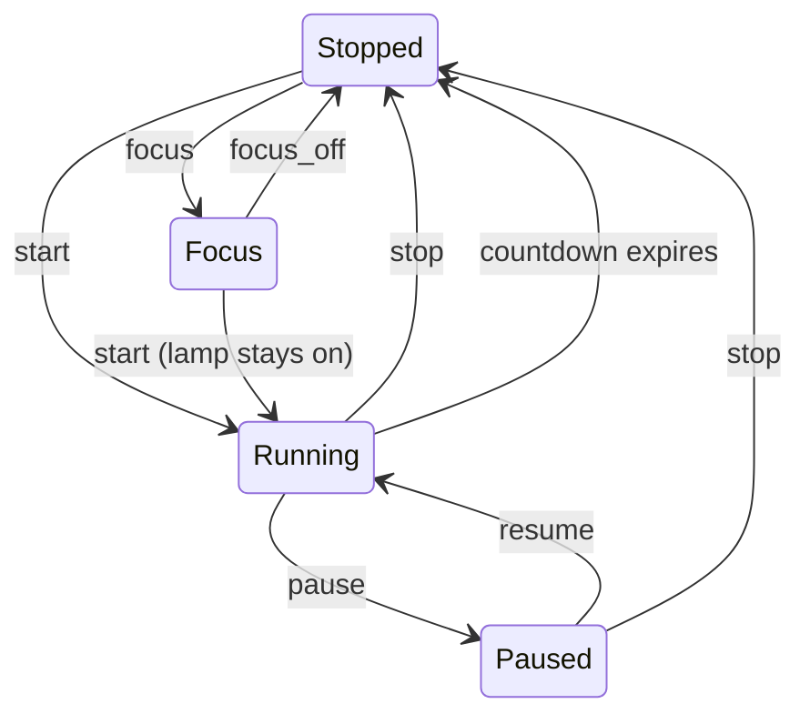

# Darkroom Timer Guide

The darkroom timer turns your ESP32 Macropad into a dedicated enlarger timer with smart relay control. It manages a single exposure countdown, controls an enlarger lamp through a Shelly Plug, and provides focus mode for framing your print — all operated through configurable touch buttons on the device.

This guide covers hardware setup, configuration, and building your first enlarger pad.

---

## Hardware Setup

The darkroom timer controls an enlarger lamp through a **Shelly Plug** (Gen1 or Gen2) on your local network. The Shelly Plug acts as a smart relay; the device sends HTTP commands to turn the lamp on and off.

### Requirements

- A Shelly Plug (any model) connected to your WiFi network
- The enlarger lamp plugged into the Shelly Plug
- The macropad connected to the same WiFi network

### Shelly Plug Configuration

1. Set up the Shelly Plug using the Shelly app and connect it to your WiFi network.
2. Assign a **fixed/static IP address** to the Shelly Plug (recommended — via your router's DHCP reservation or the Shelly app).
3. Note the IP address (e.g., `192.168.1.100`).

> **Tip**: Test the Shelly Plug by opening `http://<shelly-ip>/relay/0?turn=on` in a browser. The relay should click on. Use `turn=off` to turn it back off.

---

## Device Configuration

### Shelly IP Address

Open the web portal and go to the **Home** page. Under the **Darkroom Timer** section, enter the Shelly Plug IP address (or hostname) and save.

The device sends `GET http://<ip>/relay/0?turn=on` and `turn=off` commands to this address. Requests are fire-and-forget with a 2-second timeout — a momentarily unreachable Shelly Plug won't block the timer.

---

## Exposure Timer

The exposure timer is a countdown timer with relay control. Set an exposure time, press start, and the enlarger lamp turns on for exactly that duration. When the countdown reaches zero, the lamp turns off and a beep sounds.

### Timer States

The exposure timer has four states:

| State | Lamp | Description |
|-------|------|-------------|
| **Stopped** | OFF | Idle — ready for a new exposure |
| **Running** | ON | Countdown active — lamp is on |
| **Paused** | OFF | Countdown frozen — lamp is off |
| **Focus** | ON | Lamp on with no countdown — for framing and focusing |

### State Transitions

The **focus → start** transition is seamless — the lamp stays on without any interruption, which avoids the print shifting between framing and exposure.

---

## Binding Tokens

Binding tokens let you display live timer data on button labels. Use these in the **Label** fields of any button on a pad.

### Available Tokens

| Token | Description | Example output |
|-------|-------------|----------------|
| `[expose:time]` | Exposure time setting (seconds) | `8.0` |
| `[expose:remaining]` | Countdown remaining | `8.0` |
| `[expose:elapsed]` | Countdown elapsed | `2.3` |
| `[expose:state]` | Current state | `running` |
| `[expose:relay]` | Relay state | `ON` |

### Format Override

All three time tokens (`time`, `remaining`, `elapsed`) default to seconds with one decimal place (e.g., `8.0`, `5.7`). Override the format with a semicolon when you need a different display:

| Format | Output example | Description |
|--------|----------------|-------------|
| `mm:ss` | `0:08` | Minutes and seconds (default) |
| `mm:ss.d` | `0:08.3` | With tenths of a second |
| `ss` | `8` | Seconds only |
| `ss.d` | `8.3` | Seconds with tenths |
| `hh:mm:ss` | `0:00:08` | Hours, minutes, seconds |

**Examples**:

- `[expose:remaining;mm:ss.d]` — countdown as minutes: `0:08.3`
- `[expose:time;ss]` — exposure setting as whole seconds: `8`
- `Remaining: [expose:remaining]` — with static prefix: `Remaining: 8.0`

### Using with Expressions

Combine with the expression binding for conditional labels:

- `[expr:[expose:state]=="running"?"●":"○"]` — filled dot when running
- `[expr:[expose:state]=="focus"?"FOCUS":""]` — shows "FOCUS" only in focus mode

---

## Button Actions

Use the **Exposure Timer** action type in the button editor to wire buttons to timer commands.

### Available Commands

| Command | Description |
|---------|-------------|
| **Toggle** | Start from stopped, pause from running, resume from paused |
| **Start** | Begin countdown (turns lamp on) |
| **Stop** | Stop and reset timer (turns lamp off) |
| **Pause** | Freeze countdown (turns lamp off) |
| **Resume** | Continue countdown (turns lamp on) |
| **Reset** | Stop timer, keep exposure time setting |
| **Focus Light ON** | Turn lamp on without timer (for framing) |
| **Focus Light OFF** | Turn lamp off (exit focus mode) |
| **Focus Light Toggle** | Toggle focus on/off (no-op while running) |
| **Set Time** | Set exposure time to a specific value (seconds) |
| **Add Seconds** | Adjust exposure ± seconds |
| **Add F-Stops** | Adjust exposure ± f-stops |

### F-Stop Adjustments

**Add F-Stops** multiplies the current exposure time by 2^N, where N is the stop value. This is the standard photographic relationship — each full stop doubles or halves the exposure.

| Value | Effect | 8s becomes |
|-------|--------|------------|
| `1` | +1 stop (double) | 16s |
| `-1` | -1 stop (halve) | 4s |
| `0.5` | +½ stop | 11.3s |
| `-0.5` | -½ stop | 5.7s |
| `0.333` | +⅓ stop | 10.1s |
| `-0.333` | -⅓ stop | 6.3s |

> **Tip**: Use ⅓-stop increments (`0.333` and `-0.333`) for fine-tuning. These match the standard ⅓-stop aperture clicks on most enlarger lenses.

### Multi-Action Buttons

Buttons support multiple actions that execute in sequence. Useful combinations:

- **Start + Beep**: Play a confirmation beep when starting an exposure
- **Reset + Set Time**: One button that resets and loads a preset exposure time

---

## Building an Enlarger Pad

Here's a practical walkthrough for building a darkroom enlarger control pad.

### Recommended Layout

A 3×4 grid works well for an enlarger pad on the JC4880P433 (480×800 portrait display):

| | Column 1 | Column 2 | Column 3 |
|---|----------|----------|----------|
| **Row 1** | Time display | Remaining display | State indicator |
| **Row 2** | -⅓ stop | Start / Pause | +⅓ stop |
| **Row 3** | -1s | Stop / Reset | +1s |
| **Row 4** | Focus | Set 8s | Set 15s |

### Step-by-Step Setup

1. **Create a new pad** — Open the Pads page, select an empty pad, set it to 3 columns × 4 rows, and name it "Enlarger".

2. **Time display button** (row 1, col 1) — Set the center label to `[expose:time;ss.d]s` and give it a dark background. No action needed — this is a display-only button showing the current exposure setting.

3. **Remaining display button** (row 1, col 2) — Set the center label to `[expose:remaining;mm:ss.d]`. Use a label style with a large font (`font_size:48`) so the countdown is easy to read under safelight.

4. **State indicator** (row 1, col 3) — Set the center label to `[expose:state]`. Optionally use a dynamic background color with an expression binding.

5. **F-stop buttons** (row 2, col 1 and col 3):
   - **-⅓ stop**: Label `-⅓`, action = Exposure Timer → Add F-Stops, value = `-0.333`
   - **+⅓ stop**: Label `+⅓`, action = Exposure Timer → Add F-Stops, value = `0.333`

6. **Start/Pause button** (row 2, col 2) — Label `[expr:[expose:state]=="running"?"PAUSE":"START"]`, action = Exposure Timer → Toggle. Use a green background for visibility.

7. **Second adjustment buttons** (row 3, col 1 and col 3):
   - **-1s**: Label `-1s`, action = Exposure Timer → Add Seconds, value = `-1`
   - **+1s**: Label `+1s`, action = Exposure Timer → Add Seconds, value = `1`

8. **Stop/Reset button** (row 3, col 2) — Label `STOP`, action = Exposure Timer → Stop. Use a red background.

9. **Focus button** (row 4, col 1) — Label `[expr:[expose:state]=="focus"?"FOCUS ●":"FOCUS"]`, action = Exposure Timer → Focus Light Toggle. Safe during an active exposure (no-op while running).

10. **Preset buttons** (row 4, col 2 and col 3):
    - **8s preset**: Label `8s`, action = Exposure Timer → Set Time, value = `8`
    - **15s preset**: Label `15s`, action = Exposure Timer → Set Time, value = `15`

### Label Legibility

In a darkroom under safelight, the display is your primary light source. Keep these tips in mind:

- Use **large font sizes** for countdown displays (`font_size:36` or larger)
- Use **high-contrast colors** — white or bright text on dark backgrounds
- Keep labels **short** — abbreviate where possible
- The `mm:ss.d` format with tenths is useful during focusing but `mm:ss` is sufficient during normal printing

---

## Chemistry Timers

For timing chemical processing (developer, stop bath, fixer), the darkroom timer device includes the standard **Timer Control** action type with three independent count-up or countdown timers. These use the existing timer engine and don't require the Shelly Plug.

Configure chemistry timers on the **Home** page under the **Timers** section. Set each timer's mode (count-up or countdown) and countdown preset. Use Timer Control button actions to start, stop, and reset each timer.

A typical setup uses Timer 1 for the developer, Timer 2 for stop bath, and Timer 3 for fixer — each with its own countdown preset and expire beep.

See the [Pad Editor Guide](pad-editor-guide.md) for general button and binding configuration details.
