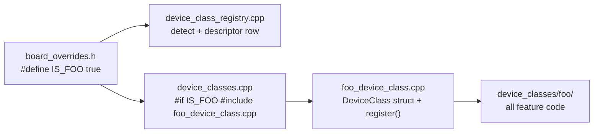

# Adding a New Device Class

This guide enumerates every touchpoint required to add a new device class
(e.g. `coffee_scale`, `darkroom_timer`) to the firmware. The architecture is
intentionally narrow: a device class is a folder under `src/app/device_classes/`,
one row in a registry table, one product-variant flag in a board override, and
a handful of feature-gated `#include` lines in existing aggregator files.

The shutter-tester device class is the reference implementation; every
section below cites the corresponding shutter-tester file as a worked example.

## Mental Model

A **device class** is a self-contained product variant that plugs into the
core firmware through three independent mechanisms:

1. **Branding** — a `DeviceClass` enum value + descriptor row used to derive
   the device name, AP SSID, web portal title, and HA model string.
2. **Runtime hooks** — a `DeviceClass` struct of optional function pointers
   (lifecycle, power, config, MQTT) registered into a fixed-size static
   registry. Core code calls `device_class_dispatch_*` at well-defined
   points; only the hooks the class fills in actually run.
3. **Compilation aggregation** — because `arduino-cli` only compiles `.cpp`
   files in the sketch root, every `.cpp` under `device_classes/<name>/`
   must be `#include`d from a feature-gated block in an aggregator
   (`device_classes.cpp`, `portal_components.cpp`, `route_components.cpp`,
   `widgets.cpp`, `sensors.cpp`).

The class is enabled by a single `IS_<NAME>` flag set in one or more board
override files. Boards that do not set the flag pay zero flash cost.



## Touchpoint Checklist

For a new class named `foo` (replace with your name in `lower_snake_case`,
flag form `IS_FOO`, enum `FOO`):

| # | File | Edit | Reference |
|---|---|---|---|
| 1 | `src/app/device_class_registry.h` | Add `FOO` to the `DeviceClass` enum | shutter: `SHUTTER_TESTER` |
| 2 | `src/app/device_class_registry.cpp` | Add `#elif IS_FOO` arm to `device_class_detect()`; add row to `DESCRIPTORS[]` | shutter row |
| 3 | `config.sh` | Add `foo)` case to `device_class_brand_prefix()`; add `IS_FOO` grep to `device_class_for_board()` | `shutter_tester)` case |
| 4 | `src/boards/<board>/board_overrides.h` | `#define IS_FOO true` on each board that should ship this class | jc4880p433-shutter |
| 5 | `src/boards/<board>/metadata.json` | Set `"device_class": "foo"` | jc4880p433-shutter |
| 6 | `src/app/device_classes/foo_device_class.cpp` | Aggregator + `DeviceClass` struct + `foo_device_class_register()` | shutter_tester_device_class.cpp |
| 7 | `src/app/device_classes.cpp` | Add `#if IS_FOO #include "device_classes/foo_device_class.cpp"` and `foo_device_class_register();` call | shutter block |
| 8 | `src/app/device_classes/foo/` | All feature code lives here | device_classes/shutter_tester/ |

The next sections cover each touchpoint in detail, plus optional touchpoints
(portal components, web routes, widgets, action types, list providers).

## 1. Register the Class Identity

### 1.1 Add the Enum Value

[src/app/device_class_registry.h](src/app/device_class_registry.h)

```cpp
enum class DeviceClass {
    MACROPAD,
    EPAPER,
    HEADLESS,
    SHUTTER_TESTER,
    FOO,                  // <-- add
};
```

### 1.2 Add the Detection Branch and Descriptor Row

[src/app/device_class_registry.cpp](src/app/device_class_registry.cpp)

Product-variant flags (`IS_*`) are checked **before** hardware flags so a
variant running on macropad hardware still resolves to its specialized class.
Add the new branch in priority order:

```cpp
DeviceClass device_class_detect() {
#if IS_FOO
    return DeviceClass::FOO;
#elif IS_SHUTTER_TESTER
    return DeviceClass::SHUTTER_TESTER;
#elif HAS_EPAPER
    return DeviceClass::EPAPER;
#elif !HAS_DISPLAY
    return DeviceClass::HEADLESS;
#else
    return DeviceClass::MACROPAD;
#endif
}
```

Add a row to `DESCRIPTORS[]`. Keep `slug` short and upper-case (used in the
default AP SSID); keep `full_name` aligned with `device_class_brand_prefix`
in `config.sh`:

```cpp
static const DeviceClassDescriptor DESCRIPTORS[] = {
    { DeviceClass::MACROPAD,       "Macropad",       "MACROPAD", "ESP32 Macropad"          },
    { DeviceClass::EPAPER,         "E-Paper",        "EPAPER",   "ESP32-MP E-Paper"        },
    { DeviceClass::HEADLESS,       "Headless",       "HEADLESS", "ESP32-MP Headless"       },
    { DeviceClass::SHUTTER_TESTER, "Shutter Tester", "SHUTTER",  "ESP32-MP Shutter Tester" },
    { DeviceClass::FOO,            "Foo",            "FOO",      "ESP32-MP Foo"            }, // <-- add
};
```

### 1.3 Mirror the Branding in `config.sh`

[config.sh](config.sh)

The bash helpers are mirrored manually; drift is caught by
[tests/test_branding_mirror.sh](tests/test_branding_mirror.sh).

```bash
device_class_brand_prefix() {
    case "$1" in
        macropad)       echo "ESP32 Macropad" ;;
        epaper)         echo "ESP32-MP E-Paper" ;;
        headless)       echo "ESP32-MP Headless" ;;
        shutter_tester) echo "ESP32-MP Shutter Tester" ;;
        foo)            echo "ESP32-MP Foo" ;;            # <-- add
        *)              echo "" ;;
    esac
}

device_class_for_board() {
    # ...
    if grep -qE '^[[:space:]]*#define[[:space:]]+IS_FOO[[:space:]]+true[[:space:]]*$' "$overrides_file"; then
        echo "foo"                                         # <-- add
        return
    fi
    if grep -qE '^[[:space:]]*#define[[:space:]]+IS_SHUTTER_TESTER[[:space:]]+true[[:space:]]*$' "$overrides_file"; then
        # ...
}
```

After editing, run `./tests/run_tests.sh` (it invokes
`test_branding_mirror.sh`) to confirm the C++ table and the bash helpers
agree.

## 2. Enable the Class on a Board

### 2.1 Board Override

[src/boards/jc4880p433-shutter/board_overrides.h](src/boards/jc4880p433-shutter/board_overrides.h)
is the reference pattern. A new board variant typically `#include`s its base
board's overrides and layers the product flag on top:

```cpp
#include "../jc4880p433/board_overrides.h"

#define IS_FOO true

// Optional portal hero: makes the device class's first nav entry the
// landing page and shows a welcome card on the root.
#define PORTAL_PRIMARY_FRAGMENT "foo-main"
#define PORTAL_PRIMARY_CATEGORY "foo"
#define PORTAL_PRIMARY_LABEL    "Foo"
#define PORTAL_PRIMARY_ICON     "\xf0\x9f\x94\xa7"  // 🔧
```

### 2.2 Board Metadata

[src/boards/jc4880p433-shutter/metadata.json](src/boards/jc4880p433-shutter/metadata.json)

Set `"device_class": "foo"`. This drives the ESP Web Tools flash page card
label and is consumed by `tools/build-esp-web-tools-site.sh`.

## 3. Implement the Class

### 3.1 Folder Layout

Put everything device-class-specific under
`src/app/device_classes/foo/`:

```
src/app/device_classes/
  foo_device_class.cpp           <-- aggregator + DeviceClass struct
  foo/
    foo_config.cpp               <-- module-local config singleton
    foo_config.h
    foo_binding.cpp              <-- [foo:...] binding scheme (optional)
    foo_binding.h
    foo_actions.cpp              <-- ActionTypeDef (optional)
    foo_payload.h                <-- ActionPayload device_class arm (optional)
    components/
      foo_component.cpp          <-- portal component (optional)
    web/
      foo.fragment.html          <-- portal fragment HTML
      portal_foo.js              <-- portal JS handlers
      portal_foo.css             <-- portal CSS (optional)
      portal_foo_routes.cpp      <-- REST endpoints (optional)
    widgets/
      foo_widget.cpp             <-- custom widget (optional)
```

Files are not auto-compiled by `arduino-cli`; they are pulled in via
aggregator `#include` lines (see §4).

### 3.2 The `DeviceClass` Struct and Aggregator

[src/app/device_classes/shutter_tester_device_class.cpp](src/app/device_classes/shutter_tester_device_class.cpp)
is the reference. Every translation unit under the class folder is
`#include`d at the bottom of this file so they enter the build atomically
under the `IS_FOO` gate. The top of the file declares static hook functions
and registers the `DeviceClass` instance.

All hooks in [src/app/device_class.h](src/app/device_class.h) are optional;
fill in only what you need.

| Hook | When called | Typical use |
|---|---|---|
| `on_setup_early` | After config load, before WiFi/portal | One-shot hardware init that the rest of setup depends on |
| `on_setup_late` | After WiFi/AP/portal | Sensor/measurement init, binding/list-provider registration |
| `on_loop` | Every `loop()` iteration | Drain queues, process captured data (must not block) |
| `run_duty_cycle` | When `owned_mode` matches boot mode | Owns the entire duty cycle for the mode |
| `on_wake_classify` | From `power_manager_boot_init()` | Classify wake reason; optionally force Config Mode |
| `on_sleep_prepare` | Right before `esp_deep_sleep_start()` | Arm additional wake sources, adjust sleep duration |
| `config_defaults` | When no valid config exists | Populate device-class fields with defaults |
| `config_load` / `config_save` | NVS load/save | Bridge to a module-local config singleton |
| `config_api_get` / `config_api_set` | REST `/api/config` | Append/parse device-class fields |
| `mqtt_on_discovery` | HA discovery publish | Publish device-class entities; set `*skip_generic` to suppress core discovery |
| `mqtt_publish_state` | Discovery bootstrap | Publish initial state snapshot |

### 3.3 Bind to the Aggregator

[src/app/device_classes.cpp](src/app/device_classes.cpp) — add two blocks:

```cpp
#if IS_FOO
#include "device_classes/foo_device_class.cpp"
#endif

void device_classes_register_all() {
#if HAS_EPAPER
    epaper_device_class_register();
#endif
#if IS_SHUTTER_TESTER
    shutter_tester_device_class_register();
#endif
#if IS_FOO
    foo_device_class_register();           // <-- add
#endif
}
```

## 4. Optional: Hook Into Subsystem Aggregators

These edits are only needed for the subsystems the class touches.

### 4.1 Portal Components

[src/app/portal_components.cpp](src/app/portal_components.cpp) — add a block
that pulls in every portal component `.cpp` for the class. Without this,
the component's `REGISTER_COMPONENT()` static initializer never runs and
the component is silently absent from the nav.

```cpp
#if IS_FOO
#include "device_classes/foo/components/foo_component.cpp"
#include "device_classes/foo/foo_config.cpp"   // module-local config singleton
#endif // IS_FOO
```

### 4.2 Web Routes

[src/app/route_components.cpp](src/app/route_components.cpp) — REST route
registration files (`REGISTER_ROUTES()`) for the class:

```cpp
#if IS_FOO
#include "device_classes/foo/web/portal_foo_routes.cpp"
#endif
```

### 4.3 Widgets

[src/app/widgets.cpp](src/app/widgets.cpp) — custom widget implementations:

```cpp
#if IS_FOO
#include "device_classes/foo/widgets/foo_widget.cpp"
#endif
```

### 4.4 Sensor Drivers

[src/app/sensors.cpp](src/app/sensors.cpp) — sensor driver implementations
and registration. Follows the same aggregator pattern as the other
subsystem files: a file-scope `#if HAS_SENSOR_*` `#include` of the driver
`.cpp` plus a matching `register_*_sensor(registry)` call inside
`sensor_manager_register_all`. Without both halves the driver is silently
absent from the sensor manager.

```cpp
#if HAS_SENSOR_FOO
#include "device_classes/foo/sensors/foo_sensor.cpp"
#endif

void sensor_manager_register_all(SensorRegistry &registry) {
    #if HAS_SENSOR_FOO
    register_foo_sensor(registry);
    #endif
    // ... existing sensors ...
}
```

### 4.5 Web Assets

Files under `device_classes/foo/web/` are picked up automatically by
[tools/minify-web-assets.sh](tools/minify-web-assets.sh):

- `*.fragment.html` — emitted as gated PROGMEM blobs and registered in the
  fragment lookup table. Feature flag is derived from filename via
  `asset_feature_flag()` (extend this case statement for the new class).
- `*.js` — emitted as gated PROGMEM blobs. Extend the same
  `asset_feature_flag()` case statement for device-class JS files
  (fragment and JS stem namespaces are disjoint).
- `*.css` — emitted directly, or rolled into a chunked CSS bundle (see
  `portal-all.css.bundle` for the chunked pattern).

To add the device-class CSS to the shared bundle so it ships as one combined
gzip blob instead of a separate HTTP request, add a chunk marker to
[src/app/web/portal-all.css.bundle](src/app/web/portal-all.css.bundle):

```
# [chunk:foo IS_FOO]
portal_foo.css
```

**Chunk naming convention:** chunk markers use the form
`[chunk:<full_class_name> IS_<CLASS>]`. Use the **full** device-class name
(e.g. `coffee_scale`, `shutter_tester`) and never an abbreviation
(`[chunk:scale]`, `[chunk:shutter]`) so chunk names never collide as more
device classes land. Same convention applies to any future chunked-JS
bundle.

### 4.6 Action Types

If the class defines new button action types (e.g. `"foo_start"`), use the
`ActionTypeDef` registry rather than editing the core `action_dispatch.cpp`
strcmp ladder.

The payload is stored in the opaque `ActionPayload::device_class` arm
(see [src/app/pad_config.h](src/app/pad_config.h)). Mirror the shutter
pattern in [src/app/device_classes/shutter_tester/shutter_payload.h](src/app/device_classes/shutter_tester/shutter_payload.h):

```cpp
#pragma once
#if IS_FOO
#include "../../pad_config.h"

#define ACTION_TYPE_FOO "foo"

struct FooPayload {
    char command[CONFIG_TIMER_CMD_MAX_LEN];
    char value[CONFIG_BINDABLE_SHORT_LEN];
};

static_assert(sizeof(FooPayload) <= ACTION_PAYLOAD_DEVICE_CLASS_BYTES,
              "FooPayload exceeds ACTION_PAYLOAD_DEVICE_CLASS_BYTES "
              "— raise it via board_overrides.h");

inline FooPayload& foo_payload(ButtonAction& act) {
    return *reinterpret_cast<FooPayload*>(act.payload.device_class);
}
inline const FooPayload& foo_payload(const ButtonAction& act) {
    return *reinterpret_cast<const FooPayload*>(act.payload.device_class);
}
#endif
```

Keep parse, serialize, dispatch, validation, binding-field handling, and
`describe()` metadata in the class's `foo_actions.cpp`. Define and register
the descriptor together with one `DEFINE_AND_REGISTER_ACTION_TYPE(...)` call
(see
[src/app/device_classes/shutter_tester/shutter_actions.cpp](src/app/device_classes/shutter_tester/shutter_actions.cpp)).

Do not add a device-class action to `src/app/actions/action_modules.inc`.
That manifest aggregates built-in actions only. Device-class action modules
remain with their owner and are compiled by the existing feature-gated
device-class aggregator.

If your payload follows the `{ command, value }` convention and `value` is
bindable (`[scheme:...]` tokens) and/or the numeric rocker's `{step}` target,
expose it via the `value_field` accessor on `ActionTypeDef`. Shared code then
drives binding resolution, the `[` binding scan, and `{step}` substitution
generically against that one pointer — you do not write a per-type
`resolve_bindings` / `has_binding` / `substitute_step`. Types with no single
value field (e.g. shelly's `host`/`relay`/`on`) leave `value_field` `nullptr`.

**Size budget**: the default `ACTION_PAYLOAD_DEVICE_CLASS_BYTES` is 96 B.
Today the dominant arm is `NotifyPayload` at 394 B, so the device-class slot
does not move `sizeof(ActionPayload)`. If your payload exceeds 96 B, prefer
raising it in `board_overrides.h` of the boards that ship the class rather
than raising the default — that would cost every board.

### 4.6 Bindings, List Providers, Pad Blocks

These all use registration-based APIs called from `on_setup_late`:

- **Binding scheme**: `binding_template_register_scheme("foo", ...)` from
  the class's binding init function.
- **List provider**: `list_provider_register(...)` exposes a `[list:foo.selected]`
  data source.
- **Pad block**: `pad_block_register(...)` adds pre-configured button groups
  to the pad editor.

All three are described in the binding system instructions
([.github/instructions/binding-system.instructions.md](.github/instructions/binding-system.instructions.md))
and the existing shutter-tester implementations.

## 5. Verify

After all touchpoints are in place:

```bash
./tests/run_tests.sh                       # confirms branding mirror passes
./build.sh <board-that-enables-IS_FOO>     # confirms full build links
./build.sh <board-that-does-NOT-enable-IS_FOO>   # confirms no leak
```

Then physically verify:

- AP SSID and HA model string carry the new brand prefix on the FOO board.
- Portal nav shows the new components only on the FOO board.
- `/api/config` round-trips the new fields.
- Boards without `IS_FOO` build identically to before the change (compare
  `build/<board>/*.bin` sizes).

## Anti-Patterns

These mistakes silently break the class without producing a build error:

- **Forgetting `portal_components.cpp` aggregation** — the component
  `REGISTER_COMPONENT()` initializer never runs; the nav entry is silently
  absent. Same trap for `route_components.cpp`, `widgets.cpp`, and the
  `device_classes.cpp` `register_all` call.
- **Adding `IS_FOO` checks to core files** — every `#if IS_FOO` outside
  the class folder and the aggregators listed in this document is debt.
  Push the logic into the device class and call it through a registered
  hook.
- **Raising `ACTION_PAYLOAD_DEVICE_CLASS_BYTES` in `pad_config.h`** — the
  default lives there for sizing canaries; per-class overrides belong in
  `board_overrides.h` of the boards that need them.
- **Reusing another class's `IS_*` flag** — each class must have its own
  flag so detection precedence in `device_class_detect()` is unambiguous
  and so boards can ship them independently.

## See Also

- [.github/copilot-instructions.md](.github/copilot-instructions.md) — Architecture overview, key files, compilation aggregation rules.
- [docs/dev/build-and-release-process.md](docs/dev/build-and-release-process.md) — Device Class Branding section.
- [docs/dev/display-touch-architecture.md](docs/dev/display-touch-architecture.md) — Display/touch driver HAL conventions.
- [docs/dev/web-portal.md](docs/dev/web-portal.md) — Portal component and REST API conventions.
- [.github/instructions/binding-system.instructions.md](.github/instructions/binding-system.instructions.md) — Binding scheme registration.
- [.github/instructions/compile-time-flags.instructions.md](.github/instructions/compile-time-flags.instructions.md) — `HAS_*` / `IS_*` flag conventions.
