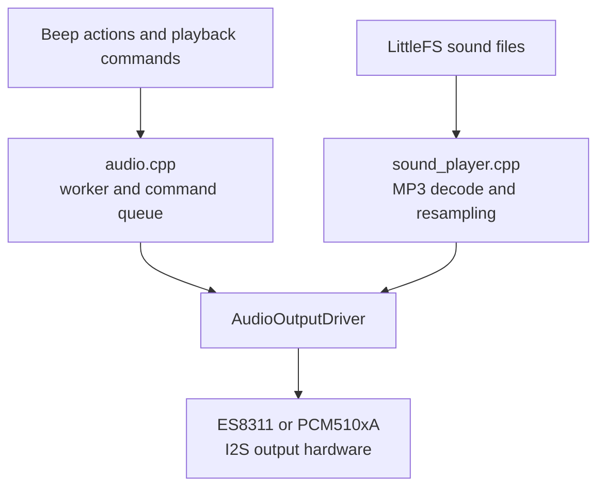

# Audio Architecture

The audio subsystem produces beeps and MP3 playback through a board-selected
output driver. It keeps command handling, decode work, and hardware I/O in
separate layers so output hardware can vary without changing callers.

## Architecture And Data Flow

`audio.cpp` owns the asynchronous audio worker, command queue, volume state,
and output-starvation timing. `sound_player.cpp` owns MP3 decode, source-rate
conversion, and transfer of interleaved PCM frames to the selected output
driver. `AudioOutputDriver` provides the hardware boundary used by both paths.

`audio_output_drivers.cpp` includes exactly one concrete driver selected by
`AUDIO_OUTPUT_DRIVER`. New output hardware must implement `AudioOutputDriver`
rather than adding hardware-specific behavior to callers.

## Music CD Player

Audio-capable builds with the sound player enabled also provide a bounded Music
CD assembled from canonical MP3 paths discovered recursively under `/media`.
The audio worker owns the immutable catalog, CD-style transport, incremental
decoder session, and elapsed-time accounting. The catalog uses
two PSRAM-backed snapshots: the worker builds an inactive slot and publishes
it, while portal readers copy the active slot under a normal FreeRTOS mutex.
Catalog-sized copies never run under a `portMUX` critical section or on the
audio-task stack. The audio worker remains the only owner of decoder,
resampler, output driver, and I2S path.

Music transport supports Play/Pause, Next, Previous, and Stop. Playback starts
at the first sorted path, does not wrap, and returns to its home position after
Stop, a final track, or a playback failure. Before PCM is emitted for a track,
the decoder opens the file and begins incremental playback immediately. Catalog
discovery reads a bounded MP3 prefix to parse ID3 title, artist, album, and
track metadata plus Xing/Info, VBRI, or CBR-estimated duration. This avoids a
full-file decode before playback; elapsed time advances only after PCM output
is accepted.

Tone Alerts overlay active Music after resampling and before the existing sole
output write. MP3 Alerts are exclusive: they stop Music and use the same
decoder session and output path. Music files can be managed through the portal
only while neither Music nor an MP3 Alert is active.

Music transport and catalog-refresh requests use a dedicated, bounded worker
queue. This keeps them independent from replaceable tone/alert requests, so an
alert cannot discard a pending refresh. Transport submission is non-blocking
and reports busy when the queue is full.

### Demand-Driven Music Analysis

On selected ESP32-P4 audio boards, `HAS_MUSIC_ANALYSIS` enables optional
pre-volume analysis of Music MP3 playback. The existing Music binding exposes
the values through `[music:analysis.*]`:

* `[music:analysis.rms]` and `[music:analysis.peak]` return integer levels from
    0 to 100.
* `[music:analysis.band.0]` through `[music:analysis.band.7]` return eight fixed
    logarithmic visualizer bands.

The feature has two guards. The compile-time flag removes the analyzer from
boards that do not support it. On enabled boards, the display task rebuilds a
demand mask from configured binding consumers. Music playback only reads this
mask when producing PCM and skips analysis when no analysis binding is present.

Spectrum analysis uses a bounded, PSRAM-first 2048-frame mono window and eight
fixed Goertzel filters. It is capped at 20 updates per second and does not add a
general FFT dependency. The small published snapshot is copied under a short
critical section; PCM buffers remain owned by the audio worker.

## Board And Driver Selection

Audio-capable boards select their driver and pin mapping in
`board_overrides.h`. The common defaults and driver identifiers live in
`board_config.h`.

| Board | Output hardware | Driver |
| --- | --- | --- |
| `esp32-p4-lcd4b` | ES8311 codec | `ES8311Driver` |
| `jc4880p433` | ES8311 codec | `ES8311Driver` |
| `jc1060p470c` | ES8311 codec | `ES8311Driver` |
| `jc3636w518` | PCM510xA DAC | `PCM510xADriver` |

The audio sample rate is board-configurable. The current audio boards use
48 kHz output; update the I2S clocking and output-buffer timing together when
changing that rate.

## ES8311 Output

The ES8311 driver configures both I2S transport and codec registers through
I2C. At 48 kHz, its master clock is 12.288 MHz, which is a 256x multiple of
the sample rate. Keep the codec configuration and I2S channel rate aligned.

ES8311 provides hardware volume control, so `setVolume()` programs the codec
rather than scaling each PCM sample in software.

### Speech To Text Input

`esp32-p4-lcd4b` enables `HAS_STT` and `HAS_ES7210_MIC`. ES8311 remains the
output codec; the ES7210 dual-microphone ADC provides capture samples on the
existing I2S RX channel. Both codecs use the shared 48 kHz clock. The STT worker
selects one microphone channel and decimates it to a 16 kHz mono, 16-bit WAV.
Recording is capped at 30 seconds, so the WAV uses at most 960,044 bytes of
PSRAM and is discarded after the transcription request completes.

The worker runs on core 0 and sends the in-memory WAV to the Azure AI Foundry
OpenAI-compatible transcription endpoint. It only publishes a small status/text
snapshot to the display task and must not call LVGL.

Create `src/app/stt_credentials.h` from
`src/app/stt_credentials.h.example` and set `STT_AZURE_API_KEY` before using
the feature. `STT_AZURE_MODEL` must be the Azure AI Foundry deployment name.
The firmware sends audio to that deployment's transcription endpoint. The
local header is ignored by Git. The current spike uses an insecure TLS client,
so use it only on a trusted network until certificate validation is configured.

## PCM510xA Output

The PCM510xA has no I2C or SPI control interface. The driver creates a
TX-only I2S channel and controls the external mute pin through `AUDIO_PA_PIN`.

The DAC derives its clocks from BCK and LRCK. Its SCK input is held push-pull
LOW before I2S starts so the DAC PLL can lock. Do not leave SCK floating or
start and stop the clock while a stream is active.

The PCM510xA path applies the shared Q15 gain table in `audio_gain.h` to each
16-bit PCM sample before DMA transfer. The table ranges from silence at volume
0 to unity at volume 100 and must not amplify above unity. Do not replace this
with floating-point gain in the output path.

## I2S Frame Format

PCM samples are 16-bit values carried in 32-bit I2S slots. These width fields
describe different parts of the interface and must agree with that framing:

* `data_bit_width` describes the PCM value and DMA buffer format
* `slot_bit_width` controls the BCK clocks per channel slot
* `ws_width` controls the LRCK high and low duration

For 16-bit data in 32-bit slots, set both `slot_bit_width` and `ws_width` to
32 bits. Changing only the slot width produces an invalid channel frame and
can drop or misplace stereo data.

## Memory And Task Constraints

I2S DMA descriptors and buffers must reside in internal DMA-capable RAM.
PSRAM is not DMA-capable for this transfer path. At 48 kHz, the current TX DMA
payload is $6 \times 240 \times 4 = 5760$ bytes, excluding descriptors and
driver metadata.

MP3 decode and resampling buffers are transient and PSRAM-first. Boards that
enable `AUDIO_MP3_SCRATCH_PSRAM` require PSRAM for decoder scratch space. Keep
large decode buffers out of task stacks, check allocations, and keep output
driver operations limited to I2S and hardware control.

The minimp3 per-frame scratch workspace is roughly 16 KB. Boards with a Music
player and a constrained internal audio stack, including `jc1060p470c`, enable
`AUDIO_MP3_SCRATCH_PSRAM` so decoding uses
`mp3dec_decode_frame_with_scratch()` instead of placing that workspace on the
audio-task stack.

The audio worker stack itself remains in internal RAM because it accesses
flash-backed storage.

The Music catalog is also PSRAM-backed. A catalog retains at most 32 stable,
lexicographically ordered paths; when more files exist, discovery continues,
publishes the first 32, and records overflow metadata. Failed filesystem
refreshes preserve the previously published catalog rather than clearing it.

## MP3 Decode And Resampling

MP3 frames can arrive at several supported source rates. `sound_player.cpp`
resamples interleaved stereo frames to `AUDIO_SAMPLE_RATE` while preserving
state across frame boundaries.

The output-frame capacity is derived from the lowest supported source rate and
the maximum MP3 frame size. It is an exact valid bound, not a warning
threshold. Do not add arbitrary headroom or treat an exact-capacity result as
truncation. When a call ends, carry the fractional position and required
source samples into the next call so adjacent decoded frames remain continuous.
Music uploads are published after path validation and storage completion; the
first decode occurs when the track is opened for playback.

## Diagnostics And Logging

`audio.cpp` reports output starvation from the time represented by queued DMA
frames. This metric identifies whether the output writer met its timing budget;
it does not establish MP3 decode or resampler correctness.

Use one low-rate initialization or state-change log per event. Do not emit
logs from PCM sample loops, DMA write loops, or resampler inner loops. Follow
the project [logging guidelines](logging-guidelines.md) for severity and
formatting.
