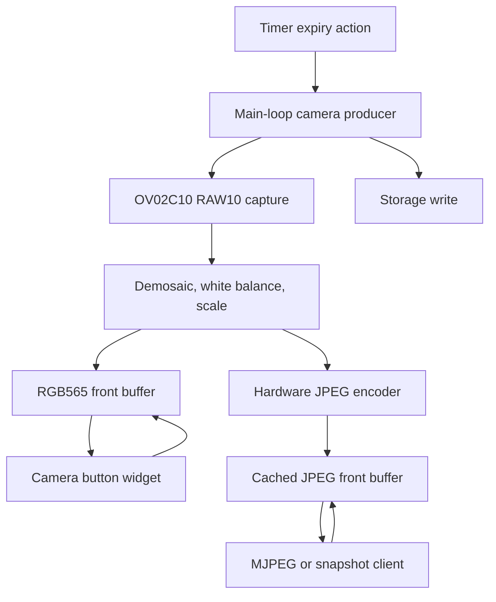

## Purpose

This temporary plan hands the camera MVE forward from commit `d3241fb`.
It defines the next implementation slices, their ownership rules, and the
hardware checks required before promoting each capability.

## Baseline

The current MVE is gated by `HAS_CAMERA` and enabled only for `jc4880p433`.
It provides OV02C10 RAW10 capture at `1280x720`, demosaic and white balance,
JPEG encoding, persisted camera settings, and authenticated one-shot JPEG and
RAW endpoints.

The verified build command is:

```bash
./build.sh jc4880p433
```

`640x360` is the only hardware-validated JPEG output mode. `320x180` produced
frequent partially garbled frames during device testing and is not advertised.
Failed captures report whether the cause was frame validation, PSRAM
allocation, or JPEG encoding.

## Architecture Boundary

Only the Arduino main loop may own sensor capture, RAW conversion, and JPEG
encoding. The LVGL task may consume completed RGB565 buffers. Web tasks may
only serve already-produced JPEG frames. A timer expiry uses the existing action
dispatch path and therefore must queue work to the main loop before capture.



The producer owns double-buffered PSRAM frame storage and must publish a new
front buffer atomically. Consumers never free, modify, or retain a published
buffer beyond the documented handoff interval.

## Constraints

* Do not capture directly from a web request, timer task, or LVGL callback
* Do not route an on-device button preview through the device's HTTP API
* Do not create a separate capture loop per storage action, button, or client
* Pause producer work when no preview or stream consumer needs a fresh frame
* Keep flash writes infrequent and bounded when using LittleFS
* Start with a single MJPEG client and explicit frame-rate limits
* Do not advertise an output dimension until it passes device capture tests

## Phase 0: Validate Output Modes

Status: Complete

Goal: establish the working JPEG dimensions and capture timing before new
features depend on them.

Implementation:

* Flash the MVE to `jc4880p433`
* Capture `640x360` repeatedly with default and changed exposure settings
* Capture `320x180` repeatedly and record the new `Camera` and `JpegEncoder`
  diagnostics if it fails
* Remove `320x180` from `kCameraOutputDimensions` unless it passes device tests
* Measure one capture's total main-loop duration and encoded JPEG size

Acceptance checks:

* `640x360` succeeds for 20 consecutive captures
* Every advertised output dimension succeeds for 20 consecutive captures
* A failed capture leaves the bridge reusable after completion
* No PSRAM allocation failure occurs during the test

## Phase 1: Snapshot-Save Action

Status: Complete

Goal: add a `camera_capture` built-in action that stores a latest JPEG and a
dated camera-roll JPEG on the device. This enables time-triggered captures
immediately through existing timer expiry action lists.

Primary files:

* `src/app/pad_config.h`
* `src/app/actions/camera_capture_action.cpp`
* `src/app/actions/action_modules.inc`
* `src/app/camera.h`
* `src/app/camera_service.cpp`
* `src/app/storage.h` and the selected storage implementation
* `src/app/web/portal_action_editor.js`
* Camera portal component and relevant docs

Implementation requirements:

* Follow the registered action-module pattern exactly
* Add the persisted payload, parsing, serialization, validation, dispatch,
  binding handling, and catalog metadata in one camera action module
* Defer from an action-dispatch context to the main loop when required
* Support the closed `save_to` action field: `latest`, `roll`, or `both`
* Write `/camera/latest.jpg`, `/camera/YYYYMMDD/NNNNNN.jpg`, or both according
  to `save_to`; paths are not user-controlled, directly or indirectly
* Scan the active date directory after boot or a date change, then cache the
  next six-digit sequence number in RAM
* Write to `Storage`, close the file, and release the JPEG on every path
* Do not apply retention limits in this MVE; the user manages camera-roll space
* Add action catalog and host-test coverage for payload validation and dispatch

Acceptance checks:

* A button action saves valid latest and camera-roll JPEGs to storage
* A countdown timer expiry executes the same action once
* Capture and storage failures do not leak buffers or leave partial state
* Existing timer actions continue to work

## Phase 2: Shared Camera Producer and Cache

Status: Implemented and hardware-validated at 4 FPS. The internal-RAM RAW-row
scratch buffer reduces RGB565 conversion from about 109 ms to 58-60 ms; RGB-only
capture now takes about 92-122 ms per frame.

Goal: introduce the one producer required by direct button preview and MJPEG.
The producer captures only when an active consumer requests frames.

Primary files:

* New `src/app/camera_feed.h` and `src/app/camera_feed.cpp`
* `src/app/camera.h` and `src/app/camera_service.cpp`
* `src/app/drivers/ov02c10_p4_driver.cpp`
* `src/app/app.ino`
* Main-loop bridge integration where needed

Implementation requirements:

* Keep CSI capture and conversion on the Arduino main loop
* Publish RGB565 and JPEG outputs separately, with explicit ownership rules
* Use PSRAM double buffers with a short critical section for pointer and
  generation-number swaps
* Make producer cadence, requested preview size, JPEG quality, and active
  consumer count explicit state
* Provide a bounded capture interval. Start at 3 FPS with telemetry and increase
  only after device measurement
* Stop or reduce producer work when the display sleeps and no web client exists
* Check `ota_activity_is_active()` before beginning a nonessential capture

Acceptance checks:

* One producer services multiple consumers without concurrent sensor capture
* Buffer ownership is safe across main-loop, LVGL, and web tasks
* Producer teardown frees all PSRAM buffers
* Main-loop capture work does not starve timer, Wi-Fi, or portal processing

## Phase 3: Camera Button Widget

Status: Implemented and hardware-validated at 4 FPS. Cover, Letterbox, and
Center crop are available from the Pad Editor.

Goal: show the latest camera RGB565 frame in a button without HTTP.

Primary files:

* New camera widget or button image-source module under `src/app/`
* `src/app/widgets.cpp`
* `src/app/screens/pad_tile_builder.cpp`
* `src/app/screens/pad_screen_poll.cpp`
* Pad schema, portal editor, and pad validation code

Implementation requirements:

* Match the existing `image_fetch` zero-copy LVGL descriptor handoff pattern
* Do not call LVGL outside the LVGL task
* Request camera feed frames only while the button's pad is visible
* Use a fixed preview dimension that fits the button and a bounded frame rate
* Provide cover, letterbox, and unscaled center-crop scale modes
* Drop stale frames rather than queueing them

Acceptance checks:

* The button updates from a camera-owned RGB565 front buffer
* Hiding the pad pauses its preview demand
* Screen-saver sleep stops preview capture
* Display flush activity does not race with a buffer swap
* The preview remains stable during portal snapshot captures

## Phase 4: MJPEG Feed API

Status: Implemented, pending hardware validation

Goal: provide an authenticated `multipart/x-mixed-replace` endpoint backed by
the shared cached JPEG frame.

Primary files:

* `src/app/web_portal_camera.cpp`
* `src/app/web_portal_camera.h`
* `src/app/web_portal_routes.cpp`
* `src/app/camera_feed.h` and `src/app/camera_feed.cpp`
* Camera portal UI and web documentation

Implementation requirements:

* Use a `multipart/x-mixed-replace` response with a stable boundary
* Serve cached JPEG frames only. A request must not directly invoke sensor
  capture or JPEG encoding
* Bound authenticated clients with `CAMERA_MJPEG_MAX_CLIENTS` and return a clear
  status for additional clients
* Terminate cleanly on disconnect and decrement the producer's web-consumer
  count
* Bound output rate to the producer cadence without a per-client frame queue
* Continue to serve individual snapshots through the existing endpoint

Acceptance checks:

* A browser renders the stream for at least 10 minutes without memory growth
* A disconnected client releases its consumer reservation and JPEG demand
* A snapshot-save action and multiple stream clients coexist without capture races
* Frame cadence and Wi-Fi throughput are measured during hardware validation

## Deferred Work

These are intentionally outside the first production slices:

* H.264, H.265, RTSP, WebRTC, and audio/video synchronization
* Video recording containers and unrestricted timelapse archives
* Multiple unrestricted MJPEG clients
* Automatic exposure or sensor gain control
* Generalizing the OV02C10 driver for unverified camera boards

## Hardware Measurement Log

Fill this section during device testing. Do not promote performance targets from
assumptions.

| Date | Firmware commit | Mode | Quality | Consumers | Capture time | JPEG size | Result | Notes |
|---|---|---|---:|---|---:|---:|---|---|
| 2026-08-24 | d3241fb + timeout diagnostics | 640x360 | 76 | Manual snapshots | 145-147 ms after RAW completion | 12,365-17,323 B | Pass, 20/20 | Exposure 1149; manual WB 256/256; no capture, allocation, or encoder errors |
| 2026-08-24 | d3241fb + timeout diagnostics | 320x180 | 76 | Manual snapshots | Not recorded | Not recorded | Fail | Frequent partially garbled frames despite a complete 1280x720 RAW10 capture; removed from advertised output modes |
| 2026-08-24 | pending RAW-row scratch commit | 640x360 | 60 | Preview, RGB-only | 92-122 ms | N/A | Pass | 4 FPS stable; RGB565 conversion 58-60 ms, down from about 109 ms |
| | | | | | | | | |

## Handoff Checklist

* Read the camera MVE commit `d3241fb` before editing the capture path
* Read scoped instructions for actions, storage, web portal, display, and
  compile-time flags before touching those areas
* Keep each phase in a separately buildable, reviewable commit
* Run targeted host tests for touched registries and `./build.sh jc4880p433`
  after firmware changes
* Update the phase status and hardware measurement log as work progresses
* Update permanent user and developer documentation only when a phase becomes a
  supported feature
