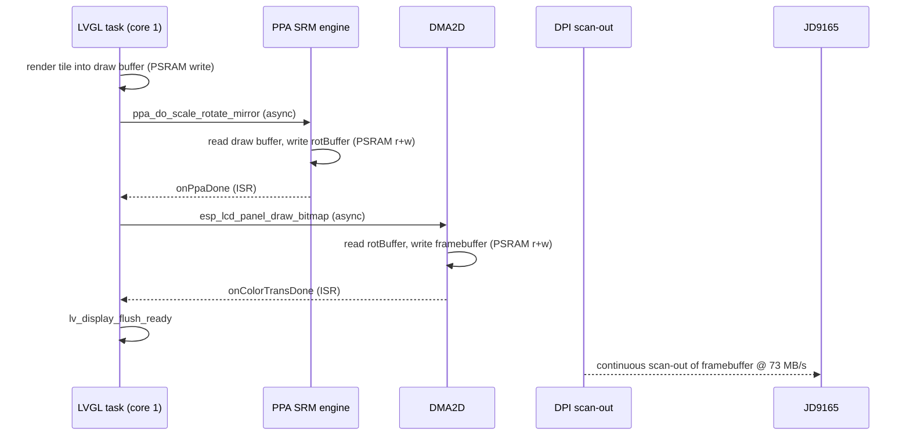
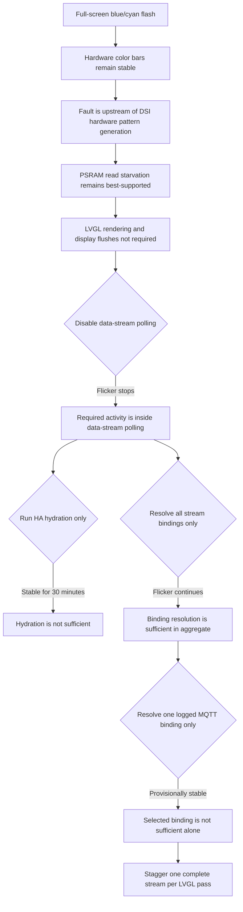

## Status

**Active: the round-robin data-stream scheduling fix failed hardware acceptance.** PSRAM bandwidth starvation remains the best-supported diagnosis. Later hardware isolation proved that resolving all active data-stream bindings is sufficient to sustain flickering even when LVGL rendering, display flushes, ring mutations, and HA hydration are excluded. Resolving one selected MQTT binding appeared stable, but rotating through all configured streams one at a time still flickered. A consecutive same-pass burst is therefore not required.

**2026-08-04 production candidate:** a P0.1 diagnostic that replaced the two
largest-free-block walks in the LVGL health-binding path with zero ran without a
reported cyan flash after pad-cache population. The permanent P0.3 candidate
removes PSRAM largest-block telemetry on MIPI-DSI boards, caches the internal
largest-block value from the timer daemon at a 30-second cadence, and keeps
safe memory counters live. P0.4 additionally removes the remaining five-second
internal and DMA largest-block walks from health history; P0.5 adds a host-test
guard against reintroducing unsafe telemetry pool walks. Hardware acceptance
remains pending.

This document exists so the eliminated ground is not re-covered. Every hypothesis below was tested on hardware, not reasoned away.

## Symptom

A full-screen flash lasting roughly one frame. Confirmed characteristics:

* **The flash fills the entire display** with a uniform blue/cyan colour. Not a rectangle, not a region.
* **The spontaneous flicker starts only after navigating to and from several pads.** It has not been observed immediately after boot or during the pad tour itself; it appears afterward while sitting on a pad.
* **It also occurs on a completely blank pad** with zero buttons. This supersedes the earlier content bisect and confirms the fault is independent of what is being rendered.
* **It is visually identical to what the device already does during filesystem access and during OTA.** Both of those paths already blank the backlight deliberately so the user does not see it.

That third point is the most important fact in this document. It means the symptom has a **known, deterministic, reproducible trigger** that has nothing to do with the render path: writing to flash.

The user first noticed it on `release/1.24.0` and suspected a regression, but it likely predates that branch.

## Hardware and pipeline context

| Property | Value |
|---|---|
| Board | `jc1060p470c` (GUITION), ESP32-P4 Rev 103, dual RISC-V @ 360 MHz |
| Memory | 16 MB flash, 32 MB PSRAM |
| Panel | JD9165, 1024x600 MIPI-DSI |
| Rotation | `DISPLAY_ROTATION 1` -> logical 600x1024 |
| DSI link | 2 data lanes, `LCD_COLOR_PIXEL_FORMAT_RGB565`, 550 Mbps per lane |
| DPI clock | 51.2 MHz (stock) |
| Blanking | HSYNC pw=24 bp=136 fp=160; VSYNC pw=2 bp=21 fp=12 |
| Totals | `h_total` 1344, `v_total` 635 -> 59.99 Hz |
| Scan-out | 73 MB/s average, ~102 MB/s during active line periods |
| Framebuffers | `num_fbs = 1`, `disable_lp = true`, `use_dma2d = true` |
| PHY supply | Internal LDO channel 3 @ 2500 mV |
| LVGL | 9.5.0, `LV_DISPLAY_RENDER_MODE_PARTIAL`, two 96000-byte PSRAM draw buffers |
| Render task | Core 1, priority 4, PSRAM stack, 15 ms refresh period |

### Flush path

Every flush crosses PSRAM five times for a single 96 KB tile, about 480 KB of traffic:



## Reproduction procedure

1. Boot the device.
2. Tour many pads in sequence (pads 15, 9, 6, 5, 4, 3, 2, 1 exercise widgets, images, and LRU eviction).
3. Return to `pad_0` and sit there.
4. Wait. `pad_0` runs three image slots at 195x124 on a 5 s interval, which is the only periodic activity.

The flash has always been observed during step 4, never during the tour itself.

## Hypotheses eliminated

Do not re-test these without new information.

| # | Hypothesis | How it was disproven |
|---|---|---|
| 1 | `disable_lp = false` causes a D-PHY LP-to-HS ramp glitch | Flickers with the flag both `false` and `true`. Two-sided test. |
| ~~2~~ | ~~DPI DMA underrun (first pass)~~ | **REOPENED.** Rests entirely on the absence of a log message. See below. |
| 3 | Widget content drives the fault | Superseded and strengthened: a blank pad with zero buttons also flickers. Content is irrelevant. |
| 4 | Image-fetch slot-size race feeds LVGL a mismatched buffer | Detector v1 stayed silent through a full reproduction. LRU eviction is ordered, so slots re-register at identical geometry. |
| 5 | LVGL serves a stale cached image for a reused `img_dsc` | LVGL 9.5.0 ships with both caches disabled and the project does not override them. |
| 6 | The render pipeline itself emits cyan | Detector v2: zero cyan values, and the framebuffer was static during the flicker. Still valid — and consistent with starvation, where the framebuffer is correct but never reaches the panel. |
| ~~7~~ | ~~DPI FIFO underrun, re-tested with ROM console capture~~ | **REOPENED.** Same dependency on the missing message. |
| 8 | Scan-out bandwidth or DPI timing margin | 43 MHz (50.3 Hz, 61 MB/s) still flickers. Weakens *average* bandwidth as the axis, but not *instantaneous* contention. |

### Why hypotheses 2 and 7 are reopened

Both were eliminated on a single piece of negative evidence: the ESP-IDF message `can't fetch data from external memory fast enough, underrun happens` never appeared.

Everything about that negative was verified carefully. The callback re-arms the DMA every frame, so it demonstrably runs at the refresh rate. The underrun interrupt is always enabled. ROM console capture was built specifically to rule out a routing problem, and a round-trip probe confirmed `esp_rom_printf` reaches the console. The Arduino core is built with `CONFIG_LOG_MAXIMUM_LEVEL=1` (ERROR), so `ESP_DRAM_LOGE` is compiled in rather than preprocessed away.

And yet the user reports the identical visual during flash writes, which is a textbook starvation scenario.

**This was then tested directly: a filesystem write was triggered, and no underrun message appeared.** Flash writes are the one case where the starvation mechanism is documented by Espressif rather than inferred — PSRAM is disabled for the duration of the write, so the DPI has nothing to read. If that case logs nothing, the message cannot be used to rule out starvation anywhere else.

The absence of the message is therefore **invalid as evidence**, not proof of absence. Hypotheses 2 and 7 are struck rather than eliminated, and PSRAM read starvation becomes the working diagnosis.

One caveat is recorded for honesty: a null log only carries weight if that specific write actually produced a blue frame, which was not visually confirmed because the backlight is blanked on that path. Given four independent sources converging on the same mechanism, this was judged not worth chasing further.

Additionally, the `draw_bitmap` failure logging added in `17972cc` has been silent across every run, which proves **no flush collisions ever occur**.

### Detail: hypothesis 7, the underrun that never fired

ESP-IDF's `esp_lcd_panel_dpi.c` contains a comment that matches the symptom almost exactly:

```c
if (unlikely(error_status & MIPI_DSI_LL_EVENT_UNDERRUN)) {
    // when an underrun happens, the LCD display may already becomes blue
    // it's too late to recover the display, so we just print an error message
    ESP_DRAM_LOGE(TAG, "can't fetch data from external memory fast enough, underrun happens");
}
```

Relevant facts verified by reading the vendor source rather than assuming:

- The checking callback is registered on `on_full_trans_done` **unconditionally**, independent of `num_fbs`.
- The underrun interrupt is always enabled.
- `underrun_discard_count` is set to `h_size`; burst length 256 and empty threshold `1024 - 256` are hardcoded.

The message uses `ESP_DRAM_LOGE`, which routes through `esp_rom_printf`. To be certain the absence was real and not a routing artifact, a ROM console capture was built (see below), and a round-trip probe confirmed the path works. The toolchain audit further confirms the message is compiled in. Despite all that, the message never appeared — which is now treated as an unexplained anomaly rather than as proof.

### Detail: hypothesis 8, the DPI clock experiment

Two runs, one variable changed:

| | Run 1 | Run 2 |
|---|---|---|
| DPI clock | 51.2 MHz | 43 MHz |
| Refresh | 59.9 Hz | 50.3 Hz |
| Scan-out | 73 MB/s | 61 MB/s |
| Duration | 190 s | 257 s |
| Underruns | 0 | 0 |
| Flicker | yes | yes |

A 16% cut in sustained scan-out changed nothing.

### DSI link margin is not marginal

Worth recording because it rules out a tempting next experiment. The link must carry one active line within the active line period:

$$\text{active line period} = \frac{1024}{51.2\,\text{MHz}} = 20\,\mu s$$

$$\text{required} = \frac{1024 \times 2\,\text{bytes} \times 8}{20\,\mu s} = 819.2\ \text{Mbps}$$

Against $2 \times 550 = 1100$ Mbps available, that is **1.34x headroom** at stock timing and 1.6x at 43 MHz. Raising `JD9165_DSI_LANE_BIT_RATE` would prove nothing.

## Diagnostics built

### Detector v1 — image fetch geometry

Added to `image_fetch.cpp` behind `TEMPORARY DIAGNOSTIC` comments. Watches for two conditions:

- A decode completing at one geometry being adopted by a slot registered at a different geometry.
- `image_fetch_get_frame()` reporting dimensions larger than the buffer actually holds, which would cause LVGL to over-read.

**Result: completely silent** across a full reproduction. This single negative eliminated hypotheses 4 and 5 at once. A silent detector is a result, not a failure.

### Detector v2 — flat-frame detection in the flush path

Added to `mipi_dsi_driver.cpp`. Sampled 16 pixels per tile to detect uniformly-coloured frames, and separately checked whether the PPA had flattened a varied source tile.

**Result: zero cyan values, ever.** The three genuine flat-frame hits decoded to `0x0000` (splash black), `0x0862` (dark slate), and `0x08A5` (exactly the `#0f172a` pad background) and were all `rect 0,720 600x80`, the empty bottom of a pad. The flicker itself produced **no output at all**, meaning the framebuffer was static while the panel flashed.

**Design flaw worth remembering:** the "PPA flattened a tile" channel produced 111 false positives. Both samplers walked 16 evenly-spaced *linear* indices, but rotation moves every pixel, so the two sample sets landed on entirely different pixels. Any tile that is mostly background with some text tripped it. Sampling-based detectors must be geometry-aware.

Detector v2 has been reverted.

### ROM console capture

`src/app/rom_log_capture.{h,cpp}`, gated by `HAS_ROM_LOG_CAPTURE` (default `false`, enabled in the `jc1060p470c` overrides).

Installs an IRAM-safe `putc` on ROM console channel 1 that feeds a 1024-byte DRAM ring buffer. `rom_log_capture_loop()` drains complete lines from `loop()` and re-emits them through the normal log. Drops on overflow rather than overwriting, and reports the dropped count.

**Key finding:** a round-trip probe emitted at startup appeared twice — once raw and unprefixed at `[81ms]`, once re-emitted through the ring at `[15318ms]`. The raw copy proves `esp_rom_printf` output **already reaches the USB-CDC console directly** on this board. The earlier "no underrun messages" negatives were therefore valid all along.

The re-emit lags because the ring only drains from `loop()`, which starts after `setup()` completes at roughly 14.3 s.

## Fixes committed during the investigation

None of these was the cause, but all are real.

| Commit | Change |
|---|---|
| `035e9ae` | `perf(drivers): drop the unused second DPI framebuffer on ESP32-P4`. Set `.disable_lp = true` and `.num_fbs = 1`, rewrote `fillFramebuffers()`. Reclaimed roughly 1.2 MB of PSRAM. |
| `17972cc` | `fix(drivers): release LVGL when a MIPI-DSI draw_bitmap call fails`. Records the error in `onPpaDone()`, releases LVGL, and drains the count from task context. Has never fired. |

## External corroboration

A literature search found the symptom documented in several places, all pointing at the same mechanism: **PSRAM read starvation of the DPI scan-out**.

### Espressif ESP-FAQ, LCD section

* **Q45** is the exact symptom: *"ESP32-P4 drives a MIPI-DSI LCD with a flashing blue screen and the message 'can't fetch data from external memory fast enough, underrun happens'."* Stated cause: insufficient PSRAM bandwidth. Suggested remedies: lower `lane_bit_rate_mbps` and `dpi_clock_freq_mhz`, prefer RGB565 over RGB888, and enable `CONFIG_SPIRAM_XIP_FROM_PSRAM`, `CONFIG_CACHE_L2_CACHE_256KB`, `CONFIG_CACHE_L2_CACHE_LINE_128B`, `CONFIG_COMPILER_OPTIMIZATION_PERF`.
* **Q13**, on the analogous ESP32-S3 RGB drift problem, states the flash mechanism explicitly: *"PSRAM and flash share a set of SPI interfaces. PSRAM is disabled during writes to flash (such as via Wi-Fi, OTA, Bluetooth LE)."* The recommended fix is XIP on PSRAM, which stops flash writes from disabling PSRAM. **This is precisely the filesystem and OTA case the user described.**
* **Q43** notes that MIPI-DSI requires `CONFIG_SPIRAM_SPEED_200M` or above, and that insufficient bandwidth can fail silently.

### LVGL issue #9590 — PPA causes DSI underrun on ESP32-P4

Directly relevant, because this project drives the PPA on **every single flush** to rotate the display.

The reporter found that reducing the PPA burst length from 128 to 64 bytes resolved the artifacts, and that raising the PSRAM clock did not: *"PPA fill use full SPIRAM bandwidth and it always interference with DSI reads and you always need to throttle PPA by reducing PPA burst lengths to give DSI a chance to read SPIRAM."* Resolved by upstream PR #9612, which made the burst length configurable.

A later commenter measured the memory system directly on a P4 rev 1.3 with PSRAM already maxed at HEX/200M/DDR:

| Operation | Throughput |
|---|---|
| DMA write to PSRAM | 352.8 MB/s |
| CPU read from PSRAM | 102.5 MB/s |
| CPU write to PSRAM | 75.7 MB/s |
| DSI scan-out, continuous | 140.4 MB/s |
| PPA SRM, source in internal RAM | 22.1 ns/px |
| PPA SRM, source in PSRAM | 86.0 ns/px |

Two conclusions from that comment are worth repeating verbatim in spirit: the scan-out is a permanent read load that never stops and takes roughly half off anything else doing reads; and a PSRAM source costs the PPA nearly **4x** more per pixel than an internal-RAM source, so *"keeping the draw buffer in internal RAM matters more than it looks."* The underrun was still observed at maximum PSRAM configuration, so "raise the clock" is not a general fix — it is a contention problem, not a clock problem.

### This project's own issue #7 (closed)

`jantielens/esp32-macropad#7`, *"ESP32-P4 MIPI-DSI: blue-flash flicker caused by PSRAM bus contention with telemetry tasks"*, diagnosed the same symptom on `esp32-p4-lcd4b` and called it *"a classic DPI buffer underrun"*. It was closed by disabling background telemetry (`DEVICE_TELEMETRY_BACKGROUND_TASKS 0`, `HEALTH_HISTORY_ENABLED 0`) on that board.

Its own list of unexplored remedies opens with **"Move LVGL draw buffer to internal SRAM"** via `LVGL_BUFFER_PREFER_INTERNAL`. That is the same fix the external measurements now independently support, and it has still never been tried.

## Toolchain configuration audit

Read from the arduino-esp32 3.3.7 P4 `sdkconfig`, since Arduino uses precompiled IDF libraries and these cannot be changed without a custom core build.

| Setting | Value | Assessment |
|---|---|---|
| `CONFIG_SPIRAM_MODE_HEX` | `y` | 16-line, maximum width |
| `CONFIG_SPIRAM_SPEED_200M` | `y` | Already at maximum for pre-v3.0 silicon |
| `CONFIG_CACHE_L2_CACHE_128KB` | `y` | FAQ recommends 256 KB |
| `CONFIG_CACHE_L2_CACHE_LINE_64B` | `y` | FAQ recommends 128 B |
| `CONFIG_SPIRAM_XIP_FROM_PSRAM` | **not set** | SoC supports it; not enabled. Flash writes therefore stall PSRAM |
| `CONFIG_COMPILER_OPTIMIZATION_SIZE` | `y` | FAQ recommends `PERF` |
| `CONFIG_LOG_MAXIMUM_LEVEL` | `1` (ERROR) | The underrun message **is** compiled in |

PSRAM is already as fast as this part allows, which matches the external finding that clock speed is not the lever. The remaining Espressif-recommended settings are all locked inside the precompiled core. **The levers still available to this project are the ones that reduce demand rather than increase supply.**

## Revised diagnosis



The competing candidates from the previous round — PHY LDO sag, panel-internal ESD recovery, DSI link glitch — are **deprioritised but not eliminated**. They remain the fallback if reducing PSRAM demand has no effect.

## Final mitigation results

### 1. Resolve the message contradiction (done — superseded)

Originally framed as "trigger a filesystem write with the backlight left on and watch the console." The framing was wrong: the backlight gates visibility only, while the underrun ISR logs independently of it.

Run anyway, and the result was **no underrun message during a filesystem write**. See the reopened-hypotheses section above. Diagnosis work on the underrun counter stops here; it cannot distinguish anything.

### 2. PPA burst length (failed)

Both PPA clients register with the default `PPA_DATA_BURST_LENGTH_128`:

* `mipi_dsi_driver.cpp:221` — display rotation, runs on every flush
* `image_decoder.cpp:78` — image scaling

The IDF header documents `data_burst_length` in `ppa_client_config_t` as: *"Use a small burst length will decrease PPA performance, but can save burst bandwidth for other peripheral usages."* Both PPA clients were changed from the default 128-byte burst to 64 bytes, matching the LVGL #9590 mitigation.

**Result:** the cyan flicker still occurred. Both clients were restored to the default burst length.

### 3. Move the flush buffers into internal RAM (rejected)

Supported by both issue #7's own recommendation and the external 4x per-pixel measurement.

`LVGL_BUFFER_PREFER_INTERNAL` already exists and is honoured for the draw buffers at `display_manager.cpp:336`, but `rotBuffer` at `mipi_dsi_driver.cpp:206` is hardcoded to `MALLOC_CAP_SPIRAM`.

Real health data before the experiment showed 218,856 bytes currently free, a 100,996-byte historical minimum, and only 62,248 bytes as the DMA-capable historical minimum. The original 72 KB proposal was therefore rejected as unsafe. The final test used one 10-row LVGL buffer and one 10-row rotation buffer in internal RAM: about 24 KB persistent total.

**Result:** the display background became random pixels and lines while widgets appeared to render correctly. A plausible LVGL source-stride correction (1,216-byte aligned rows versus 1,200 visible bytes at full width) produced the same corruption. The test could not yield a valid flicker result, so the internal-buffer configuration and stride change were both reverted.

The stable configuration is restored: two 80-row LVGL buffers and the rotation buffer in PSRAM.

### 4. Data-stream isolation and round-robin fix (implemented)

Later action-triggered tests isolated the activity that sustains established flickering:

| Test | Hardware result | Inference |
|---|---|---|
| Stop future PPA, DMA2D, and display-driver flushes | Flickering continued | Display writes are not required. |
| Skip `lv_timer_handler()` | Flickering continued | LVGL rendering is not required. |
| Skip `currentScreen->update()` | Flickering continued | Active-screen widget updates are not required. |
| Skip `data_stream_poll()` | Flickering stopped after activation at 267,024 ms | Data-stream polling is required under the tested workload. |
| Throttle all-stream polling to once per second | Flickering continued after activation at 205,109 ms | Polling frequency alone is not the trigger; one aggregate resolver burst per second is sufficient. |
| Run HA hydration only | No flickering during 30 minutes after activation at 69,617 ms | HA hydration is not sufficient. |
| Resolve all active stream bindings only | Flickering continued after activation at 168,871 ms | Binding resolution is sufficient without ring mutations or ingestion. |
| Resolve only the first active binding | No flickering observed through at least 374,524 ms after activation at 177,557 ms | The selected MQTT temperature binding is not sufficient alone. Aggregate or another resolver workload remains implicated. |
| Process one complete stream per LVGL pass in round-robin order | Flickering continued | Consecutive same-pass resolution is not required. Another binding, rotating resolver state, or the full per-stream clock/ring/ingestion path remains required. |
| Resolve one active binding per LVGL pass in round-robin order | Flickering continued after activation at 90,805 ms | Staggered binding resolution alone is sufficient. Clock transitions, ring advancement, parsing, ingestion, and range recomputation are not required. |
| Resolve FNV-1a hash half `0` only (7 streams) | Flickering continued within a few minutes after activation at 41,320 ms | At least one of these seven bindings, or their combined resolver workload, is sufficient. Hash half `1` is not required. |
| Resolve two-binding subset only | No flickering during the reported observation after activation at 90,582 ms | These two bindings are not sufficient together. This does not distinguish another binding from a larger-set pressure threshold. |
| Process all streams at one complete resolution every 250 ms | Flickering continued within the first reported 134 seconds | Sustained resolution rate and obvious LVGL scheduling stalls are not sufficient explanations. Telemetry showed 222/232 resolutions per minute, maximum 6,425 us, and zero late opportunities. |
| Resolve `[health:rssi]` from cached RSSI without broad WiFi refresh | Flickering continued | The two-second `WiFi.status()` / `SSID()` / `localIP()` refresh was not required. |

The selected binding in the final isolation test was:

```text
[mqtt:homeassistantcopy/sensor/esp32_kelder_ketel_bme280_temperature/state;;%.1f]
```

`Stream[0]` in that log was a registry slot, not a persistent semantic identity. The logged template identifies what was tested. Editing or rebuilding pad configuration can assign a different binding to slot 0.

The first production candidate changed `data_stream_poll()` from processing every active stream consecutively to fully processing one active stream per LVGL pass. Hardware testing showed that this still flickered because it sustained about 50 resolutions per second.

The second production candidate kept the allocation-free round-robin cursor but permitted one complete stream resolution every 250 ms, reducing sustained resolver pressure to four resolutions per second. Hardware testing still flickered. Telemetry showed maximum complete-resolution times near 6.4 ms and no polling opportunities delayed by an additional interval, so average resolver rate and obvious long LVGL stalls do not explain the fault. The pacer, its telemetry, and its focused test were removed.

Code inspection then found that `[health:rssi]` was not fully cached. Although RSSI itself came from `device_telemetry_get_cached_rssi()`, every health resolution entered a broad two-second refresh that called `WiFi.status()`, `WiFi.SSID()`, and `WiFi.localIP()` from the LVGL task. Special-casing `rssi` to avoid those calls did not stop flickering, so that candidate was reverted.

The current build returns to one complete stream per LVGL pass and adds a reversible same-boot A/B control at the entire `data_stream_poll()` boundary. Each **Start BLE Pairing** action toggles polling. The LVGL task owns the state change and logs it:

```text
ble_pair hijacked for data stream polling toggle
Flicker diagnostic: data stream polling OFF at ... ms
Flicker diagnostic: data stream polling ON at ... ms
```

While polling is OFF, registry rebuild checks continue but resolution, clock/ring processing, ingestion, and HA hydration stop. Turning polling ON restores the normal round-robin path without rebooting. This reproduces the strongest earlier isolation while controlling for boot, network state, active configuration, and observation conditions.

Focused scheduler tests cover empty registries, holes, wraparound, fairness, one-stream behavior, the signed-handle capacity boundary, and invalid arguments. The latest `jc1060p470c` A/B diagnostic build passes with 3,186,472 bytes of flash and 91,172 bytes of global memory.

Hardware acceptance procedure:

1. Flash `build/jc1060p470c/app.ino.merged.bin`. Polling starts ON.
2. Use the image-free configuration with normal WiFi, MQTT, and widgets.
3. Use a button labeled **STREAM A/B** with the **Start BLE Pairing** action.
4. Keep polling ON until flickering is clearly established. Record the last flicker time.
5. Press the button once and confirm `data stream polling OFF`. Observe for at least twice the preceding inter-flicker interval, with a minimum target of 10 minutes. Charts are expected to stop updating.
6. Press the button again and confirm `data stream polling ON`. Wait until flickering returns. If it does not return within the baseline observation window, the cycle is inconclusive.
7. After flickering returns, toggle OFF again and repeat until at least three ON-to-OFF transitions have matched flicker-to-quiet behavior.

Evidence supports causality only if flickering repeatedly occurs during ON phases and repeatedly remains absent during matched OFF phases. One quiet OFF phase is not enough because the symptom is intermittent.

**Result:** pending repeated same-boot A/B testing. The result determines whether to continue inside the data-stream path or reopen the causal boundary.

The all-binding round-robin resolution-only test still flickered after activation at 90,805 ms. This excludes the complete clock/ring/ingestion path and establishes that rotating binding resolution is sufficient under the tested workload.

Hash half `0` contained seven active streams and still flickered within a few minutes after activation at 41,320 ms. Its two-binding branch remained stable throughout the reported observation after activation at 90,582 ms. Further subset isolation was stopped by decision: the production candidate now tests the broader resolver-pressure hypothesis directly while retaining every stream.

The diagnostic retains one resolution per LVGL pass, discards resolver output, leaves HA hydration enabled, and logs every included binding with its hash. The expected subset is:

| Hash | Binding |
|---|---|
| `c716304e` | `[mqtt:homeassistantcopy/sensor/esp32_kelder_ketel_bme280_temperature/state]` |
| `57c6bb2e` | `[mqtt:homeassistantcopy/sensor/solar_power/state]` |

This subset test collected evidence but was not a viable fix because chart ingestion stopped after activation. Its action hijack and hash-selection code have been removed.

### Deferred: cut self-inflicted load

`pad_1` registers three 591x336 image fetches at `interval=1ms`. Independent of the flicker, that is a large recurring PSRAM and decode load that should be throttled.

## Open questions

* **Why is the underrun message never logged**, even during a flash write, when it is compiled in, the callback provably runs every frame, and the console path is proven? Unanswered, but no longer blocking: the message is simply not a usable detector on this setup. One plausible explanation is that the bridge interrupt is masked or its latched status lost while the cache is disabled.
* Does flickering repeatedly follow data-stream polling ON/OFF state within one boot?
* If causality is confirmed, does moving the PSRAM-backed MQTT subscription store to internal RAM remove the effect?
* Would a second framebuffer help after all? Issue #7 listed `num_fbs = 2` as a candidate mitigation, and commit `035e9ae` went the other way for memory reasons.

## Unrelated bugs found

Real defects surfaced by the investigation, none of them the cause, none yet fixed.

| Issue | Location | Effect |
|---|---|---|
| `image_fetch_pause_slot()` does not clear `new_frame` | `image_fetch.cpp` | After `front_buf` is freed, `pollImageFrames()` re-runs `lv_image_set_src` and `lv_obj_invalidate` every LVGL tick until the next successful fetch. |
| Sequential fetch task head-of-line blocking | `image_fetch.cpp` | One slow camera returning `HTTP -11` blocked for 10 to 27 s per round, stretching other slots from a 5 s interval to roughly 25 s. |
| Cancel-before-delete ordering | `pad_tile_builder.cpp:31` | `image_fetch_cancel()` frees `lvgl_buf` before `lv_obj_delete()`, with contradictory adjacent comments. Latent, unproven. |

Three deferred fixes for the slot race were designed but not implemented, since detector v1 proved the race does not occur in practice:

* Add a `generation` counter to `ImageSlot`, bump it on request, and discard decodes whose generation no longer matches.
* Store decoded width and height with each buffer and have `get_frame()` report those rather than `target_w`/`target_h`.
* Clear `new_frame` in `image_fetch_pause_slot()`.

## Method notes

Lessons that generalise beyond this bug.

* **Verify vendor-library behaviour against actual source.** Two assumptions turned out wrong: that the underrun callback depended on `num_fbs`, and that `esp_rom_printf` was invisible on this console.
* **A silent detector is a result.** Detector v1's silence eliminated two hypotheses simultaneously.
* **Check library defaults before building a theory on them.** The LVGL cache hypothesis died on a one-line config check.
* **Sampling detectors must be geometry-aware.** Detector v2's PPA channel compared linear indices across a rotation, which is meaningless.
* **Change one variable per flash.** The 50 Hz run was deliberately deferred so the ROM capture result would be unambiguous.
* **Do not update docs or the changelog with a hypothesised effect** before hardware confirms it.

## Final code disposition

* Detector v1 was removed from `image_fetch.cpp`.
* The ROM console capture and its feature flags were removed.
* The DSI refresh-rate and scan-out log line remains because it is useful operational telemetry independent of this investigation.
* The stable 80-row, double-buffered PSRAM path and default PPA burst length were restored.
* `data_stream_poll()` again processes one active stream per LVGL pass in round-robin order; 250 ms pacing was removed after failed hardware acceptance.
* The cached-only `[health:rssi]` candidate was reverted after failed hardware acceptance.
* On `jc1060p470c`, BLE pairing toggles the complete data-stream polling boundary for repeated same-boot A/B tests.
* All data-stream hash-subset diagnostic code remains removed.
* Four earlier fallback diagnostics remain temporarily available on `jc1060p470c` until hardware acceptance completes.
