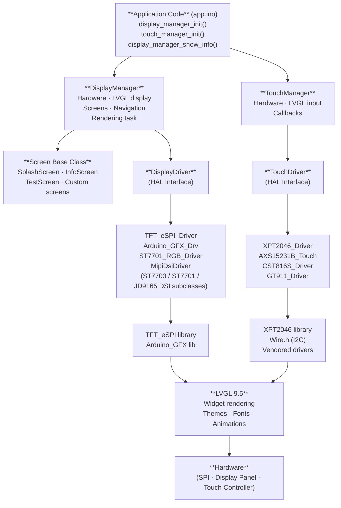
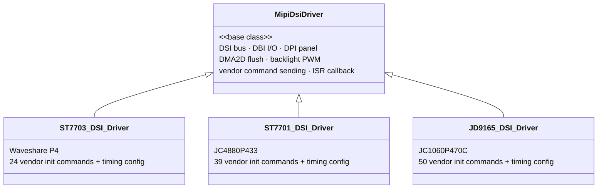
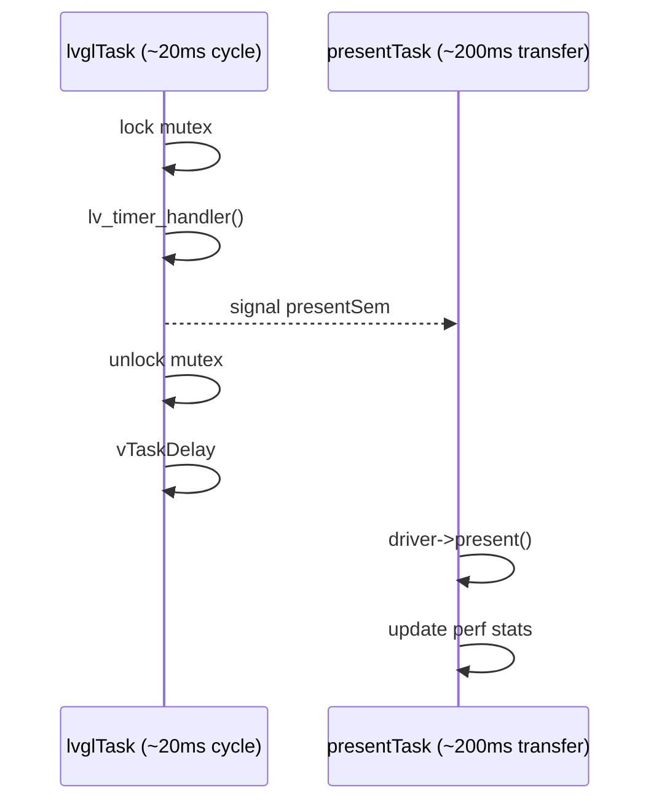
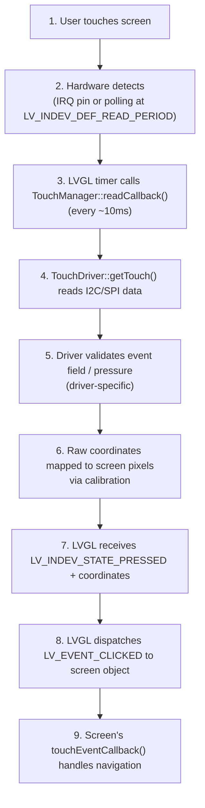
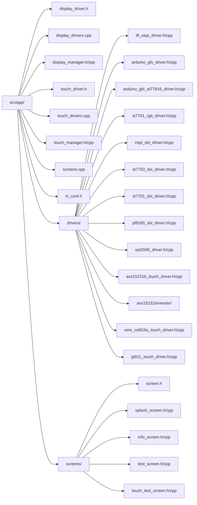
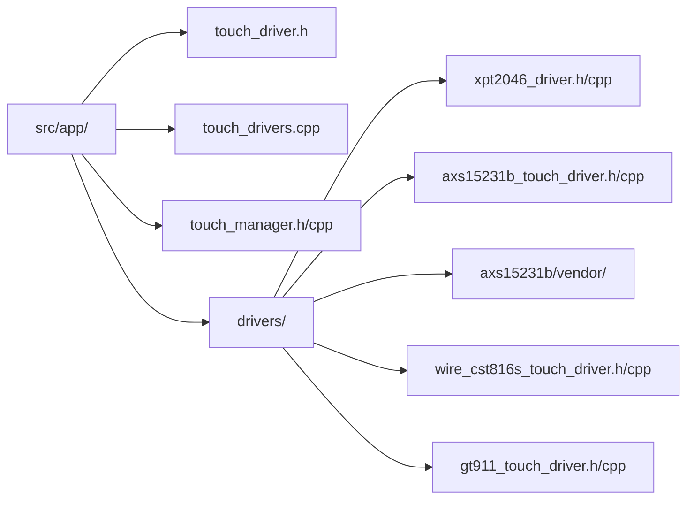

This document describes the display and touch subsystem architecture, design patterns, and extension points for adding new displays, touch controllers, and screens.

## Table of Contents

- [Overview](#overview)
- [Architecture Layers](#architecture-layers)
- [Display Driver HAL](#display-driver-hal)
- [Touch Driver HAL](#touch-driver-hal)
- [Screen Management](#screen-management)
- [Rendering System](#rendering-system)
- [Adding New Display Drivers](#adding-new-display-drivers)
- [Adding New Touch Drivers](#adding-new-touch-drivers)
- [Adding New Screens](#adding-new-screens)
- [Multi-Board Support](#multi-board-support)
- [Performance Considerations](#performance-considerations)

## Overview

The display and touch subsystem is built on four main pillars:

1. **Display HAL** - Isolates display hardware library specifics
2. **Touch HAL** - Isolates touch controller library specifics
3. **Screen Pattern** - Base class for creating reusable UI screens
4. **Manager Classes** - Centralized management of hardware, LVGL, and lifecycle

**Key Technologies:**
- **LVGL 9.5** - Embedded graphics library
- **TFT_eSPI** - Default display driver (supports ILI9341, ST7789, ST7735, etc.)
- **XPT2046_Touchscreen** - Resistive touch support
- **FreeRTOS** - Task-based continuous rendering

## Architecture Layers



## Display Driver HAL

### Inkplate 6 Flick LVGL

`inkplate6flick-interactive` is an experimental always-on e-paper target. Its Inkplate
driver is buffered: LVGL flushes update a framebuffer, then a presentation task
coalesces changes before a physical waveform. B/W mode uses partial updates with
periodic full refreshes; grayscale uses full waveforms. The Cypress touch driver
continues polling while a presentation is pending. This target uses a no-OTA
partition and must be updated over USB.

The driver copies the mode-specific drawing framebuffer into a PSRAM presentation
snapshot while holding its mutex, then releases the mutex before the blocking
waveform. That preserves writes made during the waveform for the next
presentation and permits no-op detection against the last presented frame. B/W
pixels use ordered dithering and can use `partialUpdate()`; 3-bit grayscale can
only use full waveforms. The driver, rather than InkplateLibrary's automatic
threshold, owns the periodic B/W full-refresh cadence.

The Cypress controller is an event stream. `getData()` returning zero is not by
itself a release: it can also mean that no event is pending. The touch driver
reads only pending events, retains contact state between them, and serializes
controller reads so a one-shot report cannot be consumed by another observer.

### reTerminal E1003 LVGL

`reterminal-e1003-interactive` is an always-on IT8951 e-paper Macropad target.
Its buffered driver keeps 4-bit drawing and presentation framebuffers in PSRAM.
It copies a settled LVGL frame under the framebuffer mutex, then uploads and
refreshes the presentation snapshot outside that mutex so later LVGL flushes
remain queued. Both modes coalesce LVGL flush rectangles into one aligned IT8951
region. B/W uses ordered dithering and regional DU; grayscale uses regional GC16.
Initial and forced presentations use full-panel GC16, as do scheduled refreshes
in both modes. Regional grayscale quality still needs hardware validation.
Touch uses the existing GT911 driver on the E1003's shared
GPIO19/GPIO20 I2C lines.

### Purpose

The DisplayDriver interface decouples LVGL from specific display libraries, allowing support for TFT_eSPI, LovyanGFX, or custom drivers without changing DisplayManager code.

### Interface Definition

```cpp
// src/app/display_driver.h
class DisplayDriver {
public:
    virtual ~DisplayDriver() = default;

    // How the driver completes a frame:
    // - Direct: LVGL flush pushes pixels straight to the panel
    // - Buffered: LVGL flush writes into a buffer/canvas; DisplayManager calls present()
    enum class RenderMode : uint8_t { Direct = 0, Buffered = 1 };
    
    // Hardware initialization
    virtual void init() = 0;
    
    // Display configuration
    virtual void setRotation(uint8_t rotation) = 0;

    // Active coordinate space dimensions for setAddrWindow()/pushColors().
    // Drivers should report the post-rotation width/height of their address space.
    virtual int width() = 0;
    virtual int height() = 0;
    virtual void setBacklight(bool on) = 0;
    virtual void applyDisplayFixes() = 0;
    
    // Brightness control (optional - only when HAS_BACKLIGHT enabled)
    virtual void setBacklightBrightness(uint8_t brightness_percent) {}  // 0-100%
    virtual uint8_t getBacklightBrightness() { return 100; }
    virtual bool hasBacklightControl() { return false; }
    
    // LVGL flush interface (hot path - called frequently)
    virtual void startWrite() = 0;
    virtual void endWrite() = 0;
    virtual void setAddrWindow(int16_t x, int16_t y, uint16_t w, uint16_t h) = 0;
    virtual void pushColors(uint16_t* data, uint32_t len, bool swap_bytes = true) = 0;

    // Default: Direct
    virtual RenderMode renderMode() const { return RenderMode::Direct; }

    // Buffered drivers override this to push the accumulated framebuffer/canvas to the panel.
    virtual void present() {}
    
    // Panel sleep/wake (optional — called by screen saver manager)
    // Put the panel controller into low-power mode and wake it back up.
    // Default: no-op (backlight-only sleep for drivers that lack panel sleep).
    virtual void displaySleep() {}
    virtual void displayWake() {}

    // LVGL configuration hook (override for driver-specific behavior)
    // Called during LVGL initialization to allow driver-specific settings
    // such as software rotation, full refresh mode, etc.
    // Default implementation: no special configuration (hardware handles rotation)
    virtual void configureLVGL(lv_display_t* disp, uint8_t rotation) {
        // Override if driver needs software rotation or other LVGL tweaks
    }
};
```

### Arduino Build System Note (Driver Compilation Units)

Arduino only compiles `.cpp` files in the sketch root directory. Driver implementations under `src/app/drivers/` are compiled by including the selected driver `.cpp` from dedicated translation units:

- `src/app/display_drivers.cpp`
- `src/app/touch_drivers.cpp`

### LVGL Configuration Hook

The `configureLVGL()` method allows drivers to customize LVGL behavior without modifying DisplayManager code:

**Use Cases:**
- **Software rotation** - When panel hardware doesn't support rotation via registers
- **Full refresh mode** - For e-paper displays that need full-screen updates
- **Direct mode** - For high-FPS applications bypassing buffering
- **Custom DPI** - For panels with non-standard pixel density
- **DMA2D async flush** - Register completion callback for hardware-accelerated framebuffer copy (e.g., ESP32-P4)

**Example: MIPI-DSI Base Class DMA2D Callback Registration**

The `MipiDsiDriver` base class registers the DMA2D completion callback so that LVGL knows when the draw buffer can be recycled after hardware-accelerated framebuffer copy. Panel subclasses (ST7703, ST7701) inherit this automatically.

```cpp
void MipiDsiDriver::configureLVGL(lv_display_t* disp, uint8_t rotation) {
    lvglDisplay = disp;
    esp_lcd_dpi_panel_event_callbacks_t cbs = {};
    cbs.on_color_trans_done = onColorTransDone;
    ESP_ERROR_CHECK(esp_lcd_dpi_panel_register_event_callbacks(panel_handle, &cbs, disp));
}
```

**Example: TFT_eSPI Hardware Rotation (Default)**
```cpp
// TFT_eSPI_Driver doesn't override configureLVGL()
// Uses default implementation (no special configuration)
// Hardware rotation via setRotation() is sufficient
```

**DisplayManager Integration:**

Interactive displays store `display_rotation` as a 0-3 quarter-turn offset from
the board's `DISPLAY_ROTATION` default. Config loads before display startup;
DisplayManager applies `(DISPLAY_ROTATION + display_rotation) & 3` before driver
initialization (for drivers that allocate rotation buffers), and again after
initialization (for hardware rotation). TouchManager receives the same effective
rotation. The saved value only takes effect after reboot. E-paper frame mode
uses a separate rotation setting for status screens and overlays.

```cpp
void DisplayManager::initLVGL() {
    lv_init();
    lv_tick_set_cb([]() -> uint32_t { return (uint32_t)millis(); });
    
    display = lv_display_create(driver->width(), driver->height());
    lv_display_set_flush_cb(display, DisplayManager::flushCallback);
    lv_display_set_user_data(display, this);
    
    // Allocate aligned draw buffer(s)
    buf = (uint8_t*)heap_caps_aligned_alloc(LV_DRAW_BUF_ALIGN, buf_size_bytes, ...);
    lv_display_set_buffers(display, buf, buf2, buf_size_bytes, LV_DISPLAY_RENDER_MODE_PARTIAL);
    
    // Call driver's LVGL configuration hook
    driver->configureLVGL(display, (DISPLAY_ROTATION + config->display_rotation) & 3);
}
```

**Benefits:**
- Driver encapsulates its own LVGL requirements
- No `#if DISPLAY_DRIVER == ...` conditionals in DisplayManager
- Easy to add new drivers with quirky behavior
- Self-documenting (driver implementation shows what's needed)

### Performance Impact

**Measured overhead:** +640 bytes flash (0.046%), negligible runtime cost

The hot path (`pushColors`) is called 24 times per full screen refresh:
- Virtual call overhead: ~0.01 µs
- SPI transfer time: 640-1280 µs (at 40-80 MHz)
- **Total overhead: 0.01%** (completely negligible)

### Backlight Brightness Control

The HAL supports optional PWM-based brightness control via the `HAS_BACKLIGHT` feature flag:

**Enable in board_config.h or board_overrides.h:**
```cpp
#define HAS_BACKLIGHT true
#define TFT_BL 27                    // Backlight GPIO pin
#define TFT_BACKLIGHT_ON HIGH        // Active-high or active-low
```

**Implementation Details:**
- Uses ESP32 LEDC peripheral (PWM at 5kHz, 8-bit resolution)
- Brightness range: 0-100% (user-friendly percentage)
- Automatically handles active-high/low polarity via `TFT_BACKLIGHT_ON`
- Supports both Arduino Core 2.x and 3.x LEDC APIs
- Stored in NVS configuration (persists across reboots)
- Exposed via REST API (`PUT /api/display/brightness`, `GET/POST /api/config`)
- Web UI slider for live adjustment

**Driver Methods:**
```cpp
virtual void setBacklightBrightness(uint8_t brightness_percent);  // 0-100%
virtual uint8_t getBacklightBrightness();                         // Current value
virtual bool hasBacklightControl();                               // Feature detection
```

**Manager API:**
```cpp
void display_manager_set_backlight_brightness(uint8_t brightness_percent);
```

### Screen Saver (Burn-In Prevention)

When `HAS_DISPLAY` is enabled, the firmware includes an inactivity manager with two optional features. Idle Screen temporarily displays a configured pad after inactivity, and Display Sleep turns the panel off at its own timeout. Both timeouts are measured from the last user activity and can run independently; when both are enabled, Idle Screen must occur first.

**Behavior:**
- Idle Screen is configured by `idle_screen_enabled`, `idle_screen_timeout_seconds`, and `idle_screen_pad`. It requires a configured pad and positive timeout. When Display Sleep is also enabled, its timeout must be shorter than `screen_saver_timeout_seconds`.
- Idle Screen navigation is transient: the manager captures the currently active screen, does not push the Idle Screen onto history, and restores the captured screen on wake. Its first wake interaction is suppressed and cannot activate a button on the idle pad.
- Idle Screen switches immediately at the current brightness. `screen_saver_fade_out_ms` and `screen_saver_fade_in_ms` apply only when entering or leaving Display Sleep.
- After `screen_saver_timeout_seconds` of inactivity, the backlight fades to 0, even when Idle Screen is active.
- Wake fades back to the configured `backlight_brightness`.
- On touch devices, wake can optionally be triggered by touch (`screen_saver_wake_on_touch`).
- While Idle Screen is active or while dimming/asleep/fading in, touch input is suppressed so wake gestures cannot click through into LVGL UI navigation.
- **Sleep overlay**: When entering `Asleep`, a full-screen black LVGL object is created on `lv_layer_top()` so RGB panels physically drive black pixels (reduces LC stress). The overlay is removed *before* the backlight rises during wake.
- **Pixel shift**: Each sleep cycle advances an offset across a square grid whose radius is the device-wide **Burn-in Pixel Shift Distance** (`pixel_shift_distance_px`, default 4 px, range 0-8 px). On wake and screen switch, `lv_obj_set_style_translate_x/y` is applied to `lv_scr_act()`. A distance of 0 disables movement and removes the matching pad-layout reserve. Pad layouts reserve the same distance on every edge to prevent clipping.
- **Panel sleep**: When entering `Asleep`, the screen saver calls `displaySleep()` on the active `DisplayDriver` to put the panel controller into hardware low-power mode (MIPI-DSI DCS sleep-in, TFT_eSPI command 0x10, Arduino_GFX bus command). On wake, `displayWake()` is called before the backlight fade-in begins. Drivers that do not override these methods fall back to backlight-only sleep.
- **Periodic sleep refresh / active de-bias**: While fully asleep, the screen saver calls `displayRefreshSleep()` on the active driver every `SCREENSAVER_SLEEP_REFRESH_MS` (default 15 min, 0 disables) so drivers can scrub residual state during long idle. `MipiDsiDriver` re-blanks the DPI framebuffer by default. On boards with `DISPLAY_HARD_RESET_ON_SLEEP`, this hook instead performs an **active LC de-bias**: it briefly powers the panel back up and drives `DISPLAY_DEBIAS_CYCLES` (default 3) full-frame white↔black inversion cycles — `DISPLAY_DEBIAS_HOLD_MS` (default 80 ms) per half-cycle — to cancel the DC bias that accumulates in cheap IPS cells (the cause of washed-out colors after multi-hour idle), then re-asserts reset. The backlight is at 0 throughout, so it is invisible, and the panel is left in the same resting state (RST low, framebuffer black) so the wake path is unchanged.
- **LVGL throttle**: While fully asleep, the LVGL task loop delay increases from the normal 1–20 ms to `SCREENSAVER_SLEEP_TICK_MS` (default 200 ms, board-overridable). `screen->update()` is gated so widgets stop refreshing. FPS is reported as 0 during sleep. This reduces CPU usage from ~30% to ~2%.

**Configuration / APIs:**
- Config fields are exposed via `GET/POST /api/config` (only when `HAS_DISPLAY`).
- Runtime control endpoints:
    - `GET /api/display/sleep` (status)
    - `POST /api/display/sleep` (sleep now)
    - `POST /api/display/wake` (wake now)
    - `POST /api/display/activity` (reset timer; optional `?wake=1`)

**Example Implementation (TFT_eSPI_Driver):**
```cpp
void TFT_eSPI_Driver::setBacklightBrightness(uint8_t brightness_percent) {
    #if HAS_BACKLIGHT
    uint8_t duty = map(brightness_percent, 0, 100, 0, 255);
    if (!TFT_BACKLIGHT_ON) duty = 255 - duty;  // Invert for active-low
    #if ESP_ARDUINO_VERSION_MAJOR >= 3
    ledcWrite(TFT_BL, duty);
    #else
    ledcWrite(BACKLIGHT_CHANNEL, duty);
    #endif
    #endif
}
```

### MIPI-DSI Driver Architecture (ESP32-P4)

ESP32-P4 boards use MIPI-DSI displays via a shared base class (`MipiDsiDriver`) with thin panel-specific subclasses. This replaces per-panel full implementations with a DRY design:



**Base Class (`mipi_dsi_driver.h/cpp`):**
- ESP-IDF direct calls: `esp_lcd_new_dsi_bus`, `esp_lcd_new_panel_io_dbi`, `esp_lcd_new_panel_dpi`
- DMA2D async flush (`use_dma2d=true`) with ISR completion callback (`onColorTransDone`)
- LDO channel 3 (2500 mV) for MIPI PHY power
- Backlight PWM with configurable duty mapping
- Defines `MipiDsiTimingConfig` struct for per-panel timing parameters

**Subclass Override Points:**
```cpp
virtual const mipi_dsi_init_cmd_t* getInitCommands() const = 0;  // Vendor init table
virtual size_t getInitCommandCount() const = 0;                   // Table size
virtual const char* getLogTag() const = 0;                        // Log prefix
virtual MipiDsiTimingConfig getTimingConfig() const = 0;          // Panel timing
```

**Per-Panel Timing Config:**

Key timing parameters that differ between panels:

| Parameter | ST7703 (Waveshare) | ST7701 (JC4880P433) | JD9165 (JC1060P470C) |
|---|---|---|---|
| DPI clock | 38 MHz | 34 MHz | 51.2 MHz |
| Lane bit rate | 480 Mbps | 500 Mbps | 550 Mbps |
| Resolution | 720×720 | 480×800 | 1024×600 |
| `disable_lp` | `true` (continuous HS) | `false` (LP during blanking) | `true` (continuous HS) |

The `disable_lp` flag controls whether the D-PHY drops to low-power signaling during blanking intervals. ST7703 needs continuous high-speed mode (measured at +6 fps there, and it eliminated visible flashes), while ST7701S expects LP signaling during blanking (setting `true` causes horizontal jitter). JD9165 is set to `true` for consistency with ST7703; hardware A/B on jc1060p470c measured it as FPS-neutral (25 fps either way on the benchmark screen) and it does **not** eliminate that panel's intermittent full-screen cyan frames — those are a separate PSRAM-bandwidth / DPI-underrun issue, not an LP↔HS ramp artifact.

### Selecting a Driver

In `board_config.h` or `board_overrides.h`:

```cpp
// Available drivers
#define DISPLAY_DRIVER_TFT_ESPI 1
#define DISPLAY_DRIVER_LOVYANGFX 3
#define DISPLAY_DRIVER_ARDUINO_GFX 4

// Select driver (defaults to TFT_eSPI)
#define DISPLAY_DRIVER DISPLAY_DRIVER_TFT_ESPI
```

## Screen Management

### Screen Base Class

All screens inherit from the `Screen` interface:

```cpp
// src/app/screens/screen.h
class Screen {
public:
    virtual void create() = 0;   // Create LVGL objects
    virtual void destroy() = 0;  // Free LVGL objects
    virtual void show() = 0;     // Load screen (lv_scr_load)
    virtual void hide() = 0;     // Hide screen
    virtual void update() = 0;   // Update dynamic content (called every 5ms)
    virtual ~Screen() = default;
};
```

### Lifecycle

1. **Create** - Called once during `DisplayManager::init()`
   - Allocate LVGL objects
   - Set initial content
   - Position widgets
   
2. **Show** - Called when navigating to screen
   - `lv_scr_load(screen)` to make visible
   
3. **Update** - Called continuously by rendering task (every 5ms)
   - Refresh dynamic data (uptime, WiFi status, etc.)
   - Only update if screen is active
   
4. **Hide** - Called when navigating away
   - LVGL handles screen unloading automatically
   
5. **Destroy** - Called in DisplayManager destructor
   - Free all LVGL objects

### Included Screens

**SplashScreen** (`splash_screen.h/cpp`)
- Boot screen with animated spinner
- Status text updates during initialization
- Optimized layout for 240x240 round displays

**InfoScreen** (`info_screen.h/cpp`)
- Device information and real-time stats
- Round display compatible (all text centered)
- Shows: device name, uptime, memory, WiFi, IP, version, chip info
- Device name as hero element with separator lines

**TestScreen** (`test_screen.h/cpp`)
- Display calibration and color testing
- RGB and CMY color bars
- Centered grayscale gradient (black to white)
- Resolution info display

**TouchTestScreen** (`touch_test_screen.h/cpp`)
- Touch accuracy and tracking verification (only compiled when `HAS_TOUCH`)
- Red dots at touch points with white connecting lines on LVGL canvas
- Resolution-independent: queries `lv_disp_get_hor/ver_res(NULL)` at create time
- Canvas allocated in PSRAM on `show()`, freed on `hide()` (zero cost while inactive)
- Ghost touch suppression via `touch_manager_suppress_lvgl_input(200)` on show
- Adaptive brush size (~0.8% of smaller display dimension, clamped 2–6 px)

### Table Widget Payload Contract

The table widget consumes a structured JSON payload, not plain formatted text.

**Binding constraints:**
- Use an exact single-token data binding template such as `[health:table]` or `[health:extended_table]`
- Do not add static prefix or suffix text around the token
- Do not add a format parameter in the binding token

The widget resolves binding data through `binding_template_resolve_single_token()` and expects JSON with this contract:

```json
{
    "header_text_color": "#404070",
    "row_text_color": "#b0b0d0",
    "default_bg": "#12122a",
    "columns": [
        { "key": "metric", "header": "Metric", "width_pct": 42 },
        { "key": "value", "header": "Value", "width_pct": 58 }
    ],
    "rows": [
        {
            "_bg": "#0a2a0a",
            "metric": "CPU",
            "value": { "text": "42%", "color": "#6edc8c" }
        }
    ]
}
```

Contract semantics:
- `columns` defines rendering order and optional width percentages
- `rows` is an array of objects and each object maps by column key
- `_bg` is optional and sets row background color
- a cell may be a primitive value or an object with `text`, `bg`, and `color`
- if `columns` is absent, the widget derives columns from the first non-meta row keys

Current built-in sources:
- `health:table` returns the standard status table schema
- `health:extended_table` returns the standard schema plus extra static device rows
- both payloads are built in `health_table_builder.cpp` and routed from `health_binding.cpp`

## Rendering System

### FreeRTOS Task-Based Architecture

DisplayManager creates a dedicated task for LVGL rendering:

```cpp
void DisplayManager::lvglTask(void* pvParameter) {
    while (true) {
        mgr->lock();                        // Acquire mutex
        uint32_t delayMs = lv_timer_handler();  // LVGL rendering (returns suggested delay)
        if (mgr->currentScreen) {
            mgr->currentScreen->update();   // Screen data refresh
        }

        // Signal async present task for Buffered drivers (e.g., QSPI panels).
        // Releases the mutex before the slow panel transfer so touch and animation
        // processing can continue at ~50 Hz instead of ~4 Hz.
        if (mgr->flushPending && mgr->driver->renderMode() == DisplayDriver::RenderMode::Buffered) {
            xSemaphoreGive(mgr->presentSem);  // Wake presentTask
        }
        // Direct-mode drivers handle perf stats inline (present() is a no-op).
        mgr->flushPending = false;
        mgr->unlock();                      // Release mutex

        // Clamp delay to keep UI responsive while avoiding busy looping on static screens.
        if (delayMs < 1) delayMs = 1;
        if (delayMs > 10) delayMs = 10;
        vTaskDelay(pdMS_TO_TICKS(delayMs));
    }
}
```

**Benefits:**
- Continuous LVGL updates (animations, timers work automatically)
- No manual `update()` calls needed in `loop()`
- Works on both single-core and dual-core ESP32
- Thread-safe via mutex protection
- Buffered drivers (QSPI panels) use an **async present task** — the slow panel transfer runs concurrently with LVGL timer/input processing, reducing effective LVGL cycle time from ~225ms to ~20ms

**Core Assignment:**
- **Dual-core:** LVGL + Present tasks pinned to Core 0, Arduino `loop()` on Core 1
- **Single-core:** All tasks time-sliced on Core 0

### Task Stack Placement

Use the named helpers in `rtos_task_utils.h` for new application tasks.
`rtos_create_task_psram_stack()` is for compute, network, decode, and render
work that never invokes flash-backed operations. Tasks that may access
LittleFS, Preferences/NVS, OTA, or other storage affected by SPI-flash cache
disable must use `rtos_create_task_internal_stack()`. The internal helper
allocates with `MALLOC_CAP_INTERNAL | MALLOC_CAP_8BIT` and verifies that both
ends of the stack are internal RAM before creating the task.

### Async Present Task (Buffered Render Mode)

For Buffered render-mode drivers (e.g., Arduino_GFX / AXS15231B on jc3248w535), `present()` is decoupled into a separate FreeRTOS task:



This means:
- Touch input is read every ~10-20ms instead of every ~225ms
- LVGL gesture recognition gets far more data points for accurate swipe detection
- Animations compute more intermediate steps between panel refreshes
- The PSRAM framebuffer is shared: `pushColors()` writes while `present()` reads — minor one-frame tears are possible but self-correcting
- Dirty-row tracking (`hasDirtyRows` / `dirtyMaxRow`) is protected by a portMUX spinlock

Direct-mode boards are unaffected — no present task is created (their `present()` is a no-op).

### Thread Safety

All display operations from outside the rendering task must be protected:

```cpp
displayManager->lock();
// LVGL operations here
displayManager->unlock();
```

**Deferred Screen Switching:**

DisplayManager uses a deferred pattern for screen navigation (`showSplash()`, `showInfo()`, `showTest()`, etc.):

1. Navigation methods set `pendingScreen` flag (no mutex, returns instantly)
2. LVGL rendering task checks flag and performs switch on next frame
3. Avoids blocking rendering task during screen transitions (prevents FPS drops)
4. After switching, `lv_indev_reset(NULL, NULL)` is called to flush any in-progress PRESSED state from the previous screen, preventing phantom CLICKED events on the new screen
5. Screens switch within 1 frame (~10ms), imperceptible to users

Direct LVGL operations still require manual locking.

## Touch Driver HAL

### Interface Definition

All touch drivers implement the `TouchDriver` interface ([`src/app/touch_driver.h`](../src/app/touch_driver.h)):

```cpp
class TouchDriver {
public:
    virtual void init() = 0;
    virtual bool isTouched() = 0;
    virtual bool getTouch(uint16_t* x, uint16_t* y, uint16_t* pressure = nullptr) = 0;
    virtual void setCalibration(uint16_t x_min, uint16_t x_max, 
                                 uint16_t y_min, uint16_t y_max) = 0;
    virtual void setRotation(uint8_t rotation) = 0;
    virtual ~TouchDriver() = default;
};
```

### Implementations

**XPT2046_Driver** ([`src/app/drivers/xpt2046_driver.h/cpp`](../src/app/drivers/xpt2046_driver.cpp))
- **Library**: `XPT2046_Touchscreen` by Paul Stoffregen (standalone)
- **Hardware**: Resistive touch controller (4-wire/5-wire)
- **Communication**: Separate SPI bus (VSPI on ESP32)
- **Features**:
  - IRQ pin support for power efficiency
  - Pressure sensing (z-axis)
  - Built-in noise filtering (pressure threshold)
  - Automatic SPI bus initialization
  - Calibration via raw coordinate mapping
- **Key Details**:
  - Independent SPI bus — can run on separate SPI from display
  - Pressure filtering — rejects electrical noise (z < 200 threshold)
  - Persistent SPIClass — avoids dangling reference by allocating with `new`
  - Destructor properly deletes SPIClass instance

**AXS15231B_TouchDriver** ([`src/app/drivers/axs15231b_touch_driver.h/cpp`](../src/app/drivers/axs15231b_touch_driver.cpp))
- **Library**: Vendored I2C driver ([`drivers/axs15231b/vendor/`](../src/app/drivers/axs15231b/vendor/))
- **Hardware**: AXS15231B capacitive touch (same chip as QSPI display, different bus)
- **Communication**: I2C (400 kHz), default address 0x3B
- **Protocol**: 11-byte command + 100 µs delay + 8-byte response (per Espressif `esp_lcd_touch_axs15231b.c`)
- **Response layout**:
  - `[0]` gesture, `[1]` num_points
  - `[2]` event(2b):unused(2b):x_h(4b), `[3]` x_l
  - `[4]` unused(4b):y_h(4b), `[5]` y_l
- **Event field state machine**: Byte `[2]` bits 7:6 encode press(0), lift(1), contact(2), no-event(3). A `touchActive` flag requires a fresh press(0) before accepting contact(2) events, preventing double-tap artifacts from stale controller replays after lift.
- **Features**:
  - Optional IRQ pin (polling fallback when INT=-1)
  - Edge clamping to calibration range before coordinate mapping
  - Driver-level rotation (inverse of display pixel transpose)
  - Calibration via `setOffsets()` with real→ideal coordinate mapping

**Wire_CST816S_TouchDriver** ([`src/app/drivers/wire_cst816s_touch_driver.h/cpp`](../src/app/drivers/wire_cst816s_touch_driver.cpp))
- **Library**: Arduino Wire.h (I2C)
- **Hardware**: CST816S capacitive touch controller
- **Communication**: I2C via Wire.h, address 0x15, 400 kHz
- **Protocol**: Register 0x02, 5 bytes [numPoints, event|xH, xL, touchID|yH, yL]
- **Features**:
  - Auto-sleep disabled on init (reg 0xFE = 0x01) for reliable polling
  - Hardware reset via TOUCH_RST pin
  - Edge clamping to calibration range before coordinate mapping
  - Driver-level rotation
- **Used by**: jc3636w518 (ESP32-S3 + ST77916 QSPI 360×360)

**GT911_TouchDriver** ([`src/app/drivers/gt911_touch_driver.h/cpp`](../src/app/drivers/gt911_touch_driver.cpp))
- **Library**: Vendored I2C driver
- **Hardware**: GT911 multi-touch capacitive controller (up to 5 points, uses 1)
- **Communication**: I2C (compile-time bus selection via `TOUCH_I2C_BUS`: Wire or Wire1)
- **Optional reset**: Hardware reset via `TOUCH_RST` pin (INT pin selects I2C address)
- **Used by**: ESP32-4848S040 (Guition ESP32-S3, ST7701 RGB 480×480), ESP32-P4-LCD4B (Waveshare, ST7703 DSI 720×720), JC4880P433 (Guition ESP32-P4, ST7701 DSI 480×800)

### Touch Manager

TouchManager ([`src/app/touch_manager.h/cpp`](../src/app/touch_manager.cpp)) handles:
- Driver initialization and configuration
- LVGL input device registration
- Coordinate translation for LVGL events
- Calibration application from board config

### Touch Event Flow



**Polling rate**: `LV_INDEV_DEF_READ_PERIOD` is set to 10 ms (default 30) in `lv_conf.h` for responsive touch input.

### Touch Integration Pattern

Screens handle touch via LVGL event callbacks:

```cpp
class InfoScreen : public Screen {
private:
    static void touchEventCallback(lv_event_t* e) {
        InfoScreen* instance = (InfoScreen*)lv_event_get_user_data(e);
        instance->displayMgr->showTest();  // Navigate on tap
    }
    
public:
    void create() override {
        screen = lv_obj_create(NULL);
        
        // Make entire screen clickable
        lv_obj_add_event_cb(screen, touchEventCallback, LV_EVENT_CLICKED, this);
        lv_obj_add_flag(screen, LV_OBJ_FLAG_CLICKABLE);
        
        // Make all child objects click-through
        lv_obj_t* label = lv_label_create(screen);
        lv_obj_clear_flag(label, LV_OBJ_FLAG_CLICKABLE);  // Pass-through
    }
};
```

**Critical Details**:
- Use `lv_obj_clear_flag(child, LV_OBJ_FLAG_CLICKABLE)` on **all child objects**
- Without this, clicks on labels/bars won't reach parent screen
- Use `LV_EVENT_CLICKED` for tap events (LVGL handles press/release)
- Pass `this` as user_data to access instance in static callback

## Adding New Display Drivers

### Step 1: Create Driver Class

Create `src/app/drivers/my_driver.h` and `.cpp`:

```cpp
#include "../display_driver.h"
#include <MyDisplayLib.h>

class MyDisplayDriver : public DisplayDriver {
private:
    MyDisplayLib display;
    
public:
    void init() override {
        display.begin();
    }
    
    void setRotation(uint8_t rotation) override {
        display.setRotation(rotation);
    }
    
    void setBacklight(bool on) override {
        // Control backlight on/off
    }
    
    void setBacklightBrightness(uint8_t brightness_percent) override {
        // PWM brightness control (0-100%)
        #if HAS_BACKLIGHT
        uint8_t duty = map(brightness_percent, 0, 100, 0, 255);
        // Apply to PWM channel
        #endif
    }
    
    bool hasBacklightControl() override {
        #if HAS_BACKLIGHT
        return true;
        #else
        return false;
        #endif
    }
    
    void applyDisplayFixes() override {
        // Board-specific fixes (inversion, gamma, etc.)
    }

    void displaySleep() override {
        // Put panel controller into low-power mode (optional)
    }
    void displayWake() override {
        // Wake panel controller from low-power mode (optional)
    }
    
    void configureLVGL(lv_display_t* disp, uint8_t rotation) override {
        // Override to customize LVGL behavior
        // Example: register DMA2D completion callback for async flush
        // Default: hardware handles rotation via setRotation()
    }
    
    void startWrite() override { display.startWrite(); }
    void endWrite() override { display.endWrite(); }
    void setAddrWindow(int16_t x, int16_t y, uint16_t w, uint16_t h) override {
        display.setWindow(x, y, w, h);
    }
    void pushColors(uint16_t* data, uint32_t len, bool swap_bytes) override {
        display.writePixels(data, len);
    }
};
```

### Step 2: Register Driver

In `board_config.h`:

```cpp
#define DISPLAY_DRIVER_MY_DRIVER 3

#ifndef DISPLAY_DRIVER
#define DISPLAY_DRIVER DISPLAY_DRIVER_MY_DRIVER
#endif
```

### Step 3: Integrate in DisplayManager

In `display_manager.cpp`:

```cpp
#if DISPLAY_DRIVER == DISPLAY_DRIVER_MY_DRIVER
#include "drivers/my_driver.h"
#endif

// In constructor:
#if DISPLAY_DRIVER == DISPLAY_DRIVER_MY_DRIVER
driver = new MyDisplayDriver();
#endif
```

### Step 4: Compile Driver

**IMPORTANT**: Arduino build system only auto-compiles `.cpp` files in the sketch root directory, not subdirectories.

This repo solves that by compiling driver implementations via dedicated “translation unit” files in the sketch root:
- `src/app/display_drivers.cpp` for display backends
- `src/app/touch_drivers.cpp` for touch backends

To add a new display driver implementation (`src/app/drivers/my_driver.cpp`), include it conditionally in `src/app/display_drivers.cpp`:

```cpp
// src/app/display_drivers.cpp
#if DISPLAY_DRIVER == DISPLAY_DRIVER_TFT_ESPI
    #include "drivers/tft_espi_driver.cpp"
#elif DISPLAY_DRIVER == DISPLAY_DRIVER_MY_DRIVER
    #include "drivers/my_driver.cpp"
#else
    #error "Unknown DISPLAY_DRIVER"
#endif
```

**Why this pattern?**
- Keeps `.cpp`-includes out of manager code
- Ensures only the selected driver is compiled
- Avoids duplicate-symbol issues (each driver `.cpp` is included exactly once)

## Adding New Touch Drivers

### Step 1: Create Touch Driver Class

Create `src/app/drivers/my_touch_driver.h` and `.cpp`:

```cpp
#include "../touch_driver.h"
#include <MyTouchLib.h>

class MyTouchDriver : public TouchDriver {
private:
    MyTouchLib touch;
    uint16_t cal_x_min, cal_x_max;
    uint16_t cal_y_min, cal_y_max;
    
public:
    MyTouchDriver(uint8_t sda, uint8_t scl) : touch(sda, scl) {
        cal_x_min = 0;
        cal_x_max = 4095;
        cal_y_min = 0;
        cal_y_max = 4095;
    }
    
    void init() override {
        touch.begin();
    }
    
    bool isTouched() override {
        return touch.touched();
    }
    
    bool getTouch(uint16_t* x, uint16_t* y, uint16_t* pressure) override {
        if (!touch.touched()) return false;
        
        uint16_t raw_x, raw_y;
        touch.readData(&raw_x, &raw_y);
        
        // Map raw coordinates to screen coordinates
        *x = map(raw_x, cal_x_min, cal_x_max, 0, DISPLAY_WIDTH - 1);
        *y = map(raw_y, cal_y_min, cal_y_max, 0, DISPLAY_HEIGHT - 1);
        
        return true;
    }
    
    void setCalibration(uint16_t x_min, uint16_t x_max, 
                        uint16_t y_min, uint16_t y_max) override {
        cal_x_min = x_min;
        cal_x_max = x_max;
        cal_y_min = y_min;
        cal_y_max = y_max;
    }
    
    void setRotation(uint8_t rotation) override {
        touch.setRotation(rotation);
    }
};
```

### Step 2: Add Touch Driver Constant

In `src/app/board_config.h`:

```cpp
#define TOUCH_DRIVER_NONE      0
#define TOUCH_DRIVER_XPT2046   1
#define TOUCH_DRIVER_FT6236    2
#define TOUCH_DRIVER_MY_TOUCH  3  // Add new driver ID
```

### Step 3: Include in Compilation

Touch driver implementations are compiled via `src/app/touch_drivers.cpp` (a sketch-root translation unit).

To add a new touch driver implementation (`src/app/drivers/my_touch_driver.cpp`), include it conditionally in `src/app/touch_drivers.cpp`:

```cpp
// src/app/touch_drivers.cpp
#if HAS_TOUCH
    #if TOUCH_DRIVER == TOUCH_DRIVER_XPT2046
        #include "drivers/xpt2046_driver.cpp"
    #elif TOUCH_DRIVER == TOUCH_DRIVER_MY_TOUCH
        #include "drivers/my_touch_driver.cpp"
    #else
        #error "Unknown TOUCH_DRIVER"
    #endif
#endif
```

### Step 4: Configure in Board Override

In `src/boards/my-board/board_overrides.h`:

```cpp
#define HAS_TOUCH true
#define TOUCH_DRIVER TOUCH_DRIVER_MY_TOUCH

// Touch pins
#define TOUCH_SDA 21
#define TOUCH_SCL 22
#define TOUCH_IRQ 36

// Calibration values (get from calibration sketch)
#define TOUCH_CAL_X_MIN 200
#define TOUCH_CAL_X_MAX 3900
#define TOUCH_CAL_Y_MIN 250
#define TOUCH_CAL_Y_MAX 3700
```

### Step 5: Update TouchManager

In `src/app/touch_manager.cpp`, add initialization:

```cpp
void TouchManager::init() {
    #if TOUCH_DRIVER == TOUCH_DRIVER_XPT2046
        driver = new XPT2046_Driver(TOUCH_CS, TOUCH_IRQ);
    #elif TOUCH_DRIVER == TOUCH_DRIVER_MY_TOUCH
        driver = new MyTouchDriver(TOUCH_SDA, TOUCH_SCL);
    #endif
    
    driver->init();
    driver->setCalibration(TOUCH_CAL_X_MIN, TOUCH_CAL_X_MAX, 
                          TOUCH_CAL_Y_MIN, TOUCH_CAL_Y_MAX);
    // ... rest of init
}
```

## Adding New Screens

### Step 1: Create Screen Files

Create `src/app/screens/my_screen.h`:

```cpp
#ifndef MY_SCREEN_H
#define MY_SCREEN_H

#include "screen.h"
#include <lvgl.h>

class MyScreen : public Screen {
private:
    lv_obj_t* screen;
    lv_obj_t* label;
    
public:
    MyScreen();
    ~MyScreen();
    
    void create() override;
    void destroy() override;
    void show() override;
    void hide() override;
    void update() override;
};

#endif
```

Create `src/app/screens/my_screen.cpp`:

```cpp
#include "my_screen.h"
#include "../board_config.h"

MyScreen::MyScreen() : screen(nullptr), label(nullptr) {}

MyScreen::~MyScreen() {
    destroy();
}

void MyScreen::create() {
    if (screen) return;
    
    screen = lv_obj_create(NULL);
    lv_obj_set_style_bg_color(screen, lv_color_black(), 0);
    
    label = lv_label_create(screen);
    lv_label_set_text(label, "My Screen");
    lv_obj_align(label, LV_ALIGN_CENTER, 0, 0);
}

void MyScreen::destroy() {
    if (screen) {
        lv_obj_del(screen);
        screen = nullptr;
        label = nullptr;
    }
}

void MyScreen::show() {
    if (screen) {
        lv_scr_load(screen);
    }
}

void MyScreen::hide() {
    // LVGL handles screen switching
}

void MyScreen::update() {
    // Update dynamic content here
}
```

### Step 2: Add to DisplayManager

In `display_manager.h`:

```cpp
#include "screens/my_screen.h"

class DisplayManager {
private:
    MyScreen myScreen;
    
public:
    void showMyScreen();
};
```

In `display_manager.cpp`:

```cpp
void DisplayManager::init() {
    myScreen.create();
    // ...
}

void DisplayManager::showMyScreen() {
    // Deferred pattern - just set flag, no mutex needed
    pendingScreen = &myScreen;
    // Actual switch happens in lvglTask on next frame
}
```

### Step 3: Compile Screen

Add to `src/app/screens.cpp`:

```cpp
#include "screens/my_screen.cpp"
```

## Multi-Board Display & Touch Support

### Board-Specific Configuration

Each board can define display and touch settings in `src/boards/[board-name]/board_overrides.h`:

**Display Configuration:**

```cpp
// Enable display
#define HAS_DISPLAY true

// Display driver selection
#define DISPLAY_DRIVER_ILI9341_2  // Variant with inversion support

// Display dimensions
#define DISPLAY_WIDTH  320
#define DISPLAY_HEIGHT 240
#define DISPLAY_ROTATION 1  // 0=portrait, 1=landscape, 2=portrait_flip, 3=landscape_flip

// Pin configuration (HSPI)
#define TFT_MOSI 13
#define TFT_MISO 12
#define TFT_SCLK 14
#define TFT_CS   15
#define TFT_DC   2
#define TFT_RST  -1   // -1 = no reset pin
#define TFT_BL   21
#define TFT_BACKLIGHT_ON HIGH

// Display-specific fixes
#define DISPLAY_INVERSION_ON true
#define DISPLAY_NEEDS_GAMMA_FIX true
#define DISPLAY_COLOR_ORDER_BGR true
#define TFT_SPI_FREQUENCY 55000000  // 55 MHz

// LVGL buffer size (board-specific optimization)
#undef LVGL_BUFFER_SIZE
#define LVGL_BUFFER_SIZE (DISPLAY_WIDTH * 10)
```

**Touch Configuration:**

```cpp
// Enable touch
#define HAS_TOUCH true
#define TOUCH_DRIVER TOUCH_DRIVER_XPT2046

// Touch pins (VSPI - separate from display)
#define TOUCH_CS   33
#define TOUCH_SCLK 25
#define TOUCH_MISO 39
#define TOUCH_MOSI 32
#define TOUCH_IRQ  36

// Calibration values (from calibration sketch)
#define TOUCH_CAL_X_MIN 300
#define TOUCH_CAL_X_MAX 3900
#define TOUCH_CAL_Y_MIN 200
#define TOUCH_CAL_Y_MAX 3700
```

**Conditional Compilation:**

Both display and touch are optional - boards can have:
- ✅ Display + Touch (e.g., CYD boards)
- ✅ Display only (e.g., dev boards with TFT shields)
- ✅ Neither (headless operation)

```cpp
// Headless board
#define HAS_DISPLAY false
#define HAS_TOUCH false
```

### Round Display Support

All included screens are designed for **240x240 minimum round displays**:

- All text uses `LV_ALIGN_CENTER` for horizontal/vertical centering
- Widgets positioned with Y offsets from center
- Important content kept within ±90px of center
- Full-width elements (gradients, bars) work on rectangular displays too

**Layout Guidelines:**
- Use centered alignment: `lv_obj_align(obj, LV_ALIGN_CENTER, 0, y_offset)`
- Keep critical content within ±90px from center (Y=0)
- Test on both 240x240 round and 320x240 rectangular displays

### Build System Integration

The build system automatically detects board-specific display configurations:

```bash
./build.sh cyd-v2  # Builds with CYD display config
./build.sh esp32-nodisplay       # Builds without display (HAS_DISPLAY=false)
```

Each board compiles with its own display driver and settings.

## Performance Considerations

### Memory Usage

- **DisplayDriver HAL:** +64 bytes RAM (vtable), +640 bytes flash
- **LVGL buffers:** `DISPLAY_WIDTH * 10 * 2` bytes (e.g., 6.4 KB for 320x240)
- **Per screen:** ~200-500 bytes (depends on widget count)
- **Total:** ~50-60 KB for display subsystem

### Rendering Performance

Display performance snapshots use a shared sampling window protected by the
performance spinlock. FPS is normalized by actual elapsed time and counts LVGL
flush-producing cycles for direct drivers or completed `present()` calls for
buffered drivers, not physical panel scanout. Quiet windows and screen-saver
rendering suspension report zero FPS.

The API-only `display_perf` object reports per-cycle average and peak durations
for `lv_timer_handler()`, data-stream polling, current-screen updates, and the
total display-mutex-held cycle. Buffered presentation is measured separately.
The FPS screen shows average Render, Present, and Cycle times; Cycle excludes
lock wait and task sleep and does not sum concurrent rendering and presentation.

On LCD boards, `DISPLAY_BINDING_REFRESH_INTERVAL_MS` throttles passive labels,
colors, numeric styles, and local-image path templates independently of button
visibility, widget-value updates, widget ticks, and image-frame handoff. Zero
retains every-cycle passive resolution. The `jc1060p470c-sd` target uses 100 ms;
other LCD targets retain their defaults. Initial/rebuilt pads, pad navigation,
clock synchronization, and configured minute boundaries refresh passive values
immediately. Interactive e-paper retains its existing all-content coalescing.

Gauge captions reuse their current resolved text to skip unchanged placement.
Fonts and gauge geometry are fixed when the widget is created; configuration
changes rebuild the widget and place captions again. Unchanged captions avoid
layout, trigonometry, and transform/position setters, and caption colors are
applied only when changed.

**Typical metrics (320x240 @ 40 MHz SPI):**
- Full screen refresh: ~30-40ms (24 buffer flushes)
- LVGL task overhead: ~1-2% CPU (5ms interval)
- Virtual call overhead: <0.01% (negligible)

**Optimization tips:**
- Use larger LVGL buffers if RAM allows (reduces flushes)
- Increase SPI speed to 80 MHz if display supports it
- Minimize widget updates in `update()` method
- Use LVGL's dirty rectangle optimization (automatic)

### LVGL Configuration

Key settings in `src/app/lv_conf.h`:

```cpp
#define LV_COLOR_DEPTH 16              // RGB565
#define LV_MEM_SIZE (48 * 1024U)       // 48 KB LVGL heap
#define LV_FONT_MONTSERRAT_14 1        // Enable fonts
#define LV_FONT_MONTSERRAT_18 1
#define LV_FONT_MONTSERRAT_24 1
#define LV_THEME_DEFAULT_DARK 1        // Dark theme enabled
```

## File Organization



## Best Practices

1. **Always use the HAL interface** - Don't access TFT_eSPI directly
2. **Keep screens stateless** - Reload data in `update()`, don't cache
3. **Test on round displays** - Verify 240x240 compatibility
4. **Use LVGL themes** - Leverage default theme for consistent styling
5. **Protect LVGL calls** - Use `lock()`/`unlock()` from outside rendering task
6. **Optimize update()** - Only update changed values, avoid full redraws
7. **Follow naming conventions** - snake_case for files, PascalCase for classes

## Touch Support

### Overview

Touch input is supported through a TouchDriver HAL interface following the same pattern as DisplayDriver. This allows different touch controllers to be used without changing application code.

**Supported Controllers:**
- XPT2046 (resistive touch — via standalone SPI library)
- AXS15231B (capacitive touch — vendored I2C driver)
- CST816S (capacitive touch — via Wire.h I2C)
- GT911 (capacitive touch — vendored I2C driver)

### Touch Driver HAL

```cpp
// src/app/touch_driver.h
class TouchDriver {
public:
    virtual ~TouchDriver() = default;
    
    virtual void init() = 0;
    virtual bool isTouched() = 0;
    virtual bool getTouch(uint16_t* x, uint16_t* y, uint16_t* pressure = nullptr) = 0;
    virtual void setCalibration(uint16_t x_min, uint16_t x_max, uint16_t y_min, uint16_t y_max) = 0;
    virtual void setRotation(uint8_t rotation) = 0;
};
```

### XPT2046 Implementation

The XPT2046_Driver wraps TFT_eSPI's touch extensions:

```cpp
// Uses TFT_eSPI's getTouch() and setTouch() methods
// Calibration values from board configuration
// Automatic rotation handling
```

**Hardware Setup (CYD boards):**
- Touch controller on separate VSPI bus
- 5-pin configuration: IRQ, MOSI, MISO, CLK, CS
- Calibration values: (300-3900, 200-3700) - from macsbug.wordpress.com

### Touch Manager

TouchManager integrates touch hardware with LVGL's input device system:

```cpp
// Initialize touch (after DisplayManager)
touch_manager_init();

// LVGL automatically polls touch via registered input device
// No manual update() calls needed
```

**Key Features:**
- LVGL input device registration
- Calibration from board config
- Rotation matching display
- Thread-safe (called from LVGL task)

### Enabling Touch for a Board

**Step 1: Board Configuration**

In `src/boards/[board-name]/board_overrides.h`:

```cpp
// Enable touch support
#define HAS_TOUCH true
#define TOUCH_DRIVER TOUCH_DRIVER_XPT2046

// TFT_eSPI Touch Controller Pins (required for TFT_eSPI extensions)
#define TOUCH_CS 33
#define TOUCH_SCLK 25
#define TOUCH_MISO 39
#define TOUCH_MOSI 32
#define TOUCH_IRQ 36

// XPT2046 Touch Pins (for documentation)
#define XPT2046_IRQ  36
#define XPT2046_MOSI 32
#define XPT2046_MISO 39
#define XPT2046_CLK  25
#define XPT2046_CS   33

// Calibration values (determine via calibration procedure)
#define TOUCH_CAL_X_MIN 300
#define TOUCH_CAL_X_MAX 3900
#define TOUCH_CAL_Y_MIN 200
#define TOUCH_CAL_Y_MAX 3700
```

**Step 2: Application Integration**

In `app.ino` (after display initialization):

```cpp
#if HAS_TOUCH
#include "touch_manager.h"

void setup() {
    // ... display init ...
    
    #if HAS_TOUCH
    touch_manager_init();  // Initialize after display
    #endif
}
#endif
```

### Adding Touch Events to Screens

LVGL handles touch events automatically once input device is registered. Add interactive widgets:

```cpp
// In screen's create() method:

// Button example
lv_obj_t* btn = lv_btn_create(screen);
lv_obj_add_event_cb(btn, button_callback, LV_EVENT_CLICKED, this);

// Slider example
lv_obj_t* slider = lv_slider_create(screen);
lv_obj_add_event_cb(slider, slider_callback, LV_EVENT_VALUE_CHANGED, this);
```

### Mousepad And Scrollpad Touch Ownership

Touch registration explicitly sets LVGL's input read timer to
`LV_DEF_INDEV_READ_PERIOD` (10 ms, nominally 100 Hz), independently of display
refresh. LVGL 9.5 otherwise creates the input timer with `LV_DEF_REFR_PERIOD`
(33 ms); defining the input-period macro alone does not change its timer.
Actual fresh coordinate rates remain limited by the touch controller and
LVGL task load.

The Mousepad widget uses the existing single-contact touch interface and LVGL
coordinates. It registers its event callback during widget creation, before
PadScreen's ordinary button handlers. It consumes press, pressing, release,
click, long-press, and gesture events; clears `LV_OBJ_FLAG_GESTURE_BUBBLE`;
and uses `LV_OBJ_FLAG_PRESS_LOCK` to retain touches that leave the button.
No touch-driver or native Extension ABI changes are needed.

`MousepadInput` owns the relative movement baseline, fractional sensitivity
remainders, movement threshold, and time-based acceleration.
`widget_mousepad_movement_threshold` sets the initial activation distance in
device pixels (0-12, default 3), before sensitivity or acceleration. Exactly
the threshold remains tap-eligible; once exceeded, subsequent movement has
no dead zone. Acceleration uses raw finger speed before sensitivity, with a
fixed speed threshold and bounded gain;
`widget_mousepad_acceleration` is 0-5, default 0/off.
The widget submits deltas and left clicks to
`mouse_hid`, never sending USB reports while holding LVGL's display mutex.
The main loop submits mouse reports directly to TinyUSB without waiting for
Arduino's report semaphore. Rejected submissions retain queued input; accepted
submissions are acknowledged once. USB and OTA epochs are checked immediately
before submission; neutral release remains allowed during OTA. Reports already
accepted by TinyUSB cannot be recalled. Keyboard boot protocol does not carry
mouse reports.
`MouseSurfaceTouch` shares event isolation, press setup, USB/OTA gesture epoch
checks, object flags, and show/hide cancellation between both widgets.
Widget hide/destroy and connection-epoch changes cancel stale input. A click
release has priority over subsequent movement; OTA clears input while still
allowing a neutral release report.

Temporary movement diagnostics log the active I2C address and raw controller
identity (`0x8140`-`0x814A`), including product ID, firmware version, output
dimensions, and sensor/vendor byte at boot. Before any optional configuration
write, the driver captures the standard GT911 configuration window
(`0x8047`-`0x8100`) and reads it again to check stability. The extended window
(`0x8101`-`0x813F`) is captured and checked separately; an unsupported extended
read does not discard the standard snapshot. Hex dumps preserve the raw data.
Decoded fields are explicitly labeled as GT911-layout interpretations: verify
the product ID before applying that layout to another controller variant.
They include configuration version, dimensions, contact count, checksum,
apply flag, debounce, filter bitfields, reporting period, and touch levels.
`MouseTrace` buffers up to 256 widget, raw GT911, and USB send/retry samples
from the first five seconds of each of the first three Mousepad gestures
after boot. Unchanged widget coordinates and GT911 polls are sampled every
50 ms when callbacks continue; changes, I2C errors, and I2C waits or reads
of at least 10 ms are recorded immediately. All callbacks and polls update
summary counters within the capture window even if the sample buffer fills.
It prints after release/cancellation and queue drainage (or USB disconnection),
outside the input callback and queue lock. Sample times are offsets from the
gesture's `start` timestamp, not the later log-print times; `truncated=1`
indicates the time or capacity limit was reached. USB samples use `dx`/`dy`;
their `x`/`y` fields are unused. Reboot to rearm the trace.

Each gesture starts with the actual threshold, sensitivity, and acceleration,
followed by summaries of widget callback cadence, GT911 poll cadence, and
USB main-loop cadence. The summaries include maximum gaps, first raw and
widget coordinate changes, first widget output, and first accepted USB
movement. `through-first-change` includes the first changed callback;
`through-first-raw-change` includes the first successful changed touch report.
The associated `change-seen`, `output-seen`, and `sent-seen` flags distinguish
an unobserved event from an event at time zero. GT911 summaries separate ready
reports, polls without ready data, and polls with I2C errors. Raw samples
include status, contact ID and size, all eight contact bytes and their read
validity, bus-lock wait and read duration in
microseconds, and error bits (`0x01`: address/write failure; `0x02`: short
read). Raw coordinates precede calibration and rotation; widget coordinates
follow both. GT911 samples are captured under the I2C lock and published
after unlocking. Within the active capture window, an additional status read
immediately after the existing acknowledgement records whether the ready bit
cleared or remained set. Probe errors, duration, and whether the probe ran are
recorded separately; an unchecked or failed probe is not counted as cleared
or ready. Summaries cover the whole window and the interval through the first
raw coordinate change. Messages are split to fit the logger's 127-character
body limit. The trace does not change filtering or pointer calculations, but
the additional status read adds I2C time during the bounded capture window.

Sparse delayed probes pair the immediate status read with another status read
and all eight contact bytes, targeting 1, 3, or 8 ms after acknowledgement.
The targets rotate, with probe starts at least 100 ms apart, only during the
active capture window and after a successful normal contact read and
acknowledgement. No second acknowledgement is issued, and delayed coordinates
never update the pointer's cached position. Every delayed probe requests a
buffered sample, subject to the same capacity and time limits; per-target
summaries continue counting after the buffer fills and also cover the interval
through the first normal raw coordinate change.

The `target` is a minimum interval from completion of the host's acknowledgement
write to starting the delayed read; `elapsed` ends when the status read
completes. The delayed `read` duration covers status and contact reads, not the
intentional wait. Status errors and contact errors/validity are independent.
A valid contact read establishes transaction success, not a fresh scan;
coordinates may remain in the register window even when ready is clear.
Normal report timestamps and read durations are captured before the delayed
probe. The shared I2C lock remains held across the wait and reads to prevent
another host touch read from acknowledging between them. These probes add up
to an 8 ms intentional wait plus I2C time to selected touch callbacks and can
also delay other devices on the shared bus. Account for this instrumentation
when comparing callback gaps and raw-to-widget or USB latency.

To investigate the initial dead zone, use threshold 0, sensitivity 1,
acceleration 0, and short, slow gestures starting immediately after contact.
Regular widget callbacks and successful stationary GT911 reads place the pause
before widget arithmetic. A ready bit before acknowledgement alone does not
prove an independently fresh scan: a report can remain latched until cleared.
A cleared post-acknowledgement bit confirms that it was clear at that instant;
a set bit could be a retained report or a new scan racing the probe, including
the delayed probes. Repeated polls without ready data show a reporting pause.
After accounting for intentional probe waits, large callback or
poll gaps, long I2C waits, or I2C errors instead point to processing or bus
delays. Changed coordinates without widget output indicate threshold or
fractional suppression; output followed by delayed or retried USB reports
indicates delivery latency. These measurements cannot establish when physical
finger movement began or prove which controller filter caused a pause.

Experimental writes are disabled on `jc1060p470c-sd`: it now uses the defaults
`TOUCH_GT911_FILTER=-1` and `TOUCH_GT911_RESET_CONFIG_VERSION=false`.
The attempted filter value `1` was never verified active; the tested panel
retained the raw `0x8050` value `0x08`. The guide defines its upper two bits as
the first filter and lower six bits as the normal filter, so `0x08` means
first filter 0 and normal filter 8, not a proven eight-pixel dead zone.
The X/Y threshold fields (`0x8057`/`0x8058`) are marked reserved in the guide.

The opt-in filter implementation remains available. The driver requires
two identical complete configuration reads and plausible output dimensions
and contact count, changes the filter byte and checksum, sends all 186
bytes (configuration, checksum, and apply flag) in one I2C transaction, and
verifies all configuration data bytes by readback. The shared Wire buffer is
expanded to fit the packet and its two-byte register address. The checksum is
regenerated for transmission rather than used to reject a live configuration
read, matching Linux's Goodix driver. Readback verification excludes the
checksum byte. Without the experimental version reset, it preserves the
version. Both paths preserve the reporting period, debounce, and remaining
panel parameters. The override affects touch on all screens and may increase jitter.
GT911 configuration can persist across resets: to roll back this experiment,
set the board override to `8`, rebuild, and boot once to apply it. Removing the
override alone does not guarantee restoration of the controller's old value.
Verify filter `0x08` by readback; restoration of the original version is not
guaranteed.

The vendor GT9xx driver treats configuration versions of 90 or higher as
fixed and skips sending configuration. This is a driver policy, not proof
of hardware write protection. The tested panel reports version `0x63` (99)
and retained filter `0x08` after an attempted version-preserving update.

`TOUCH_GT911_RESET_CONFIG_VERSION` defaults to `false` and requires an explicit
board override to enable the version-reset experiment.
When the filter differs from its target, this opt-in bypasses the vendor-policy
guard and sends configuration version `0x00` along with the filter change.
The GT911 register guide documents that version `0x00` initializes the version
to `'A'` (`0x41`). The checksum is regenerated after changing both fields;
readback must show version `0x41`, the requested filter, and every remaining
data byte unchanged. There is one write attempt per initialization, no retry,
and no write if the requested filter is already active. Logs distinguish the
outgoing version from the verified version. If verification fails, controller
state remains unverified; the experiment does not automatically roll back.
The physical panel also rejected this version-reset attempt: readback remained
version `0x63` and filter `0x08`, rather than the expected version `0x41` and
filter `1`. Neither experiment established an active filter change.

Scrollpad uses the same event isolation, press lock, and lifecycle callbacks.
`ScrollpadInput` tracks the selected axis only and accumulates fractional
wheel steps at one step per 20 device pixels at sensitivity 1. Release/cancel
discards fractions, and a new press establishes a fresh relative baseline.
Vertical coordinates are inverted for finger-up/scroll-up; horizontal pan
uses finger-right/scroll-right. Reverse direction flips either sign.
There is no click recognition or pointer movement. Widget callbacks
queue scroll deltas through `mouse_hid_scroll()`; the main loop emits wheel
and pan in the existing relative mouse report alongside any pointer deltas.
Failed sends retain all four axes, and neutral release precedes scrolling.

`ScrollpadInput` estimates recent axis velocity using a time-based filter.
Release after an 80 ms stationary pause does not coast. With
`widget_scrollpad_inertia` (0-5, default 0/off), release passes velocity to the
shared `MouseHidState`. The main loop snapshots it under the queue lock,
integrates exponential decay outside the critical section, and commits only if
the inertia revision is still current. Touch, reset, and a new coast invalidate
older calculations; unrelated movement and clicks are preserved. Fractional
coast steps are retained. Higher inertia increases the decay
time. Initial speed is capped at 40 steps/second, lifetime at three seconds,
and polling gaps above 100 ms stop coasting. No additional task or LVGL timer
is needed. Touching either mouse surface clears scrolling/coasting without
dropping pointer deltas or queued clicks; a scroll generation prevents stale
acknowledgements from consuming newly queued scroll steps. Hide/destroy,
USB epoch changes, and OTA reset both coasting and pending input.

The Mouse Button action queues the configured Left, Right, or Middle button
mask through the same sender. It has no touch callback or widget lifecycle;
the action-list host decides when to dispatch it. It does not enable pointer
movement or hold-to-drag. The sender stores up to eight clicks in FIFO order
and retries a neutral release between each click.

### Touch Calibration

To determine calibration values for a new board:

1. Use TFT_eSPI's calibration sketch
2. Record min/max raw values for X and Y
3. Add to board_overrides.h as TOUCH_CAL_* defines
4. Rebuild and test touch accuracy

**Default values (XPT2046 on CYD):**
- X range: 300 to 3900
- Y range: 200 to 3700

### File Organization



### Architecture Benefits

✅ **Same HAL pattern as display** - Consistent abstraction
✅ **Easy controller swapping** - Change via TOUCH_DRIVER define
✅ **LVGL integration** - Automatic event handling
✅ **Board-specific calibration** - Values in board_overrides.h
✅ **Zero application changes** - Touch works transparently

## Future Enhancements

- LovyanGFX driver implementation
- Touch gestures (swipe, pinch, long-press)
- Buffered touch polling (collect points during QSPI render cycle — see GitHub issue #68)
- Screen navigation with buttons
- Settings screen for WiFi configuration
- Graph widgets for sensor data visualization
- Multi-language support with LVGL's text engine
