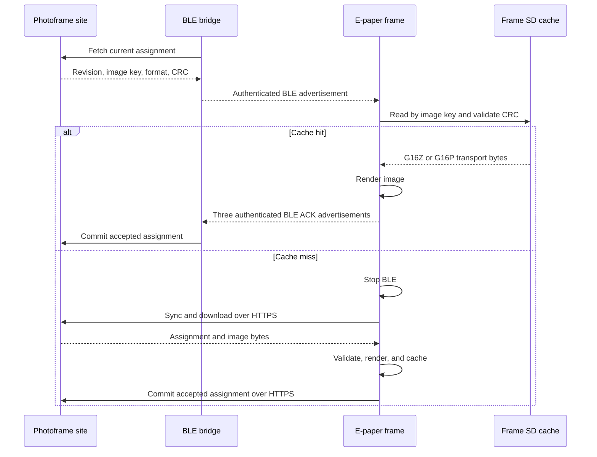

## Status

The e-paper BLE bridge and frame acceleration work is parked on the
`archive/epaper-ble-experiment` branch. It is not recommended for release in
its current form.

The experiment proved that authenticated BLE assignment discovery and
cache-only refreshes are feasible. It did not produce a simple, dependable
fallback path for uncached images. The final hybrid design still requires WiFi
on the frame, adds two radio lifecycles to one wake, and has more failure modes
than the direct HTTP assignment path.

> [!IMPORTANT]
> The durable display-assignment APIs and transaction logic predate the BLE
> commits. They remain useful without the bridge and should not be removed with
> the experimental BLE transport.

Future options are evaluated in
[E-Paper BLE Future Options](epaper-ble-future-options.md).

## Commit Boundary

| Commit | Role | Recommendation |
|---|---|---|
| `8d13a5b` | Durable photoframe assignments | Keep |
| `e83469e` | Assignment transaction tests | Keep |
| `bcd456f` | Separate image source modes | Keep as the pre-BLE baseline |
| `69f3a37` | BLE bridge runtime | Park |
| `ad45b1b` | Frame BLE acceleration | Park |
| Archive follow-up commit | Hardware fixes and this retrospective | Park with the experiment |

The `bcd456f` commit is the clean boundary between the reusable assignment
work and the BLE experiment.

## Intended Design

The bridge polls the photoframe site for assignment metadata and advertises a
small authenticated packet. A frame scans at wake, selects its packet, and
tries to render the corresponding image from its assignment cache. BLE never
carries image bytes in this design.

This split makes BLE fast only when the exact transport image is already on the
frame. A new photo still takes the full WiFi, DNS, TLS, download, decode, and
panel-refresh path.

## Implemented Components

### Durable Assignment Layer

These components are independent of BLE and remain useful:

| Component | Main files | Purpose |
|---|---|---|
| Assignment transaction | [`epaper_assignment.cpp`](../../src/app/device_classes/epaper/epaper_assignment.cpp), [`epaper_assignment_logic.cpp`](../../src/app/device_classes/epaper/epaper_assignment_logic.cpp) | Synchronize, validate, render, persist, and acknowledge assignments |
| Assignment state | [`epaper_assignment.h`](../../src/app/device_classes/epaper/epaper_assignment.h) | Store the accepted revision, opaque image key, and transport CRC |
| Image source modes | [`epaper_source_mode.cpp`](../../src/app/device_classes/epaper/epaper_source_mode.cpp) | Keep slot images and display assignments as explicit modes |
| HTTPS transport | [`epaper_http.cpp`](../../src/app/device_classes/epaper/epaper_http.cpp) | Download images without the Inkplate library HTTPS path |
| Assignment cache | [`epaper_sd_cache.cpp`](../../src/app/device_classes/epaper/epaper_sd_cache.cpp) | Cache transport bytes by assignment image key and metadata |
| Site assignment store | [`store.py`](../../tools/photoframe-site/store.py) | Maintain pending, current, accepted, and successor assignment state |
| Site API | [`app.py`](../../tools/photoframe-site/app.py) | Expose assignment metadata, image delivery, acknowledgement, and sync |
| Tests | [`test_epaper_assignment.cpp`](../../tests/test_epaper_assignment.cpp), [`test_assignment_api.py`](../../tools/photoframe-site/tests/test_assignment_api.py) | Verify revision ordering, replay, commit, and API behavior |

### BLE-Specific Layer

These components exist only for the experiment:

| Component | Main files | Purpose |
|---|---|---|
| BLE packet codec | [`epaper_ble_codec.cpp`](../../src/app/epaper_ble_codec.cpp) | Encode, authenticate, and decode fixed-size assignment and ACK packets |
| Frame scanner | [`epaper_ble_frame.cpp`](../../src/app/device_classes/epaper/epaper_ble_frame.cpp) | Scan for 400 ms, select a frame-specific packet, use cache, and send ACKs |
| Frame decision logic | [`epaper_ble_frame_logic.cpp`](../../src/app/device_classes/epaper/epaper_ble_frame_logic.cpp) | Decide unchanged, cached render, or HTTP fallback |
| Bridge runtime | [`epaper_ble_bridge_runtime.cpp`](../../src/app/device_classes/epaper_ble_bridge/epaper_ble_bridge_runtime.cpp) | Poll assignment APIs, rotate advertisements, receive ACKs, and retry |
| Bridge configuration | [`epaper_ble_bridge_config.cpp`](../../src/app/device_classes/epaper_ble_bridge/epaper_ble_bridge_config.cpp) | Store credentials for up to two frames with API redaction |
| Bridge portal | [`epaper_ble_bridge_component.cpp`](../../src/app/device_classes/epaper_ble_bridge/components/epaper_ble_bridge_component.cpp) | Configure bridge-owned frame records |
| Shared TLS allocator | [`tls_allocator.cpp`](../../src/app/tls_allocator.cpp) | Route bridge mbedTLS allocations to PSRAM with internal-RAM fallback |
| BLE tests | [`test_epaper_ble_codec.cpp`](../../tests/test_epaper_ble_codec.cpp), [`test_epaper_ble_frame_logic.cpp`](../../tests/test_epaper_ble_frame_logic.cpp), [`test_epaper_ble_bridge_logic.cpp`](../../tests/test_epaper_ble_bridge_logic.cpp) | Verify packet vectors, authentication, selection, and retry behavior |

## Assignment API Worth Keeping

The assignment API is the strongest reusable result. It gives frames and
bridges a stable way to ask for the next photo without coupling them to BLE.

Every endpoint requires `device_id` and the device API `key`. The site verifies
the key with a constant-time comparison.

| Method and path | Request | Result |
|---|---|---|
| `GET /api/assignment/current` | Optional `If-None-Match` | Current assignment JSON, `304`, or `204` |
| `GET /api/assignment/image` | `revision`, optional `proxy=1` | Exact image transport plus image-key and CRC headers, `404`, or `410` |
| `POST /api/assignment/ack` | `revision`, `image_key`, optional `ack_tag` | Commit matching assignment and return its successor |
| `POST /api/assignment/sync` | `last_displayed_revision`, `image_key`, optional `ack_tag` | Commit displayed assignment when present, then return current assignment |
| `GET /api/next` | Legacy device credentials | Redirect to the next image or return `204` |

Assignment records include the schema, device ID, revision, image ID, opaque
16-hex image key, transport CRC32, format, creation time, and state. The image
key identifies content independently of its storage URL. The CRC validates the
exact downloaded transport bytes before they enter the cache or panel pipeline.

The sync transaction is valuable because it is replayable:

1. The frame sends its last successfully displayed revision and image key.
2. The site commits that assignment when it still matches.
3. The site returns the current successor in the same request.
4. The frame persists new state only after a successful render or validated
   unchanged result.

This contract works for direct frame HTTPS, a LAN proxy, the metadata bridge,
or a future full BLE bridge.

## What Worked

### Assignment and cache behavior

* Durable revisions survive resets and interrupted acknowledgements.
* RFC 1982 revision ordering rejects stale assignments while allowing wrap.
* Image keys and transport CRCs prevent a stale or corrupt cache entry from
  being displayed as a new assignment.
* A validated legacy blob-cache entry can be promoted into the assignment
  cache.
* HTTP fallback can commit its accepted revision through `/sync`; it does not
  require a second BLE session.

### BLE metadata path

* The bridge polls and advertises authenticated assignment metadata.
* The frame filters packets by device key and selects a valid revision.
* A 400 ms scan reliably found nearby bridge packets in hardware tests.
* Unchanged assignments avoid a panel refresh.
* Assignment-cache hits render without WiFi and send three authenticated ACK
  advertisements at 30 ms spacing.
* The bridge receives BLE ACKs and forwards accepted state to the site.

### Bridge runtime

* The bridge supports two configured frames.
* Fixed-size runtime records fit the small ESP32-S3 Zero target.
* HTTP runs on a worker task while BLE rotation remains responsive.
* Exponential retry prevents tight polling during site outages.
* PSRAM-first mbedTLS allocation resolved bridge-side internal-memory pressure.

### Test and build coverage

The host suite covers assignment transactions, BLE packet vectors, frame
selection, bridge retry logic, security guards, and bridge configuration. The
experiment was built successfully for `reterminal-e1003`,
`esp32s3-ble-bridge`, and the preferred regression board
`esp32-p4-lcd4b`.

## What Did Not Work Reliably

### Retaining BLE through HTTPS fallback

The first frame design kept NimBLE initialized so it could send a BLE ACK after
an HTTP render. Hardware runs showed HTTPS stalls and read timeouts when BLE
remained initialized. Moving mbedTLS allocations to PSRAM reduced memory
pressure but did not restore reliable transfer.

The corrected lifecycle stops BLE before starting WiFi and acknowledges a
successful HTTP fallback through `/api/assignment/sync`. Same-wake BLE
reinitialization was rejected after crashes in the Arduino BLE stack.

### Frame-wide mbedTLS PSRAM allocation

Applying the bridge allocator globally to frames caused or correlated with TLS
downloads stalling near TLS-record boundaries. Frames have enough internal RAM
for TLS once BLE is stopped, while their large image buffers already live in
PSRAM. The frame allocator override was removed. The bridge retains it because
BLE and HTTPS coexist there.

### HTTP performance

The original body loop used `Stream::readBytes`, which performs a timed read
for each byte in Arduino-ESP32. Replacing it with the client's bulk `read`
improved throughput, but remote HTTPS remained slow.

Measured samples varied from about 24 KiB/s to 38 KiB/s. The precompiled
ESP32-S3 lwIP library uses a 5,760-byte TCP receive window. Remote round-trip
latency therefore constrains a single HTTPS connection even with a correct
bulk-read loop. BLE teardown does not change that compiled TCP window.

The current data does not prove that BLE itself causes the remaining normalized
throughput variation. A controlled same-blob A/B run with BLE disabled and
enabled would be required to isolate residual lifecycle effects from changing
server latency.

### SNTP and assignment networking

A hardware run asserted in `udp_new_ip_type` with the message
`Required to lock TCPIP core functionality`. The decoded backtrace showed an
SNTP DNS callback overlapping the assignment HTTP hostname lookup. The staged
fix stops SNTP and detaches its callback after the bounded synchronization wait
and before assignment networking begins.

### Integration complexity

Several failures were not protocol bugs. They came from lifecycle and build
integration details:

* The bridge portal component was initially absent because registration depends
  on the project aggregation units.
* An `HTTPClient` outlived its local transport object and crashed the bridge.
* An empty BLE GAP name crashed frame initialization.
* BLE reinitialization in one wake was unsafe.
* Radio ordering, allocator ownership, panel prewarm, SNTP, DNS, TLS, MQTT, and
  sleep all interact in one frame wake.

Each issue was fixable, but the combined system is difficult to reason about
and expensive to validate across cache hits, cache misses, first boot, site
outage, bridge outage, corrupt cache, and interrupted acknowledgement.

## Keep, Rework, and Park

| Area | Decision | Reason |
|---|---|---|
| Assignment site API and store | Keep | Transport-neutral, replayable, and useful to every future design |
| Firmware assignment state machine | Keep | Separates accepted display state from requested state |
| Image key and transport CRC contract | Keep | Enables safe caching and corruption detection |
| Assignment SD cache | Keep | Useful for direct HTTP and any bridge design |
| Image-source mode separation | Keep | Prevents assignment and slot settings from interfering |
| Timing telemetry | Keep | Essential for hardware diagnosis |
| Bulk HTTP reads and truncation checks | Keep | Correctness and performance fixes independent of BLE |
| Explicit SNTP shutdown | Keep | Prevents a demonstrated lwIP crash |
| BLE packet codec | Park | Useful reference, but tied to the metadata-only protocol |
| Bridge runtime and portal | Park | Operational complexity is not justified by metadata-only acceleration |
| Frame scan and BLE ACK lifecycle | Park | Adds radio complexity while uncached frames still require WiFi |
| Shared TLS allocator | Keep only with bridge | Solves the bridge memory constraint; unnecessary on frames |

## Confidence Gaps

The following scenarios were not validated enough for release confidence:

* Repeated uncached BLE-selected assignments over many wake cycles
* Long-running bridge behavior with two frames and intermittent site failures
* Recovery from bridge reboot between advertisement and ACK
* BLE and WiFi behavior across all ESP32-S3 radio and heap states
* Same-image throughput comparisons against the 1.22.0 release
* Power consumption for scan, fallback, cache render, and full wake paths
* Behavior after every interrupted state transition and deep-sleep boundary

## Conditions for Restarting the Work

Do not resume by adding another fallback to the current hybrid lifecycle. Start
with one explicit product goal and one primary transport.

Before implementation, require:

* A written decision on whether frames may use WiFi
* A measured transfer target for a representative 500 to 900 KiB G16Z image
* A failure matrix covering power loss, bridge loss, site loss, and corrupt data
* A protocol version and compatibility policy
* Hardware tests that run repeated cold wakes, not one successful demonstration
* Per-path memory, active-time, and battery measurements

The existing assignment contract should remain the source of truth regardless
of the selected transport.