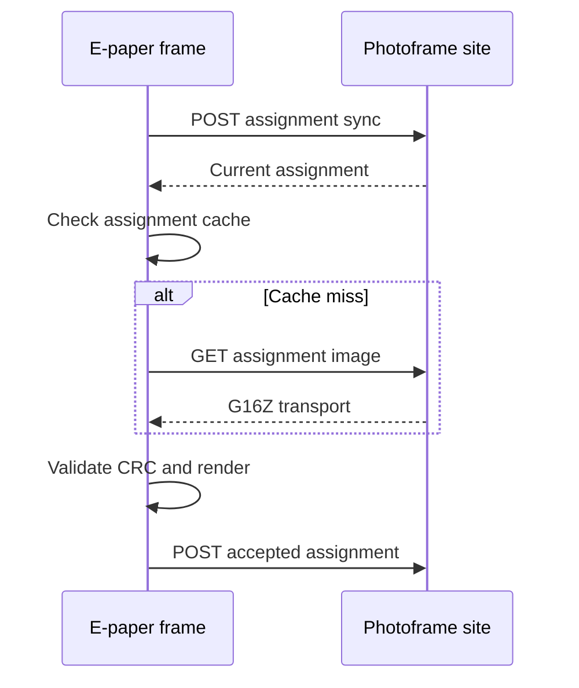
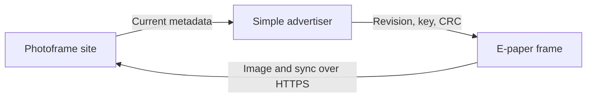
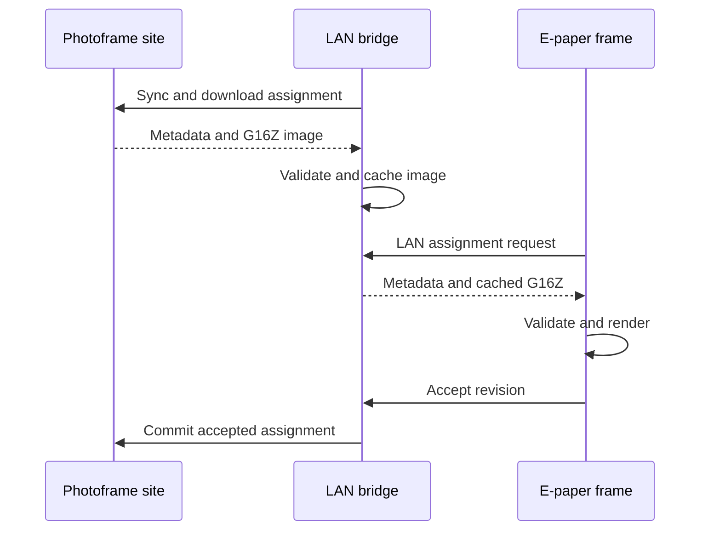
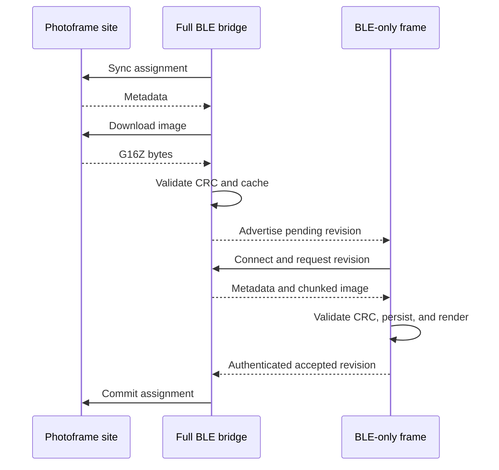

## Decision Context

The parked experiment uses BLE for assignment metadata and WiFi for every
uncached image. That combination accelerates cache hits but leaves the most
important new-photo path dependent on both radios.

The full evidence and component inventory are in
[E-Paper BLE Experiment Retrospective](epaper-ble-experiment-retrospective.md).

Future work should optimize for one of two different goals:

* Minimize firmware complexity while retaining dependable photo delivery
* Remove WiFi from battery-powered frames

Those goals lead to different architectures. A metadata-only bridge is not a
good compromise when uncached photos are the common case.

## Option Summary

| Option | Frame WiFi | New-photo path | Complexity | Recommendation |
|---|---|---|---|---|
| Direct assignment HTTPS | Required | Site to frame | Low | Default baseline |
| Simplified metadata bridge | Required | Site to frame | Medium | Avoid unless cache hits dominate |
| LAN cache or proxy bridge | Required | Bridge to frame over LAN | Medium | Strong performance option |
| Full BLE image bridge | Not required | Bridge to frame over BLE | High | Best fit for WiFi-free frames |
| Custom larger-window ESP32 core | Required | Site to frame | High operational cost | Consider only with controlled toolchains |

## Option 1: Direct Assignment HTTPS

Remove frame BLE acceleration and retain the assignment API, assignment cache,
and direct HTTPS transport.

### Benefits

* One radio lifecycle and one source of truth
* Smallest firmware and test surface
* Existing behavior already works without a bridge
* SD assignment cache still avoids repeated downloads
* No bridge hardware or bridge configuration to operate

### Limitations

* WiFi association, DNS, TLS, and NTP remain on the frame
* Remote throughput is constrained by the ESP32-S3 TCP receive window and RTT
* WiFi credentials remain provisioned on every frame

### Appropriate use

Use this as the release baseline while requirements are still evolving. It is
the easiest architecture to support and the control case for future benchmarks.

## Option 2: Simplified Metadata Bridge

Retain the current fixed-size BLE assignment advertisement, but remove bridge
ACK forwarding and most bridge-side state. The bridge only announces a newer
revision. The frame always commits through HTTP after cache use or download.

### Simplifications

* Make advertisements stateless and periodically refreshed
* Remove BLE ACK advertisements and bridge ACK processing
* Remove accepted-state forwarding from the bridge
* Keep authentication, device filtering, and protocol versioning
* Let the site assignment transaction remain authoritative

### Assessment

This reduces bridge complexity but does not remove WiFi, TLS, or remote image
latency from the frame. It is worthwhile only when most new assignments are
already present in the frame cache. That is not the normal photo delivery case.

## Option 3: LAN Cache or Proxy Bridge

The bridge owns remote HTTPS and stores assignment images locally. Frames use
WiFi only for a low-latency LAN request to the bridge.

### Benefits

* Avoids high-RTT remote TCP limits on the frame
* Keeps image transport HTTP-based and easy to inspect
* Reuses the assignment API and transport CRC contract
* Bridge can prefetch while the frame sleeps
* Easier to benchmark and recover than a custom BLE bulk protocol

### Costs

* Frames still need WiFi credentials and association time
* Bridge needs persistent image storage and a local HTTP service
* Local authentication and bridge discovery must be designed
* The bridge becomes required infrastructure for normal delivery

### Appropriate use

Choose this when speed is the primary problem but frame WiFi is acceptable. It
offers much of the performance benefit of a bridge without implementing bulk
BLE transfer.

## Option 4: Full BLE Image Bridge

The bridge owns all WiFi, site API, TLS, and image caching. The frame uses BLE
for metadata and image bytes and never enables WiFi.

### Required protocol components

* Authenticated connection setup tied to the existing device API key
* Versioned metadata containing revision, image key, format, length, and CRC
* Chunked transfer with sequence numbers and explicit offsets
* Resume after disconnect without restarting the full image
* Flow control that does not overrun frame PSRAM or bridge queues
* End-to-end CRC validation before cache commit or panel refresh
* Atomic replacement of cached transport data
* Idempotent accepted-revision acknowledgement
* Cancellation when a newer assignment supersedes an in-progress transfer

GATT notifications are widely supported but add application-level flow control.
L2CAP connection-oriented channels may provide cleaner bulk transfer if the
Arduino-ESP32 NimBLE integration exposes the required APIs reliably. The
transport choice must be benchmarked on the actual bridge and E1003 hardware.

### Benefits

* Frames need no WiFi credentials, DNS, TLS, NTP, or lwIP image transport
* One frame radio lifecycle per wake
* Bridge can prefetch while frames sleep
* Site credentials and internet access remain centralized
* Frame firmware has a clear offline model

### Costs

* Largest protocol and test investment
* Bridge becomes a required single point of service
* Bridge needs enough persistent storage for all pending frame images
* BLE transfer time and energy must be measured for 500 to 900 KiB images
* Connection recovery, resume, and version compatibility become product code

### Appropriate use

Choose this only when WiFi-free frames are an explicit product requirement. Do
not extend the metadata-only protocol incrementally without first defining the
bulk-transfer and recovery contract.

## Option 5: Custom Larger-Window ESP32 Core

Rebuild Arduino-ESP32 libraries with a larger lwIP TCP receive window and
mailbox sizes for ESP32-S3. The current precompiled core uses a 5,760-byte
default receive window, which constrains throughput over high-latency HTTPS.

### Benefits

* Keeps direct HTTPS architecture unchanged
* Improves all long-distance TCP transfers on the target
* Avoids parallel range requests or a new application protocol

### Costs

* Requires a custom core build and distribution process
* CI, setup scripts, release reproducibility, and contributor onboarding change
* Larger windows consume additional internal RAM
* Core upgrades require rebuilding and revalidating custom libraries

### Appropriate use

Consider this only if the project accepts ownership of a custom embedded
toolchain. It is disproportionate for one image path in the current build
system.

## Recommended Direction

Use direct assignment HTTPS as the maintained baseline. Keep the assignment
API, transaction state machine, assignment cache, CRC validation, bulk HTTP
reads, and timing telemetry.

If WiFi-free frames become a firm requirement, start a new full BLE bridge
project from the assignment contract. Do not revive the current hybrid as its
foundation. The useful references are the authenticated packet codec, device
key selection, revision ordering, and idempotent acknowledgement semantics.

If speed matters but WiFi remains acceptable, prototype the LAN cache or proxy
before custom BLE bulk transport. It moves high-latency HTTPS to the bridge and
keeps the frame protocol conventional.

## Validation Plan for Any New Design

Use one fixed image corpus and report bytes per second, active time, heap, and
battery cost for each path.

Minimum scenarios:

1. First boot with no cached assignment
2. New assignment with a cold cache
3. Unchanged assignment
4. Valid assignment-cache hit
5. Corrupt or truncated cached image
6. Bridge unavailable at wake
7. Site unavailable while the bridge has cached data
8. Disconnect halfway through image transfer
9. Power loss after render but before acknowledgement
10. Revision replacement during an active transfer
11. Repeated cold wakes for at least 100 cycles
12. Two frames requesting different images concurrently

Release confidence should require automated transaction tests plus repeated
hardware runs. A single successful refresh is not sufficient evidence for a
radio, storage, and deep-sleep lifecycle.