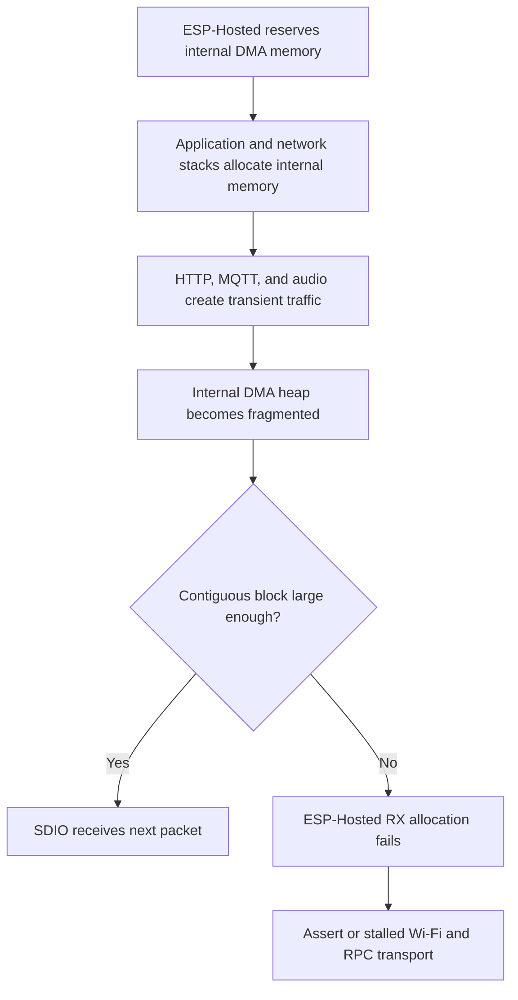

## Status

The production release branch remains on Arduino-ESP32 3.3.7. The experimental
changes described here are preserved on branch
`spike/arduino-esp32-3.3.11-hosted-dma`.

Arduino-ESP32 3.3.10 and 3.3.11 compile successfully, but neither release is
reliable on the Waveshare ESP32-P4-WIFI6-Touch-LCD-4B under the full workload.
The workload includes display rendering, MQTT, audio, the web portal, and three
HTTP camera image slots. ESP-Hosted eventually cannot obtain a contiguous
internal DMA-capable receive buffer. Depending on the bundled ESP-Hosted path,
the device asserts or the Wi-Fi transport remains nominally connected while
packet and RPC traffic stops working.

> [!IMPORTANT]
> Application-side memory tuning improved headroom but did not make the system
> reliable. Do not merge the spike branch into a production release without a
> new runtime validation result or an upstream transport change.

## Objective

The spike evaluated whether the project could move beyond Arduino-ESP32 3.3.7
without losing runtime stability on the ESP32-P4 plus ESP32-C6 architecture.
The constraints were:

* Keep the stock Arduino build workflow when practical
* Avoid machine-local patches to an installed Arduino core
* Preserve display, MQTT, audio, portal, and three HTTP image slots
* Prefer repository-controlled and reproducible changes
* Distinguish total free memory from contiguous internal DMA-capable memory

## Tested platform

| Item | Value |
| --- | --- |
| Board | Waveshare ESP32-P4-WIFI6-Touch-LCD-4B |
| Host SoC | ESP32-P4 |
| Wi-Fi coprocessor | ESP32-C6 over 4-bit 40 MHz SDIO |
| Display | 720 x 720 ST7703 MIPI-DSI |
| Baseline Arduino-ESP32 | 3.3.7 |
| Tested Arduino-ESP32 | 3.3.10 and 3.3.11 |
| Arduino 3.3.11 ESP-IDF | 5.5.4 |
| Arduino 3.3.11 ESP-Hosted | 2.12.11 |
| ESP-Hosted mode | Streaming, TX/RX queues 20/20 |
| Test workload | Display, portal, MQTT, audio, and three HTTP snapshots |

## Failure mechanism

The failing allocation requests use capabilities `0x0000080c`, which require
memory that is internal, DMA-capable, and 8-bit accessible. The important
metric is the largest contiguous block matching those capabilities, not total
heap or PSRAM availability.



ESP-Hosted 2.12.11 enables its preallocated transport pool while keeping the
pool in internal DMA memory:

```text
CONFIG_ESP_HOSTED_SDIO_TX_Q_SIZE=20
CONFIG_ESP_HOSTED_SDIO_RX_Q_SIZE=20
CONFIG_ESP_HOSTED_USE_MEMPOOL=y
# CONFIG_ESP_HOSTED_MEMPOOL_PREFER_SPIRAM is not set
# CONFIG_ESP_HOSTED_DFLT_TASK_FROM_SPIRAM is not set
```

The host pool is approximately `(20 + 11) * 1536 = 47,616` bytes. Additional
streaming traffic still requires contiguous allocations in 1,536-byte
increments. This fixed reservation is the largest difference from the working
3.3.7 environment.

## Upgrade and build results

### Arduino-ESP32 3.3.10

* Installed successfully with ESP-IDF 5.5.4 and esptool 5.3.0
* Passed all host-native tests
* Built all 14 configured board targets
* Required restoration of custom partition definitions after core installation
* Required LVGL draw-buffer alignment to follow the P4 cache-line size
* Reproduced the ESP-Hosted SDIO RX failure on hardware

### Arduino-ESP32 3.3.11

* Installed successfully with esptool 5.3.1
* Passed all host-native tests
* Built the preferred `esp32-p4-lcd4b` target
* Reproduced the failure on stock settings
* The full board matrix was not repeated after hardware reproduced the failure

## Application memory audit

Most large project-owned allocations were already placed in PSRAM:

* LVGL uses a PSRAM-first allocator
* The 720 x 80 RGB565 LVGL draw buffer resides in PSRAM
* Both MIPI-DSI framebuffers reside in PSRAM
* Pad runtime arrays reside in PSRAM
* Image slot and connection arrays reside in PSRAM
* Image download and decoded pixel buffers prefer PSRAM
* LVGL, display-present, and image-fetch task stacks reside in PSRAM
* MP3 read, output, decoder, and PCM buffers prefer PSRAM

Important internal-memory consumers remain:

| Consumer | Approximate size | Notes |
| --- | ---: | --- |
| ESP-Hosted packet pool | 47.6 KB | Internal DMA, SDK-controlled |
| Audio task stack | 24 KB | Internal for cache-disabled paths |
| AsyncTCP task stack | 16 KB stock | Reduced experimentally to 4 KB |
| Arduino loop stack | 8 KB | Core configuration |
| ESP-Hosted task stacks | 7 KB | Default and RPC stacks remain internal |
| I2S DMA resources | Variable | Internal DMA requirement |
| Network stack state | Variable | Main transient fragmentation source |

The compiled stock P4 SDK also has these relevant policies:

```text
CONFIG_ARDUINO_LOOP_STACK_SIZE=8192
CONFIG_LWIP_MAX_SOCKETS=16
CONFIG_LWIP_TCP_SND_BUF_DEFAULT=65534
CONFIG_LWIP_TCP_WND_DEFAULT=65534
# CONFIG_SPIRAM_TRY_ALLOCATE_WIFI_LWIP is not set
# CONFIG_MBEDTLS_EXTERNAL_MEM_ALLOC is not set
```

## Experiments

### Global PSRAM preference for ordinary allocations

Calling `heap_caps_malloc_extmem_enable(0)` and applying a board-level external
memory threshold moved some ordinary allocations to PSRAM.

On 3.3.10, the largest internal DMA block improved from 1,012 to 1,396 bytes,
but a 1,536-byte Hosted allocation still failed. On 3.3.11, a later 3,072-byte
request failed with a largest block of 1,012 bytes.

Result: rejected. Generic allocator policy does not reserve the specific
contiguous DMA memory required by ESP-Hosted and can move allocations with
unexpected capability requirements.

### Dynamic LVGL cache-line alignment

The fixed 64-byte LVGL alignment was replaced with
`CONFIG_CACHE_L2_CACHE_LINE_SIZE`, with a 64-byte fallback. The P4 runtime now
uses 128-byte alignment.

Result: retained on the spike branch. This fixes an independent Arduino-ESP32
3.3.10 and 3.3.11 compatibility issue.

### PSRAM task-stack helper units

The project helper described and allocated stack depth as words, while ESP-IDF
defines its task stack depth argument in bytes. The helper allocated
`depth * sizeof(StackType_t)` bytes but passed `depth` to FreeRTOS, wasting
PSRAM without increasing usable stack depth.

Result: corrected on the spike branch. The helper now consistently uses byte
units. This does not directly recover internal DMA memory.

### Audio task stack in PSRAM

Moving the 24 KB audio task stack to PSRAM recovered substantial internal
headroom. After audio initialization, the largest DMA block measured 42,996
bytes. The first boot MP3 then asserted:

```text
assert failed: spi_flash_disable_interrupts_caches_and_other_cpu
(esp_task_stack_is_sane_cache_disabled())
```

The audio path can run while flash and PSRAM caches are disabled. ESP-IDF
therefore requires this task stack to remain in internal memory.

Result: rejected and reverted. The spike branch keeps the internal 24 KB audio
stack and adds explicit task-creation failure handling.

### Staged DMA telemetry

Memory snapshots now include:

* `df`: free internal DMA-capable memory
* `dm`: minimum free internal DMA-capable memory
* `dl`: largest contiguous internal DMA-capable block

Snapshots are emitted after Hosted startup, display, audio, Wi-Fi, portal,
MQTT, setup, and image-fetch initialization.

Result: retained on the spike branch. These measurements isolated portal and
network startup as major pressure points.

### AsyncTCP stack reduction

The AsyncTCP library defaults to a 16 KB internal task stack. Runtime logging
showed substantial unused space. The project build system already exports
`CONFIG_ASYNC_TCP_STACK_SIZE` into separately compiled libraries.

| Stack | Portal `df` | Portal `dl` | Setup `df` | Fetch `dl` | Outcome |
| ---: | ---: | ---: | ---: | ---: | --- |
| 16 KB | 8,780 | 8,180 | 7,528 | 500 | 1,536-byte allocation failed |
| 8 KB | 17,500 | 16,372 | 16,412 | 788 | 2,048-byte allocation failed |
| 4 KB | 22,384 | 21,492 | 21,296 | 10,228 | 6,144-byte allocation failed |

The 4 KB build reported 3,692 bytes free at the early stack watermark sample.
It substantially improved headroom but did not prevent later fragmentation.
At failure, 6,620 bytes were free but the largest contiguous block was only
4,852 bytes, so a 6,144-byte request failed.

Result: useful optimization, not a complete fix. The spike branch currently
keeps the 4 KB setting for further research. Production adoption requires
long-running portal, MCP, image, reconnect, and concurrent-client testing.

### Serializing boot audio and image startup

Deferring image fetching until the boot sound completes could avoid one
startup collision. It was not implemented because sounds can play during
normal operation while images, MQTT, or portal traffic are active.

Result: rejected as a reliability solution. Scheduling can reduce failure
probability but cannot guarantee DMA headroom during normal concurrent use.

## Runtime conclusions

The 4 KB AsyncTCP test demonstrates that application tuning can reclaim real
headroom. It also demonstrates that the complete workload remains too close to
the internal DMA limit. A normal packet burst can fragment the heap below the
next Hosted request size even when total internal memory remains available.

The observed end state can be misleading:

* Arduino Wi-Fi state still reports connected
* The device retains its DHCP address
* Ping, HTTP, MQTT, and Hosted RPC requests time out
* Reconnect attempts cannot complete because the transport itself is stalled

Avoid treating startup-only success or the absence of an assertion as proof of
stability.

## Upstream research

Relevant upstream reports include:

* [esp-hosted-mcu issue 144][hosted-mcu-144], the open
  `sdio_rx_get_buffer` allocation failure
* [esp-hosted-mcu issue 191][hosted-mcu-191], the open preallocated mempool
  increase discussion
* [esp-hosted issue 597][hosted-597], a related closed DMA and heap report
* [pioarduino platform issue 465][pioarduino-465], the matching ESP-IDF 5.5.2
  to 5.5.4 regression
* [ESP32-P4-NINA-Display issue 130][nina-130], a related project report
* [ESP32-P4-NINA-Display pull request 131][nina-131], which resolved that
  project by pinning ESP-Hosted 2.12.3
* [ESPHome issue 16574][esphome-16574], field evidence for the ESP-Hosted
  PSRAM mempool option

ESP-Hosted 2.12.8 and later provide
`CONFIG_ESP_HOSTED_MEMPOOL_PREFER_SPIRAM`. ESPHome users reported that enabling
this option fixed the matching boot-time mempool assertion on P4 plus C6
systems. The option allocates the pool with PSRAM and DMA capabilities, with an
internal DMA fallback.

Stock Arduino-ESP32 3.3.11 does not enable the option, and a sketch-level
define cannot change the precompiled SDK library. The linked NINA display
project did not ultimately use the option; its merged fix pinned ESP-Hosted to
2.12.3 through `dependencies.lock`.

## Options after the spike

### Production baseline

Keep Arduino-ESP32 3.3.7 on `release/1.22.0`. It is the known working baseline
for the required workload. Revisit the upgrade when the Arduino bundle changes
its Hosted memory policy or failure handling.

### Preferred research path

Build Arduino as an ESP-IDF component and enable:

```text
CONFIG_ESP_HOSTED_MEMPOOL_PREFER_SPIRAM=y
```

This is more work than the stock Arduino workflow, but it gives the repository
control over the SDK configuration and avoids patches inside a locally
installed core. Validate PSRAM consumption and long-running Hosted lifecycle
behavior because one ESPHome report observed PSRAM exhaustion after repeated
initialization and deinitialization.

### Other possible paths

* Test an official future Arduino-ESP32 bundle that enables the PSRAM mempool
  or handles Hosted allocation failure without asserting or wedging
* Coordinate smaller P4 host queues with matching ESP32-C6 coprocessor firmware
* Pin an older ESP-Hosted component in an ESP-IDF-component build
* Reduce product functionality or persistent connection count if the full
  workload is no longer required

Machine-local edits to the installed Arduino core are not recommended. They
are hard to reproduce, disappear on core upgrades, and make release builds
dependent on workstation state.

## Preserved spike branch state

The spike branch contains:

* Arduino-ESP32 3.3.11 setup pin
* P4 cache-line-aware LVGL buffer alignment
* Updated display and image-decoder alignment documentation
* Corrected PSRAM task-stack helper byte units
* Staged DMA-internal telemetry and allocation-failure diagnostics
* Internal audio task stack with task-creation failure handling
* P4-specific 4 KB AsyncTCP stack experiment
* Generated compile-time flag documentation

Validation completed during the spike:

* All host-native tests passed
* Arduino-ESP32 3.3.10 built all 14 configured boards
* Arduino-ESP32 3.3.11 built `esp32-p4-lcd4b`
* The final 4 KB AsyncTCP experiment built successfully

The latest 4 KB test artifact had this ELF SHA-256:

```text
c8403c6c81bdaf79b4ccf52d49dd89b17dda9c0c6123a81a668efbf58a3ca204
```

The final runtime result remained an ESP-Hosted allocation failure, followed
by loss of functional Wi-Fi connectivity.

[hosted-mcu-144]: https://github.com/espressif/esp-hosted-mcu/issues/144
[hosted-mcu-191]: https://github.com/espressif/esp-hosted-mcu/issues/191
[hosted-597]: https://github.com/espressif/esp-hosted/issues/597
[pioarduino-465]: https://github.com/pioarduino/platform-espressif32/issues/465
[nina-130]: https://github.com/chvvkumar/ESP32-P4-NINA-Display/issues/130
[nina-131]: https://github.com/chvvkumar/ESP32-P4-NINA-Display/pull/131
[esphome-16574]: https://github.com/esphome/issues/issues/16574
