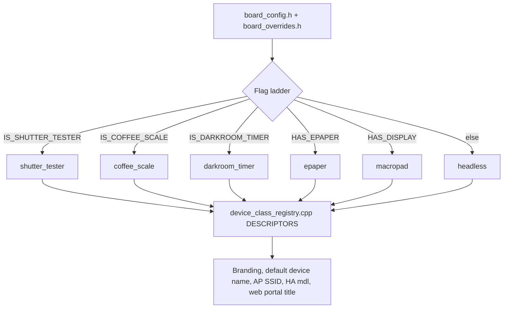

<!-- markdownlint-disable-file MD041 -->
# Device Classes

The ESP32 Macropad firmware compiles for multiple hardware classes from a single source tree. The active class is selected at compile time through `IS_*` and `HAS_*` flags in [src/app/board_config.h](../../src/app/board_config.h) and per-board overrides under [src/boards/](../../src/boards/).

| Class            | Brand prefix              | Default boards                                            | Highlights                                                                                                  |
|------------------|---------------------------|-----------------------------------------------------------|-------------------------------------------------------------------------------------------------------------|
| `macropad`       | `ESP32 Macropad`          | `jc4880p433`, `jc3636w518`, `jc3248w535`, `esp32-p4-lcd4b`, `jc1060p470c`, `esp32-4848S040` | Touch-screen control surface with configurable buttons, widgets, MQTT, BLE HID.                             |
| `epaper`         | `ESP32-MP E-Paper`        | `inkplate5v2`, `reterminal-e1003`                        | Battery-powered e-paper display with hourly schedules and image carousel.                                   |
| `headless`       | `ESP32-MP Headless`       | `esp32c3-withsensors`                                     | Sensor / bridge node — MQTT telemetry, BTHome BLE beacons, no display.                                      |
| `shutter_tester` | `ESP32-MP Shutter Tester` | `jc4880p433-shutter`                                      | Specialized capture rig measuring camera shutter speeds via an ADC sensor array. See [shutter-tester/](shutter-tester/README.md). |
| `coffee_scale`   | `ESP32-MP Coffee Scale`   | `jc4880p433-nau7802`, `jc4880p433-hx711`                  | Connected espresso / pour-over scale with a stage-based brew engine and weight logging. See [coffee-scale/](coffee-scale/README.md). |
| `darkroom_timer` | `ESP32-MP Darkroom Timer` | `jc4880p433-darkroom`                                     | Enlarger exposure timer with f-stop test strips, light metering, relay control, and a print session log. See [darkroom-timer/](darkroom-timer/README.md). |

## How class detection works

The single source of truth is `device_class_detect()` and the `DESCRIPTORS[]` table in [src/app/device_class_registry.cpp](../../src/app/device_class_registry.cpp). The bash mirror in [config.sh](../../config.sh) (`device_class_for_board`, `device_class_brand_prefix`) is validated against the C++ table by [tests/test_branding_mirror.sh](../../tests/test_branding_mirror.sh).

## Per-class documentation

- [shutter-tester/](shutter-tester/README.md) — Shutter Tester device class
- [coffee-scale/](coffee-scale/README.md) — Coffee Scale device class
- [darkroom-timer/](darkroom-timer/README.md) — Darkroom Timer device class
