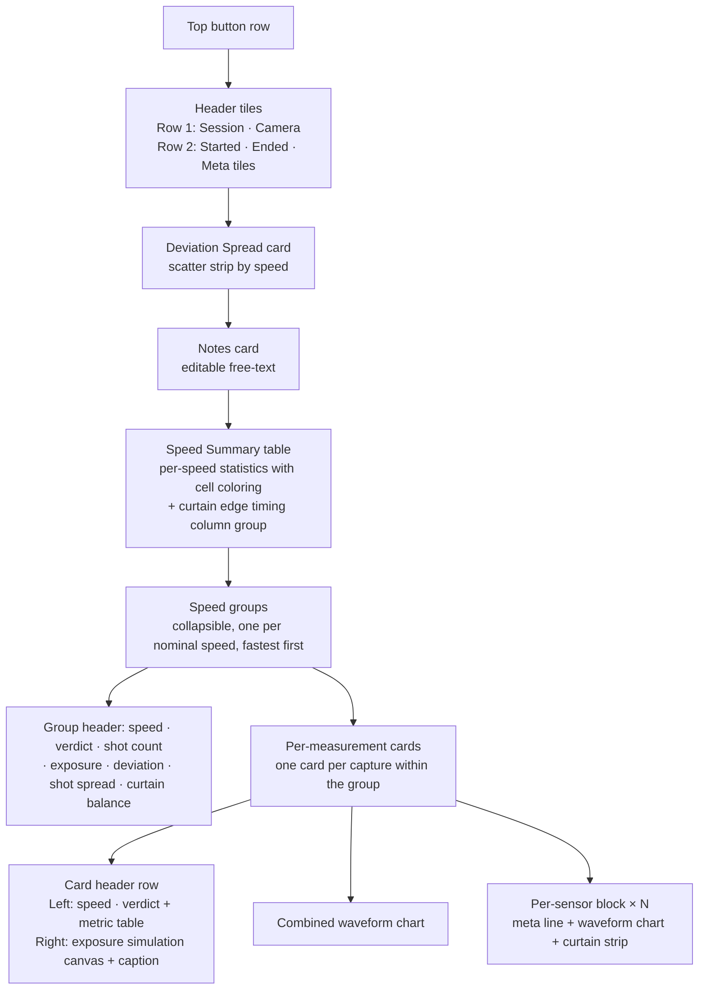
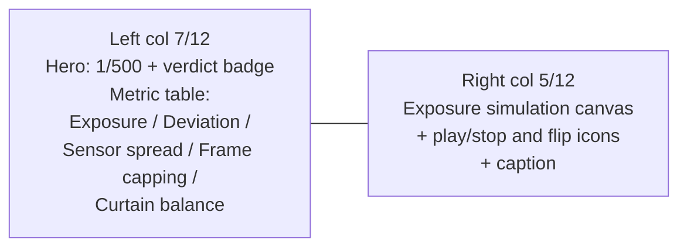
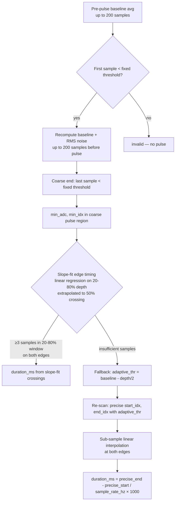
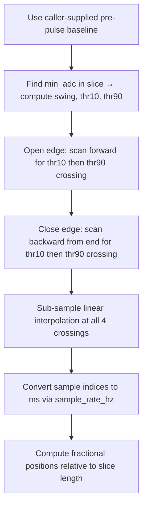

# Shutter Tester — Session Detail View

This document describes every section of the **session detail view** in the web portal (Sessions → click a session) and explains the calculations behind each value.

> If you change what the detail view renders, update this doc. The view is implemented in [src/app/web/portal_shutter_sessions.js](src/app/web/portal_shutter_sessions.js) and [src/app/web/shutter-sessions.fragment.html](src/app/web/shutter-sessions.fragment.html). Per-sensor measurement math lives in [src/app/shutter_measure.cpp](src/app/shutter_measure.cpp).

## Page anatomy



The page loads three REST endpoints in parallel (plus a local font preload):

| Endpoint | Purpose |
|---|---|
| `GET /api/sessions/{id}` | Full session: measurements, sensor results, waveforms |
| `GET /api/sessions` | Manifest list — used to overlay authoritative `camera` and `notes` |
| `GET /api/config` | Device configuration including verdict thresholds |

Measurements are sorted **ascending by `nearest_duration_ms`** (fastest shutter speed first) before rendering.

---

# Part 1 — Reading the detail view

This part describes what each section shows and how to interpret it. Field names in `code` map back to JSON fields in the session record for cross-reference with code and CSV exports.

## Top button row

| Button | Effect |
|---|---|
| **← Back to sessions** | Returns to the session list |
| **🖨 Print / Save PDF** | Opens the browser print dialog. Layout is print-friendly |
| **📋 Copy for AI Analysis** | Experimental — not documented here |

## Header tiles

Two rows of stat tiles at the top of the detail view. Row 1 contains hero tiles (accent border, tinted background); row 2 contains compact secondary tiles.

### Row 1 — hero tiles

| Tile | Field | Meaning |
|---|---|---|
| **Session** | `id` | Numeric session identifier (e.g. `42`). Read-only |
| **Camera** | `camera` | Free-text camera identifier. Click ✎ to edit; saved to manifest. Uses `--wide` class for extra width |

### Sweep orientation flip

Each per-shot **exposure simulation** canvas has a small Material Symbols flip icon in its bottom-left corner. Clicking it toggles the simulated sweep direction between:

* **Horizontal** (`swap_horiz`, focal plane cloth) — default. Curtains travel left↔right across the gate.
* **Vertical** (`swap_vert`, focal plane metal) — curtains travel top↔bottom.

The choice is session-scoped: flipping any card flips them all. It is not persisted across reloads. The flip only changes the orientation of the simulated slit and the gradient drawn on every per-shot card; it does not affect any measurement, deviation, or verdict math.

### Row 2 — compact tiles

| Tile | Field | Meaning |
|---|---|---|
| **Started** | `started_at` | Session start timestamp in local time |
| **Ended** | `ended_at` | Session end timestamp in local time |
| **Meta tiles** | `meta[]` | Self-describing context entries from firmware (see below) |

### Session metadata (`meta` array)

The firmware snapshots device configuration when a session starts and writes it as a `meta` array of `{key, label, value, icon}` objects. The `key` field is a machine-readable identifier for filtering, search, and deduplication. The `icon` field is optional and specifies a Material Symbols icon name. The portal renders each entry as a compact tile with a faint background icon and formats raw numeric values for display.

| Label | Key | Value type | Icon | Description |
|---|---|---|---|---|
| Sensor Preset | `sensor_preset` | string | `tune` | Active sensor preset ID at session start |
| Active Sensors | `active_sensors` | integer | `sensors` | Number of sensors enabled |
| Tester Firmware | `firmware` | string | `memory` | Firmware version that captured the session |
| ADC Sample Rate | `sample_rate` | float (Hz) | `speed` | Per-sensor ADC sample rate. Portal formats as kHz |
| Ambient Baseline | `ambient_baseline` | integer (ADC) | `brightness_auto` | Average baseline ADC reading from the first measurement's valid sensors. Only present if valid sensors exist |
| Guided Test | `guided_test` | string | `auto_fix_high` | Guided test script name. Only present for guided sessions |
| Sensor Offset | `sensor_offset` | string | `straighten` | Combined offset display (e.g. `±(11.2, 7.4) mm`). Only present when offsets are configured. Contains additional numeric sub-fields: `sensor_offset_x_mm`, `sensor_offset_y_mm`, `sensor_diagonal_mm` ($2\sqrt{x^2 + y^2}$) |

## Notes card

Full-width editable free-text field. Click ✎ to edit; saved to manifest. Multi-line supported.

## Deviation Spread card

Scatter strip showing measurement deviation by speed. Only shown when the session contains measurements.

### Reading the deviation scatter

* **X axis** is calibrated in **stops** with tick marks at common photographic boundaries: 0, ±1/3, ±1/2, ±2/3, ±1, ±2.
* **Background bands** colour the tolerance zones based on the deviation thresholds from `/api/config`: green inside the warning threshold, yellow between warning and fail, no band outside fail.
* **Y axis** lists shutter speeds, slowest at the top.
* **Dot colour** is determined by the dot's position on the X axis relative to the deviation threshold bands (green/yellow/red), not by the per-measurement verdict.
* **Diamond marker** appears when a speed has 2 or more measurements — it shows the **average** deviation. A dashed line connects the diamonds across speeds, making drift across the speed range visible.
* **Click any dot or diamond** to scroll directly to its measurement card.

A healthy shutter shows tight clusters near the zero line. Diamonds drifting consistently to the negative side at faster speeds are the classic sign of an aging mechanical shutter (curtains slow at high tension).

## Speed Summary table

Aggregates every measurement that landed on the same nominal shutter speed. Rows are sorted **fastest first** (largest denominator first). Hover any column header for an inline tooltip; click a row to jump to the first measurement card for that speed. Most numeric columns carry their unit in the header (e.g. `(stops)`, `(ms)`, `(s)`) so cells stay compact.

| Column | Meaning |
|---|---|
| **Verdict** | Per-speed verdict driven solely by average absolute deviation in stops (warning at >1/3, fail at >1/2). Capping, spread, and repeatability cells remain colour-tinted for diagnostic context but do not affect the verdict |
| **Speed** | Nominal shutter speed label, e.g. `1/500` (the trailing `s` is moved to the column header) |
| **Avg deviation** | Mean of `deviation_stops` across measurements at this speed, in stops |
| **Shot spread** | Peak-to-peak range across shots as a percentage of the mean. Hidden if fewer than 2 measurements |
| **Frame capping** | Estimated total capping across the full 35 mm frame (gradient × 43.27 mm), in stops. Shows `<0.01` when the gradient is below 0.001 stops/mm. Cells are color-tinted based on threshold severity |
| **Repeatability** | Coefficient of variation (CV%) across shots. Hidden if fewer than 3 measurements |
| **Curtain edge timing** (group) | Three-column visual group with vertical separators. Per-speed averages of when each curtain edge crosses the sensor positions, plus the closing÷opening balance |
| &nbsp;&nbsp;**1st curtain** | Mean `curtain1_ms` across all valid sensors of all shots at this speed, in ms |
| &nbsp;&nbsp;**2nd curtain** | Mean `curtain2_ms` across all valid sensors of all shots at this speed, in ms |
| &nbsp;&nbsp;**Balance** | 2nd ÷ 1st curtain ratio (dimensionless, ideally 1.00). Includes a `(ΔN%)` annotation when within-shot variation across sensors is ≥ 0.5% |
| **Individual measurements** | Comma-separated list of `avg_duration_ms` per capture, with the nominal target in parentheses (in ms). Each value is a link to its card. Hidden on narrow viewports |

Footer row shows:

* **Total measurements** in the session.
* **Speed trend** — drift slope across the speed range, in stops per doubling. Hidden if fewer than 3 distinct speeds were tested. Negative means the shutter runs progressively faster than nominal at fast speeds (typical aging pattern).

### Verdict thresholds

Verdicts are driven solely by average absolute deviation in stops.

| Metric | Warning | Fail |
|---|---|---|
| Deviation | > 1/3 stop | > 1/2 stop |

Capping, sensor spread, and repeatability are still shown in the summary table with colour-tinted cells for diagnostic context but do not affect the verdict. Cell-colour thresholds are fixed in the portal; only the deviation thresholds are configurable via the device settings API (`GET /api/config` → `verdict_thresholds.deviation`).

### Healthy ranges

| Metric | Excellent | Acceptable | Investigate |
|---|---|---|---|
| Sensor spread | < 5% | 5–10% | > 10% |
| Repeatability | < 5% | 5–10% | > 10% |
| Speed trend | < ±0.10 stops/doubling | < ±0.30 | > ±0.30 |

## Speed groups

Measurement cards are grouped by nominal shutter speed. Groups are sorted fastest first (largest denominator first). Each group has a collapsible header showing:

| Element | Meaning |
|---|---|
| **Speed label** | Nominal speed for this group |
| **Verdict badge** | Per-speed verdict driven by average absolute deviation in stops |
| **Shot count** | Number of measurements at this speed |
| **Exposure** | Mean `avg_duration_ms` across the group, in ms |
| **Deviation** | Average `deviation_stops` across the group, shown both in stops and `(±X.X%)` |
| **Shot spread** | Peak-to-peak spread of `avg_duration_ms` across shots, as a percentage. Hidden for single-shot groups |
| **Curtain balance** | Mean 2nd ÷ 1st curtain ratio across all sensors of all shots, with optional `(ΔN%)` for within-shot variation |

Click any group header to collapse/expand it. All groups are expanded by default. The chevron (▼/▶) indicates open/closed state.

## Per-measurement card

One card per individual capture, rendered inside its speed group. The card has a two-column header row (metrics on the left, exposure simulation on the right) followed by waveform charts.

### Card header row



On narrow viewports (< 768 px) the right column stacks below the left.

#### Hero line

Shows the nominal **Speed** (`nearest_speed`) and the per-measurement **Verdict** badge (`verdict`).

#### Metric table

A compact two-column table styled to match the Speed Summary table (muted 0.78 rem labels, 0.85 rem values). Rows are omitted when the underlying metric is unavailable.

| Row | Field | Meaning |
|---|---|---|
| **Exposure** | `avg_duration_ms` | Average measured exposure time across valid sensors, in ms |
| **Deviation** | `deviation_stops`, `deviation_pct` | Difference from nominal, e.g. `+0.45 stops (+36.4%)` |
| **Sensor spread** | `spread_pct` | Sensor-to-sensor variation as a percentage. Only shown when 2+ sensors are valid |
| **Frame capping** | derived | Full-frame capping estimate in stops. Only shown when `capping_gradient_stops_per_mm ≥ 0.001`. For 4-corner sessions, a 2D breakdown is shown: `0.32 stops (H:0.18 V:0.27)` — horizontal and vertical components extrapolated to the 36×24 mm gate, combined as $\sqrt{H^2 + V^2}$. For 3-line sessions, the value is the 1D gradient × 43.27 mm film diagonal |
| **Skew differential** | `skew_differential` | Row-average curtain skew gradient in µs/mm (4-corner sessions only). Hover the row for a per-curtain tooltip showing left/right edge timing and spread. See [Curtain skew](#curtain-skew-firmware-4-corner-only) |
| **Curtain balance** | derived | Range (or single value) of 2nd ÷ 1st curtain travel ratios across sensors, e.g. `0.95 → 1.02 (Δ7%)`. Only includes sensors where `curtain_stats.valid` is true. See [Curtain timing](#curtain-edge-detection-firmware) |

#### Exposure simulation

A small canvas (288 × 192 CSS px, 720 × 480 backing) on the right side of the card showing an **approximate** simulation of how the slit moved across the film and the resulting exposure gradient.

* The orientation (horizontal or vertical sweep) follows the in-canvas **flip icon** (bottom-left of each simulation, session-scoped). Default is horizontal. The canvas Y axis matches real-world orientation: positive Y in the firmware's sensor geometry (physical top of the gate) is drawn at the top of the canvas, and the static gradient, red sensor markers, and animated slit all share this convention.
* Sensor positions are drawn as small red circles using the configured X/Y offsets. Each marker is labelled with its per-sensor stops deviation from the geometric mean of all sensors (e.g. `+0.12` or `−0.08`), rendered in bold white monospace with a black outline for contrast. Labels appear inside the sensor field (below top-half markers, above bottom-half markers).
* The gradient direction encodes which side of the frame received more light. Differences are exaggerated for visibility.
* A **play** icon (Material Symbols `play_arrow`) in the bottom-right corner runs a curtain-sweep animation that loops until the user clicks the **stop** icon (`stop`). While the animation runs, a synchronized hover guide tracks the curtain timeline on the measurement's combined and per-sensor waveform charts. Hover-scrubbing any of those charts cancels the running animation and shows a single frame at the hovered time.
* Caption below the canvas: `Approx. exposure & slit simulation · exposure differences exaggerated ×N · cyan ruler = ideal slit (linear model)` (where N is the exaggeration factor).
* The simulation requires both X and Y sensor offsets to be configured and at least 2 valid sensors. Otherwise the canvas is hidden.
* Hidden when printing.

> The simulation is illustrative, derived from sparse sensor data. Use the **Frame capping** row in the metric table for the quantitative figure.

### Combined waveform chart

A single chart overlaying all valid sensors, drawn in raw ADC values. Each sensor uses its own colour (blue / green / yellow). The **x-axis** shows time in milliseconds, with 0 ms aligned to the exposure start of the **earliest-opening** valid sensor across the measurement (not whichever sensor happens to come first in logical order). Later sensors therefore sit at positive offsets; no sensor's pulse start can appear negative purely because of the chosen reference. Grid lines are shared with the per-sensor charts below for visual alignment, and the exposure-simulation animation uses the same time origin so hover-scrubbing stays in sync.

Use this to compare sensors at a glance: their dips should be roughly synchronous in time (offset by curtain travel) and similar in depth.

### Per-sensor block

Below the combined chart, one block per valid sensor. Each block shows:

#### Sensor meta line

```
Sensor 1 · exposure 1.92 ms · deviation -0.06 stops (-4.0%) · 1st curtain 2.10 ms / dwell 0.05 ms / 2nd curtain 2.18 ms · curtain balance 1.04
```

| Element | Source | Meaning |
|---|---|---|
| **exposure** | `sensors[i].duration_ms` | Time this sensor was exposed, in ms |
| **deviation** | derived | This sensor's drift from the nominal speed, in stops and percent |
| **1st curtain** | `curtain_stats.curtain1_ms` | Time the opening (1st) curtain took to clear this sensor |
| **dwell** | `curtain_stats.dwell_ms` | Time the sensor was fully exposed (between curtains). Near zero at high speeds — that is the slit-mode regime |
| **2nd curtain** | `curtain_stats.curtain2_ms` | Time the closing (2nd) curtain took to cross this sensor |
| **curtain balance** | `curtain_stats.curtain_ratio` | 2nd ÷ 1st curtain ratio for this sensor. Ideally 1.00 |

> Curtain values are **per-sensor edge durations**, not curtain travel times across the whole gate. They measure how steep each transition was at this point in the film plane, which corresponds to local curtain speed.

#### Per-sensor waveform chart

A single-sensor view in raw ADC values. The **x-axis** shows time in milliseconds, sharing the same scale and grid lines as the combined chart above for direct visual comparison. Several overlays are drawn on top:

| Overlay | Colour | What it represents |
|---|---|---|
| Waveform line | Sensor colour | Average-downsampled ADC values (or raw if slice fits within target) |
| **Ideal window box** | Translucent grey | The time window the **target** speed should occupy, centred on the dwell midpoint and scaled from the nominal vs. measured ratio |
| **Measurement line + dots** (red) | Red | Two-point line from waveform value at `pulse_start_frac` to value at `pulse_end_frac` — the actual measured open interval |

Compare the red line span against the grey box: if the red endpoints fall outside the box, this capture is faster (red wider) or slower (red narrower) than the target speed. Centring matches when the curtains are balanced.

#### Curtain timing strip

A 5-pixel three-segment bar directly below the waveform chart:

| Colour | Segment | Meaning |
|---|---|---|
| 🟧 Orange | 1st curtain | Falling-edge transition window (10%→90% of swing) |
| 🟩 Green | Dwell | Fully-open interval. Hidden when < 0.1% of the slice |
| 🟥 Red | 2nd curtain | Rising-edge transition window (90%→10% of swing) |

For mechanical shutters at fast speeds, expect the green dwell to vanish and the orange and red bars to dominate — the shutter is operating as a slit. For slow speeds, the green should fill most of the strip.

Hover any segment to see its duration in milliseconds.

---

# Part 2 — Math reference

This part documents the calculations that produce the values shown above. Equations use the field names from [src/app/shutter_measure.h](src/app/shutter_measure.h) and [src/app/shutter_session.h](src/app/shutter_session.h).

## Per-sensor duration (firmware)

Implemented in `compute_sensor_duration()` ([src/app/shutter_measure.cpp](src/app/shutter_measure.cpp)). Two passes are required because the right ADC threshold for a precise edge measurement depends on the pulse depth, which is unknown until a coarse pass has located the pulse.



### Slope-fit edge timing (primary method)

The legacy adaptive-threshold method (used as fallback) finds the precise edge by interpolating between the last sample above threshold and the first sample below. This is brightness-invariant in theory because the threshold scales with pulse depth, but in practice it drifts when the bottom of the pulse is distorted by ADC rail clipping, amplifier slew limits, or optical scatter pedestals — all of which shift `min_adc` and therefore shift the threshold.

The slope-fit method avoids that pitfall:

1. Within each edge region (start_idx → min_idx for the falling edge, min_idx → coarse_end for the rising edge), collect samples whose ADC value lies in $(min + 0.2 \cdot depth, \; min + 0.8 \cdot depth)$ — the linear portion of the transition.
2. Fit a line $y = m \cdot i + b$ to those samples by ordinary least squares.
3. Solve for the sample index $i$ where the line crosses the 50% point $min + 0.5 \cdot depth$.

The fit ignores the distorted bottom region and the noisy near-baseline region, giving a more stable estimate of the edge timing. It falls back to the adaptive-threshold method when fewer than 3 samples qualify on either edge, when the fit is degenerate, or when the resulting edges are reversed. Requires `depth ≥ SHUTTER_MIN_PULSE_DEPTH (100)`.

### Baseline and noise

For up to 200 samples immediately before the first sub-threshold sample at index `start_idx`:

$$\text{baseline\_adc} = \frac{1}{N}\sum_{i=s-N}^{s-1} x_i$$

$$\text{idle\_noise\_rms} = \sqrt{\frac{1}{N}\sum_{i=s-N}^{s-1} (x_i - \text{baseline\_adc})^2}$$

where $s$ = `start_idx` and $N$ = up to 200. This is **population RMS**, not sample stddev.

### Adaptive threshold

After locating `min_adc` in the coarse pulse region:

$$\text{adaptive\_thr} = \text{baseline\_adc} - \tfrac{1}{2}(\text{baseline\_adc} - \text{min\_adc})$$

This puts the threshold at the 50% point of the actual pulse depth, making timing independent of light intensity.

### Sub-sample interpolation

Linear interpolation between the last sample above threshold and the first below (and symmetrically at the trailing edge):

$$\text{precise\_start} = (s-1) + \frac{x_{s-1} - \text{thr}}{x_{s-1} - x_s}$$

$$\text{precise\_end} = e + \frac{\text{thr} - x_e}{x_{e+1} - x_e}$$

Final duration in milliseconds:

$$\text{duration\_ms} = \frac{\text{precise\_end} - \text{precise\_start}}{\text{sample\_rate\_hz}} \times 1000$$

### Validity gate

A sensor is rejected (`valid = false`) if pulse depth is too shallow:

$$\text{baseline\_adc} - \text{min\_adc} < \text{SHUTTER\_MIN\_PULSE\_DEPTH (100)}$$

This rejects noise-triggered captures where the ADC barely dipped below threshold.

## Per-measurement aggregates (firmware)

Implemented in `shutter_measure_process_capture()` ([src/app/shutter_measure.cpp](src/app/shutter_measure.cpp)).

### Average and spread

Across the $V$ valid sensors:

$$\text{avg\_duration\_ms} = \frac{1}{V}\sum_{i=1}^{V} \text{duration\_ms}_i$$

$$\text{spread\_pct} = \frac{\max_i - \min_i}{\text{avg\_duration\_ms}} \times 100 \quad (V \geq 2)$$

### Capping gradient

Computed after spread, only when $V \geq 2$ and the sensor diagonal is configured (> 0):

$$\text{capping\_gradient} = \frac{\left|\log_2\!\left(\frac{\max(\text{duration\_ms})}{\min(\text{duration\_ms})}\right)\right|}{\text{sensor\_diagonal\_mm}}$$

The sensor diagonal is precomputed from the configured X/Y offsets:

$$\text{sensor\_diagonal\_mm} = 2 \times \sqrt{x^2 + y^2}$$

When either condition is not met (single valid sensor or zero diagonal), `capping_gradient_stops_per_mm` is set to the sentinel value $-1.0$ and omitted from session JSON and binding output.

### Nominal speed match

Selects the entry from `STANDARD_SPEEDS[]` minimising the absolute log ratio:

$$\text{nearest\_idx} = \arg\min_k \left| \log \frac{\text{avg\_duration\_ms}}{\text{STANDARD\_SPEEDS}[k]} \right|$$

If the user has locked a target speed, that index is used unconditionally instead.

### Deviation and verdict

$$\text{deviation\_pct} = \frac{\text{avg\_duration\_ms} - \text{nearest\_duration\_ms}}{\text{nearest\_duration\_ms}} \times 100$$

$$\text{deviation\_stops} = \log_2 \frac{\text{avg\_duration\_ms}}{\text{nearest\_duration\_ms}}$$

| Condition | `verdict` |
|---|---|
| $\lvert\text{deviation\_stops}\rvert \leq 0.333$ | `SHUTTER_VERDICT_PASS` |
| $\lvert\text{deviation\_stops}\rvert \leq 0.500$ | `SHUTTER_VERDICT_WARNING` |
| otherwise | `SHUTTER_VERDICT_FAIL` |

Thresholds defined as `SHUTTER_VERDICT_PASS_STOPS` / `SHUTTER_VERDICT_WARN_STOPS` in [src/app/shutter_measure.h](src/app/shutter_measure.h).

## Curtain edge detection (firmware)

Implemented in `compute_curtain_stats()` ([src/app/shutter_curtain_stats.cpp](src/app/shutter_curtain_stats.cpp)). Runs on the device at full ADC resolution (before downsampling) against the stored waveform slice. Results are pre-computed and emitted in the session JSON as `curtain_stats` per sensor. The browser reads these values directly — no client-side edge detection.

### Two-tier validity model

The `curtain_stats` object carries two independent flags that consumers interpret differently:

| Flag | Meaning | Consumer behaviour |
|---|---|---|
| `edges_detected` | All six 10% / 50% / 90% threshold crossings on both edges were located | When false, the entire `curtain_stats` object is omitted from session JSON |
| `valid` | `edges_detected` AND both physical-meaningfulness gates passed (slit-mode regime, no recovery-tail artifact) | When false, `curtain1_ms` / `curtain2_ms` / `dwell_ms` are still populated for diagnostic transparency, but `curtain_ratio` is **not** physically meaningful. Portal aggregates and the per-sensor curtain-balance display suppress invalid ratios |

Two gates run after edge detection succeeds. Both must pass for `valid = true`:

| Gate | Test | What it rejects |
|---|---|---|
| **#1 Full-open** | $\text{dwell\_ms} > 4 \times \max(\text{curtain1\_ms}, \text{curtain2\_ms})$ | Slow-shutter regime where both curtains travel independently with no slit overlap — the "ratio" measures sensor electronics, not shutter mechanics |
| **#2 Recovery tail** | $\text{close edge width} > 3 \times \text{open edge width}$ | Sensor recovery tails (slow photodiode/TIA decay after the close edge) that get scanned as if they were curtain transit |

The gate ratios are defined as `MIN_SLIT_DWELL_RATIO = 4.0` and `MAX_CLOSE_EDGE_WIDTH_RATIO = 3.0` in [src/app/shutter_curtain_stats.h](src/app/shutter_curtain_stats.h).

### 10%–90% excursion thresholds

The **pre-pulse baseline** is supplied by the caller (`session_append_measurement()` passes the per-sensor `baseline_adc` from the firmware's two-pass duration computation). Using the true pre-pulse baseline rather than averaging the first slice samples is essential at fast shutter speeds, where the pulse-centred stored slice can already be inside the falling edge at sample 0.

$$\text{swing} = \text{baseline} - \text{min\_adc}$$

$$\text{thr}_{10} = \text{baseline} - 0.10 \times \text{swing}$$

$$\text{thr}_{90} = \text{baseline} - 0.90 \times \text{swing}$$

If `swing < 50` ADC counts the function marks the result as invalid — too little excursion to be meaningful.

### Edge timing pipeline



### Per-segment durations

$$\text{curtain1\_ms} = \frac{\text{open}_{90} - \text{open}_{10}}{\text{sample\_rate\_hz}} \times 1000$$

$$\text{dwell\_ms} = \frac{\text{close}_{90} - \text{open}_{90}}{\text{sample\_rate\_hz}} \times 1000 \quad (\text{clamped} \geq 0)$$

$$\text{curtain2\_ms} = \frac{\text{close}_{10} - \text{close}_{90}}{\text{sample\_rate\_hz}} \times 1000$$

$$\text{curtain\_ratio} = \frac{\text{curtain2\_ms}}{\text{curtain1\_ms}}$$

### Fractional positions

All fractions are relative to the stored waveform slice (not the full capture buffer), so they align directly with the waveform chart X axis:

$$\text{curtain1\_start\_frac} = \frac{\text{open}_{10}}{\text{slice\_len} - 1}$$

$$\text{curtain1\_end\_frac} = \frac{\text{open}_{90}}{\text{slice\_len} - 1}$$

$$\text{curtain2\_start\_frac} = \frac{\text{close}_{90}}{\text{slice\_len} - 1}$$

$$\text{curtain2\_end\_frac} = \frac{\text{close}_{10}}{\text{slice\_len} - 1}$$

A measurement-level curtain ratio is then computed across all sensors where `curtain_stats.valid` is true as a `{min, max}` range by `_mCurtainRatioRange()`. Sensors where `valid` is false are skipped so a recovery-tail artifact on one sensor does not pollute the aggregate.

## Curtain skew (firmware, 4-corner only)

For 4-corner sensor topologies, the firmware computes per-curtain per-position **skew** values from the difference between sensor arrival times on the cross-axis (the axis perpendicular to curtain travel). Implemented inline in `shutter_measure_process_capture()` ([src/app/shutter_measure.cpp](src/app/shutter_measure.cpp)).

### Cross-axis sensor pairs

The sensor pairs chosen depend on `detected_travel`. Travel direction is auto-detected by comparing the row-vs-column arrival-time spread (`V` if row spread dominates by ≥3×, `H` if column spread dominates by ≥3×, `L` if both are below 2 sample periods, otherwise empty).

| Travel | Cross-axis | `skew_left` pair | `skew_right` pair |
|---|---|---|---|
| `V` (vertical) | X | BR − BL (bottom row) | TR − TL (top row) |
| `H` (horizontal) | Y | BL − TL (left column) | BR − TR (right column) |

Each skew is the timing difference in microseconds between two sensors on the same cross-axis row or column. A positive value means the second sensor in the pair fired later. Computed for both curtains:

* `curtain1_skew_left_us`, `curtain1_skew_right_us` — opening curtain (uses `sensors[i].start_idx`)
* `curtain2_skew_left_us`, `curtain2_skew_right_us` — closing curtain (uses `sensors[i].end_idx`)

### Differential skew

A single summary scalar shown in the per-shot card and used for binding output:

$$\text{skew\_top}_{\mu s / mm} = \frac{c1_{t_{\text{TR}}} - c1_{t_{\text{TL}}}}{\text{col\_span\_mm}}, \quad \text{skew\_bot}_{\mu s / mm} = \frac{c1_{t_{\text{BR}}} - c1_{t_{\text{BL}}}}{\text{col\_span\_mm}}$$

$$\text{skew\_differential\_us\_per\_mm} = \text{skew\_bot} - \text{skew\_top}$$

A healthy shutter with parallel curtains and well-aligned sensors produces a skew differential at the ADC sample-period noise floor (typically < 5 µs/mm). Large or shot-consistent skew values indicate either a real shutter tilt or a sensor-channel timing offset; if the same discrete values recur across every shutter speed, suspect calibration rather than mechanics.

Fields are emitted in session JSON only when `capping_gradient_x_stops_per_mm ≥ 0` (i.e. the 2D capping computation succeeded), guaranteeing that all four sensors had valid edges.

## Ideal window box (per-sensor chart)

Computed inline in `sessionCreateWaveformCharts()`. Width and centre are independent:

### Width

$$\text{idealSamples} = (\text{xActualEnd} - \text{xActualStart}) \times \frac{\text{nearest\_duration\_ms}}{\text{duration\_ms}}$$

So the box is wider than the red measurement line when the shutter ran fast (`duration_ms < nearest`) and narrower when it ran slow.

### Centre

The centre is chosen by priority:

1. **Dwell midpoint** from `curtain_stats` (via `s._edges.dwellFrac`) if `dwellMs > 0.05 ms`.
2. Otherwise the **argmin** of the waveform within the actual pulse region.

This matches the centre of the curtain timing strip below the chart, so the box and strip align visually.

## Speed Summary table

Implemented in `sessionBuildSummaryTable()`.

### Shot spread (peak-to-peak across shots)

$$\text{shot\_spread\_pct} = \frac{\max(\text{durs}) - \min(\text{durs})}{\overline{\text{durs}}} \times 100 \quad (n \geq 2)$$

> The summary table column is labelled **Shot spread**; the per-shot card uses **Sensor spread** (`spread_pct` from firmware) for within-shot variation across sensors. Two distinct metrics with deliberately different names.

### Repeatability (population CV%)

$$\text{repeatability\_pct} = \frac{1}{\overline{\text{durs}}} \sqrt{\frac{1}{n}\sum_{i=1}^{n}(\text{durs}_i - \overline{\text{durs}})^2} \times 100 \quad (n \geq 3)$$

Population variance ($1/n$, not $1/(n-1)$) is used.

### Capping gradient (per-speed average)

Average of `capping_gradient_stops_per_mm` across all measurements at this speed that have a valid (non-sentinel) gradient value:

$$\text{avg\_capping} = \frac{1}{M}\sum_{i=1}^{M} \text{capping\_gradient}_i$$

where $M$ is the count of measurements with `capping_gradient_stops_per_mm >= 0`. The column is hidden for a speed row when no measurements have a valid gradient.

### Full-frame capping estimate (per-speed)

Extrapolates the per-speed average gradient to the full 35 mm frame diagonal:

$$\text{frame\_capping\_stops} = \text{avg\_capping} \times 43.27$$

where 43.27 mm $\approx \sqrt{36^2 + 24^2}$ is the 35 mm film diagonal. The capping cell is colour-tinted using fixed diagnostic thresholds (1/3 stop warning, 2/3 stop fail) for at-a-glance mechanical health, but capping no longer affects the verdict badge.

### Per-row verdict

Verdict is driven solely by average absolute deviation in stops.

| Metric | Warning | Fail |
|---|---|---|
| Deviation | > 1/3 stop | > 1/2 stop |

Capping, sensor spread, and repeatability cells remain colour-tinted using fixed diagnostic thresholds but do not influence pass/warning/fail.

### Curtain edge timing group (per-speed)

For the **1st curtain**, **2nd curtain**, and **Balance** sub-columns, all valid sensors of all shots at this speed contribute. Let $E$ be the set of `curtain_stats` entries from valid sensors with non-null `curtain1_ms` and `curtain2_ms`:

$$\overline{\text{curtain1}} = \frac{1}{|E|} \sum_{e \in E} \text{curtain1\_ms}_e \qquad \overline{\text{curtain2}} = \frac{1}{|E|} \sum_{e \in E} \text{curtain2\_ms}_e$$

$$\text{balance} = \frac{\overline{\text{curtain2}}}{\overline{\text{curtain1}}}$$

The optional `(ΔN%)` annotation on the Balance cell is the mean across all shots of the within-shot peak-to-peak ratio range:

$$\Delta = \frac{1}{|S|} \sum_{s \in S} (\text{ratio}_{\max}^{(s)} - \text{ratio}_{\min}^{(s)}) \times 100$$

where $S$ is the set of shots for the speed. The annotation is shown only when $\Delta \geq 0.5\%$.

### Speed trend

Linear regression on points $(x_k, y_k) = (\log_2(\text{nominal\_ms}_k), \overline{\text{deviation\_stops}}_k)$ across all speeds with $\geq 3$ distinct points:

$$\text{slope} = \frac{n \sum xy - \sum x \sum y}{n \sum x^2 - (\sum x)^2}$$

The displayed value is **`-slope`** so that "negative trend" means the shutter is progressively faster than nominal at faster speeds — the intuitive direction for diagnosing curtain-tension wear.

## Deviation scatter strip

Implemented in `sessionCreateDeviationChart()`.

### X coordinate

Each point is plotted at:

$$x = \log_2\!\left(1 + \frac{\text{deviation\_pct}}{100}\right)$$

This is mathematically identical to `deviation_stops` but recomputed from `deviation_pct` for the chart. Tick marks are placed at $\{-2, -1, -2/3, -1/2, -1/3, 0, 1/3, 1/2, 2/3, 1, 2\}$ stops.

### Y coordinate

Integer row index, with speeds sorted slowest first (longest duration at the top of the strip).

### Average diamond

Drawn when a speed has $\geq 2$ measurements:

$$x_{\text{avg}} = \log_2\!\left(1 + \frac{\overline{\text{deviation\_pct}}}{100}\right)$$

A dashed line connects the diamonds across speeds (Chart.js `showLine: true`).

### Tolerance bands

| Band | X range | Colour |
|---|---|---|
| Green | $[-1/3, +1/3]$ | translucent green |
| Yellow (left) | $[-1/2, -1/3]$ | translucent amber |
| Yellow (right) | $[+1/3, +1/2]$ | translucent amber |
| Outside | beyond ±1/2 | no band (fail zone) |

A solid vertical line at $x = 0$ marks the nominal target.
