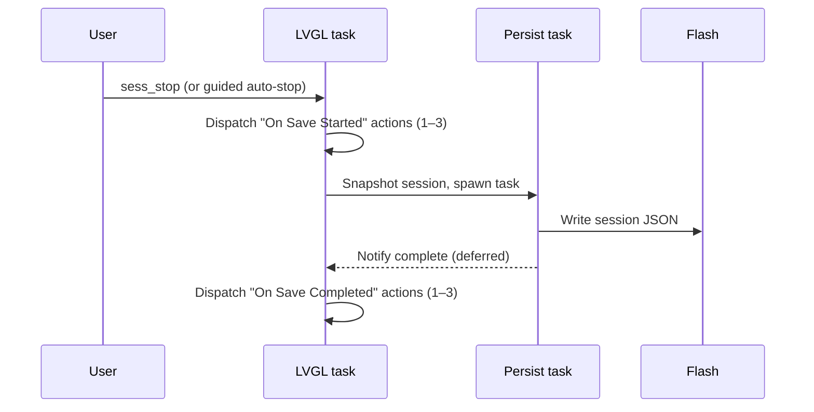

# Shutter Tester Guide

The Shutter Tester turns your ESP32 Macropad into a precision camera shutter speed analyzer. Using 3 BPW34 photodiode sensors placed at the film gate, it captures and measures actual shutter curtain travel times with sub-millisecond accuracy — from 1s all the way down to 1/2000s.

---

## Overview

When you fire a camera shutter with a light source behind it, the photodiodes detect the light pulse as the curtain passes. The system:

1. Continuously monitors 1 or 3 ADC channels via DMA at the rate the hardware actually delivers (self-calibrated at boot — typically ~27.7 kHz/sensor in 1-sensor mode and ~21 kHz/sensor in 3-sensor mode on ESP32-P4)
2. Triggers when any sensor detects a light pulse
3. Captures the full waveform (pre-trigger, pulse, and post-trigger)
4. Computes exposure duration using an adaptive 50% threshold algorithm
5. Matches to the nearest standard shutter speed and reports deviation

### Supported Shutter Speeds

| Speed | Nominal Duration |
|-------|-----------------|
| 4s | 4000 ms |
| 2s | 2000 ms |
| 1s | 1000 ms |
| 1/2s | 500 ms |
| 1/4s | 250 ms |
| 1/5s | 200 ms |
| 1/8s | 125 ms |
| 1/10s | 100 ms |
| 1/15s | 66.67 ms |
| 1/25s | 40 ms |
| 1/30s | 33.33 ms |
| 1/50s | 20 ms |
| 1/60s | 16.67 ms |
| 1/100s | 10 ms |
| 1/125s | 8 ms |
| 1/200s | 5 ms |
| 1/250s | 4 ms |
| 1/500s | 2 ms |
| 1/1000s | 1 ms |
| 1/2000s | 0.5 ms |

---

## Hardware Setup

### Requirements

- **Board**: jc4880p433-shuttertester (ESP32-P4 with shutter tester variant)
- **Sensors**: 1× or 3× BPW34 photodiodes wired to ADC2 inputs (configurable via portal)
- **Pins**: S1 = GPIO 49, S2 = GPIO 50, S3 = GPIO 51
- **Light source**: Any bright LED or lamp positioned behind the camera body

> **Sensor count** is configured in the web portal under **Shutter Tester → Sensor Configuration**. Select *Direct — Single sensor* if only one BPW34 is wired. Select *Direct — 3-line array* for the full three-sensor strip. A reboot is required after changing the preset.

### Sensor Placement

Place the 3-sensor strip at the **film gate plane** (where the film would sit):

- Sensors should be as close to the shutter curtain as possible — flush with the film gate
- Moving sensors back from the gate creates penumbra (gradual shadow transitions) that inflates measured durations at fast speeds
- S1 and S3 on the edges provide the most reliable readings; S2 in the center can be partially shadowed by internal camera geometry (film rails, baffles)
- The sensor strip orientation determines which sensors see the curtain first, revealing travel direction

### Light Source Tips

- **Closer is better** — intensity follows inverse square law; doubling distance quarters the light
- The adaptive algorithm works with dim light sources, but brighter light gives sharper threshold crossings and lower spread
- The light source does not need to be blindingly bright — a desk lamp or moderate LED panel works well
- All 3 sensors should ideally saturate (min_adc = 0) for best accuracy; if min_adc > 500, consider a brighter source or closer placement

---

## Sensor Preset

The firmware ships as a single `jc4880p433-shuttertester` binary. The number of active sensors is selected at runtime via the web portal and persists in device config.

### Available Presets

| Preset ID | Display Name | Sensors | Use Case |
|---|---|---|---|
| `direct_single` | Direct — Single sensor | 1 (S1 / GPIO 49) | Quick speed check, single BPW34 |
| `direct_3_line` | Direct — 3-line array | 3 (S1–S3 / GPIO 49–51) | Full curtain travel analysis |

### Changing the Preset

1. Open the web portal and navigate to **Shutter Tester → Sensor Configuration**
2. Select the desired sensor preset from the dropdown
3. Click **Save & Reboot** — the device reboots and activates the new preset

> In `direct_single` mode, `spread`, `spread_ms`, `capping_gradient`, and `sensor_2_ms` / `sensor_3_ms` all return `---`. The waveform widget shows only one trace.

### Sensor Offset Configuration

The sensor offsets define the physical distance (in mm) from the centre sensor (S2) to an outer sensor (S1 or S3) along two axes:

| Field | Default | Description |
|---|---|---|
| **Sensor Offset X (mm)** | 11.2 | Horizontal distance from S2 to S1/S3 |
| **Sensor Offset Y (mm)** | 7.4 | Vertical distance from S2 to S1/S3 |

These values are used to compute the **sensor diagonal** — the full corner-to-corner distance across the sensor array — which feeds the [capping gradient](#capping-gradient) calculation. The diagonal is computed as:

$$\text{diagonal} = 2 \times \sqrt{x^2 + y^2}$$

The defaults match the standard BPW34 3-sensor strip layout. If you build a custom sensor array with different spacing, update these values in the web portal under **Shutter Tester → Sensor Configuration** and click **Save & Reboot**.

> Sensor offsets are snapshotted into the session metadata at session start, so mid-session changes (which require a reboot anyway) do not affect in-progress sessions.

---

## How It Works

### Measurement Algorithm

The system uses a two-pass algorithm with slope-fit edge timing:

1. **Trigger detection**: An adaptive threshold derived from the calibrated dark baseline detects when any sensor sees a light pulse. After each calibration the threshold is set to the lowest sensor baseline minus a safety margin (`SHUTTER_TRIGGER_MARGIN`, default 150 ADC counts), clamped to never exceed the fixed default threshold, so ambient-light drift does not cause false triggers
2. **Waveform capture**: Pre-trigger ring buffer provides lookback context, then captures through the pulse until silence, followed by a post-capture extension for trailing baseline context
3. **Baseline computation**: Average of the ~200 ADC samples immediately before the pulse starts
4. **Slope-fit edge timing (primary)**: Linear regression on the 20%–80% linear portion of each transition extrapolates to the 50% crossing point. This is robust against ADC rail clipping and amplifier slew that can distort the bottom of the pulse and shift a fixed-percentage threshold
5. **Adaptive-threshold fallback**: When fewer than 3 samples land in the 20%–80% fit window on either edge, falls back to the 50% midpoint between baseline and minimum ADC value, then measures time between first and last crossing
6. **False-positive rejection**: Each sensor result passes through three validation filters before the measurement is accepted:
   - **Depth**: Pulse must be at least 100 ADC counts deep (existing)
   - **Duration**: Pulse must last at least 0.45 ms (`SHUTTER_MIN_PULSE_DURATION_MS`) — rejects single-sample noise blips
   - **Coverage**: Pulse must span less than 80% of the capture buffer (`SHUTTER_MAX_PULSE_COVERAGE`) — rejects ambient drift
7. **Multi-sensor coherence**: When 2+ sensors are valid, the ratio of longest to shortest duration must not exceed 4.0× (`SHUTTER_MAX_SENSOR_RATIO`). If it does, the entire measurement is suppressed as incoherent
### Capture Buffer Configuration

The capture buffer sizes are board-overridable for tuning the visible baseline context:

| Parameter | Default | Shutter Tester Board | Duration at ~27.7 kHz |
|-----------|---------|---------------------|---------------------|
| `SHUTTER_PRE_TRIGGER_SAMPLES` | 512 | 4096 | ~148 ms |
| `SHUTTER_POST_TRIGGER_SAMPLES` | 256 | 256 | ~9 ms (silence detection) |
| `SHUTTER_POST_CAPTURE_SAMPLES` | 0 | 4096 | ~148 ms |
| `SHUTTER_CAPTURE_MAX_SAMPLES` | 32768 | 32768 | ~1.18 s |

- **Pre-trigger**: Ring buffer lookback before the pulse. Larger values show more baseline before the waveform edge.
- **Post-trigger silence**: Consecutive samples above threshold required to declare pulse complete. Not visible context — this is part of the trigger algorithm.
- **Post-capture extension**: Additional samples recorded after pulse ends. Provides visible baseline after the trailing edge.
- **Max samples**: Hard cap per channel. At ~27.7 kHz/sensor, 32768 samples covers shutter speeds down to ~1s. In 3-sensor mode the hardware delivers ~21 kHz/sensor (ESP32-P4 SAR-ADC2 throughput ceiling), which extends the same buffer to ~1.55 s.

### Sample Rate Self-Calibration

The ESP32-P4 SAR-ADC2 caps total DMA throughput at ~63 kHz regardless of the configured `sample_freq_hz`. In 1-sensor mode the firmware requests 27.7 kHz and gets it. In 3-sensor mode it requests 83.1 kHz total (3 × 27.7) but the hardware delivers only ~63 kHz total → ~21 kHz per sensor.

To keep duration measurements accurate, the firmware **measures the actual per-sensor rate during a ~250 ms window at boot** and uses that calibrated value (not the configured value) for all sample-to-millisecond conversions. The result is logged once at startup:

```
I ShutterADC: Calibrated sample rate: 21028 Hz/sensor (configured 27700, ratio 0.759, 5320 samples in 253ms)
```

The calibrated rate is also surfaced through `ShutterCaptureCaps.sample_rate_hz_per_sensor`, so the web portal and CSV export show the real rate.

### Why Slope-Fit Edge Timing?

A fixed ADC threshold produces timing errors that depend on light intensity:

- Bright light (deep pulse): threshold crossed quickly → accurate timing
- Dim light (shallow pulse): threshold crossed late and left early → measured duration is too short

The adaptive 50% threshold scales with pulse depth, but still drifts when the bottom of the pulse is distorted by ADC rail clipping, amplifier slew, or optical scatter — all of which shift `min_adc` and therefore shift the threshold. Slope-fit edge timing avoids both pitfalls: it fits a line through the 20%–80% linear portion of each edge (skipping the distorted bottom and the noisy near-baseline region) and extrapolates to the 50% crossing. The result is duration measurements that are invariant to brightness across the full operating range from desk-lamp to LED-spotlight intensity.

### Verdict System

Both per-measurement and per-speed verdicts are driven **solely by absolute deviation in stops** against the nominal speed. Capping, spread, and repeatability remain visible in the speed summary table with colour-tinted cells for diagnostic context, but they do not influence the pass/warning/fail badge. There is no session-level verdict — each speed stands on its own.

The comparison target can be overridden manually using [shutter actions](#shutter-actions):

| Speed | Duration |
|-------|----------|
| 1s | 1000 ms |
| 1/2s | 500 ms |
| 1/4s | 250 ms |
| 1/5s | 200 ms |
| 1/8s | 125 ms |
| 1/10s | 100 ms |
| 1/15s | 66.67 ms |
| 1/25s | 40 ms |
| 1/30s | 33.33 ms |
| 1/50s | 20 ms |
| 1/60s | 16.67 ms |
| 1/100s | 10 ms |
| 1/125s | 8 ms |
| 1/200s | 5 ms |
| 1/250s | 4 ms |
| 1/500s | 2 ms |
| 1/1000s | 1 ms |
| 1/2000s | 0.5 ms |

#### Verdict Thresholds

| Metric | Warning threshold | Fail threshold | Meaning |
|--------|------------------|---------------|---------|
| Deviation | > 1/3 stop | > 1/2 stop | Speed accuracy error from nominal |

These thresholds are configurable via the device settings API.

#### Per-Speed Verdict

Each speed group in the summary table receives a verdict badge (Pass, Warning, or Fail) computed from the average absolute deviation of its measurements. Capping, spread, and repeatability cells are still colour-tinted (using fixed diagnostic thresholds) so operators can spot mechanical issues at a glance, but those cells do not change the badge.

### Spread

The spread percentage reports timing consistency across the active sensors: `(max - min) / avg × 100`. Only meaningful when 2 or more sensors are active — `spread` and `spread_ms` return `---` in single-sensor mode. Low spread (<10%) indicates uniform curtain travel. High spread (>20%) suggests:

- A sensor is partially shadowed by camera internals
- The curtain has uneven tension
- Sensor placement needs adjustment

### Capping Gradient

The capping gradient quantifies how unevenly the shutter curtain exposes the film plane, expressed in **stops per millimetre**. It combines the spread (timing difference across sensors) with the physical sensor diagonal (distance across the array) to produce a geometry-normalised metric.

$$\text{capping\_gradient} = \frac{\left|\log_2\!\left(\frac{\max(\text{duration\_ms})}{\min(\text{duration\_ms})}\right)\right|}{\text{sensor\_diagonal\_mm}}$$

The gradient is computed only when:

- 2 or more sensors produced valid readings
- Sensor offsets are configured (diagonal > 0)

When either condition is not met, the gradient is omitted from measurement data and the `[shutter:capping_gradient]` binding returns an empty string.

#### Interpreting the gradient

| Gradient (stops/mm) | Interpretation |
|---|---|
| < 0.005 | Excellent — very uniform exposure |
| 0.005–0.015 | Normal — typical for well-maintained shutters |
| 0.015–0.030 | Elevated — curtain tension may be uneven |
| > 0.030 | High — investigate curtain mechanism |

Unlike raw spread (which depends on sensor spacing), the capping gradient is comparable across different sensor array geometries because it normalises by the physical distance.

### Full-Frame Capping Estimate

The gradient is extrapolated to a full 35 mm film frame to give a single-number capping severity in stops:

$$\text{frame\_capping\_stops} = \text{capping\_gradient} \times 43.27$$

where 43.27 mm is the 35 mm frame diagonal ($\sqrt{36^2 + 24^2}$).

| Frame capping (stops) | Grade | Meaning |
|---|---|---|
| < 1/3 stop | Good | Within spec — undetectable in prints |
| 1/3–2/3 stop | Warning | Visible in slides — adjust during CLA |
| > 2/3 stop | Fail | Visible in prints — shutter needs service |

The estimate appears on measurement cards (with gradient and verdict) and in the summary table as a color-tinted "Frame capping" column, and via the `[shutter:capping_frame_stops]` binding for touchscreen display.

---

## Typical Use Cases

### 1. Quick Speed Check

Fire the shutter at a marked speed and verify the measurement matches. Useful for:

- Buying/selling vintage cameras — verify the shutter is healthy
- Post-CLA verification — confirm the repair shop did good work
- Annual checkups — track shutter drift over time

### 2. Full Speed Sweep

Test every speed from 1s to 1/1000s and record results. Look for:

- Consistent accuracy across all speeds (all PASS)
- Speeds that run fast or slow (indicates tension/lubrication issues)
- Speeds that jump to wrong categories (sticky governor, worn gears)

### 3. Curtain Travel Analysis

Compare start_idx values across sensors to measure curtain travel time:

- Horizontal-travel shutters (Leica M3/M4): sensors trigger in sequence with measurable delay
- Rotary shutters (Olympus OM-1): sensors may trigger more simultaneously
- Travel time that differs from left-to-right vs right-to-left indicates uneven curtain tension

### 4. Repeatability Testing

Fire the same speed 5–10 times and compare results:

- Consistent durations = healthy mechanism
- Wildly varying durations = sticky, dirty, or worn components
- First shot differs from subsequent shots = cold-start stiction (common in old shutters)

---

## Guided Test Sessions

Guided sessions automate the workflow of testing multiple shutter speeds with a defined number of shots per speed. Instead of manually setting the target speed and counting shots, the system walks you through a test script step by step.

### Test Script Format

Test scripts are stored on the device filesystem at `/storage/shutter_tests.txt`. Each script defines a sequence of speeds to test:

```text
# Comments start with #
name: basic-test|Basic Speed Test
shots_per_speed: 2
1/60
1/125
1/250
```

| Field | Required | Description |
|-------|----------|-------------|
| `name:` | Yes | Format: `id|Display Name`. The id is used in actions, the display name in the UI |
| `shots_per_speed:` | No | Number of shots per speed (default: 1) |
| Speed lines | Yes | One speed per line. Trailing `s` is optional (`1/60` and `1/60s` are equivalent) |

Multiple test scripts can be defined in the same file, separated by blank lines or comments.

### Example Test Scripts

```text
# Leica M3 — full mechanical speed range (1s to 1/1000s)
# Cloth focal-plane shutter, horizontal travel
name: leica-m3|Leica M3 - Full Range
shots_per_speed: 3
1
1/2
1/4
1/8
1/15
1/30
1/60
1/125
1/250
1/500
1/1000

# Olympus OM-1 — full mechanical speed range (1s to 1/1000s)
# Cloth focal-plane shutter, horizontal travel
name: olympus-om1|Olympus OM-1 - Full Range
shots_per_speed: 3
1
1/2
1/4
1/8
1/15
1/30
1/60
1/125
1/250
1/500
1/1000

# Quick check — 3 common speeds for a fast go/no-go test
name: quick-check|Quick Speed Check
shots_per_speed: 2
1/60
1/125
1/250
```

### How Guided Sessions Work

1. A `guide_start` action triggers the session with a test script ID
2. The system loads the script, starts a measurement session, and locks the target to the first speed
3. After each shot, the system auto-advances: increments the shot counter, and when all shots for a speed are taken, moves to the next speed
4. When all speeds are complete, the session auto-stops
5. Each measurement is recorded with the guided target speed, so deviation is always calculated against the intended speed

### Guided Session Controls

| Action | Effect |
|--------|--------|
| `guide_start` (value = script ID) | Start guided session from the specified test script |
| `guide_stop` | Abort the guided session early |
| `guide_skip` | Skip remaining shots at the current speed, advance to the next speed (auto-stops if at the last speed) |
| `guide_redo` | Discard the last shot and retake it (rolls back to the previous speed if at shot 1 of a new speed) |

### Progress Bindings

During a guided session, these bindings provide live progress. All return `---` when no guided session is active.

| Binding | Example | Description |
|---------|---------|-------------|
| `[shutter:session.guide.target]` | `1/125` | Current target speed |
| `[shutter:session.guide.step]` | `2` | Current speed step (1-based) |
| `[shutter:session.guide.steps]` | `3` | Total speed steps |
| `[shutter:session.guide.shot]` | `1` | Current shot within this speed (1-based) |
| `[shutter:session.guide.shots]` | `2` | Shots per speed |
| `[shutter:session.guide.taking]` | `4` | Overall shot number being taken |
| `[shutter:session.guide.total]` | `6` | Grand total shots (steps × shots) |
| `[shutter:session.guide.name]` | `Basic Speed Test` | Test display name |
| `[shutter:session.guide.id]` | `basic-test` | Test script ID |

A typical progress label: `[shutter:session.guide.taking]/[shutter:session.guide.total]` → `4/6`

### Managing Test Scripts via the Portal

The web portal provides a **Test Scripts** section under the Shutter Tester page:

- **GET /api/shutter/tests/list** — List all available test scripts (id, name, shots_per_speed, speed list)
- **GET /api/shutter/tests** — Get raw test script file contents
- **PUT /api/shutter/tests** — Upload new test script file contents

Uploading new test definitions via **PUT /api/shutter/tests** automatically refreshes the list provider cache, so list widgets pick up the changes immediately without a reboot.

### Selecting Tests with a List Widget

Instead of hardcoding a test script ID in a button action, you can use a **list widget** to let the user browse and select from available test scripts at runtime. The `shutter_tests` list provider serves the parsed test definitions as selectable items.

**List widget button** (displays available tests):

```json
{
  "widget": "list",
  "widget_data_binding": "shutter_tests"
}
```

**Start button** (launches the selected test):

```json
{
  "type": "shutter",
  "shutter_command": "guide_start",
  "shutter_value": "[list:shutter_tests.selected]",
  "label_center": "▶ Start Test"
}
```

When the user taps "Full Range Test" (id: `full-range`) in the list widget, then taps the start button, the `[list:shutter_tests.selected]` binding resolves to `full-range`, and the guided session begins with that test script.

> **Tip:** You can filter the list with `widget_data_binding_2`. For example, `leica*` shows only tests whose id or label matches the glob pattern. See [Filter syntax](pad-editor-guide.md#filter-syntax) for the full rule reference.

### Session File Output

Guided sessions produce the same session JSON format as freeform sessions, with additional metadata:

```json
{
  "id": 42,
  "type": "guided",
  "template_id": "basic-test",
  "template_name": "Basic Speed Test",
  "shots_per_speed": 2,
  "guided_targets": ["1/60s", "1/125s", "1/250s"],
  "meta": [
    {"key": "sensor_preset", "label": "Sensor Preset", "value": "direct_3_line", "icon": "tune"},
    {"key": "active_sensors", "label": "Active Sensors", "value": 3, "icon": "sensors"},
    {"key": "firmware", "label": "Tester Firmware", "value": "1.14.0", "icon": "memory"},
    {"key": "sample_rate", "label": "ADC Sample Rate", "value": 100000.0, "icon": "speed"},
    {"key": "ambient_baseline", "label": "Ambient Baseline", "value": 3420, "icon": "brightness_auto"},
    {"key": "guided_test", "label": "Guided Test", "value": "Basic Speed Test", "icon": "auto_fix_high"},
    {"key": "sensor_offset", "label": "Sensor Offset", "value": "\u00b1(11.2, 7.4) mm", "icon": "straighten", "sensor_offset_x_mm": 11.2, "sensor_offset_y_mm": 7.4, "sensor_diagonal_mm": 26.85}
  ],
  "measurements": [
    {
      "target_speed": "1/60s",
      "nearest_speed": "1/60s",
      "deviation_pct": 1.2,
      ...
    }
  ]
}
```

The `meta` array captures device configuration at session start. Each entry has a `key` (machine-readable identifier for filtering/search/deduplication), `label` (display name), `value` (raw data), and an optional `icon` (Material Symbols icon name for portal tile rendering). Numeric values like ADC Sample Rate (in Hz) and Ambient Baseline (in ADC counts) are formatted by the portal for display.

The `target_speed` field on each measurement records which guided speed was being tested, enabling the detail view to group and analyze results correctly.

---

## Session Save Actions

The firmware exposes two configurable lifecycle hooks that fire when a session is being persisted to flash. Each hook holds **up to 3 sequential actions** (any standard [`ButtonAction`](pad-editor-guide.md): notify bubble, screen navigation, MQTT publish, beep, sound, key sequence, etc.), executed in order.

Configure them in the web portal under **Shutter Tester → Session Save Actions**.

### Lifecycle Events

| Event | Fires when | Use cases |
|---|---|---|
| **On Save Started** | `sess_stop` (or auto-stop) begins persistence | Show a "Saving…" notification, beep, or navigate to a "please wait" pad |
| **On Save Completed** | Background persist task finishes writing the JSON | Show "Saved ✓", navigate to the sessions list, publish an MQTT event so a Home Assistant automation can react |



### Self-Trigger Guard

The dispatcher rejects any action whose `shutter_command` is `sess_start` or `sess_stop` to prevent recursive save loops. Other shutter commands (set, adjust, recalibrate, guide_*) are allowed.

### REST API

`GET` / `POST /api/component/shutter-session-actions/config`

Payload schema:

```json
{
  "save_start_actions": [
    {"type": "notify", "notify_text": "Saving session…", "notify_duration_ms": 1500}
  ],
  "save_complete_actions": [
    {"type": "beep", "beep_pattern": "100", "beep_volume": 50},
    {"type": "screen", "target": "shutter-sessions"}
  ]
}
```

Both arrays are optional and may hold 0–3 entries. Empty arrays disable that lifecycle hook (the default).

---

## Structured CSV Export

The firmware emits machine-readable measurement data on the serial port as `[MEAS]` lines. These can be captured and filtered into a spreadsheet-ready CSV file using the included `monitor_meas.sh` script.

### Quick Start

```bash
./monitor_meas.sh                      # auto-detect port, write meas_YYYYMMDD_HHMMSS.csv
./monitor_meas.sh /dev/ttyUSB0         # explicit port
./monitor_meas.sh /dev/ttyUSB0 115200 --raw  # also save raw serial log
```

Fire the shutter repeatedly. When done, press **Ctrl+C**. The script prints a summary with the CSV file path and size.

### Output Files

| File | Created when | Contents |
|------|-------------|----------|
| `meas_YYYYMMDD_HHMMSS.csv` | Always | Filtered measurement rows, Excel/Sheets-ready |
| `meas_raw_YYYYMMDD_HHMMSS.log` | `--raw` only | Full timestamped serial output for correlation |

### CSV Field Reference

#### Top-Level Fields (columns 1–16)

| Column | Field | Description |
|--------|-------|-------------|
| 1 | `#` | Measurement sequence number (increments since boot) |
| 2 | `preset_id` | Active sensor preset: `direct_single`, `direct_3_line`, etc. |
| 3 | `capture_id` | Monotonic capture identifier (for dedup / correlation) |
| 4 | `timestamp_ms` | `millis()` at measurement time |
| 5 | `matched_speed` | Nearest standard speed label the firmware matched the measurement to, e.g. `1/125s` |
| 6 | `matched_ms` | Nominal duration of the matched standard speed in ms |
| 7 | `target_manual` | `1` if target was manually set/adjusted, else `0` |
| 8 | `speed_locked` | `1` if speed lock was active, else `0` |
| 9 | `avg_ms` | Average measured duration across valid sensors |
| 10 | `dev_pct` | Deviation from target (%, signed) |
| 11 | `dev_stops` | Deviation in stops (log₂ ratio, signed) |
| 12 | `spread_ms` | Absolute spread across sensors in ms (0 if single sensor) |
| 13 | `spread_pct` | Relative spread: `(max−min)/avg × 100` (0 if single sensor) |
| 14 | `verdict` | `0` = PASS, `1` = WARNING, `2` = FAIL |
| 15 | `sensor_count` | Active sensors for this preset |
| 16 | `valid_sensor_count` | Sensors that produced a valid pulse reading |

#### Per-Sensor Block (10 columns each, repeated for S1, S2, S3, …)

| Suffix | Field | Description |
|--------|-------|-------------|
| `_ms` | `duration_ms` | Measured exposure duration for this sensor |
| `_min` | `min_adc` | Minimum ADC value during pulse (0 = fully saturated) |
| `_base` | `baseline_adc` | Average ADC idle level immediately before pulse |
| `_rms` | `idle_noise_rms` | RMS noise of ~200 idle samples before pulse |
| `_depth` | `baseline_adc − min_adc` | Pulse depth (signal strength) |
| `_snr_db` | `20 × log₁₀(depth / noise_rms)` | Signal-to-noise ratio in dB (empty if depth ≤ 0 or noise = 0) |
| `_threshold` | threshold | ADC trigger threshold active during this capture |
| `_start` | `start_idx` | First sample index below adaptive threshold |
| `_end` | `end_idx` | Last sample index below adaptive threshold |
| `_total` | `total_samples` | Total samples in the captured waveform |

Invalid sensor slots emit empty cells so the column count always matches the header.

#### Example Header (3-sensor preset)

```
#,preset_id,capture_id,timestamp_ms,matched_speed,matched_ms,target_manual,speed_locked,avg_ms,dev_pct,dev_stops,spread_ms,spread_pct,verdict,sensor_count,valid_sensor_count,S1_ms,S1_min,S1_base,S1_rms,S1_depth,S1_snr_db,S1_threshold,S1_start,S1_end,S1_total,S2_ms,S2_min,...
```

### Analysis Tips

- **`dev_stops`** is the best single-number quality indicator. Within ±0.33 stops = PASS. Within ±0.50 stops = WARNING.
- **`snr_db`** values above ~30 dB indicate a clean signal. Below 20 dB suggests a dim light source or noisy sensor.
- **`spread_pct`** above 10–15% with a 3-sensor strip typically points to uneven curtain tension or a partially shadowed sensor.
- Filter on `verdict = 0` to see only passing shots, then check `dev_stops` distribution to track long-term drift.

---

## Binding Scheme Reference

The `[shutter:key]` binding scheme exposes live measurement data for display on pad buttons and widgets.

### Syntax

```text
[shutter:key]
[shutter:key;format]
[shutter:key|fallback]
```

### Available Keys

| Key | Description | Example Output |
|-----|-------------|----------------|
| `speed` | Nearest standard speed from the last measurement (no unit suffix) | `1/125` |
| `speed_seconds` | Matched speed in seconds (decimal) | `0.008` |
| `target_speed` | Comparison target label with unit suffix; `---` before first measurement | `1/125s` |
| `speed_locked` | Whether the comparison target is locked | `true` or `false` |
| `target_ms` | Target speed in milliseconds | `8.0` |
| `duration_ms` | Measured duration in milliseconds | `8.1` |
| `deviation` | Deviation from nominal (signed numeric %) | `-3.2` |
| `deviation_abs` | Absolute deviation % | `3.2` |
| `deviation_stops` | Deviation in stops | `0.15` |
| `verdict` | Result verdict | `pass`, `warning`, `fail` |
| `spread` | Cross-sensor spread % (`---` in single-sensor mode) | `2.1` |
| `spread_ms` | Cross-sensor spread in ms (`---` in single-sensor mode) | `0.17` |
| `capping_gradient` | Capping gradient in stops/mm (empty when unavailable or < 0.001) | `0.012` |
| `capping_frame_stops` | Estimated full-frame capping in stops (gradient × 43.27 mm; empty when unavailable) | `0.52` |
| `sensor_count` | Number of active sensors (set by preset) | `3` |
| `valid_sensor_count` | Sensors that produced a valid result in the last measurement | `3` |
| `preset_id` | Active preset identifier | `direct_3_line` |
| `preset_name` | Active preset display name | `Direct - 3-Line` |
| `sensor_1_ms` | Sensor 1 duration (`---` if inactive) | `8.2` |
| `sensor_2_ms` | Sensor 2 duration (`---` if inactive) | `7.9` |
| `sensor_3_ms` | Sensor 3 duration (`---` if inactive) | `8.1` |
| `sensor_1_valid` | Sensor 1 valid flag (`---` if inactive) | `true` or `false` |
| `sensor_2_valid` | Sensor 2 valid flag (`---` if inactive) | `true` or `false` |
| `sensor_3_valid` | Sensor 3 valid flag (`---` if inactive) | `true` or `false` |
| `sensor_1_depth` | Sensor 1 pulse depth (signal strength; `---` if inactive) | `3347` |
| `sensor_2_depth` | Sensor 2 pulse depth | `3341` |
| `sensor_3_depth` | Sensor 3 pulse depth | `3321` |
| `sensor_1_snr` | Sensor 1 signal-to-noise ratio | `101` |
| `sensor_2_snr` | Sensor 2 signal-to-noise ratio | `98` |
| `sensor_3_snr` | Sensor 3 signal-to-noise ratio | `95` |
| `sensor_1_saturated` | Sensor 1 saturation check | `true` or `false` |
| `sensor_2_saturated` | Sensor 2 saturation check | `true` or `false` |
| `sensor_3_saturated` | Sensor 3 saturation check | `true` or `false` |
| `sensor_1_min_adc` | Sensor 1 raw minimum ADC during pulse (`0` = fully saturated; `---` if inactive) | `0` |
| `sensor_2_min_adc` | Sensor 2 raw minimum ADC | `12` |
| `sensor_3_min_adc` | Sensor 3 raw minimum ADC | `8` |
| `sensor_1_threshold` | Sensor 1 adaptive threshold used during this capture | `1675` |
| `sensor_2_threshold` | Sensor 2 adaptive threshold | `1668` |
| `sensor_3_threshold` | Sensor 3 adaptive threshold | `1660` |
| `worst_noise_rms` | Max noise RMS across all active sensors | `33` |
| `count` | Total measurements since boot | `42` |
| `capture_id` | Change-detection token (increments per capture) | `42` |
| `available` | ADC driver status | `true` or `false` |
| `history_json` | JSON array of recent measurements | (see below) |
| **Session keys** | | |
| `session.active` | Whether a measurement session is in progress | `true` or `false` |
| `session.count` | Number of measurements captured in the current session | `5` |
| `session.id` | Current session ID (empty when no session) | `3` |
| `session.type` | Session type | `freeform`, `guided`, or empty |
| `session.verdict` | Worst verdict across session measurements (empty when inactive) | `warning` |
| **Guided session keys** | | |
| `session.guide.target` | Current target speed (bare format) | `1/125` |
| `session.guide.step` | Current speed step number (1-based) | `2` |
| `session.guide.steps` | Total number of speed steps | `3` |
| `session.guide.shot` | Current shot within the current speed (1-based) | `1` |
| `session.guide.shots` | Total shots per speed | `2` |
| `session.guide.taking` | Overall shot number being taken (1-based) | `4` |
| `session.guide.total` | Total shots in entire session (steps × shots) | `6` |
| `session.guide.name` | Human-readable test name | `Basic Speed Test` |
| `session.guide.id` | Test script ID | `basic-test` |
| **Alignment keys** | | |
| `align.active` | Whether alignment mode is active | `true` or `false` |
| `align.s1_pct` – `align.s9_pct` | Per-sensor light percentage (0–100); `---` beyond active count | `85` |
| `align.s1_raw` – `align.s9_raw` | Per-sensor raw ADC value; `---` beyond active count | `430` |
| `align.spread` | Spread between sensors (max − min percentage) | `4` |
| `align.status` | 3-tier alignment status (machine-readable) | `ready` |
| `align.hint` | Human-readable hint (empty when ready) | `Too dim` |
| `align.sensor_count` | Number of sensors in alignment reading | `3` |

### Alignment Status Values

The `align.status` key returns a 3-tier machine-readable status; `align.hint` provides a short human-readable explanation:

| Status | Hint | Condition | Meaning |
|--------|------|-----------|---------|
| `not-ready` | No light detected | All sensors < 10% | No light — check light source |
| `not-ready` | Too bright - clipping | Any sensor > 95% | Sensor is overloaded — reduce light |
| `usable` | Too bright | Any sensor > 92% | Close to saturation — consider reducing light |
| `not-ready` | Too dim | Any sensor < 40% | Very weak signal — increase light |
| `usable` | Light is low | Any sensor < 60% | Signal is usable but not ideal |
| `not-ready` | Uneven lighting | Spread > 20% | Large difference between sensors |
| `usable` | Slightly uneven | Spread > 10% | Moderate difference — fine-tune position |
| `ready` | *(empty)* | 80–92% AND spread ≤ 10% | Optimal alignment |
| `usable` | Aim for 80-92% | Passes all checks but not in ideal range | Acceptable alignment |

Status is evaluated top-to-bottom; the first matching condition wins.

### Key Behaviour Notes

**`speed` vs `target_speed`**: After a measurement both typically show the same speed. The difference matters when `set`/`adjust` has been pressed in unlocked mode — `target_speed` reflects the manually adjusted display target, while `speed` always reflects what the measurement auto-detected. In locked mode, `target_speed` shows the frozen target for every measurement.

**Real-time updates on `set`/`adjust`**: When a `set` or `adjust` action is fired, the following bindings update immediately without waiting for the next measurement: `speed`, `speed_seconds`, `target_speed`, `target_ms`, `deviation`, `deviation_abs`, `deviation_stops`, `verdict`. The waveform target rectangle also redraws. Sensor-specific keys (`sensor_N_ms`, `spread`, etc.) remain from the last measurement.

### Format Specifiers

Use a semicolon-separated format string for numeric formatting:

```text
[shutter:duration_ms;%.1f ms]   → "8.1 ms"
[shutter:deviation;%+.0f%%]     → "+3%"
[shutter:spread;%.1f%%]         → "2.1%"
```

### History JSON

The `history_json` key returns a JSON array of the last 8 measurements for use with the table widget:

```json
[
  {"speed": "1/125s", "ms": "8.1", "dev": "+1.3%", "spread": "2.1%", "verdict": "pass"},
  {"speed": "1/60s", "ms": "16.8", "dev": "+0.8%", "spread": "3.5%", "verdict": "pass"}
]
```

### Example Button Configurations

**Main speed display** (large center button):

```json
{
  "label_center": "[shutter:speed|---]",
  "label_center_style": "font_size:48;align:center",
  "label_bottom": "[shutter:deviation;%+.0f%%|]",
  "bg_color": "[expr:threshold([shutter:deviation_abs];5;10;'#1a472a';'#4a3500';'#4a1a1a')]"
}
```

**Duration readout**:

```json
{
  "label_center": "[shutter:duration_ms;%.1f ms]",
  "label_top": "Duration"
}
```

**Measurement counter**:

```json
{
  "label_center": "[shutter:count]",
  "label_bottom": "shots"
}
```

**History table** (using table widget):

```json
{
  "widget": "table",
  "data_binding": "[shutter:history_json]",
  "columns": ["speed", "ms", "dev", "spread", "verdict"]
}
```

---

## Shutter Actions

Buttons can control the comparison target speed and lock mode using the `shutter` action type. This is useful for building a test pad where you dial in the expected speed before measuring.

### Action Format

```json
{"type": "shutter", "shutter_command": "set",         "shutter_value": "1/125"}
{"type": "shutter", "shutter_command": "adjust",      "shutter_value": "faster"}
{"type": "shutter", "shutter_command": "adjust",      "shutter_value": "slower"}
{"type": "shutter", "shutter_command": "toggle_lock"}
{"type": "shutter", "shutter_command": "recalibrate"}
```

### Commands

| Command | Value | Description |
|---------|-------|-------------|
| `set` | Speed label (with or without `s`, e.g. `1/125` or `1/125s`) | Set the comparison target to a specific speed |
| `adjust` | `faster` or `slower` | Step the target one position in the speed table |
| `toggle_lock` | _(none)_ | Toggle lock on/off. Fails if no target is set |
| `sess_start` | _(none)_ | Start a new measurement session (auto-exits alignment mode) |
| `sess_stop` | _(none)_ | Stop the current session |
| `sess_toggle` | _(none)_ | Toggle session on/off (auto-exits alignment mode) |
| `sess_disc` | _(none)_ | Discard the last measurement in the current session |
| `guide_start` | Test script ID (e.g. `basic-test`) | Start a guided test session using the specified test script |
| `guide_stop` | _(none)_ | Stop the current guided session (also stops the underlying session) |
| `guide_skip` | _(none)_ | Skip remaining shots at the current speed and advance to the next |
| `guide_redo` | _(none)_ | Discard the last shot and retake it |
| `align_start` | _(none)_ | Start alignment mode (continuous ~20 Hz sensor feedback) |
| `align_stop` | _(none)_ | Stop alignment mode |
| `align_tog` | _(none)_ | Toggle alignment mode on/off |
| `recalibrate` | _(none)_ | Re-run the dark-baseline sensor calibration |

### Lock Behaviour

| State | Behaviour |
|-------|-----------|
| **Unlocked** | Every measurement auto-detects the nearest standard speed |
| **Unlocked + `set`/`adjust` pressed** | Current display (deviation, waveform rect) updates immediately — next measurement still auto-detects |
| **Locked** | Target is frozen; every measurement compares against the locked speed |

When unlocked, `set` and `adjust` are purely retrospective: they let you ask "how far off is this result relative to a different speed?" without affecting future measurements. Use `toggle_lock` to freeze a target so all subsequent measurements compare against it. The auto-detected speed after each measurement is tracked internally, so pressing `toggle_lock` immediately after a shot freezes that shot's detected speed.

### Example: Speed Selector Pad

```json
{
  "type": "shutter",
  "shutter_command": "adjust",
  "shutter_value": "faster",
  "label_center": "▲ Faster"
}
```

```json
{
  "type": "shutter",
  "shutter_command": "toggle_lock",
  "label_center": "[expr:[shutter:speed_locked]=='true' ? '🔒 Locked' : '🔓 Auto']"
}
```

---

## Sensor Calibration

At power-on, the shutter tester automatically measures each sensor's dark reference level for about one second. This baseline is used for two purposes:

- **Alignment mode percentages** — converting raw ADC values to 0–100% light intensity
- **Adaptive trigger threshold** — the trigger threshold is set to the lowest sensor baseline minus `SHUTTER_TRIGGER_MARGIN` (default 80 ADC counts). This prevents false triggers when sensors are exposed to ambient light, where idle ADC values can drift close to a fixed threshold

Measurement timing and pulse-depth health values do not depend on this boot baseline; each captured waveform still computes its own adaptive baseline from pre-trigger samples.

Use the `recalibrate` shutter command when the dark baseline may be stale:

- The device booted while the sensor strip was exposed to light.
- Room lighting changed significantly after boot.
- Alignment mode reports unexpected percentages, such as 0% with visible light or values that appear clipped.
- You are about to start a critical session and want to confirm the baseline.

During boot and manual calibration, the sensors should be in the same lighting conditions they see when the shutter is closed. Best practice is to place the strip inside the camera body behind the film gate with the test light off. Covering the strip or placing it face-down is also fine. Complete room darkness is not required, but the test light must be off; otherwise the baseline includes the test light and later alignment percentages will be wrong.

The calibration state is exposed as `[shutter:calib.active]`, returning `1` while calibration is running and `0` otherwise. A recalibration request during an active capture is ignored. A recalibration request from alignment mode temporarily exits alignment, refreshes the dark baseline, then returns to alignment.

---

## Alignment Mode

Alignment mode provides continuous ~20 Hz sensor readings for positioning guidance before starting a measurement session. When active, the firmware decimates the raw ADC stream (20-sample window at ~20.8 kHz) into percentage values relative to the current calibrated dark baseline, giving real-time feedback on light intensity and sensor evenness.

### How It Works

1. At boot, and when `recalibrate` is requested, the ADC backend measures each sensor's dark baseline (idle ADC value with no light)
2. When alignment starts, the ADC task accumulates 20 samples per sensor, then computes:
   - **Percentage**: `100 × (baseline − adc) / baseline` — how much light each sensor sees (0% = dark, 100% = saturated)
   - **Spread**: difference between highest and lowest sensor percentage
   - **Status**: advisory string based on priority rules (see [Alignment Status Values](#alignment-status-values))
3. Results are double-buffered with a spinlock swap for lock-free reading from the LVGL task

### Usage

- Use `align_start` / `align_stop` / `align_tog` actions from a button
- Starting a session (`sess_start` or `sess_toggle`) automatically exits alignment mode
- Alignment readings are exposed via `[shutter:align.*]` binding keys for live display on pad buttons

### Example: Alignment Indicator Button

```json
{
  "type": "shutter",
  "shutter_command": "align_tog",
  "label_top": "align",
  "label_center": "[shutter:align.status|off]",
  "label_bottom": "[expr:[shutter:align.active]=='true' ? 'spread ' + [shutter:align.spread] + '%' : '']",
  "bg_color": "[expr:threshold([shutter:align.spread];10;20;'#1a472a';'#4a3500';'#4a1a1a')]"
}
```

### Example: Per-Sensor Alignment Display

```json
{
  "label_top": "S1",
  "label_center": "[shutter:align.s1_pct|---] %",
  "label_bottom": "[shutter:align.s1_raw|]",
  "widget_type": "gauge",
  "widget_data_binding": "[shutter:align.s1_pct]",
  "widget_gauge_min": 0,
  "widget_gauge_max": 100
}
```

---

## Waveform Widget

The waveform widget renders captured ADC data directly on a button, showing the light pulse shape with optional overlays.

### Configuration Options

| Option | Values | Description |
|--------|--------|-------------|
| `widget_waveform_sensor` | `0` (all), `1`, `2`, `3` | Which sensor(s) to display |
| `widget_waveform_show_threshold` | `true`/`false` | Show fixed trigger threshold line |
| `widget_waveform_show_trigger` | `true`/`false` | Show vertical trigger marker |
| `widget_waveform_show_target` | `true`/`false` | Show target speed overlay rectangle |
| `widget_waveform_line_width` | integer | Line thickness in pixels |
| `widget_waveform_invert_y` | `true`/`false` | Flip Y axis (pulse goes up instead of down) |
| `widget_waveform_line_color_1` | hex color | Sensor 1 line color |
| `widget_waveform_line_color_2` | hex color | Sensor 2 line color |
| `widget_waveform_line_color_3` | hex color | Sensor 3 line color |
| `widget_waveform_threshold_color` | hex color | Threshold line color |
| `widget_waveform_trigger_color` | hex color | Trigger marker color |

### Viewport Behavior

The widget auto-zooms to show the relevant portion of the capture:

- **Before measurement arrives**: Widget waits (blank) to avoid flashing the full buffer
- **After measurement**: Zooms to the pulse with proportional padding (pulse occupies ~50% of width)
- **All-sensors mode** (`sensor=0`): Viewport spans the earliest and latest pulse edges across all 3 sensors for consistent framing
- **Single-sensor mode**: Same viewport calculation (uses all sensors) ensures multiple widgets stay synchronized

### Target Speed Rectangle

When `show_target` is enabled (single-sensor mode only), a semi-transparent overlay rectangle shows the expected pulse width for the nearest standard speed. This provides an instant visual comparison:

- Rectangle width = target speed duration in samples
- Anchored at the sensor's measured start point
- Visible as a gray overlay at 30% opacity

### Ideal Timing Window (Portal Detail View)

The per-sensor waveform charts in the session detail view show a semi-transparent gray rectangle representing the expected pulse width for the nearest standard shutter speed.

- **Width** = actual pulse width scaled by (target_duration / measured_duration)
- **Center** = dwell midpoint (fully-open period center) when detectable, otherwise waveform trough

**Interpretation:** The overlay shows where the open period *would* be if the shutter were hitting the nominal speed exactly. A pulse that extends beyond the rectangle is running slow; one that falls short is running fast.

**Important:** Vintage cameras may be intentionally calibrated off-spec (for reciprocity compensation, customer preference, or age-related adjustment). The overlay represents the *standard* target — deviation from it is not necessarily a defect.

### Example: Per-Sensor Waveforms

```json
{
  "col": 1, "row": 4, "col_span": 3,
  "widget_type": "waveform",
  "widget_waveform_sensor": 1,
  "widget_waveform_show_threshold": true,
  "widget_waveform_show_trigger": true,
  "widget_waveform_show_target": true
}
```

### Example: All Sensors Overlay

```json
{
  "col": 1, "row": 7, "col_span": 3,
  "widget_type": "waveform",
  "widget_waveform_show_threshold": true,
  "widget_waveform_show_trigger": true
}
```

---

## Sample Pad Configuration

The following is a complete pad configuration showing an advanced shutter tester layout with gauges, per-sensor waveforms, and an all-sensors overlay:

```json
{
  "layout": "grid",
  "cols": 4,
  "rows": 8,
  "buttons": [
    {
      "col": 0, "row": 0, "col_span": 2, "row_span": 2,
      "label_top": "measured",
      "label_center": "[shutter:speed]",
      "label_top_style": "font_size:24",
      "label_center_style": "font_family:doto;font_size:48",
      "bg_color": "E91E63"
    },
    {
      "col": 0, "row": 2, "col_span": 2, "row_span": 2,
      "label_top": "deviation",
      "label_center": "[shutter:deviation;%+.0f] %",
      "label_bottom": "target [shutter:target_ms] ms",
      "label_top_style": "font_size:24",
      "bg_color": "E91E63",
      "widget_type": "gauge",
      "widget_data_binding": "[shutter:deviation]",
      "widget_gauge_min": -50,
      "widget_gauge_max": 50,
      "widget_gauge_degrees": 180,
      "widget_gauge_start_angle": 180,
      "widget_gauge_zero_centered": true,
      "widget_gauge_show_needle": true,
      "widget_arc_color": "#FF9800",
      "widget_gauge_track_color": "#1A1A1A",
      "widget_gauge_needle_color": "#FFFFFF",
      "widget_gauge_tick_color": "#808080",
      "widget_gauge_arc_width_pct": 15,
      "widget_gauge_ticks": 9,
      "widget_gauge_needle_width": 4,
      "widget_gauge_needle_cutoff_pct": 40,
      "widget_anim_ms": 300
    },
    {
      "col": 2, "row": 2, "col_span": 2, "row_span": 2,
      "label_top": "spread",
      "label_center": "[shutter:spread;%.0f] %",
      "label_bottom": "[shutter:spread_ms] ms",
      "label_top_style": "font_size:24",
      "bg_color": "E91E63",
      "widget_type": "gauge",
      "widget_data_binding": "[shutter:spread]",
      "widget_gauge_min": 0,
      "widget_gauge_max": 100,
      "widget_gauge_degrees": 180,
      "widget_gauge_start_angle": 180,
      "widget_gauge_show_needle": true,
      "widget_arc_color": "#4CAF50",
      "widget_gauge_track_color": "#1A1A1A",
      "widget_gauge_needle_color": "#FFFFFF",
      "widget_gauge_tick_color": "#808080",
      "widget_gauge_arc_width_pct": 15,
      "widget_gauge_ticks": 5,
      "widget_gauge_needle_width": 4,
      "widget_gauge_needle_cutoff_pct": 40,
      "widget_anim_ms": 300
    },
    {
      "col": 0, "row": 4,
      "label_top": "sensor 1",
      "label_center": "[shutter:sensor_1_ms]",
      "label_bottom": "ms"
    },
    {
      "col": 0, "row": 5,
      "label_top": "sensor 2",
      "label_center": "[shutter:sensor_2_ms]",
      "label_bottom": "ms"
    },
    {
      "col": 0, "row": 6,
      "label_top": "sensor 3",
      "label_center": "[shutter:sensor_3_ms]",
      "label_bottom": "ms"
    },
    {
      "col": 1, "row": 4, "col_span": 3,
      "widget_type": "waveform",
      "widget_waveform_sensor": 1,
      "widget_waveform_show_threshold": true,
      "widget_waveform_show_trigger": true,
      "widget_waveform_show_target": true
    },
    {
      "col": 1, "row": 5, "col_span": 3,
      "widget_type": "waveform",
      "widget_waveform_sensor": 2,
      "widget_waveform_show_threshold": true,
      "widget_waveform_show_trigger": true,
      "widget_waveform_show_target": true
    },
    {
      "col": 1, "row": 6, "col_span": 3,
      "widget_type": "waveform",
      "widget_waveform_sensor": 3,
      "widget_waveform_show_threshold": true,
      "widget_waveform_show_trigger": true,
      "widget_waveform_show_target": true
    },
    {
      "col": 0, "row": 7,
      "label_top": "verdict",
      "label_center": "[shutter:verdict]"
    },
    {
      "col": 1, "row": 7, "col_span": 3,
      "widget_type": "waveform",
      "widget_waveform_show_threshold": true,
      "widget_waveform_show_trigger": true
    }
  ]
}
```

This layout produces:

- **Row 0–1**: Large speed readout with Doto font
- **Row 2–3**: Deviation gauge (zero-centered ±50%) and spread gauge (0–100%)
- **Row 4–6**: Per-sensor duration readouts on the left, individual waveforms with target rectangles on the right
- **Row 7**: Verdict text on the left, all-sensors waveform overlay on the right

---

## Action System (Planned)

The following button actions are planned for future implementation:

### `ACTION_TYPE_SHUTTER_RESET`

Reset the measurement counter and history buffer. Useful as a "New Session" button when starting a fresh test sequence.

### `ACTION_TYPE_SHUTTER_THRESHOLD`

Adjust the trigger threshold via button press. Could cycle between presets (sensitive/normal/aggressive) or open a numeric rocker widget for fine-tuning.

### `ACTION_TYPE_SHUTTER_CALIBRATE`

Run an automatic light/threshold calibration sequence: prompt the user to open the shutter on B (bulb), verify all sensors saturate, and set optimal threshold automatically. This is separate from the implemented manual `recalibrate` command, which only refreshes the dark sensor baseline.

---

## Diagnostic Serial Output

The system outputs structured diagnostic data on the serial monitor for batch analysis and algorithm tuning.

### Log Lines

**Human-readable summary** (one per measurement):

```text
[16335ms] I ShutterMeas: Measurement #1: 1/60s (18.6 ms, dev +11.7%, spread 5.8%, PASS)
```

**Pulse depth and noise** (one per measurement):

```text
[DEPTH] S1=0/3315  S2=0/3343  S3=0/3342  (min/base) noise_rms=43
```

- `min/base` = minimum ADC during pulse / baseline ADC before pulse
- `noise_rms` = worst-case RMS noise across all 3 sensors (standard deviation of ~200 idle samples before the pulse)
- `min=0` = fully saturated (best signal quality)

**CSV line** (one per measurement, for spreadsheet import):

```text
[MEAS] #,speed,avg_ms,dev_pct,spread_pct,verdict,S1_ms,S1_min,S1_base,S1_rms,S1_fall,S1_rise,S1_start,S1_end,S1_total,S2_...,S3_...
```

**Idle state** (printed once after each capture):

```text
[ShutterADC] idle S1=3336 S2=3347 S3=3349 (thr=3200)
```

### Interpreting Results

| Metric | Healthy | Concerning |
|--------|---------|------------|
| min_adc | 0–100 (saturated) | >500 (weak signal) |
| noise_rms | <30 | >50 |
| spread_pct | <10% | >20% |

---

## Troubleshooting

### No measurements appearing

- Verify idle ADC values are ~3300–3400 (sensors connected and biased correctly)
- Ensure light source is bright enough to cross the 3200 threshold
- Check that the camera back is open and light reaches the sensors

### One sensor consistently weak (high min_adc)

- Physical alignment: sensor may be shadowed by camera internals
- Particularly common for the center sensor on cameras with center-mounted film rails
- Re-position the sensor strip slightly off-center, or accept that the algorithm will eventually auto-exclude weak sensors

### Measurements don't match expected speed

- Verify the camera is actually set to the intended speed (some dial markings are offset)
- Old cameras often run slower than marked, especially at fast speeds — this is what you're measuring
- First shot after the camera sits cold may be slower (stiction); fire 2–3 warm-up shots

### High spread between sensors

- Normal at very fast speeds (1/500s, 1/1000s) due to curtain travel time
- At slow speeds (1/30s and below), high spread indicates sensor placement issues
- Spread >20% at slow speeds: check that all sensors get equal light exposure
