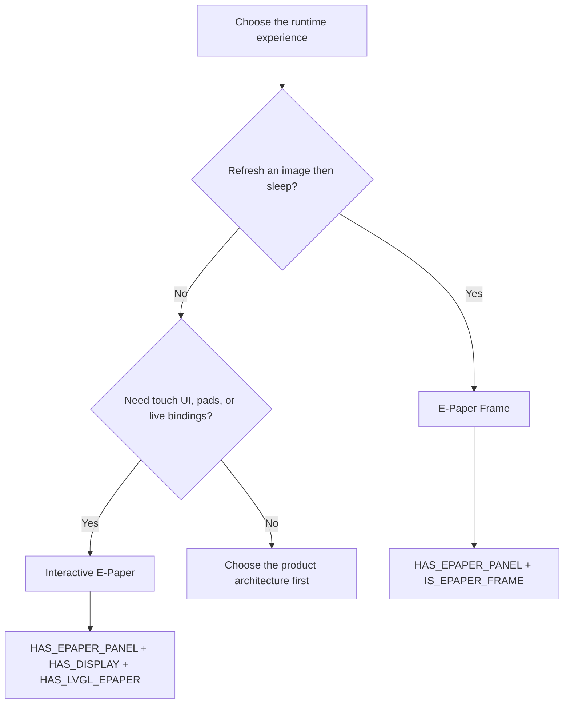

## Architecture Choice

The project supports two intentionally separate ways to use an e-paper panel.
Choose the architecture from the runtime experience, not from the panel vendor.

| Architecture | E-Paper Frame | Interactive E-Paper |
|---|---|---|
| User experience | Scheduled full-screen images | Touch UI with pads, widgets, and bindings |
| Runtime | Wake, refresh, then deep sleep | Always-on LVGL application |
| Identity | `IS_EPAPER_FRAME` | `HAS_LVGL_EPAPER` |
| Required hardware flag | `HAS_EPAPER_PANEL` | `HAS_EPAPER_PANEL` |
| Device class | `EPAPER_FRAME` | `MACROPAD` |
| Board suffix | `-frame` | `-interactive` |

## E-Paper Frame

An E-Paper Frame is a battery-oriented image display. It wakes on a schedule or
frame wake button, fetches or renders one full-screen image, refreshes the panel,
and returns to deep sleep. It does not start the LVGL display or touch stacks.

Use the [E-Paper Frame Guide](epaper-frame-guide.md) for configuration,
image sources, scheduling, and frame-specific hardware behavior.

## Interactive E-Paper

Interactive E-Paper runs the standard LVGL application on a slow-refresh panel.
It uses a buffered display driver, coalesces visual changes before applying a
physical waveform, and can expose B/W partial refreshes or grayscale full
refreshes. It remains a Macropad device class because it provides the same
interactive screen, pad, and binding model as other display boards.

Use the [Interactive E-Paper Developer Guide](dev/interactive-epaper.md) when
adding a board or display driver.

## Board Naming

Board targets use product behavior rather than a graphics-library implementation:

* `inkplate5v2-frame`
* `inkplate6flick-frame`
* `reterminal-e1003-frame`
* `inkplate6flick-interactive`
* `reterminal-e1003-interactive`

The `-interactive` suffix stays stable even if the rendering implementation
changes. LVGL is an implementation detail of the current interactive stack.