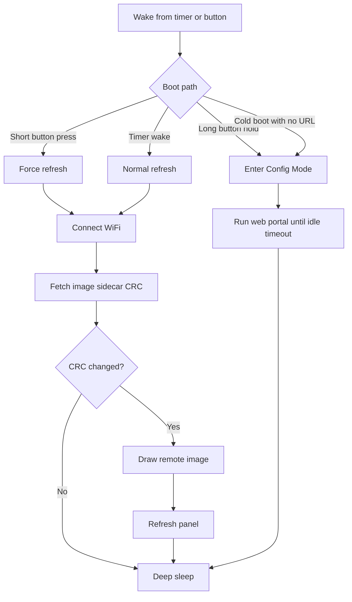

## Overview

The e-paper device class is the low-power, non-interactive branch of ESP32 Macropad.

Instead of rendering an LVGL user interface and waiting for touch input, an e-paper device wakes on demand, refreshes a single full-screen image, and returns to deep sleep. The current board target is the Soldered Inkplate 5V2.

This guide holds the detailed e-paper-specific material. Generic project docs, such as the README and changelog, stay intentionally high level so they do not become a second copy of the same evolving information.

## Current Scope

The current implementation targets one board and one usage model:

* Board: Inkplate 5V2
* SoC: ESP32 classic
* Display: 720 × 1280 3-bit grayscale e-paper
* Interaction model: non-touch, battery-oriented dashboard
* Render model: fetch one remote image, draw it, sleep

The shared web portal is still used for setup and configuration, but the runtime behavior is intentionally much simpler than the interactive display class.

## Runtime Model



## Board Profile

The Inkplate 5V2 is materially different from the interactive boards in this repository.

* `HAS_EPAPER` is enabled
* `HAS_DISPLAY` is disabled
* `HAS_TOUCH` is disabled
* `HAS_BUTTON` is disabled
* `HAS_EPAPER_WAKE_BUTTON` is enabled
* MQTT remains enabled for shared config, health, and portal paths

That split is intentional. The e-paper board does not participate in the LVGL display stack, touch stack, widget stack, or image-fetch subsystem used by interactive boards.

## Image Refresh Pipeline

Each refresh cycle uses the same high-level sequence:

1. Connect to WiFi.
2. Fetch `<image-url>.crc32`.
3. Compare the sidecar value to the last successfully displayed CRC.
4. Skip the panel refresh when the CRC is unchanged, unless the refresh was explicitly forced.
5. Draw the image with the Inkplate library.
6. Trigger the panel refresh.
7. Read battery voltage.
8. Store the new CRC after a successful update.
9. Put the panel to sleep.
10. Enter ESP32 deep sleep until the next wake.

The image itself is fetched and decoded by the Inkplate library. The firmware does not implement a custom PNG, JPEG, or dithering pipeline for this board class.

## Image and Sidecar Contract

The current implementation expects a public HTTP or HTTPS image URL.

Supported image formats:

* PNG
* JPEG
* BMP

The change-detection sidecar is fetched from the same path with `.crc32` appended.

Examples:

```text
https://example.com/dashboard.png
https://example.com/dashboard.png.crc32
```

Sidecar body formats currently accepted:

* `0x12345678`
* `12345678` (hex, 8 chars)
* `305419896` (decimal)

If the sidecar fetch fails, times out, or returns unparseable content, the device treats the image as changed and proceeds with a normal refresh.

## Wake Button Behavior

The Inkplate wake button has two meanings:

* Short press from deep sleep: force an immediate refresh and bypass the CRC skip path
* Long press at boot or wake: enter Config Mode

The long-press threshold is 2.5 seconds.

Button wake classification is done once at boot. That prevents the refresh path and the config-mode path from re-interpreting the same physical press differently later in startup.

## Portal Configuration Model

On e-paper boards, the web portal uses a dedicated E-Paper page as the primary landing area.

The page currently groups settings into three areas:

* Image source
* Refresh schedule
* Status

The operating mode is not exposed as a separate page on e-paper boards. The E-Paper page writes the hidden `operating_mode=duty_cycle_epaper` field on save so the board cannot drift into an unrelated transport mode through normal portal use.

## Status Semantics

The status card mixes NVS-backed values, RTC-retained values, and last-attempt values. That distinction matters when interpreting what the page shows.

### Last Refresh

The last refresh timestamp is stored in RTC-retained memory after a successful image update, but only when the clock is valid.

That means it:

* Survives deep sleep
* Does not survive full power loss or hard reset
* Cannot be computed meaningfully until the device clock is synced

### Successful Refreshes

The refresh counter is also stored in RTC-retained memory.

It counts successful panel updates, not timer wakes, not skipped CRC checks, and not failed draw attempts.

### Last Draw Result

The last result reflects the most recent refresh attempt in the current boot context.

Current values:

* `updated`
* `skipped`
* `fetch_failed`
* `draw_failed`
* `disabled`

### Last Sidecar HTTP

This field reports the final HTTP status returned by the `.crc32` fetch path.

Typical values:

* `200` when the sidecar exists and was fetched successfully
* `404` when no sidecar file exists
* `0` when the request failed before a usable HTTP response was received

The portal currently renders `0` as `N/A`.

### Last Image CRC

The CRC shown in the portal is the last successfully committed image CRC from NVS. It represents the last known displayed image identity, not necessarily the most recent sidecar body when a refresh failed.

## Config Mode

Config Mode uses the same portal idle-timeout mechanism as the rest of the project.

On the Inkplate board, the default portal idle timeout is 300 seconds. That gives you enough time to join the access point, configure WiFi, and set the image URL without leaving the device awake indefinitely on battery power.

## Current Limitations

The e-paper device class is intentionally narrow in this first version.

Current limitations include:

* Public image URLs only
* Single-image refresh model
* Full refresh only, no partial-update pipeline
* No local cache or offline image fallback
* No touch UI runtime
* No slideshow or multi-slot image rotation

Those constraints keep the runtime predictable and power efficient while the device class matures.

## Documentation Strategy

When new e-paper capabilities land, update this guide first.

Keep the generic markdown files high level:

* `README.md` should explain what the e-paper class is and where it fits
* `CHANGELOG.md` should summarize what changed
* This guide should hold the board-specific behavior, wake semantics, status-field meaning, and image-sidecar contract

That split keeps the general docs readable while leaving room for the e-paper feature set to grow over time.