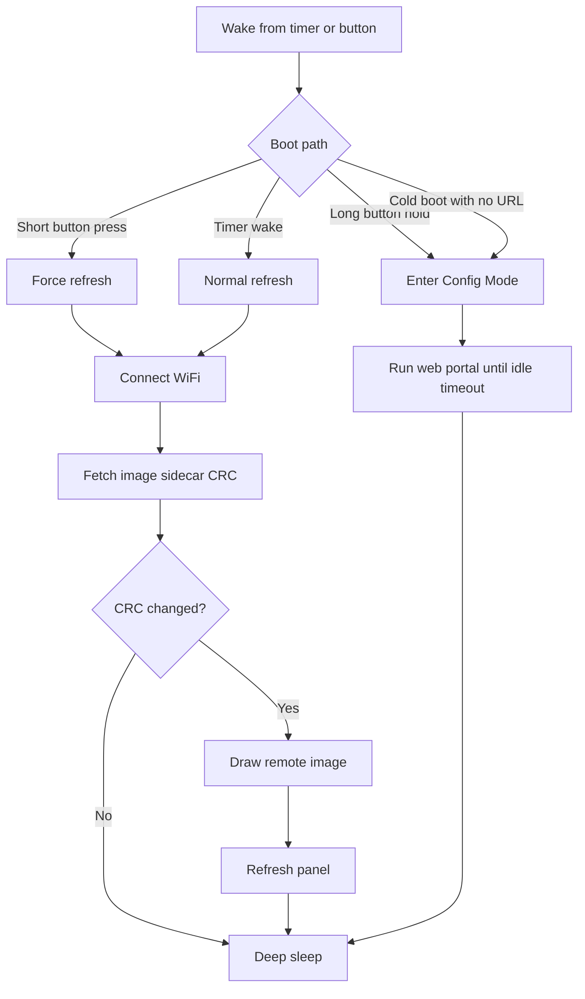

## Overview

The e-paper device class is the low-power, non-interactive branch of ESP32 Macropad.

Instead of rendering an LVGL user interface and waiting for touch input, an e-paper device wakes on demand, refreshes a single full-screen image, and returns to deep sleep. The current board target is the Soldered Inkplate 5V2.

This guide holds the detailed e-paper-specific material. Generic project docs, such as the README and changelog, stay intentionally high level so they do not become a second copy of the same evolving information.

## Current Scope

The current implementation targets one board and one usage model:

* Board: Inkplate 5V2
* SoC: ESP32 classic
* Display: 720 × 1280 3-bit grayscale e-paper
* Interaction model: non-touch, battery-oriented dashboard
* Render model: fetch one remote image, draw it, sleep

The shared web portal is still used for setup and configuration, but the runtime behavior is intentionally much simpler than the interactive display class.

## Runtime Model



## Board Profile

The Inkplate 5V2 is materially different from the interactive boards in this repository.

* `HAS_EPAPER` is enabled
* `HAS_DISPLAY` is disabled
* `HAS_TOUCH` is disabled
* `HAS_BUTTON` is disabled
* `HAS_EPAPER_WAKE_BUTTON` is enabled
* MQTT remains enabled for shared config, health, and portal paths

That split is intentional. The e-paper board does not participate in the LVGL display stack, touch stack, widget stack, or image-fetch subsystem used by interactive boards.

## Image Refresh Pipeline

Each refresh cycle uses the same high-level sequence:

1. Connect to WiFi.
2. On cold boot only, kick SNTP and wait up to 2 s for the first time sync so the status overlay timestamp is meaningful on the very first refresh. The ESP32 RTC keeps wall-clock through deep sleep, so subsequent wakes skip the wait.
3. Fetch `<image-url>.crc32`.
4. Compare the sidecar value to the last successfully displayed CRC.
5. Skip the panel refresh when the CRC is unchanged, unless the refresh was explicitly forced.
6. Clear the framebuffer so the boot splash or low-battery screen does not bleed through at the configured rotation.
7. Draw the image with the Inkplate library.
8. Composite the status overlay on top of the image.
9. Trigger the panel refresh.
10. Read battery voltage.
11. Store the new CRC after a successful update.
12. Put the panel to sleep.
13. Enter ESP32 deep sleep until the next wake.

The image itself is fetched and decoded by the Inkplate library. The firmware does not implement a custom PNG, JPEG, or dithering pipeline for this board class.

A refresh is always forced (CRC skip is bypassed) when any of these is true:

* Cold boot — the panel currently shows only the boot splash, so the dashboard image must be drawn at least once before the CRC short-circuit becomes safe.
* Short press of the WAKE button — the user is actively looking at the panel.
* The portal `Refresh e-paper now` action.

## Image and Sidecar Contract

The current implementation expects a public HTTP or HTTPS image URL.

Supported image formats:

* PNG
* JPEG
* BMP

The change-detection sidecar is fetched from the same path with `.crc32` appended.

Examples:

```text
https://example.com/dashboard.png
https://example.com/dashboard.png.crc32
```

Sidecar body formats currently accepted:

* `0x12345678`
* `12345678` (hex, 8 chars)
* `305419896` (decimal)

If the sidecar fetch fails, times out, or returns unparseable content, the device treats the image as changed and proceeds with a normal refresh.

## Wake Button Behavior

The Inkplate wake button has two meanings:

* Short press from deep sleep: force an immediate refresh and bypass the CRC skip path
* Long press at boot or wake: enter Config Mode

The long-press threshold is 2.5 seconds.

Button wake classification is done once at boot. That prevents the refresh path and the config-mode path from re-interpreting the same physical press differently later in startup.

## Status Overlay

Every successful refresh composites a small status chip on top of the dashboard image before the panel-drive waveform runs, so the overlay is always in sync with the image being refreshed.

* **Font** &mdash; the overlay uses the medium font (Inter 12 pt). The smallest font face (Inter 8 pt) stays compiled in for future high-DPI boards but is not readable on the Inkplate 5V2 panel.
* **Background** &mdash; a filled rounded-rectangle chip with no outline; on a panel this size the outline made the overlay feel boxed-in, while the fill on its own already reads as a chip.
* **Items** &mdash; configurable bitmask covering battery icon, battery percentage, wall-clock time, and last cycle duration. The fields appear in the order listed and only the enabled items are drawn.
* **Position** &mdash; one of the four panel corners, set via the E-Paper portal page.
* **Time field** &mdash; sourced from the ESP32 RTC, which is seeded by SNTP on the first cold boot after a power cycle and then carried forward across deep sleep. If the clock has not yet synced (very first wake on a flaky network), the time field falls back to a placeholder.

## VCOM Calibration

The Inkplate's TPS65186 PMIC stores a panel-specific VCOM bias voltage in its on-board EEPROM. The value is printed on the e-paper ribbon cable and only needs to be set once per device.

The portal exposes three actions under the VCOM card on the E-Paper page:

* **Read current VCOM** &mdash; queries the TPS65186 and shows the value currently programmed into EEPROM.
* **Show test pattern** &mdash; draws an all-grey-levels calibration pattern so you can compare candidate VCOM values visually. If the input field has a value, the pattern is drawn with that value written to the TPS65186 *volatile* registers only (EEPROM is not touched, and the value reverts on the next panel power cycle). With the input empty, the pattern is drawn with the EEPROM-programmed value.
* **Write VCOM (programs EEPROM)** &mdash; commits the value in the input to the EEPROM. The TPS65186 EEPROM is rated for roughly 100,000 program cycles, so this should only be done when the new value visibly improves image quality.

The preview path is intentionally non-destructive: experiment freely with `Show test pattern`, then only `Write VCOM` once you have picked a final value.

## Status Screens

The e-paper flow now renders explicit full-screen status screens in lifecycle moments where users otherwise only see a stale image.

* Boot splash appears on cold boot and on button wakes before WiFi work starts, so the device gives immediate feedback that a wake was accepted.
* Configuration mode screen is drawn when entering AP or STA recovery portal mode, showing SSID and URL/IP details needed to open the portal.
* Error screen appears when refresh fails, with a human-readable reason and retry timing guidance.
* Low-battery screen appears when battery reads below 3.2 V before WiFi connect, then the device sleeps for 600 seconds to reduce brownout churn.

## Frontlight Behavior

Frontlight controls are present only on boards that compile with `HAS_EPAPER_FRONTLIGHT=true`.

* Brightness range is 0 to 63.
* Duration is in seconds.
* Frontlight runs on button wakes only, not on timer wakes.
* A value of 0 brightness disables frontlight output.

The Inkplate 5V2 board keeps `HAS_EPAPER_FRONTLIGHT=false`, so the card stays hidden there.

## E-Paper Endpoints

E-paper component endpoints are split across two components: `epaper-status` and `epaper-vcom`.

* `POST /api/component/epaper-status/refresh` triggers an immediate refresh attempt.
* `GET /api/component/epaper-status/status` returns latest refresh counters, timing, battery, and last outcome fields.
* `GET /api/component/epaper-vcom/vcom` reads the current programmed VCOM.
* `POST /api/component/epaper-vcom/vcom` programs VCOM to TPS65186 EEPROM.
* `POST /api/component/epaper-vcom/vcom-test-pattern` draws the grayscale calibration pattern and optionally previews a volatile VCOM candidate via query `?vcom=-X.XX`.

## Portal Configuration Model

On e-paper boards, the web portal uses a dedicated **E-Paper** category as the primary landing area. The category contains four pages:

* **Status** &mdash; read-only refresh counters, timing, battery, and last outcome, plus a `Refresh e-paper now` action. Auto-refreshes every 5 seconds.
* **Image Source & Refresh Schedule** &mdash; image URL, rotation, wake interval, WiFi backoff cap, and frontlight (when the board supports it).
* **Status Overlay** &mdash; overlay enable, corner position, color, and per-field bitmask (battery, percentage, time, duration).
* **VCOM** &mdash; one-time TPS65186 EEPROM calibration controls.

The operating mode is not exposed as a separate page on e-paper boards. The Image and Status Overlay pages each write the hidden `operating_mode=duty_cycle_epaper` field on save so the board cannot drift into an unrelated transport mode through normal portal use.

## Status Semantics

The status card mixes NVS-backed values, RTC-retained values, and last-attempt values. That distinction matters when interpreting what the page shows.

### Last Refresh

The last refresh timestamp is stored in RTC-retained memory after a successful image update, but only when the clock is valid.

That means it:

* Survives deep sleep
* Does not survive full power loss or hard reset
* Cannot be computed meaningfully until the device clock is synced

### Successful Refreshes

The refresh counter is also stored in RTC-retained memory.

It counts successful panel updates, not timer wakes, not skipped CRC checks, and not failed draw attempts.

### Last Draw Result

The last result reflects the most recent refresh attempt in the current boot context.

Current values:

* `updated`
* `skipped`
* `fetch_failed`
* `draw_failed`
* `disabled`

### Last Sidecar HTTP

This field reports the final HTTP status returned by the `.crc32` fetch path.

Typical values:

* `200` when the sidecar exists and was fetched successfully
* `404` when no sidecar file exists
* `0` when the request failed before a usable HTTP response was received

The portal currently renders `0` as `N/A`.

### Last Image CRC

The CRC shown in the portal is the last successfully committed image CRC from NVS. It represents the last known displayed image identity, not necessarily the most recent sidecar body when a refresh failed.

## Power and Telemetry

The e-paper duty cycle measures and retains a per-wake timing budget in RTC memory so the portal can show "last cycle" numbers and MQTT can publish them on the next wake.

### Wake Modes

The `Wake every (seconds)` setting on the E-Paper page accepts two value classes:

* Any positive value (default `900`) — the device deep-sleeps for that many seconds, then wakes via the RTC timer and refreshes
* `0` — button-only mode: the timer wakeup is not armed and the device sleeps until the WAKE button is pressed

In button-only mode, the only way to refresh is to press WAKE. Use this when the device is acting as a static placard whose image only changes on demand.

### Sleep-Time Compensation

After each cycle the firmware subtracts the active loop duration from the configured wake interval so the wake-to-wake cadence approximates the target. A 900 s setting with a 12 s active loop sleeps for 888 s, not 900 s. A minimum sleep of 10 s is enforced.

### Battery Reporting

The battery voltage is read before the panel-drive waveform sags the cell, on both the "updated" and "skipped" code paths. The portal renders it as both volts and a 0&ndash;100&nbsp;% linear estimate derived from a 3.00&ndash;4.20&nbsp;V range.

### MQTT Telemetry

When MQTT is configured, every wake publishes a retained JSON document to `<base>/epaper/state` with the following shape:

```json
{
  "battery_mv": 3870,
  "battery_pct": 75,
  "wifi_rssi": -62,
  "image_crc32": 305419896,
  "refresh_result": "updated",
  "refresh_count": 42,
  "sidecar_http_status": 200,
  "timing": {
    "boot_to_wifi_ms": 2310,
    "crc_retry_count": 1,
    "crc_to_draw_ms": 4820,
    "draw_to_mqtt_ms": 180,
    "total_active_ms": 7820,
    "last_elapsed_ms": 5100
  }
}
```

The MQTT connect attempt is bounded at 5 s. A clean DISCONNECT is sent before deep sleep to avoid spurious LWT messages on the broker.

### Home Assistant Auto-Discovery

Twelve sensor entities are auto-discovered into Home Assistant, all reading from the JSON state topic above:

| Entity                          | JSON field                       | Unit |
|---------------------------------|----------------------------------|------|
| Battery                         | `battery_pct`                    | %    |
| Battery Voltage                 | `battery_mv`                     | mV   |
| E-Paper Refresh Count           | `refresh_count`                  |      |
| E-Paper Last Refresh Result     | `refresh_result`                 |      |
| E-Paper Image CRC               | `image_crc32` (formatted as hex) |      |
| E-Paper Sidecar HTTP Status     | `sidecar_http_status`            |      |
| E-Paper Wake Loop Time          | `timing.total_active_ms`         | ms   |
| E-Paper Boot to WiFi            | `timing.boot_to_wifi_ms`         | ms   |
| E-Paper CRC to Draw             | `timing.crc_to_draw_ms`          | ms   |
| E-Paper Draw to MQTT            | `timing.draw_to_mqtt_ms`         | ms   |
| E-Paper Refresh Elapsed         | `timing.last_elapsed_ms`         | ms   |
| E-Paper CRC Fetch Attempts      | `timing.crc_retry_count`         |      |

WiFi RSSI is intentionally not duplicated &mdash; the generic `WiFi RSSI` entity from the shared health discovery already updates on every wake.

Discovery configs are retained on the broker, so they are only published on cold boot. An `RTC_DATA_ATTR` flag suppresses the entire discovery burst (health + e-paper) on subsequent warm wakes to save battery.

## Config Mode

Config Mode uses the same portal idle-timeout mechanism as the rest of the project.

On the Inkplate board, the default portal idle timeout is 300 seconds. That gives you enough time to join the access point, configure WiFi, and set the image URL without leaving the device awake indefinitely on battery power.

## Current Limitations

The e-paper device class is intentionally narrow in this first version.

Current limitations include:

* Public image URLs only
* Single-image refresh model
* Full refresh only, no partial-update pipeline
* No local cache or offline image fallback
* No touch UI runtime
* No slideshow or multi-slot image rotation

Those constraints keep the runtime predictable and power efficient while the device class matures.

## Documentation Strategy

When new e-paper capabilities land, update this guide first.

Keep the generic markdown files high level:

* `README.md` should explain what the e-paper class is and where it fits
* `CHANGELOG.md` should summarize what changed
* This guide should hold the board-specific behavior, wake semantics, status-field meaning, and image-sidecar contract

That split keeps the general docs readable while leaving room for the e-paper feature set to grow over time.