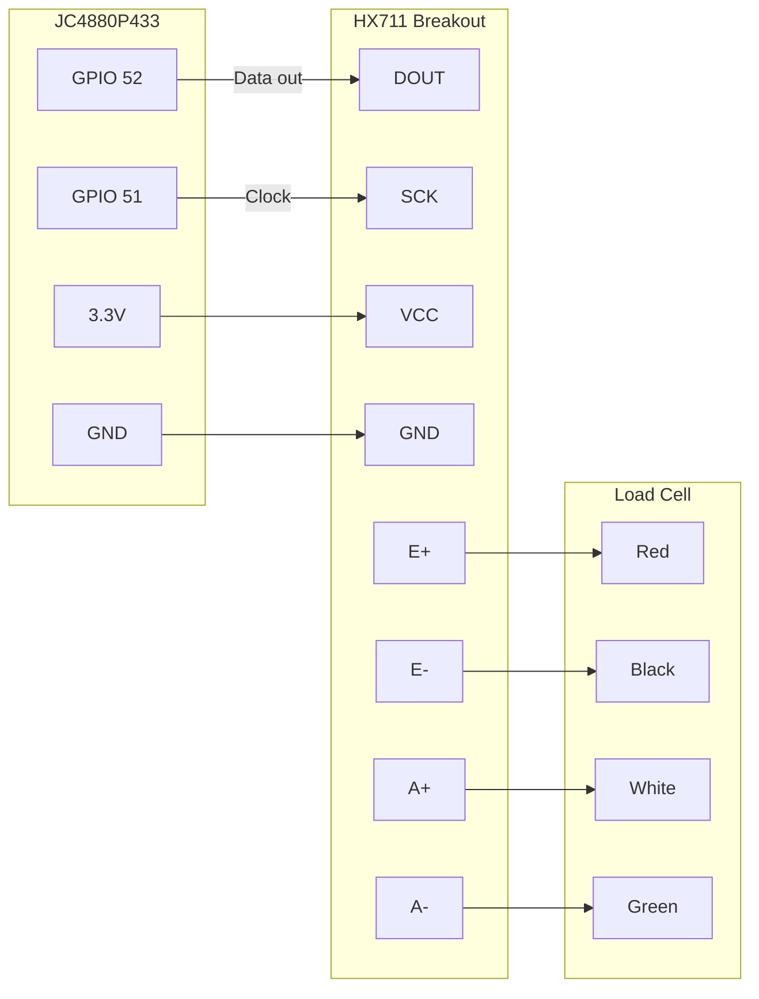
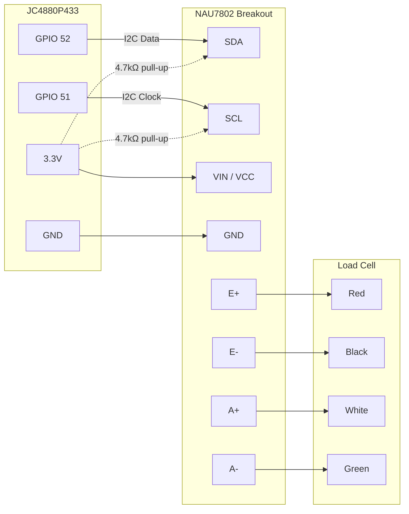

# Scale Guide

This guide covers the scale integration — bindings, actions, calibration workflow, guided brew mode, brew history logging, and REST API. It's aimed at users building rich touch-screen UIs (pad dashboards) for a scale application on an ESP32 Macropad device.

Two load cell ADCs are supported:

- **HX711** — SPI-like two-wire interface (DOUT + SCK), widely available breakout boards
- **NAU7802** — I2C 24-bit ADC with built-in PGA, higher precision, lower noise

> **Prerequisite**: A load cell ADC must be connected and enabled in the board overrides. See the hardware setup section below.

---

## Overview

The scale subsystem provides:

- **Real-time weight** — EMA-smoothed readings at ~80 Hz, displayed via bindings
- **Flow rate** — weight derivative computed over a 1-second window (grams per second)
- **On-device calibration** — tare and calibrate directly from pad buttons
- **Guided brew mode** — auto-tare and auto-start timer on first pour (brew manager)
- **Brew history** — every brew is automatically saved with time-series data, viewable in the web portal with interactive charts
- **Status feedback** — binding-driven status for taring/calibrating operations
- **REST API** — tare, calibrate, and status endpoints for external tooling

The device also includes **3 independent timers** — useful for tracking brew time, bloom phases, and pour intervals:

- **Count-up and countdown modes** — stopwatch or countdown with overtime display
- **Expire beep alerts** — configurable audio alert when a countdown reaches zero
- **Adjustable on-the-fly** — add or subtract seconds mid-brew without stopping
- **Auto-configured countdowns** — entering a pad automatically sets up timer presets from button configs

All scale data is exposed through the `[scale:]` binding scheme, and the guided brew workflow through `[brew:]`. Both work everywhere bindings are supported: labels, colors, widget data, conditional expressions, and more.

---

## Hardware Setup

Two board variants are available for the JC4880P433, each with a different load cell ADC. Both use the same two GPIOs on the pin header near the power connector.

### Option A: HX711 (jc4880p433-hx711)

The HX711 uses a proprietary two-wire protocol (not I2C).



| JC4880P433 Pin | HX711 Pin | Signal |
|----------------|-----------|--------|
| GPIO 52 | DOUT | Data output (HX711 → ESP32) |
| GPIO 51 | SCK | Clock input (ESP32 → HX711) |
| 3.3V | VCC | Power (3.3V or 5V) |
| GND | GND | Ground |

### Option B: NAU7802 (jc4880p433-nau7802)

The NAU7802 uses standard I2C (fixed address 0x2A). Same physical pins, different protocol.



| JC4880P433 Pin | NAU7802 Pin | Signal |
|----------------|-------------|--------|
| GPIO 52 | SDA | I2C data |
| GPIO 51 | SCL | I2C clock |
| 3.3V | VIN / VCC | Power (3.3V) |
| GND | GND | Ground |

> **Note**: Most NAU7802 breakout boards (e.g. SparkFun Qwiic) include on-board pull-up resistors. If yours doesn't, add 4.7 kΩ pull-ups on SDA and SCL to 3.3V (shown as dashed lines above).

### Board Configuration

Each sensor variant has its own board config. The firmware is built for one sensor at a time:

**HX711 variant** — `src/boards/jc4880p433-hx711/board_overrides.h`:
```cpp
#define HAS_SENSOR_HX711  true
#define HX711_DOUT_PIN     52
#define HX711_SCK_PIN      51
```

**NAU7802 variant** — `src/boards/jc4880p433-nau7802/board_overrides.h`:
```cpp
#define HAS_SENSOR_NAU7802 true
#define SENSOR_I2C_SDA     52
#define SENSOR_I2C_SCL     51
```

Build the variant you need:
```bash
./build.sh jc4880p433-hx711     # HX711 build
./build.sh jc4880p433-nau7802   # NAU7802 build
```

> **Tip**: Avoid GPIOs used by SDIO, SPI flash, or other peripherals. Check your board's datasheet.

### Calibration Data

Calibration factor and tare offset are automatically stored in NVS (non-volatile storage). They survive reboots — you only need to calibrate once after wiring changes or load cell replacement.

---

## Scale Bindings

The `[scale:]` binding scheme provides live scale data for labels, colors, widgets, and expressions. The general syntax is:

```
[scale:key]
[scale:key;format]
```

Where `key` selects what data to read and the optional `;format` applies a printf-style format override.

### Available Keys

| Key | Type | Default Format | Description |
|-----|------|---------------|-------------|
| `weight` | float | `%.1f` | Current EMA-smoothed weight in grams |
| `flow_rate` | float | `%.1f` | Weight change rate in g/s (1-second window) |
| `calibration_factor` | float | `%.4f` | Current calibration divisor |
| `offset` | long | `%ld` | Raw ADC tare offset |
| `available` | string | — | `ON` if HX711 detected, `OFF` otherwise |
| `cal_weight` | float | `%.1f` | Current calibration reference weight (grams) |
| `status` | string | — | `idle`, `taring`, or `calibrating` |

### Binding Examples

**Simple weight display:**
```
[scale:weight] g
```
→ `123.4 g`

**Weight with no decimal places:**
```
[scale:weight;%.0f] g
```
→ `123 g`

**Flow rate with one decimal:**
```
[scale:flow_rate] g/s
```
→ `2.3 g/s`

**Calibration reference weight:**
```
Cal: [scale:cal_weight] g
```
→ `Cal: 251.5 g`

**Status indicator:**
```
[scale:status]
```
→ `idle`, `taring`, or `calibrating`

**Availability check:**
```
Scale: [scale:available]
```
→ `Scale: ON` or `Scale: OFF`

### Using Scale Bindings in Expressions

Scale bindings work inside `[expr:]` for computed values and conditional formatting:

**Conditional color based on flow rate (V60 pour-over zones):**
```
[expr:threshold([scale:flow_rate],0,808080,1.5,00FF00,2.5,FFAA00,3.5,FF0000)]
```
- Gray when idle (< 1.5 g/s)
- Green in the sweet spot (1.5–2.5 g/s)
- Orange at the high end (2.5–3.5 g/s)
- Red when pouring too fast (> 3.5 g/s)

**Conditional status text:**
```
[expr:[scale:status]=="idle"?"Ready":"Working..."]
```

**Absolute value of flow rate:**
```
[expr:abs([scale:flow_rate]);%.1f] g/s
```

### Using Scale Bindings with Widgets

Scale data integrates naturally with all widget types.

**Sparkline — weight over time:**
```json
{
  "type": "sparkline",
  "data_binding": "[scale:weight]",
  "time_window": 120,
  "min_binding": "0",
  "max_binding": "500"
}
```

**Sparkline — flow rate trend:**
```json
{
  "type": "sparkline",
  "data_binding": "[scale:flow_rate]",
  "time_window": 60,
  "line_color_binding": "[expr:threshold([scale:flow_rate],0,808080,1.5,00FF00,2.5,FFAA00,3.5,FF0000)]"
}
```

**Gauge — weight as a dial:**
```json
{
  "type": "gauge",
  "data_binding": "[scale:weight]",
  "min_binding": "0",
  "max_binding": "500"
}
```

**Bar chart — flow rate bar:**
```json
{
  "type": "bar_chart",
  "data_binding": "[scale:flow_rate]",
  "min_binding": "0",
  "max_binding": "5",
  "bar_color_binding": "[expr:threshold([scale:flow_rate],0,808080,1.5,00FF00,2.5,FFAA00,3.5,FF0000)]"
}
```

### Pipe Fallback

Use the pipe fallback syntax to display a custom placeholder before the first reading is available:

```
[scale:weight|--.-] g
```
→ Shows `--.-- g` until the HX711 is ready, then switches to live weight.

---

## Scale Actions

Scale actions are button actions you assign in the pad editor. They enable on-device tare and calibration without needing a computer or the REST API.

### Action Types

| Action Type | Pad Editor Name | Payload | Description |
|-------------|----------------|---------|-------------|
| `scale` | Scale Tare | — | Zeros the scale (deferred, non-blocking) |
| `scale_cal` | Scale Calibrate | — | Calibrates using the current reference weight (deferred, non-blocking) |
| `scale_cal_weight` | Scale Cal Weight ± | delta (g) | Adjusts the reference weight by ± delta grams |
| `scale_cal_set` | Scale Cal Weight Set | value (g) | Sets the reference weight to an absolute value |

All tare and calibrate operations are **deferred** — the button tap returns immediately, and the actual operation runs on the next main loop cycle. This keeps the display responsive. Use `[scale:status]` to show progress.

### On-Device Calibration Workflow

A complete calibration flow using pad buttons:

1. **Set reference weight** — Use `scale_cal_set` to set the known weight of your calibration object (e.g. 251.5 g)
2. **Tare** — Tap a `scale` (tare) button with the scale empty
3. **Place object** — Put the known weight on the scale
4. **Calibrate** — Tap a `scale_cal` button to compute the calibration factor
5. **Verify** — The weight display should match the known weight

### Calibration Pad Example

Here's how to build a calibration pad with all the controls:

| Button | Action | Payload | Labels |
|--------|--------|---------|--------|
| Tare | `scale` | — | Center: `Tare` |
| Calibrate | `scale_cal` | — | Center: `Calibrate` |
| +10g | `scale_cal_weight` | `10` | Center: `+10` |
| -10g | `scale_cal_weight` | `-10` | Center: `-10` |
| +0.5g | `scale_cal_weight` | `0.5` | Center: `+0.5` |
| -0.5g | `scale_cal_weight` | `-0.5` | Center: `-0.5` |
| Set 250g | `scale_cal_set` | `250` | Center: `250g` |
| Weight | — | — | Top: `Weight`, Center: `[scale:weight;%.1f] g`, Bottom: `Cal: [scale:cal_weight] g` |
| Status | — | — | Center: `[scale:status]` |

> **Tip**: The `scale_cal_weight` delta supports decimals (e.g. `0.5`, `-0.1`), allowing 0.1 g precision for the reference weight.

### Status-Aware UI

Use `[scale:status]` with `[expr:]` for dynamic button feedback:

**Label that changes during operations:**
```
[expr:[scale:status]=="taring"?"Taring...":"Tare"]
```

**Color that highlights during activity:**
```
[expr:[scale:status]=="idle"?"333333":"FF8800"]
```

---

## REST API

The scale exposes three REST endpoints for external access and tooling.

### GET /api/scale

Returns the current scale state.

**Response:**
```json
{
  "available": true,
  "weight_g": 123.4,
  "flow_rate": 2.1,
  "calibration_factor": 1123.6415,
  "offset": 71839
}
```

### POST /api/scale/tare

Zeros the scale. No request body needed. Persists the new offset to NVS.

**Response:**
```json
{ "ok": true }
```

### POST /api/scale/calibrate

Calibrates with a known weight. The scale must be loaded with the specified weight before calling.

**Request body:**
```json
{ "known_weight_g": 251.5 }
```

**Response (success):**
```json
{ "ok": true, "calibration_factor": 1123.6415 }
```

**Response (error):**
```json
{ "ok": false, "error": "Raw delta is zero — no load cell signal. Check wiring." }
```

---

## Timers

The device includes 3 independent on-device timers — perfect for tracking brew time, bloom phase, and pour intervals. Timers support count-up (stopwatch) and countdown modes, with optional beep alerts when a countdown expires.

### Timer Bindings

The `[timer:]` binding scheme provides live timer values for labels, colors, and expressions.

| Binding | Returns | Example |
|---------|---------|---------|
| `[timer:1]` | Elapsed/remaining in mm:ss | `4:05` |
| `[timer:1;hh:mm:ss]` | Hours, minutes, seconds | `0:04:05` |
| `[timer:1;mm:ss.d]` | With decisecond precision | `4:05.3` |
| `[timer:1;ss]` | Total seconds | `245` |
| `[timer:1_state]` | Timer state | `running`, `paused`, `stopped` |
| `[timer:1_expired]` | Countdown crossed zero? | `ON` or `OFF` |
| `[timer:1_mode]` | Timer direction | `up` or `down` |

Countdown timers that run past zero show negative values (e.g., `-0:05`, `-1:23`) so you can see overtime at a glance.

### Timer Actions

Assign timer actions to pad buttons. The payload format is `N:command` or `N:command:arg`, where N is the timer number (1–3).

| Command | Payload Example | Description |
|---------|----------------|-------------|
| **toggle** | `1:toggle` | Stopped → start, running → pause, paused → resume |
| **start** | `1:start` | Start the timer |
| **stop** | `1:stop` | Stop and reset to 0 (count-up) or the countdown preset |
| **pause** | `1:pause` | Freeze at current value |
| **resume** | `1:resume` | Continue from paused value |
| **reset** | `1:reset` | Reset without changing running state |
| **lap** | `1:lap` | Reset and start fresh (step timing) |
| **countdown** | `1:countdown:240` | Set countdown duration (seconds) and switch to countdown mode |
| **adjust** | `1:adjust:15` | Add/subtract seconds from countdown preset (e.g., +15, -10) |
| **mode** | `1:mode:down` | Switch between `up` (stopwatch) and `down` (countdown) |

### Timer Button Configuration

In the pad editor, the timer action type provides additional settings:

- **Default Countdown (seconds)** — When navigating to a pad, the first button referencing each timer automatically sets its countdown preset. Only applied when the timer is stopped at zero (fresh). This means entering a brewing pad auto-configures your timers.
- **Expire Beep Pattern** — A beep DSL string (e.g., `1000:300 200 1000:300`) that plays when a countdown reaches zero. Fires exactly once per countdown cycle.
- **Expire Beep Volume** — Optional volume override (0 = device volume, 1–100).

### Using Timers with Scale Bindings

Timers and scale bindings combine naturally in expressions:

**Conditional color when bloom timer expires:**
```
[expr:[timer:1_expired]=="ON" ? "FF4444" : "333333"]
```

**Weight-per-second calculated from timer:**
```
[expr:[scale:weight] / max([timer:1;ss], 1);%.1f] g/s avg
```

**Dynamic label showing timer state:**
```
[expr:[timer:1_state]=="running" ? [timer:1;mm:ss] : "Tap to start"]
```

---

## Brew Manager (Guided Brew Mode)

The brew manager adds a guided brew workflow on top of the raw scale and timer features. It is **template-driven**: a brew template defines the ordered stages a brew moves through, and the manager is agnostic to whether a template is a built-in or a future config-driven one loaded from the filesystem.

Two built-in templates ship out of the box: **free_pour** and **v60**.

### How It Works

The brew manager operates in three meta-phases:

| Phase | Meaning |
|-------|---------|
| **Idle** | No brew in progress |
| **Active** | Template running; the current stage name is shown by `[brew:stage]` |
| **Done** | Brew finished, timer frozen, report saved |

Within **Active**, a stage can be:

| Stage type | How it advances |
|------------|----------------|
| **Manual** | User taps a button with `brew` / `next` payload |
| **Auto-weight** | Automatically advances when weight exceeds the stage threshold |
| **Auto-time** | Automatically advances after the configured duration elapses |

### Built-in Templates

#### free_pour (default)

The original two-stage workflow — tap Start, wait for pour, stop.

| # | Stage | Type | Side effect | Threshold |
|---|-------|------|-------------|-----------|
| 0 | Ready | Auto-weight | Tare on enter | 2 g |
| 1 | Brewing | Manual | — | — |

1. **Start** — scale auto-tares, state moves to **Ready**
2. **Auto-start** — weight exceeds 2 g → timer starts, state moves to **Brewing**
3. **Stop** — freezes timer, saves report
4. **Reset** — back to **Idle**

#### v60

A five-stage workflow that captures the bean dose before grinding.

| # | Stage | Type | Side effect | Threshold |
|---|-------|------|-------------|-----------|
| 0 | Place cup | Manual | — | — |
| 1 | Dosing | Manual | Tare on enter | — |
| 2 | Prep cup | Manual | — | — |
| 3 | Ready | Auto-weight | Tare on enter | 2 g |
| 4 | Brewing | Manual | — | — |

1. **Start V60** (`brew`/`start:v60` or `advance:v60`) — scale auto-tares; enters **Place cup**
2. Place empty dosing cup on scale
3. **Weigh beans** (`brew`/`next`) — tares out the cup weight; enters **Dosing**
4. Add beans to the cup; `[brew:weight]` shows pure bean weight
5. **Log dose** (`brew`/`next`) — captures current weight as the dose; enters **Prep cup**
6. Remove beans, grind them; place cup + V60 on scale
7. **Next** (`brew`/`next`) — tares scale (cup + V60 become the new zero); enters **Ready**
8. **Auto-start** — first water exceeds 2 g → timer starts, enters **Brewing**
9. **Stop** (`brew`/`stop`) — freezes timer, saves report (includes dose weight)
10. **Reset** (`brew`/`reset`) — back to **Idle** for next brew

> The dose weight is saved in the brew report and visible in the web portal's brew history.

#### rao_v60

A six-stage Rao-method V60 with bloom stage, flow targets, and named captures.

| # | Stage | Type | Side effect | Target | Flow | Auto-time |
|---|-------|------|-------------|--------|------|-----------|
| 0 | Place cup | Manual | — | — | — | — |
| 1 | Dose beans | Manual | Tare on enter, capture dose on exit | 16 g | — | — |
| 2 | Prep | Manual | Tare on enter | — | — | — |
| 3 | Arm pour | Auto-weight | Tare on enter | — | — | — |
| 4 | Bloom | Auto-time | Beep on enter, capture bloom water on exit | 60 g | 6 g/s | 45 s |
| 5 | Main pour | Manual | Beep on enter | 250 g | 5 g/s | — |

1. **Start Rao V60** (`brew`/`advance:rao_v60`) — scale auto-tares; enters **Place cup**
2. Place empty dosing cup on scale
3. **Weigh beans** (`brew`/`next`) — tares out the cup weight; enters **Dose beans**
4. Add beans; `[brew:weight]` shows pure bean weight. Target shown via `[brew:stage_weight_target]`
5. **Log dose** (`brew`/`next`) — captures dose; enters **Prep**
6. Grind beans, rinse filter, place cup + V60 on scale
7. **Ready** (`brew`/`next`) — tares scale; enters **Arm pour**
8. **Auto-start** — first water exceeds 2 g → timer starts, beep plays; enters **Bloom**
9. Pour to 60 g while bloom timer counts down. `[brew:stage_time_remaining]` shows seconds left
10. **Auto-advance** — after 45 s, beep plays, bloom water captured; enters **Main pour**
11. Pour steadily to 250 g. `[brew:stage_weight_remaining]` shows grams left
12. **Done** (`brew`/`stop` or tap advance) — freezes timer, saves report with dose + bloom water capture
13. **Reset** (`brew`/`reset`) — back to **Idle**

> Stage-level bindings (`stage_weight_target`, `stage_flow_target`, etc.) provide per-stage guidance — see the [full binding reference](scale-and-brew-bindings.md) for details.

### Brew Bindings

The `[brew:]` binding scheme provides live brew workflow data. Syntax:

```
[brew:key]
[brew:key;format]
```

| Key | Type | Default Format | Description |
|-----|------|---------------|-------------|
| `weight` | float | `%.1f` | Current weight (same as `[scale:weight]`, included for convenience) |
| `flow_rate` | float | `%.1f` | Current flow rate (same as `[scale:flow_rate]`) |
| `timer` | time | `mm:ss` | Brew elapsed time (0 before first pour, frozen when done) |
| `stage` | string | — | Current stage name: `Idle`, `Place cup`, `Dosing`, `Prep cup`, `Ready`, `Brewing`, `Done`, … |
| `active` | string | — | `1` if a template is running (ACTIVE meta-phase), `0` otherwise |
| `template` | string | — | Active template name: `v60`, `free_pour`, or empty when idle |
| `dose` | float | `%.1f` | Captured dose weight (g); 0 until dose is captured via `brew:next` on Dosing stage |
| `water` | float | `%.1f` | Water poured (g): live during brewing (scale was tared with vessel), frozen after Done |
| `ratio` | float | `%.1f` | Brew ratio (water ÷ dose); `---` when no dose captured |
| `instruction` | string | — | Current stage instruction text (empty when Idle/Done — use pipe fallback: `[brew:instruction\|tap Start to begin]`) |
| `next_label` | string | — | Advance button label for the current state — changes as brew progresses (e.g. `Start V60` → `Weigh beans` → `Log dose` → `Next` → `Armed` → `Done` → `Start V60 again`) |
| `peak_flow` | float | `%.2f` | Peak flow rate from the most recent saved brew (g/s). Returns `0` until the first brew is saved. |
| `display_name` | string | — | Template display name (e.g. "James Rao V60"); falls back to machine name |

Additional **stage-level bindings** (`stage_weight_target`, `stage_weight_current`, `stage_weight_remaining`, `stage_weight_pct`, `stage_time_target`, `stage_time_current`, `stage_time_remaining`, `stage_time_pct`, `stage_flow_target`, `stage_flow_current`, `stage_flow_pct`) provide per-stage guidance data for widgets and labels. See the [full binding reference](scale-and-brew-bindings.md) for details and practical examples.

#### Timer Format Options

The `[brew:timer]` key supports the same format options as regular timers:

| Format | Example | Description |
|--------|---------|-------------|
| `mm:ss` | `4:05` | Minutes and seconds (default) |
| `hh:mm:ss` | `0:04:05` | Hours, minutes, seconds |
| `ss` | `245` | Total seconds |
| `mm:ss.d` | `4:05.3` | With decisecond precision |

#### Binding Examples

**Brew timer with decisecond precision:**
```
[brew:timer;mm:ss.d]
```
→ `4:05.3`

**Stage-aware button label (v60) — note: prefer `[brew:next_label]` with advance action instead:**
```
[expr:[brew:stage]=="Idle"?"Start V60":[brew:stage]=="Place cup"?"Weigh beans":[brew:stage]=="Dosing"?"Log dose":[brew:stage]=="Prep cup"?"Next":[brew:stage]=="Ready"?"Armed":[brew:stage]=="Brewing"?"Done":"Start V60 again"]
```

**Background color that tracks brew state:**
```
[expr:[brew:active]=="1"?"1a3a1a":"1a1a2e"]
```

**Conditional flow rate — only show during active brew:**
```
[expr:[brew:active]=="1"?[brew:flow_rate;%.1f]:"--.-"] g/s
```

**Show captured dose:**
```
Dose: [brew:dose;%.1f] g
```

**Show water poured (live during brew, frozen after):**
```
Water: [brew:water;%.1f] g
```

**Show brew ratio (water ÷ dose):**
```
Ratio: 1:[brew:ratio;%.1f]
```
→ `Ratio: 1:15.6` (only meaningful for V60 where a dose is captured; shows `---` for free pour)

**Show active template name:**
```
[brew:template]
```
→ `v60` or `free_pour` while active, empty when idle

**Combined dose + water + ratio summary label:**
```
[brew:dose;%.1f]g / [brew:water;%.1f]g (1:[brew:ratio;%.1f])
```

### Brew Actions

Assign brew actions to pad buttons in the pad editor. The action type is `brew` and the payload selects the command.

| Payload | Description |
|---------|-------------|
| `advance:v60` | **Smart advance for V60** — start on Idle, next on Manual, stop when timer running, restart on Done; recommended for single-button pads |
| `advance:rao_v60` | **Smart advance for Rao V60** — same pattern with Rao's 6-stage template |
| `advance:free_pour` | **Smart advance for free pour** — same as above for free pour template |
| `advance:<name>` | Smart advance for any registered template |
| `start` | Start with the default template (`free_pour`); **automatically tares scale** |
| `start:v60` | Start with the V60 template |
| `start:<name>` | Start with any registered template by name |
| `next` | Advance the current **Manual** stage to the next stage |
| `stop` | Freeze timer, enter Done, save report |
| `reset` | Clear all state, return to Idle |

> **Tip**: Use `advance:<name>` as your primary button. Its label changes at every stage via `[brew:next_label]`, so one button replaces Start + Next + Stop. Add a long-press **Reset** as an escape hatch.

### Brew Pad Examples

#### Free Pour (simple)

| Button | Action | Payload | Labels |
|--------|--------|---------|--------|
| Start | `brew` | `start` | Center: `[expr:[brew:stage]=="Idle"?"Start":"Armed"]` |
| Stop | `brew` | `stop` | Center: `Stop` |
| Reset | `brew` | `reset` | Center: `Reset` |
| Timer | — | — | Top: `Brew Time`, Center: `[brew:timer;mm:ss.d]` |
| Weight | — | — | Top: `Weight`, Center: `[brew:weight;%.1f] g` |
| Flow | — | — | Top: `Flow`, Center: `[brew:flow_rate;%.1f] g/s` |
| Stage | — | — | Center: `[brew:stage]` |

#### V60 (single-button — recommended)

One **Advance** button handles the full brew. Its label tracks the current state automatically via `[brew:next_label]`.

| Button | Action | Payload | Labels |
|--------|--------|---------|--------|
| **Advance** | `brew` | `advance:v60` | Center: `[brew:next_label]` |
| Reset | `brew` | `reset` | Center: `Reset` (long-press for abort) |
| Instruction | — | — | Center: `[brew:instruction\|Tap Advance to begin]` |
| Dose | — | — | Top: `Dose`, Center: `[brew:dose;%.1f] g` |
| Timer | — | — | Top: `Brew`, Center: `[brew:timer;mm:ss.d]` |
| Weight | — | — | Top: `Weight`, Center: `[brew:weight;%.1f] g` |

Label progression on the Advance button:

| State | `[brew:next_label]` |
|-------|---------------------|
| Idle | `Start V60` |
| Place cup | `Weigh beans` |
| Dosing | `Log dose` |
| Prep cup | `Next` |
| Ready | `Armed` |
| Brewing | `Done` |
| Done | `Start V60 again` |

> The **Ready** row shows "Armed" because the timer auto-starts on first pour — the user does not tap anything at that point.

#### V60 (multi-button — explicit control)

| Button | Actions | Payload(s) | Labels |
|--------|---------|------------|--------|
| Start V60 | `brew` | `start:v60` | Center: `Start V60` |
| Next | `brew` | `next` | Center: `[brew:next_label]` |
| Stop | `brew` | `stop` | Center: `Stop` |
| Reset | `brew` | `reset` | Center: `Reset` |
| Dose | — | — | Top: `Dose`, Center: `[brew:dose;%.1f] g` |
| Timer | — | — | Top: `Brew`, Center: `[brew:timer;mm:ss.d]` |
| Weight | — | — | Top: `Weight`, Center: `[brew:weight;%.1f] g` |

> The **Next** button advances through Place cup → Dosing → Prep cup → Ready. Once in Ready the manager auto-starts on first pour.

### Brew vs. Manual Timer

| Feature | Brew Manager | Manual Timer |
|---------|-------------|--------------|
| Auto-start on pour | Yes (2 g threshold) | No |
| Auto-tare on start | Yes (always, at `brew_start()`) | No |
| Auto-tare on arm | Yes (additionally at Ready stage entry) | No |
| Independent slots | 1 brew session | 3 timers |
| Countdown mode | No (count-up only) | Yes |
| Expire beep | No | Yes |
| Stage awareness | Yes (template stage names) | No |
| Multi-stage guidance | Yes (templates) | No |

Use the brew manager for the overall brew workflow, and use manual timers alongside it for things like bloom countdowns.

---

## Brew Log (Brew History)

Every completed brew is automatically saved to the device's flash storage with full time-series data. You can review past brews, view interactive charts, and export/import brew data — all from the web portal's **Brews** page.

### How It Works

When you **stop** a brew, the brew manager automatically:

1. **Records the series** — weight and flow rate sampled at 1 Hz throughout the brew (up to 10 minutes / 600 samples)
2. **Computes summary stats** — peak flow, average flow (excluding noise below 0.3 g/s), final weight, and duration
3. **Saves to flash** — a JSON file is written to LittleFS with all fields and the full time-series
4. **Timestamps the brew** — uses NTP time if available, otherwise stores 0 (shown as "Unknown date" in the UI)

The device stores up to **200 brews**. When the limit is reached, the oldest brew is automatically evicted to make room for new ones.

> **Note**: The series buffer (~4.8 KB) is allocated in PSRAM when brewing starts and freed after saving, so it doesn't consume memory when idle.

### Web Portal — Brews Page

The **Brews** tab in the web portal provides a full brew history interface:

**List view:**
- **Stats banner** — total brew count, average time, average weight, and average flow across all brews
- **Brew cards** — each brew shows its name, date, duration, weight, and peak flow at a glance
- **Delete individual brews** — tap the trash icon on any card

**Detail view** (tap a brew card):
- **Summary fields** — duration, weight, peak flow, average flow
- **Weight chart** — interactive Chart.js line chart showing weight over time (blue gradient fill)
- **Flow rate chart** — line chart with segment coloring by flow zone:
  - Gray: < 1.5 g/s (idle/dripping)
  - Green: 1.5–2.5 g/s (target zone)
  - Orange: 2.5–3.5 g/s (fast)
  - Red: > 3.5 g/s (too fast)
- **Export** — download the brew as a JSON file
- **Delete** — remove the brew from the device

**Bulk actions:**
- **Export All** — downloads every brew sequentially into a single JSON array
- **Import** — upload a previously exported JSON file to restore brews on a new device or after a factory reset
- **Clear All** — delete all brew history

> **Tip**: Charts require an internet connection on first load (Chart.js is loaded from CDN). Once cached by your browser, they work offline.

### Brew Report Format

Each brew is stored as a self-contained JSON file. This is also the format used for export/import:

```json
{
  "v": 1,
  "fields": [
    { "key": "template", "label": "Template", "value": "v60", "format": "text" },
    { "key": "ts", "label": "Date", "value": 1742400000, "format": "datetime" },
    { "key": "duration", "label": "Duration", "value": 56813, "unit": "ms", "format": "duration" },
    { "key": "water", "label": "Water", "value": 250.3, "unit": "g", "format": "number" },
    { "key": "peak_flow", "label": "Peak Flow", "value": 3.45, "unit": "g/s", "format": "number" },
    { "key": "avg_flow", "label": "Avg Flow", "value": 2.12, "unit": "g/s", "format": "number" },
    { "key": "dose", "label": "Dose", "value": 16.2, "unit": "g", "format": "number" },
    { "key": "ratio", "label": "Ratio", "value": 15.5, "format": "number" }
  ],
  "series": {
    "interval_ms": 1000,
    "weight": [0.0, 2.1, 8.5, 18.2, ...],
    "flow": [0.00, 2.10, 6.40, 9.70, ...]
  }
}
```

| Field | Description |
|-------|-------------|
| `v` | Schema version (currently 1) |
| `fields` | Array of summary fields, each with key, label, value, optional unit, and format type |
| `template` | Template name used for this brew (`v60`, `free_pour`, …) |
| `dose` | Bean dose weight in grams — only present when captured via the V60 template (or any template with a `capture_dose` stage exit effect) |
| `series.interval_ms` | Time between samples (1000 ms = 1 Hz) |
| `series.weight` | Weight in grams at each sample point |
| `series.flow` | Flow rate in g/s at each sample point |

### Brew Log REST API

| Method | Endpoint | Description |
|--------|----------|-------------|
| `GET` | `/api/brews` | List all brews (newest first, summary fields only) |
| `GET` | `/api/brews?id=N` | Get a single brew with full series data |
| `DELETE` | `/api/brews?id=N` | Delete a specific brew |
| `DELETE` | `/api/brews` | Delete all brews |
| `POST` | `/api/brews/import` | Import brews from JSON (single object or array) |

**List response:**
```json
{
  "brews": [
    { "id": 42, "v": 1, "fields": [...] },
    { "id": 41, "v": 1, "fields": [...] }
  ],
  "count": 42,
  "max": 200
}
```

**Import request** — POST a single brew object or an array of brew objects (same format as export, without `id`).

### Peak Flow Binding

The `[brew:peak_flow]` binding returns the peak flow rate from the most recently saved brew. This is useful for showing "last brew" stats on your pad dashboard even after a reset:

```
Peak: [brew:peak_flow] g/s
```
→ `Peak: 3.45 g/s`

> **Note**: This value is in-memory only and resets to 0 on device reboot. It updates each time a brew is saved.

---

## Example: V60 Pour-Over Dashboard

A practical 4×2 pad layout for V60 coffee brewing using the V60 template, with a bloom timer:

| Col 1 | Col 2 | Col 3 | Col 4 |
|-------|-------|-------|-------|
| **Weight / Dose** | **Flow Rate** | **Brew Timer** | **Start V60 / Next** |
| Weight sparkline | Flow sparkline | **Bloom Timer** | **Stop / Reset** |

### Button Configurations

**Button (0,0) — Weight display (shows dose when captured):**
- Top label: `[expr:[brew:dose]>"0"?"Dose":"Weight"]`
- Center label: `[expr:[brew:dose]>"0"?[brew:dose;%.1f]:[brew:weight;%.1f]] g`
- Background color: `#1a1a2e`

**Button (1,0) — Flow rate with color:**
- Top label: `Flow`
- Center label: `[brew:flow_rate;%.1f] g/s`
- Background color: `[expr:threshold([scale:flow_rate],0,1a1a2e,1.5,1a3a1a,2.5,3a3a1a,3.5,3a1a1a)]`

**Button (2,0) — Brew timer display:**
- Top label: `Brew`
- Center label: `[brew:timer;mm:ss.d]`
- Bottom label: `[brew:stage]`
- Background color: `[expr:[brew:active]=="1"?"1a3a1a":"1a1a2e"]`

**Button (3,0) — Start V60:**
- Center label: `Start V60`
- Action: `brew`, payload: `start:v60`
- Background color: `#16213e`
- *(Scale auto-tares when brew starts — no extra tare action needed)*

**Button (0,1) — Weight sparkline:**
- Widget type: `sparkline`
- Data binding: `[scale:weight]`
- Time window: 120 seconds
- Background color: `#0f0f23`

**Button (1,1) — Flow rate sparkline:**
- Widget type: `sparkline`
- Data binding: `[scale:flow_rate]`
- Time window: 60 seconds
- Line color binding: `[expr:threshold([scale:flow_rate],0,808080,1.5,00FF00,2.5,FFAA00,3.5,FF0000)]`
- Background color: `#0f0f23`

**Button (2,1) — Bloom timer (manual countdown):**
- Center label: `Bloom [timer:1;mm:ss]`
- Action: `timer`, payload: `1:toggle`
- Default countdown: `45` (45-second bloom)
- Expire beep: `800:200 100 800:200`
- Background color: `[expr:[timer:1_expired]=="ON"?"3a1a1a":"16213e"]`

> Use timer 1 as a standalone bloom countdown alongside the brew manager's auto-timed overall brew.

**Button (3,1) — Next / Stop / Reset:**
- Top label: `[brew:stage]`
- Action (tap): `brew`, payload: `next` *(advances Place cup → Dosing → Prep cup → Ready; no-op during Brewing)*
- Bottom label: `Stop / Reset`
- Action (long-press): `brew`, payload: `stop`

> Add a separate long-press action for `reset` or put it on a dedicated button.

### Brewing Workflow

1. **Tap Start V60** — scale auto-tares to zero; stage shows **Place cup**
2. **Place empty dosing cup on scale** — the initial tare zeroed a bare scale
3. **Tap Weigh beans** — scale tares (cup weight becomes zero); stage shows **Dosing**
4. **Add beans to cup** — read live weight via `[brew:weight]`; shows pure bean weight (around 16 g for a standard V60)
5. **Tap Log dose** — dose (e.g. 16.2 g) is captured; stage shows **Prep cup**
6. **Remove beans, grind them** — scale can show anything during this stage, it doesn't matter
7. **Place cup + V60 + filter on scale** — prep the filter as usual, put ground coffee in
8. **Tap Next** — scale tares (cup + V60 become new zero); stage shows **Ready**
9. **Start pouring** — when weight exceeds 2 g, brew timer starts automatically; stage shows **Brewing**
10. Pour water, watch weight and flow rate sparklines; optionally tap **Bloom Timer** (timer 1) for the bloom stage
11. **Long-press Stop** when done — brew timer freezes; report saved to history (includes dose)
12. Check the **Brews** tab in the web portal to review the session

> **Tip**: The brew manager owns its own timer. You still have all 3 manual timers free — use timer 1 for bloom, timer 2 for pour stages, etc.

---

## Signal Processing Details

Understanding the signal processing helps when tuning your UI:

- **Sample rate**: ~80 Hz (HX711 at 80 SPS, single-sample reads)
- **EMA filter**: Alpha = 0.3 (30% new sample, 70% history). Smooths noise while remaining responsive to real weight changes.
- **Jump threshold**: 5g. If a single reading differs from the EMA by more than 5g, the EMA resets instantly — this makes placing/removing objects feel immediate.
- **Flow rate window**: 1 second. The derivative is computed as `(current_weight - weight_1s_ago) / elapsed_seconds`.
- **Tare**: Averages 20 raw samples (~250ms) for a stable zero point.
- **Calibration**: Averages 20 raw samples of the loaded scale, then divides by the known calibration weight to compute the factor.

### What This Means for Your UI

- Weight labels update smoothly without jitter
- Flow rate responds within ~1 second of pour changes
- Tare and calibrate take ~250ms each (handled in the background — UI stays responsive)
- The `[scale:status]` binding transitions: `idle` → `taring` → `idle` (or `idle` → `calibrating` → `idle`)

---

## Tips & Best Practices

### Scale
- **Always tare before calibrating** — calibration measures the raw ADC difference between zero and the known weight
- **Use a known, accurate weight** for calibration — kitchen scales or certified weights work well
- **Flow rate is most useful during pours** — at rest it hovers near 0.0 g/s with minor noise
- **Negative flow rate** means weight is decreasing (evaporation, dripping, object removal)
- **Calibration persists across reboots** — you don't need to recalibrate after power cycles
- **Use `[scale:available]` for conditional UI** — hide or gray out scale buttons when the sensor isn't connected
- **The cal_weight defaults to 500g** at boot and is not persisted — set it from a pad button before calibrating

### Timers
- **Default countdown auto-configures** — entering a pad sets up timer countdowns from button configs, so you don't need a separate "set countdown" button
- **Overtime is visible** — countdown timers keep running past zero and show negative values, so you always know how far over time you are
- **Expire beep fires once** — the beep triggers on the zero-crossing edge, not repeatedly. Reset or adjust the timer to re-arm it
- **Use `adjust` for on-the-fly changes** — add or subtract seconds mid-brew without stopping the timer
- **Lap for pour phases** — the `lap` command resets and immediately restarts a timer, perfect for timing individual pour phases (bloom, first pour, second pour)
- **3 timers = 3 purposes** — e.g., timer 1 for total brew time, timer 2 for bloom/stage timing, timer 3 for anything else
- **Timers are runtime-only** — they don't persist across reboots; countdown presets are reapplied when you navigate to the pad
