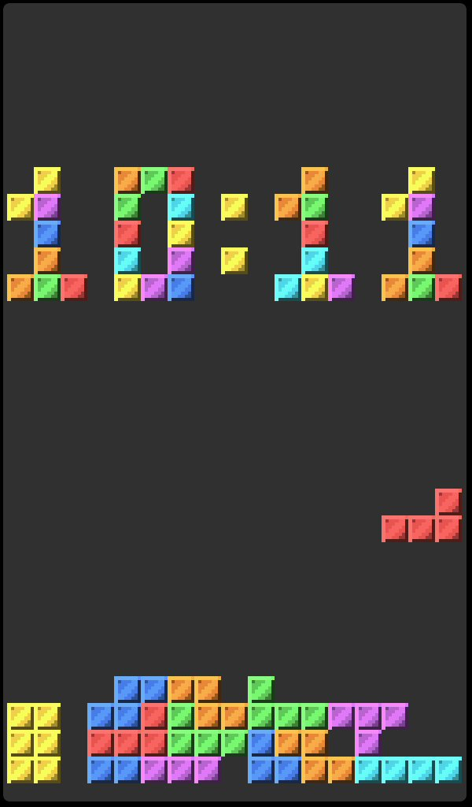

## Overview

Block Drop Clock is a native extension for ESP32-P4 boards. It renders the
current hour and minute as a pixel-art clock while a small block-drop game plays
below it.
The display adapts its grid size to the containing button.



## Configuration

Add the **Extension** widget to a button, select `block-drop-clock`, and optionally
provide this configuration:

```json
{
  "time": "[time:%H:%M;Europe/Brussels]",
  "burn_in_shift_minutes": 60,
  "speed": 1.0,
  "block_color": "#55D7E8",
  "clock_color": "#F3D24B"
}
```

| Field | Default | Description |
| --- | --- | --- |
| `time` | `[time:%H%M]` | Binding template that supplies the hour and minute. Separators are optional. |
| `burn_in_shift_minutes` | `60` | Minutes between vertical clock shifts for burn-in mitigation. Set to `0` to disable shifting. |
| `speed` | `1.0` | Playfield speed multiplier from `0.25` to `4.0`. |
| `block_color` | Palette | Optional six-digit RGB color for game blocks, for example `#55D7E8`. Lighter and darker variants are generated from this base color. |
| `clock_color` | Palette | Optional six-digit RGB color for clock cells, for example `#F3D24B`. Lighter and darker variants are generated from this base color. |

The extension resolves the `time` binding in its owning button context, so it
supports the project's standard time-binding options such as timezone
parameters.

## Rendering

Each block is based on an embedded `8 x 8` RGB565 pixel-art sprite. The
extension tints the sprite for the seven piece colors, then uses the native
extension canvas sprite-blit API to scale it exactly to each grid cell. This
keeps blocks inside their bounds on buttons of any size.

The renderer maintains separate static-board, active-piece, and clock layers.
Only regions affected by a game step, time update, or clock shift are redrawn.

## Build

Build this extension alone during development:

```bash
bash tools/build-p4-extension.sh \
  extensions/block-drop-clock/block_drop_clock.cpp \
  build/extensions/block-drop-clock@1.0.0.elf
```

Build and sign every shipped extension package:

```bash
./tools/build-p4-extensions.sh
```

The extension requires firmware and a package built for the same native
extension ABI. See [Native Extensions](../../docs/dev/extensions.md) for the
installation workflow and ABI details.
