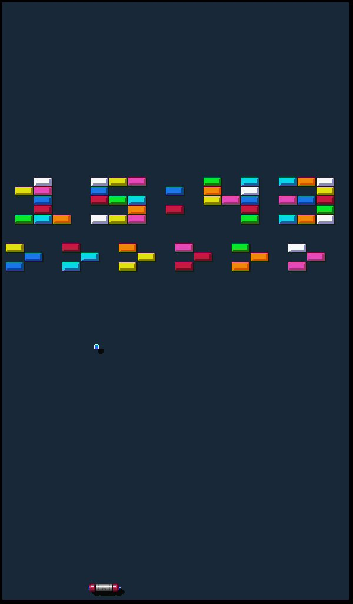

## Overview

Brick Breaker Clock is a self-playing native extension for ESP32-P4 boards. It
shows the current hour and minute as a wall of retro arcade bricks. A near-perfect
paddle keeps a ball in play as it strikes the time bricks.

A struck clock brick, including either colon brick, disappears, then returns
when the ball next reaches the paddle. A timed respawn mode remains available.

The extension also adds a separate field of level bricks. Level bricks clear
permanently when struck; after the field is cleared, a randomly selected new
arcade formation appears. The clock-brick layout is unaffected by level
transitions. Level formations sit below the clock so they become the natural
first targets after a paddle return.

The extension computes all game dimensions from its assigned button rectangle.
It scales brick, ball, paddle, spacing, and game field sizes for landscape,
portrait, square, and compact button layouts.



## Configuration

Add the **Extension** widget to a button, select `brick-breaker-clock`, and
optionally provide this configuration:

```json
{
  "time": "[time:%H:%M;Europe/Brussels]",
  "speed": 1.0,
  "respawn_on_paddle": true,
  "respawn_ms": 1000,
  "paddle_accuracy": 96,
  "brick_color": "#F81858"
}
```

| Field | Default | Description |
| --- | ---: | --- |
| `time` | `[time:%H%M]` | Binding template supplying the four clock digits. It supports timezone parameters such as `Europe/Brussels`. |
| `speed` | `1.0` | Ball-speed multiplier from `0.25` to `4.0`. |
| `respawn_on_paddle` | `true` | Returns all hit clock bricks together when the ball next hits the paddle. A 30-second safety timeout prevents indefinite damage. |
| `respawn_ms` | `1000` | Timed respawn delay when `respawn_on_paddle` is `false`. The supported range is `0` to `10000` milliseconds. |
| `paddle_accuracy` | `96` | Autonomous paddle tracking accuracy from `0` to `100`. The default provides near-perfect play and prioritizes reachable level bricks with a randomized miss offset, then clear ceiling shots. |
| `brick_color` | `#F81858` | Optional six-digit RGB color for digit bricks. |

Tap and long-press events always pass through to the owning button. The
extension does not consume button actions.

The game field always uses the owning button's resolved background color.

## Rendering and performance

The extension uses an RGB565 canvas and repaints only the region affected by
the previous and current ball and paddle positions. A brick hit or respawn adds
only that brick to the damaged region. Level transitions repaint the field once.
The game has no network or worker activity.

Its compact pixel-art brick, ball, and paddle forms are hard-coded in the
extension from the original arcade visual language. The original reference
image is not distributed with the package.

Minute transitions resolve the configured time binding again, rebuild the brick
map for the new digits, and discard old respawn state.

## Build

Build this extension alone during development:

```bash
bash tools/build-p4-extension.sh \
  extensions/brick-breaker-clock/brick_breaker_clock.cpp \
  build/extensions/brick-breaker-clock@1.0.0.elf
```

Build and sign every shipped extension package:

```bash
./tools/build-p4-extensions.sh
```

The extension requires firmware and a package built for the same native
extension ABI. See [Native Extensions](../../docs/dev/extensions.md) for the
installation workflow and ABI details.
