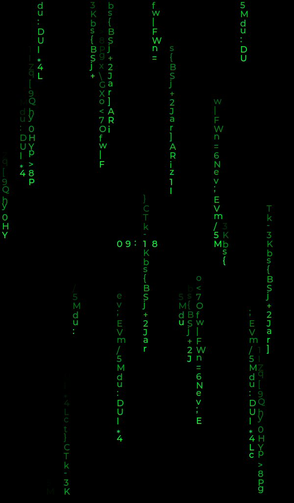

## Overview

Matrix Rain renders independent streams of ASCII characters using the widget's
background color for clearing. Characters use the firmware's bundled fonts, so
the effect works without packaging a separate glyph asset.



## Configuration

Add the **Extension** widget to a button, select `matrix-rain`, and optionally
provide:

```json
{
  "clock": "[time:%H:%M:%S;Europe/Brussels]",
  "burn_in_shift_minutes": 60,
  "rain_color": "#00FF41",
  "clock_color": "#00FF41",
  "font_family": "doto",
  "font_size": 18,
  "speed": 1.0,
  "density": 0.8,
  "trail_length": 1.0
}
```

| Field | Default | Description |
| --- | --- | --- |
| `font_family` | `default` | `default`, `dseg7`, `bebas`, or `doto`. |
| `font_size` | `18` | Compiled firmware font size from 12 to 48 pixels. |
| `clock` | Disabled | Optional `[time:...]` binding that displays a centered `HH:MM` clock. |
| `burn_in_shift_minutes` | `60` | Moves the clock vertically by one character cell every interval. Set to `0` to disable it. |
| `rain_color` | `#00FF41` | Six-digit RGB color for the rain, with an optional leading `#`. Intensity fades are applied to this color. |
| `clock_color` | `#00FF41` | Six-digit RGB color for clock characters, with an optional leading `#`. |
| `speed` | `1.0` | Rain speed multiplier from `0.1` to `12.0`. |
| `density` | `0.8` | Portion of columns that contain rain, from `0.0` to `1.0`. |
| `trail_length` | `1.0` | Visible characters per stream multiplier from `0.25` to `2.0`. |

The clock requires room for five character cells at the selected font size. If
the widget is narrower, Matrix Rain leaves the optional clock disabled.

Set the External Widget's `extension_tick_interval_ms` from `33` to `1000`
milliseconds to control animation cadence. Lower values produce smoother
animation and higher CPU usage.

When `clock` is configured, use the firmware's time binding syntax. For
example, `[time:%H:%M;Europe/Brussels]` formats a 24-hour clock in the named
timezone. Extra output, such as seconds, is ignored. Omitting the timezone uses
UTC. The clock requires synchronized NTP time before it can show the current
time.

The widget's configured background color is used whenever animation pixels are
cleared. Clock characters use `clock_color` and normal rain uses `rain_color`,
with both defaulting to bright green. Normal rain skips clock cells. Clock
values update directly when the time binding changes. Burn-in prevention cycles
the clock through the vertical offsets $0$, $+1$, and $-1$ character cells.
The old and new positions are cleared during a move so no bright glyph pixels
remain behind.

## Build

```bash
bash tools/build-p4-extension.sh \
  extensions/matrix-rain/matrix_rain.cpp \
  build/extensions/matrix-rain@1.0.0.elf
```

The extension requires firmware and a package built for the same native
extension ABI.