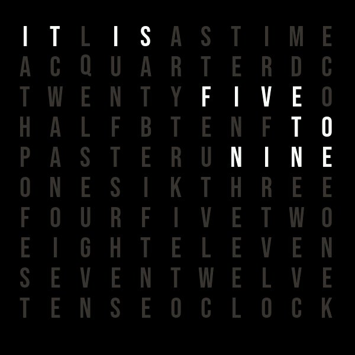
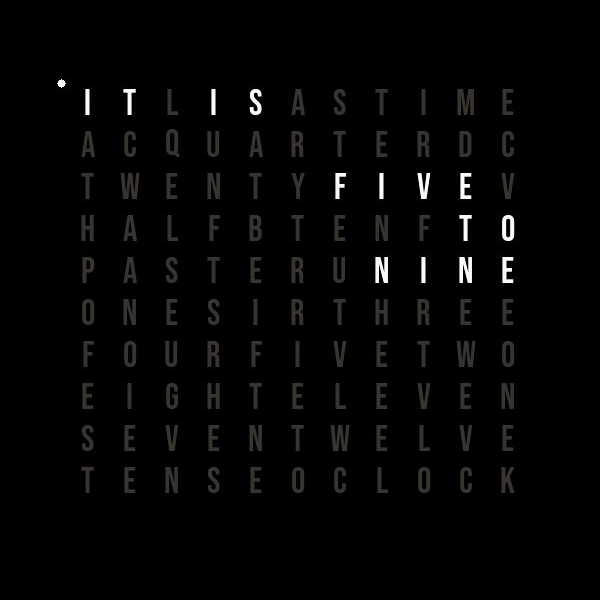
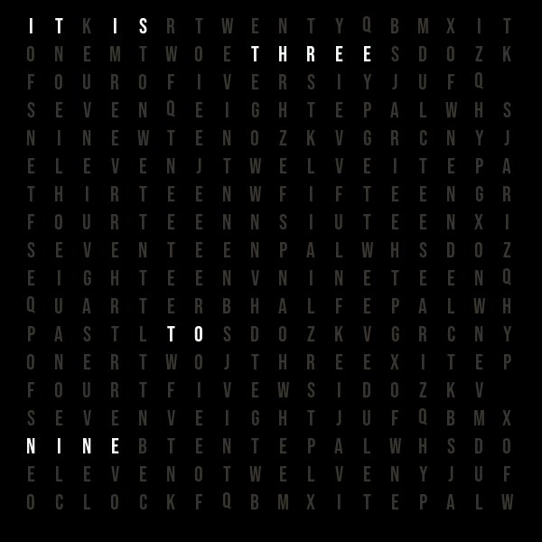

## Overview

Word Clock presents the time as highlighted words in an English letter matrix.
Rounded and minute-dots modes use a fixed 11 by 10 face; accurate mode uses a
larger 18 by 18 face. The visual treatment is inspired by the familiar
word-clock format, while using original letter layouts and phrase maps.

The extension uses the owning button's resolved background color for its face.
Inactive letters use the dimmed color and active words use the button's text
color. It measures the selected bundled font before rendering so the complete
matrix remains centered and unstretched in square, portrait, landscape, and
compact button layouts.

## Mode Previews

Rounded mode displays the nearest five-minute phrase.



Minute-dots mode uses the previous five-minute phrase and lights a corner dot
for each remaining minute.



Accurate mode spells every minute with its expanded letter face.



## Configuration

Add the **Extension** widget to a button, select `word-clock`, then use one of
these configurations.

### Rounded

The default mode rounds to the nearest five-minute phrase.

```json
{
  "time": "[time:%H%M;Europe/Brussels]",
  "mode": "rounded"
}
```

### Minute Dots

Use the preceding five-minute phrase and light one to four corner dots for the
remaining minutes.

```json
{
  "time": "[time:%H%M;Europe/Brussels]",
  "mode": "minute-dots"
}
```

### Accurate

Spell each minute. The threshold keeps `past` phrasing through minute 35, then
uses `to` the next hour.

```json
{
  "time": "[time:%H%M;Europe/Brussels]",
  "mode": "accurate",
  "accurate_past_threshold_minutes": 35,
  "phrase_animation_ms": 100,
  "font_family": "bebas",
  "dimmed_color": "#383631",
  "burn_in_shift_minutes": 15,
  "burn_in_shift_pixels": 0
}
```

| Field | Default | Description |
| --- | --- | --- |
| `time` | `[time:%H%M]` | Existing time binding that supplies hour and minute. Timezone parameters are supported. |
| `mode` | `rounded` | `rounded` uses the nearest five-minute phrase. `minute-dots` uses the preceding five-minute phrase and lights one to four filled corner dots for the remaining minutes. `accurate` spells every minute in words. |
| `accurate_past_threshold_minutes` | `35` | Accurate mode only. Counts through this minute as `past` the current hour, then uses `to` the next hour. Values are clamped to 30 through 44 so `quarter to` remains consistent. |
| `phrase_animation_ms` | `0` | Milliseconds per character during a phrase change. `0` changes immediately. Otherwise, removed characters dim from right to left, then added characters highlight from left to right. Unchanged characters remain highlighted. |
| `font_family` | `bebas` | `default`, `bebas`, `doto`, or `dseg7`. `bebas` best matches the compact, uppercase clock face. |
| `font_size` | `0` | `0` chooses the largest fitting bundled font. Otherwise use 12, 14, 18, 24, 32, 36, or 48. Large values reduce automatically when the button is too small. |
| Button text color | Button setting | Words that describe the current time use the owning button's resolved text color. |
| `dimmed_color` | `#383631` | Six-digit RGB color for inactive letters. |
| `burn_in_shift_minutes` | `60` | Moves the complete matrix through a nine-position grid at this interval. Set to `0` to disable it. |
| `burn_in_shift_pixels` | `0` | Offset distance in pixels. `0` uses `max(4, font_size / 3)`; otherwise use 1 through 24. |

The extension accepts time bindings that produce four digits. Separators in the
binding output are ignored. In the default `rounded` mode, it rounds to the
nearest five-minute phrase, so 10:03 displays "IT IS FIVE PAST TEN" and
10:58 displays "IT IS ELEVEN O'CLOCK". `minute-dots` uses floor-to-five-minute
phrases: 14:14 displays "IT IS TEN PAST TWO" with four corner dots, and 13:38
displays "IT IS TWENTY FIVE TO TWO" with three dots.

`accurate` uses its own square 18 by 18 letter matrix with dim separator letters
between words. Its remaining inactive letters are varied rather than repeated.
It uses spoken expressions for familiar times: 08:15 displays "IT IS
QUARTER PAST EIGHT", 08:30 displays "IT IS HALF PAST EIGHT", and 08:45
displays "IT IS QUARTER TO NINE". Other exact minutes include `MINUTE` or
`MINUTES`: 05:13 displays "IT IS THIRTEEN MINUTES PAST FIVE". Full teen
words remain intact, while compound values use separate words such as
"THIRTY FOUR". `accurate_past_threshold_minutes` defaults to 35, so 08:35
displays "IT IS THIRTY FIVE MINUTES PAST EIGHT" and 08:36 displays "IT IS
TWENTY FOUR MINUTES TO NINE".

## Rendering

The host schedules a 50 ms tick. The extension checks its time binding at most
twice per second, but redraws its RGB565 canvas only when the displayed phrase,
phrase-animation step, or burn-in shift changes. It has no worker task or
network activity.

## Burn-In Prevention

The complete face, including the always-lit `IT IS` letters, moves through a
three by three grid centered on the button. The default interval is 60 minutes;
15 minutes is suitable for a clock that remains visible for long periods. The
adaptive distance is at least four pixels and scales with the selected font.
Set `burn_in_shift_pixels` when a fixed distance better suits the display.

The extension's canvas is allocated to the current button bounds. Font metrics
from the host select the largest fitting font, then place each glyph in an
independent cell within a near-square 11 by 10 face. Extra space becomes an
even background border; minute-dots mode reserves a small perimeter for minute
dots. Accurate mode uses a square 18 by 18 face for its larger vocabulary
and separated word groups. This preserves a readable clock face on every
supported aspect ratio.

## Build

```bash
bash tools/build-extension.sh s3 \
  extensions/word-clock/word_clock.cpp \
  build/extensions/word-clock@1.0.4-s3.elf
```

Use `p4` instead of `s3` to build the ESP32-P4 package.

Build and sign every shipped extension package:

```bash
./tools/build-p4-extensions.sh
```