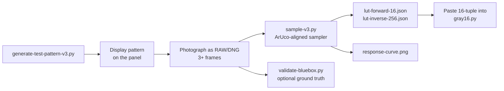

# Panel tone-response calibration

Measure how a 16-level grayscale e-paper panel actually reproduces tone, and emit
the lookup tables that correct it. This is the toolkit that produced the
`PANEL_RESPONSE_E1003_GC16_V32` curve baked into
[`../photoframe-site/gray16.py`](../photoframe-site/gray16.py); run it again to
calibrate a different panel (or a different waveform / VCOM on the same panel).

> Background and a worked example are in the standalone writeup:
> <https://gist.github.com/jantielens/03746406c09154017989e0d2bd64f002>

## Why

A 16-level panel only accepts source codes `0, 17, 34, … 255`. Naively assuming
code `k·17` yields reflectance `k/15` is wrong — real panels render **midtones
lighter than linear**, so uncorrected photos look washed out. The response is
monotonic and repeatable, so it can be measured once and corrected with a LUT.

## The pipeline



## Files

| File | Role |
|------|------|
| `generate-test-pattern-v3.py` | Builds the 16-step wedge + co-located white rails + 4 ArUco markers. Emits a preview PNG, a packed `.g16p` payload, and `sample-regions-v3.2.json` (the geometry manifest the sampler reads). |
| `sample-v3.py` | The core engine: decode DNG → detect ArUco markers → homography warp to canonical geometry → glare-robust per-bar reflectance → rail-interpolated white field → normalized monotonic forward LUT (16) + inverse LUT (256) + `response-curve.png`. |
| `sample_v3_shim.py` | Import shim that exposes the hyphenated `sample-v3.py` as a module for the validator. |
| `validate-bluebox.py` | Optional independent cross-check: samples a hand-drawn blue ground-truth region and scores it against the auto result (this is where the published RMS 0.0059 number comes from). |
| `sample-regions-v3.2.json` | The geometry manifest emitted by the generator and consumed by the sampler. Regenerated whenever you change the pattern. |

## Requirements

```bash
python3 -m venv .venv && source .venv/bin/activate
pip install -r requirements.txt
```

`rawpy` (DNG decode) and `opencv-python` (ArUco detection + homography) are the
heavyweight dependencies; `numpy`, `Pillow`, and `matplotlib` round it out. These
are intentionally **not** part of the firmware build — this is a one-off bench
tool.

## How to calibrate a panel

1. **Generate the pattern**

   ```bash
   python3 generate-test-pattern-v3.py
   ```

   Produces `test-pattern-v3.2-preview.png`, `test-pattern-v3.2.g16p`, and
   `sample-regions-v3.2.json`. The `.g16p` is the packed Gray16 payload to push
   to the panel; the preview PNG is for reference.

2. **Display it on the panel** at full resolution (no scaling, no extra tone
   processing) using the same waveform you ship (e.g. GC16).

3. **Photograph it** as RAW/DNG, hand-held is fine, under even room light. Take
   3+ frames. All four corner ArUco markers must be fully visible in each frame.

4. **Run the sampler**

   ```bash
   python3 sample-v3.py frame1.dng frame2.dng frame3.dng
   ```

   Outputs `lut-forward-16.json`, `lut-inverse-256.json`, `response-curve.png`,
   `raw-samples-averaged.csv`, and `verify.log`. The run aborts if the forward
   LUT is non-monotonic or inter-frame variance is too high — that signals bad
   captures (glare, motion, uneven light), not a bad panel.

5. **(Optional) Validate** against an independent ground truth: draw a blue
   rectangle outline over a glare-free band across all 16 bars in an image
   editor, save a matching `.tiff` beside each `.dng`, then:

   ```bash
   python3 validate-bluebox.py frame1.dng frame2.dng frame3.dng
   ```

6. **Adopt the curve.** Copy the 16 `normalized_Y_envelope` values from
   `lut-forward-16.json` into a new `PANEL_RESPONSE_*` tuple in
   [`../photoframe-site/gray16.py`](../photoframe-site/gray16.py) and point the
   `_PANEL_*_LUT` builders at it.

## Notes and limits

- Values are per panel **and** per waveform/VCOM. Re-measure if you change the
  waveform mode or VCOM tuning.
- The white rails co-located beside each gray bar are essential: they give a
  local white reference at each bar's own position, so the sampler can model the
  center-peaked illumination hump that a corner-only flat field misses. Do not
  remove them from the pattern.
- The resolution and wedge geometry default to the E1003's 1872×1404. For a
  different panel size, pass new `--wedge` / patch rectangles to the generator;
  the sampler reads all geometry from the emitted manifest.
