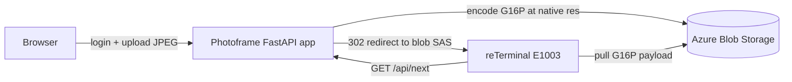

> **Sample reference implementation, not a hosted production service.** This
> small FastAPI app exists so you can stand up an end-to-end image source for an
> e-paper board (notably the Seeed reTerminal E1003) on your own infrastructure.
> It is deliberately minimal: single process, blob-authoritative storage, a
> couple of accounts in a JSON file. It is **not** operated as a shared hosted
> service, and the [production hardening](#what-you-would-change-for-production)
> below is intentionally left to you.

It does two jobs from one process:

- A **human web UI** (login, gallery, upload) for managing the images a device
  rotates through.
- Device APIs for legacy immediate selection (`/api/next`) and durable
  assignment transactions (`/api/assignment/*`).

Images are converted to the panel's calibrated **G16P** format at upload time
and served verbatim. The board never scales or re-tones; it draws what it is
handed.

## How it fits the firmware



The board's e-paper refresh path is documented in
[`../../docs/epaper-guide.md`](../../docs/epaper-guide.md). Legacy firmware uses
the [`/api/next` response](#device-api-apinext). Assignment-enabled firmware uses
the [assignment transaction API](#assignment-transaction-api). Both paths share
the [image-format requirements](#image-format-g16p-and-jpeg).

## Requirements

- Python 3.10+
- An Azure Blob Storage container per device, reachable through a **container
  SAS URL** with read/write/list/delete rights. The app stores one copy of each
  image and treats the blob container as the source of truth.
- Dependencies in [`requirements.txt`](requirements.txt) (FastAPI, Uvicorn,
  Pillow, Jinja2). Install into a virtualenv.

## Minimum configuration

Copy the example and edit it:

```bash
cp config.example.json config.local.json
python3 hash_password.py   # mint a password_hash to paste into a user account
```

`config.local.json` has two maps — `devices` and `users`:

```json
{
  "devices": {
    "E1003-1": {
      "container_sas_url": "https://YOURACCOUNT.blob.core.windows.net/e1003-1?sv=...&sig=...",
      "api_key": "replace-with-a-long-random-device-pull-key",
      "resolution": { "width": 1872, "height": 1404 },
      "image_transform": { "rotate_deg": 0, "mirror_x": false, "mirror_y": false }
    }
  },
  "users": {
    "owner@example.com": {
      "password_hash": "pbkdf2_sha256$200000$<salt_hex>$<hash_hex>",
      "devices": ["E1003-1"]
    }
  }
}
```

- **`container_sas_url`** — the per-device blob container. Keep these secret;
  each is scoped to a single device's container so one device can never read
  another's images.
- **`api_key`** — the per-device pull key the firmware sends on every
  `/api/next` request. Use a long random value.
- **`resolution`** — the panel's native pixel dimensions. Uploaded images are
  encoded to exactly this size; the matching `image_transform` rotation/mirror
  orients the source to the panel.
- **`output`** _(optional)_ — output profile. `{ "format": "g16z" }` (default)
  is the calibrated/dithered E1003 transport. `{ "format": "jpeg",
  "jpeg_quality": 90 }` is a resize + tone-only grayscale JPEG for panels whose
  firmware library does its own dithering (e.g. Inkplate).
- **`serve_mode`** _(optional)_ — how `/api/next` delivers the payload.
  `"redirect"` (default) 302s the device straight to the blob SAS URL (zero-copy,
  fastest; suits clients that follow HTTP redirects, like the E1003 firmware).
  `"inline"` streams the bytes through the app, for clients that **cannot** follow
  redirects — e.g. the InkplateLibrary image loader, which defaults to no-follow.
- **`temp_min_spacing`** _(optional, default `4`)_ — cadence knob for **featured**
  photos (temporary/expiring photos plus newly uploaded "fresh" ones). A featured
  photo is shown at most once every this many displays, so its share of screen
  time is the same whether the gallery has 20 photos or 1000. `4` means a single
  featured photo takes ~1 in every 4 displays. Minimum `2` (one permanent always
  separates featured photos). Owners can override it per device from the device
  **Config** page (reached via the Config button on the devices page), saved to
  `state/settings.json` with no redeploy. See
  [How the next image is chosen](#how-the-next-image-is-chosen).
- **`fresh_window_days`** _(optional, default `7`)_ — how long a newly uploaded
  permanent photo is **featured** after upload. For this many days the photo joins
  the featured bucket and is shown often (instead of being lost at 1/pool odds),
  then graduates into normal permanent rotation automatically once `uploaded_at`
  ages past the window — no extra state, no graduation event. `0` disables the
  fresh boost. Per-device override on the **Config** page.
- **`max_temp_share_pct`** _(optional, default `50`)_ — caps the **combined** share
  of the featured bucket (temporary + fresh), so a bulk upload of fresh photos
  cannot take over the screen. `50` means at least every other display is a
  permanent photo; `25` caps featured at a quarter of displays. Mapped to a
  spacing floor of `ceil(100 / pct)` and only binds during large bursts. Per-device
  override on the **Config** page.
- **`users`** — web-UI accounts. `password_hash` is a `pbkdf2_sha256` string
  produced by `hash_password.py`. Each user lists the device IDs it may manage.

## Running locally

```bash
python3 -m venv .venv && source .venv/bin/activate
pip install -r requirements.txt
./run_local.sh           # auto-loads ./config.local.json, serves on 127.0.0.1:8080
```

`run_local.sh` persists a dev `SECRET_KEY` to `./.secret_key` so login sessions
survive restarts. Override `CONFIG_JSON` or `SECRET_KEY` by exporting them before
running. The supplied local and Azure startup commands disable Uvicorn access
logs because device API keys are query parameters. Keep request-target logging
disabled in other deployments, or configure the reverse proxy to redact the
`key` parameter.

## Device API: `/api/next`

```text
GET /api/next?device_id=<id>&key=<api_key>&proxy=0
```

| Response | Meaning |
|---|---|
| `302 Found` (default) | Redirect (`Location:`) to the blob's own SAS URL. The device pulls the ~1.3&nbsp;MB G16P payload **straight from blob storage**, not through this app. Sent when the device's `serve_mode` is `redirect` (the default) and `proxy=0`. |
| `200 OK` (inline) | Inline body: the raw image bytes, with `X-Image-Format` (`g16p` or `jpeg`) and the matching `Content-Type`. Sent when the device's `serve_mode` is `inline`, or when `proxy=1` is passed. Use for clients that cannot follow redirects (e.g. Inkplate). |
| `204 No Content` | No image is queued for this device, and the gallery is empty. The firmware keeps the current panel contents and sleeps. |
| `401 Unauthorized` | Unknown `device_id` or `key` mismatch. |

The default 302 path keeps the single-process app off the bulk transfer path.
The firmware resolves the redirect to a content-stable image id (used by the
on-device [SD blob cache](../../docs/epaper-guide.md#sd-image-cache)) **before**
downloading the body, so a cache hit skips the blob pull entirely.

A separate `<image-url>.crc32` change-detection sidecar is part of the firmware
contract; see the e-paper guide. The device skips a panel refresh when the CRC
is unchanged.

## Assignment transaction API

Assignment-enabled frames use a durable plan, display, acknowledge, and commit
cycle. Planning does not advance display history or the featured-slot countdown.
The matching acknowledgement applies those effects once and creates the next
revision. Assignment state is isolated by device and persisted under
`state/assignment/<sha256-device-id>.json`; the document also stores and verifies
the original device ID.

```text
GET  /api/assignment/current?device_id=<id>&key=<api_key>
POST /api/assignment/ack?device_id=<id>&key=<api_key>
POST /api/assignment/sync?device_id=<id>&key=<api_key>
GET  /api/assignment/image?device_id=<id>&key=<api_key>&revision=<revision>
```

`current` returns the existing pending revision or plans one when none exists.
Send its `ETag` in `If-None-Match` to receive `304 Not Modified` when the pending
assignment is unchanged. `ack` accepts `revision` and `image_key`; `sync` accepts
`last_displayed_revision` and `image_key`. Both commit a valid displayed revision
at most once and return its successor. `image` verifies that the revision belongs
to the device before redirecting or streaming according to `serve_mode`.

Image responses include `X-Image-Key`, `X-Content-CRC32`, and
`X-Image-Format`. The CRC covers the exact canonical blob bytes. A wire CRC of
zero means unknown and clients must download rather than accept unchanged.

Legacy `/api/next` remains available. It invalidates any uncommitted assignment
inside the same per-device transaction before selecting and marking an image as
served, preventing a stale acknowledgement after fallback.

### Backfill legacy transport CRCs

Uploads stamp transport CRC metadata immediately. Backfill older blobs with the
standalone resumable tool:

```bash
source .venv/bin/activate
python3 backfill_crc.py --dry-run
python3 backfill_crc.py
python3 backfill_crc.py --device-id E1003-1
```

The metadata key's presence is the completion marker. A genuine computed CRC of
zero is stamped once and skipped on later sweeps. Assignment mode does not wait
for the sweep to finish; legacy images without the key are exposed as CRC zero.

## How the next image is chosen

Each `/api/next` poll returns exactly one image. Selection is **blob-authoritative**:
every photo's lifecycle state (`permanent`, `expires_at`, `last_shown_at`,
`served_at`, `uploaded_at`, `format`) is stamped as metadata on the image blob
itself, so a single List Blobs call decides the next image — and resolves its
format — regardless of gallery size, with no per-image `.json` read on the hot
path. The only soft-state is the disposable `state/queue.json` (explicit "show
next" order) and `state/schedule.json` (the featured-slot countdown) — losing
either just restarts cadence, never loses a photo.

Selection runs in two tiers:

1. **Queue (explicit).** A freshly uploaded or "Show next" photo jumps to the
   front of the queue and is served once, next.
2. **Two-bucket rotation.** Everything else splits into two buckets by lifecycle:

   | Bucket | Photos | Behaviour |
   |---|---|---|
   | **Permanent** | `permanent`, no expiry, uploaded longer ago than the fresh window | The everyday pool; least-recently-shown rotates evenly. |
   | **Featured** | photos with an `expires_at` **or** permanent photos uploaded within `fresh_window_days` | Short-lived or brand-new photos to spotlight; least-recently-shown rotates within the bucket. |

   The two buckets interleave round-robin, but featured slots are **spaced** so
   any single featured photo appears at most once every `temp_min_spacing` (`n`)
   displays. The featured slot fires every `max(floor, ceil(n / k))` displays for
   `k` featured photos, which they share fairly (least-recently-shown within the
   bucket). The `floor` comes from `max_temp_share_pct` (`ceil(100 / pct)`) and
   caps the whole featured bucket — `50%` → floor `2`, `25%` → floor `4` — so a
   burst of fresh photos can never crowd out the permanent pool.

**Fresh photos** are a *derived* membership in the featured bucket, not a third
bucket: `is_fresh()` is simply "permanent, no expiry, and `uploaded_at` is within
`fresh_window_days`". A newly uploaded photo is therefore spotlighted immediately
and, once it ages past the window, drops back into permanent rotation on its own —
no new persisted field and no graduation event. Because it accumulates
`last_shown_at` while featured, it lands at the back of the permanent LRU on
graduation (no second burst). Set `fresh_window_days = 0` to disable the boost.

The key property: a featured photo's share of screen time depends on `n` and the
cap, **not on the size of the permanent pool**. With `n = 4`, one featured photo
holds ~25% of displays whether there are 20 permanent photos or 1000 — a guarantee
a simple "boost weight" cannot make (its share dilutes as `boost / pool`). The
`max_temp_share_pct` floor bounds the bucket even when many featured photos exist
at once (`50%` at the default).

The knobs default from the device's `temp_min_spacing`, `fresh_window_days`, and
`max_temp_share_pct` config and can be retuned per device from the device
**Config** page; the overrides are stored as disposable soft-state in
`state/settings.json` and fall back to the config defaults if absent. The devices
page shows each device's effective knobs (flagged when an override is in effect),
and the gallery badges each temporary photo with its remaining lifetime and each
**fresh** photo with the time left in its window, so owners can see what is in the
featured bucket.

Each gallery card also shows a best-effort **exposure hint** badge (e.g. "~6×/day",
"~once every 8 weeks") so an owner can see how often a photo is expected to
appear given the whole gallery and the device's settings. The *share* is
closed-form (`store.expected_share`, the same arithmetic the scheduler implies);
turning it into a per-hour/day/week rate uses a **displays-per-day estimate
inferred from recent `last_shown_at` history** (`store.estimate_displays_per_day`
takes the median gap between recent serves), since the server never sees the
device's poll cadence directly. The hint is approximate and self-calibrates as
the device serves more images. Per-photo tone adjustments stay off the card face
(too technical): the full values live in a hover tooltip behind a single
**Adjusted** badge that appears only when a photo was tweaked from the defaults.

```text
n=4, 1 featured photo:    T P P P  T P P P  T P P P   (featured = 25%)
n=3, 2 featured photos:   T1 P  T2 P  T1 P  T2 P      (each = 25%, bucket = 50%)
```

Two offline tools model this exact logic (the same pure `bucket_schedule_pick`
the server uses, no Azure needed):

```bash
python3 simulate_selection.py --perm 20 --temp 1 --n 4               # watch the interleave + shares
python3 simulate_selection.py --perm 20 --temp 4 --n 4 --max-share 25 # cap the featured bucket at 25%
python3 simulate_selection.py --fresh --perm 1000 --fresh-count 1     # fresh photo featured 7d, then graduates
python3 simulate_selection.py --fresh --perm 1000 --fresh-count 50 --max-share 25  # bulk upload, capped
python3 sweep_selection.py --temp 1 --n 4                            # prove featured share is pool-independent
python3 tests/test_selection.py                                     # unit tests for the pure core
python3 tests/test_assignment.py                                    # assignment transaction invariants
python3 tests/test_assignment_api.py                                # assignment HTTP contract
python3 tests/test_security.py                                      # login throttle, SECRET_KEY fail-fast, headers
```

The `--fresh` mode advances wall-clock so newly uploaded photos enter the featured
bucket via `store.is_fresh` and then age out on their own. It prints a per-day
share curve: a single new photo in a 1000-photo pool holds ~25% of displays for
the 7-day window (vs ~0.1% without the boost), then drops to 0 as it graduates;
with `--fresh-count 50 --max-share 25` the whole bucket stays capped at 25% so a
bulk upload cannot crowd out the permanent pool.

## Measuring `/api/next` latency

Every board polls `/api/next` on a cadence, so its latency multiplies across the
fleet. The endpoint is instrumented two ways so you can see exactly where the
time goes:

- **`Server-Timing` response header** (always on, negligible cost). Each response
  carries a per-phase breakdown — `config`, `fetch` (the four independent
  selection reads run in parallel: settings, image list, queue, schedule),
  `select`, `served`, `deliver`, plus `blob` (summed Azure Blob round-trips with
  their count in `desc="n=.."`) and `total`. Because the reads overlap, `total`
  is typically *less* than the summed `blob` time. Inspect it directly:

  ```bash
  curl -sD - -o /dev/null \
    "$BASE/api/next?device_id=E1003-1&key=$KEY" | grep -i server-timing
  ```

- **`NEXT_PROFILE=1`** env flag — additionally logs the same breakdown for each
  request (handy for `./run_local.sh` profiling). Off by default.

The [`bench_next.py`](bench_next.py) harness drives the endpoint repeatedly and
reports percentiles for both the client-side wall clock (connect / TTFB / total)
and the server's `Server-Timing` phases. Credentials are read from
`config.local.json`, never the command line, and the key is masked in output:

```bash
# Local app (./run_local.sh), decision-only (does not follow the 302 redirect,
# so it times just the selection logic + serve-time writes):
python3 bench_next.py --config config.local.json \
    --base-url http://127.0.0.1:8080 --n 20

# Deployed Azure app, full delivery path (proxy=1 streams the image inline):
python3 bench_next.py --config config.local.json \
    --base-url https://<app>.azurewebsites.net --mode full --n 20

# Keep-alive vs fresh-per-request, to isolate connection-handshake cost:
python3 bench_next.py --config config.local.json \
    --base-url http://127.0.0.1:8080 --reuse
```

A normal poll makes ~6 Azure Blob REST round-trips, but the handler keeps them
cheap two ways. [`blobstore.py`](blobstore.py) reuses a **keep-alive connection
per host** (a burst of calls pays the TCP+TLS handshake once, not per call), and
the handler **fans the four independent selection reads out in parallel** so
their long-haul latency overlaps instead of serializing. Selection reuses the
metadata the list call already returned (no per-image `read_meta` GET), and
`served_at`/`format` are stamped on the blob so the serve path needs no extra
reads. Running the bench both locally (dev machine → Azure Blob, long-haul
handshakes) and on Azure (app co-located with Blob) separates algorithmic cost
(round-trip *count*) from network distance.

## Image format: G16P (and JPEG)

The board draws at the panel's **native resolution with no on-device scaling**,
so every image this server emits is already sized to the configured
`resolution`. Two transport formats are relevant:

- **G16P (the uncompressed framebuffer).** At upload time `gray16.encode_g16p()`
  tone-maps the source through the panel's measured response curve, applies
  Floyd–Steinberg dithering to 16 grey levels, and packs the result into the
  G16P container: an 18-byte header (`G16P` magic, version, width, height,
  payload length, CRC32) followed by the 4&nbsp;bpp packed-nibble framebuffer.
  The firmware copies these nibbles straight into the panel buffer — no JPEG
  decode, no large working buffer. This is the fast, low-power path.
- **Baseline JPEG (firmware fallback).** The firmware can still decode a
  baseline (non-progressive) JPEG at native resolution and dither it on-device.
  This server does not emit JPEG, but a custom image source may. Progressive
  JPEGs are rejected by the firmware.

### G16Z — the compressed transport wrapper

When compression shrinks the payload, this server wraps the G16P bytes in a
raw-DEFLATE `G16Z` container (`gray16.wrap_g16z()`): the 4-byte `G16Z` magic
followed by a header-less DEFLATE stream of the complete G16P bytes. The device
pulls ~0.3–0.5× the bytes off WiFi and inflates straight into a fixed-size G16P
buffer with the ROM's malloc-free tinfl, then renders the reconstructed G16P. If
compression does not actually shrink a frame, the server stores raw G16P
instead, so the wire never grows. The firmware also still accepts raw G16P, so
uncompressed blobs keep rendering. On firmware builds with the SD image cache,
the device writes back the original **compressed** G16Z blob, so a later cache
hit skips the re-download and reads only ~0.4 MB off the card (vs ~1.3 MB for a
full G16P) before re-inflating in PSRAM.

The panel response curve (`PANEL_RESPONSE_*` in `gray16.py`) is produced once
per panel during bring-up by the
[`../panel-calibration`](../panel-calibration/README.md) toolkit.

## What you would change for production

This sample is sufficient for one owner and a handful of devices. Before relying
on it more broadly, consider:

- **Authentication & secrets** — accounts live in a JSON file and device keys
  are plaintext config. Move to a real identity provider / secrets manager,
  rotate device keys, and serve only over HTTPS (set `secure` session cookies
  behind your TLS terminator).
- **Persistence & concurrency** — the app is single-process and treats one blob
  container per device as the source of truth. A multi-instance deployment needs
  a shared, locked metadata store (the in-blob queue is not designed for
  concurrent writers) and a managed identity for blob access instead of
  long-lived SAS URLs.
- **Delivery / CDN** — `/api/next` already redirects devices to blob storage to
  stay off the bulk path; for fleets, front the blobs with a CDN and shorten SAS
  lifetimes, or issue per-request SAS tokens.
- **Observability & limits** — add request logging, rate limiting on
  `/api/next`, upload size/type validation beyond the current checks, and
  health/metrics endpoints suitable for your platform (`/healthz` is provided as
  a starting point).
