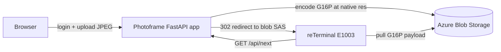

# Photoframe site — sample image server

> **Sample reference implementation, not a hosted production service.** This
> small FastAPI app exists so you can stand up an end-to-end image source for an
> e-paper board (notably the Seeed reTerminal E1003) on your own infrastructure.
> It is deliberately minimal: single process, blob-authoritative storage, a
> couple of accounts in a JSON file. It is **not** operated as a shared hosted
> service, and the [production hardening](#what-you-would-change-for-production)
> below is intentionally left to you.

It does two jobs from one process:

- A **human web UI** (login, gallery, upload) for managing the images a device
  rotates through.
- A **device API** (`/api/next`) that hands the board the next image to draw.

Images are converted to the panel's calibrated **G16P** format at upload time
and served verbatim. The board never scales or re-tones; it draws what it is
handed.

## How it fits the firmware



The board's e-paper refresh path is documented in
[`../../docs/epaper-guide.md`](../../docs/epaper-guide.md). The only contract the
firmware depends on is the [`/api/next` response](#device-api-apinext) and the
[image-format requirements](#image-format-g16p-and-jpeg).

## Requirements

- Python 3.10+
- An Azure Blob Storage container per device, reachable through a **container
  SAS URL** with read/write/list/delete rights. The app stores one copy of each
  image and treats the blob container as the source of truth.
- Dependencies in [`requirements.txt`](requirements.txt) (FastAPI, Uvicorn,
  Pillow, Jinja2). Install into a virtualenv.

## Minimum configuration

Copy the example and edit it:

```bash
cp config.example.json config.local.json
python3 hash_password.py   # mint a password_hash to paste into a user account
```

`config.local.json` has two maps — `devices` and `users`:

```json
{
  "devices": {
    "E1003-1": {
      "container_sas_url": "https://YOURACCOUNT.blob.core.windows.net/e1003-1?sv=...&sig=...",
      "api_key": "replace-with-a-long-random-device-pull-key",
      "resolution": { "width": 1872, "height": 1404 },
      "image_transform": { "rotate_deg": 0, "mirror_x": false, "mirror_y": false }
    }
  },
  "users": {
    "owner@example.com": {
      "password_hash": "pbkdf2_sha256$200000$<salt_hex>$<hash_hex>",
      "devices": ["E1003-1"]
    }
  }
}
```

- **`container_sas_url`** — the per-device blob container. Keep these secret;
  each is scoped to a single device's container so one device can never read
  another's images.
- **`api_key`** — the per-device pull key the firmware sends on every
  `/api/next` request. Use a long random value.
- **`resolution`** — the panel's native pixel dimensions. Uploaded images are
  encoded to exactly this size; the matching `image_transform` rotation/mirror
  orients the source to the panel.
- **`users`** — web-UI accounts. `password_hash` is a `pbkdf2_sha256` string
  produced by `hash_password.py`. Each user lists the device IDs it may manage.

## Running locally

```bash
python3 -m venv .venv && source .venv/bin/activate
pip install -r requirements.txt
./run_local.sh           # auto-loads ./config.local.json, serves on 127.0.0.1:8080
```

`run_local.sh` persists a dev `SECRET_KEY` to `./.secret_key` so login sessions
survive restarts. Override `CONFIG_JSON` or `SECRET_KEY` by exporting them before
running.

## Device API: `/api/next`

```text
GET /api/next?device_id=<id>&key=<api_key>&proxy=0
```

| Response | Meaning |
|---|---|
| `302 Found` (default) | Redirect (`Location:`) to the blob's own SAS URL. The device pulls the ~1.3&nbsp;MB G16P payload **straight from blob storage**, not through this app. |
| `200 OK` with `proxy=1` | Inline body: the raw G16P bytes, `Content-Type: application/octet-stream`, header `X-Image-Format: g16p`. Legacy/debug path for clients that cannot follow redirects. |
| `204 No Content` | No image is queued for this device. The firmware keeps the current panel contents and sleeps. |
| `401 Unauthorized` | Unknown `device_id` or `key` mismatch. |

The default 302 path keeps the single-process app off the bulk transfer path.
The firmware resolves the redirect to a content-stable image id (used by the
on-device [SD blob cache](../../docs/epaper-guide.md#sd-image-cache)) **before**
downloading the body, so a cache hit skips the blob pull entirely.

A separate `<image-url>.crc32` change-detection sidecar is part of the firmware
contract; see the e-paper guide. The device skips a panel refresh when the CRC
is unchanged.

## Image format: G16P (and JPEG)

The board draws at the panel's **native resolution with no on-device scaling**,
so every image this server emits is already sized to the configured
`resolution`. Two transport formats are relevant:

- **G16P (the uncompressed framebuffer).** At upload time `gray16.encode_g16p()`
  tone-maps the source through the panel's measured response curve, applies
  Floyd–Steinberg dithering to 16 grey levels, and packs the result into the
  G16P container: an 18-byte header (`G16P` magic, version, width, height,
  payload length, CRC32) followed by the 4&nbsp;bpp packed-nibble framebuffer.
  The firmware copies these nibbles straight into the panel buffer — no JPEG
  decode, no large working buffer. This is the fast, low-power path.
- **Baseline JPEG (firmware fallback).** The firmware can still decode a
  baseline (non-progressive) JPEG at native resolution and dither it on-device.
  This server does not emit JPEG, but a custom image source may. Progressive
  JPEGs are rejected by the firmware.

### G16Z — the compressed transport wrapper

When compression shrinks the payload, this server wraps the G16P bytes in a
raw-DEFLATE `G16Z` container (`gray16.wrap_g16z()`): the 4-byte `G16Z` magic
followed by a header-less DEFLATE stream of the complete G16P bytes. The device
pulls ~0.3–0.5× the bytes off WiFi and inflates straight into a fixed-size G16P
buffer with the ROM's malloc-free tinfl, then renders the reconstructed G16P. If
compression does not actually shrink a frame, the server stores raw G16P
instead, so the wire never grows. The firmware also still accepts raw G16P, so
uncompressed blobs keep rendering. On firmware builds with the SD image cache,
the device writes back the original **compressed** G16Z blob, so a later cache
hit skips the re-download and reads only ~0.4 MB off the card (vs ~1.3 MB for a
full G16P) before re-inflating in PSRAM.

The panel response curve (`PANEL_RESPONSE_*` in `gray16.py`) is produced once
per panel during bring-up by the
[`../panel-calibration`](../panel-calibration/README.md) toolkit.

## What you would change for production

This sample is sufficient for one owner and a handful of devices. Before relying
on it more broadly, consider:

- **Authentication & secrets** — accounts live in a JSON file and device keys
  are plaintext config. Move to a real identity provider / secrets manager,
  rotate device keys, and serve only over HTTPS (set `secure` session cookies
  behind your TLS terminator).
- **Persistence & concurrency** — the app is single-process and treats one blob
  container per device as the source of truth. A multi-instance deployment needs
  a shared, locked metadata store (the in-blob queue is not designed for
  concurrent writers) and a managed identity for blob access instead of
  long-lived SAS URLs.
- **Delivery / CDN** — `/api/next` already redirects devices to blob storage to
  stay off the bulk path; for fleets, front the blobs with a CDN and shorten SAS
  lifetimes, or issue per-request SAS tokens.
- **Observability & limits** — add request logging, rate limiting on
  `/api/next`, upload size/type validation beyond the current checks, and
  health/metrics endpoints suitable for your platform (`/healthz` is provided as
  a starting point).
