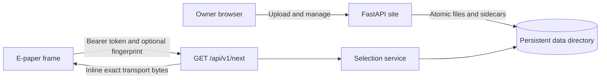

## Overview

The site stores source photos, pre-encodes frame-specific transport variants,
and serves the selected bytes inline through `GET /api/v1/next`. It has one
local filesystem backend and no external storage dependency.

The frame API implements the locked
[Photoframe Next Image Version 1 contract](../../docs/dev/photoframe-next-image/contract.md).
There is no unversioned endpoint and no redirect delivery mode.



## Data layout

The entire persistent state lives below `PHOTOFRAME_DATA_DIR`, which defaults
to `data/`:

```text
data/
  config/frames.json
  config/session-secret
  config/setup.lock
  config/users.json
  devices/<device-id>/images/<image-key>/source.<ext>
  devices/<device-id>/images/<image-key>/transport-<width>x<height>-<code>-<profile-key>.<ext>
  devices/<device-id>/images/<image-key>/thumb.png
  devices/<device-id>/images/<image-key>/sidecar.json
  devices/<device-id>/state/queue.json
  devices/<device-id>/state/schedule.json
  devices/<device-id>/state/settings.json
  devices/<device-id>/state/telemetry.json
```

Photo sidecars are durable truth. Each device owns an isolated gallery, and the
application rebuilds its per-device in-memory index from sidecars at startup.
Queue, cadence, settings, and last-seen telemetry are small atomic JSON files
inside the owning device namespace. Restoring the complete `data/` directory
restores the site without a database.

## First boot

Start the service, then open it in a browser. An empty data directory redirects
to `/setup`, where you create the administrator account and first frame. The
service generates the frame bearer token and shows it once after setup.

The first startup creates configuration files and a 256-bit session secret
under `data/config/`. Later startups load those files without changing them.
The `/setup` route returns `404 Not Found` after an administrator and frame
exist.

> [!IMPORTANT]
> Complete setup immediately on a trusted network. Before setup finishes, the
> first browser that submits the form claims the instance.

## Manage devices

Use **Add device** on the device list to create another device. The form starts
with the E1003 profile (`1872` x `1404`, format preference `3,2`) and also accepts
other geometry and format combinations. A device ID is minted from its display
name and remains unchanged when you rename the device or edit its profile.

Each opaque token identifies one device and binds its exact geometry and ordered
format preference. Device settings provide password-gated controls to reveal or
rotate the token. Rotation invalidates the old token immediately without
changing the gallery or last-seen history.

Changing a profile rebuilds that device's pre-encoded variants from its stored
source images before replacing the active namespace. Removing a device requires
the current administrator password and typed confirmation. Removal immediately
deletes its configuration, bearer token, gallery, queue, settings, and telemetry,
with no retention or undo.

The underlying record remains in `data/config/frames.json`:

```json
{
  "frames": {
    "e1003-living-room": {
      "token": "replace-with-at-least-32-random-hex-characters",
      "profile": {
        "width": 1872,
        "height": 1404,
        "format_codes": [3, 2]
      }
    }
  }
}
```

Format codes are `1` for baseline JPEG, `2` for G16P, and `3` for G16Z. Uploads
generate only the variants required by the selected device and store them in
that device's namespace.

An authenticated owner can recover a frame token from that frame's **Settings**
page by entering their current password. The page shows only a SHA-256
fingerprint until re-authentication succeeds. Revealed-token responses use
`Cache-Control: no-store` and return to the masked view on reload.

> [!WARNING]
> On a plain-HTTP LAN, the administrator password and any revealed token cross
> the wire in cleartext. Enable TLS before using the token-reveal feature.

## Manage photos

Use **Upload image** in a device gallery to preview, frame, and adjust one image.
Use **Bulk upload** to select several images and apply one shared lifetime. Bulk
uploads use the device's default image-processing settings and process one image
at a time, which bounds memory use and reports failures per image. Successful
images remain saved when another image fails, and failed images can be retried.

## Export and import

The device settings page can export a self-contained device bundle after you
enter your current password. The bundle contains its profile, bearer token,
source images, pre-encoded transports, thumbnails, settings, queue, and
telemetry. On **Add device**, **Import existing device** adds or replaces the
device with the bundle's immutable ID and installs transport bytes as-is. It
does not re-encode images or change other devices or administrator credentials.
Adding a missing device requires `IMPORT`; replacing an existing device
requires its exact immutable device ID.

The **Site export & import** page is available only when the site has exactly one
user. Site export requires the current password and downloads the complete
`data/` tree. Site import requires exactly one administrator account and exactly
one owner for every device, then fully replaces all devices, administrator
credentials, and the session secret. Restart the service after a successful
site import; the imported administrator password applies after restart. The
service rejects other requests until it restarts.

Both bundle types include a versioned manifest, exact file checksums, and image
transport CRCs. Imports reject missing, corrupt, mismatched, or path-unsafe
entries before changing live data.

> [!WARNING]
> Exports are unencrypted. Device bundles contain bearer tokens. Site bundles
> also contain the administrator password hash and session secret. Store them
> securely. On plain HTTP, a network observer can capture a downloaded archive.

## Configure additional users

The setup page also creates `data/config/users.json`. Human sessions and frame
credentials are separate. To add another user, generate a password hash:

```bash
cd tools/photoframe-site
./hash_password.py
```

Place the result in `password_hash` and list the frame IDs that the user can
manage. Keep `frames.json`, `users.json`, and `session-secret` out of source
control.

## Run locally

Python 3.11 or newer is required.

```bash
cd tools/photoframe-site
./run_local.sh
```

The launcher creates `.venv`, installs dependencies on first use, and listens
on <http://127.0.0.1:8080>. Open that address to complete first-boot setup.

For a local container:

```bash
cd tools/photoframe-site
docker build --platform linux/amd64 -t epaper-photoframe-site:local .
docker run --rm -p 8080:8080 \
  -v "$PWD/data:/app/data" \
  epaper-photoframe-site:local
```

The container bind-mounts `./data` at `/app/data`. Configuration, photos, and
the session secret persist there.

## Publish a development image

The public GHCR package is the transfer path between the devbox and Proxmox.
GitHub Actions is not involved in development publishes.

Authenticate once using a GitHub personal access token with `write:packages`:

```bash
docker login ghcr.io -u jantielens
```

Enter the token at Docker's password prompt. Then build and publish the `dev`
tag:

```bash
cd tools/photoframe-site
./publish-dev.sh
```

If the VS Code process still has stale Docker group membership, run:

```bash
sg docker -c './publish-dev.sh'
```

After the first push, open the package on GitHub, select **Package settings**,
then change its visibility to **Public**. The LXC can then pull it without a
GitHub login.

## Deploy to a fresh Proxmox LXC

Create an unprivileged Debian LXC in Proxmox with 2 CPU cores, 1 GB memory, and
8 GB storage. Enable the `Nesting` and `Keyctl` features, then start it and open
its console.

Install Docker, prepare persistent storage, and start the site:

```bash
apt-get update
apt-get install -y docker.io
mkdir -p /opt/epaper-photoframe/data
docker pull ghcr.io/jantielens/epaper-photoframe-site:dev
docker run -d \
  --name epaper-photoframe \
  --restart unless-stopped \
  -p 8080:8080 \
  -v /opt/epaper-photoframe/data:/app/data \
  ghcr.io/jantielens/epaper-photoframe-site:dev
```

Browse to `http://<LXC-IP>:8080` and complete setup. You can also verify the
process from the LXC console:

```bash
curl http://127.0.0.1:8080/healthz
docker logs epaper-photoframe
```

For each later development update, run `./publish-dev.sh` on the devbox. Then
run these commands in the LXC console:

```bash
docker pull ghcr.io/jantielens/epaper-photoframe-site:dev
docker rm -f epaper-photoframe
docker run -d \
  --name epaper-photoframe \
  --restart unless-stopped \
  -p 8080:8080 \
  -v /opt/epaper-photoframe/data:/app/data \
  ghcr.io/jantielens/epaper-photoframe-site:dev
```

Container replacement does not modify the bind-mounted data directory, so the
administrator account, frame token, session secret, settings, and photos remain
available. The setup page does not run again.

## Optional public access with Tailscale Funnel

Tailscale Funnel can publish the site at a stable HTTPS `*.ts.net` address
without port forwarding or a custom domain. Run Tailscale directly in the LXC,
outside the Docker container, so the application image remains independent of
the deployment network.

First check whether the LXC already exposes the kernel TUN device:

```bash
ls -l /dev/net/tun
```

If the device is missing, stop the LXC and add these lines to
`/etc/pve/lxc/<CTID>.conf` on the Proxmox host:

```ini
lxc.cgroup2.devices.allow: c 10:200 rwm
lxc.mount.entry: /dev/net/tun dev/net/tun none bind,create=file
```

Start the LXC again, then install and authenticate Tailscale inside it:

```bash
apt-get update
apt-get install -y curl ca-certificates
curl -fsSL https://tailscale.com/install.sh | sh
systemctl enable --now tailscaled
tailscale up
```

Complete site setup on the trusted LAN before publishing it. Then recreate the
container with its HTTP port bound only to the LXC loopback interface and mark
browser session cookies as HTTPS-only:

```bash
docker rm -f epaper-photoframe
docker run -d \
  --name epaper-photoframe \
  --restart unless-stopped \
  -p 127.0.0.1:8080:8080 \
  -e COOKIE_SECURE=1 \
  -v /opt/epaper-photoframe/data:/app/data \
  ghcr.io/jantielens/epaper-photoframe-site:dev
curl http://127.0.0.1:8080/healthz
```

Publish the loopback service and display its public URL:

```bash
tailscale funnel --bg 8080
tailscale funnel status
```

The Funnel configuration persists in Tailscale state. Docker restarts the
container because it uses `unless-stopped`, and `systemd` starts both Docker
and Tailscale when the LXC boots. Enable **Start at boot** for the LXC in
Proxmox, or run `pct set <CTID> --onboot 1` on the Proxmox host. Verify the
complete boot configuration inside the LXC:

```bash
systemctl is-enabled docker tailscaled
docker inspect -f '{{.HostConfig.RestartPolicy.Name}}' epaper-photoframe
```

Expected output is `enabled` for both services and `unless-stopped` for the
container. Preserve `-p 127.0.0.1:8080:8080` and `-e COOKIE_SECURE=1` whenever
the container is replaced. Use `tailscale funnel reset` to remove public
access.

## Internet exposure safeguards

The application rejects ordinary form bodies larger than 1 MiB, image upload
bodies larger than 32 MiB, and archive import bodies larger than 130 MiB. A
request must finish delivering its complete body within 30 seconds. Decoded
images are limited to 40 million pixels, and crop geometry is bounded before
Pillow allocates a crop canvas.

Every browser POST requires a session-bound CSRF token. Login failures are
throttled independently by peer address, account, and a global budget. The
application ignores `X-Forwarded-For` by default because an internet client can
spoof that header unless a trusted proxy removes and replaces it.

Set `TRUSTED_PROXY_IPS` to a comma-separated list only when each listed proxy
sanitizes `X-Forwarded-For` before forwarding requests. Do not enable this for
an address merely because it is a Docker bridge or loopback peer. Tailscale
Funnel does not require this setting.

## Network trust

> [!WARNING]
> Plain HTTP is appropriate only on a trusted LAN. Anyone who can observe that
> traffic can steal and replay a frame bearer token. Use TLS when Wi-Fi clients,
> network infrastructure, or any routed segment are not fully trusted.

`COOKIE_SECURE=1` marks human session cookies as HTTPS-only. The service uses
the persistent session secret unless `SECRET_KEY` explicitly overrides it. This
setting does not encrypt frame API traffic; terminate TLS at the service or a
trusted reverse proxy.

Frame tokens are never accepted in query strings or written to application
logs. The setup completion page displays the generated token once. Frame API
responses never return it. Missing, unknown, and revoked tokens produce the
same `401 Unauthorized` response.

## Frame API

```http
GET /api/v1/next HTTP/1.1
Authorization: Bearer <frame-token>
Photoframe-Current-Image-Key: M7x4qQ2V0A
Photoframe-Current-Content-CRC32: 89abcdef
```

The advisory fingerprint headers must form a valid pair. A partial or malformed
pair is ignored after authentication. When another eligible pair exists, the
reported pair is excluded from that selection.

Responses are:

| Status | Meaning |
| ------ | ------- |
| `200` | Exact transport bytes are in the response body |
| `204` | Keep the current display unchanged |
| `401` | Bearer authentication failed |
| `404` | The requested major-version path is unsupported |
| `405` | The method is not `GET`; `Allow: GET` is present |

Every API response prevents shared-cache reuse with
`Cache-Control: private, no-cache` and `Vary: Authorization`. A `200` response
also carries `Photoframe-Image-Key` and the lowercase CRC-32 of the exact body
in `Photoframe-Content-CRC32`.

## Verify

Run all standalone site tests:

```bash
cd tools/photoframe-site
for test in tests/test_*.py; do .venv/bin/python "$test"; done
```

Verify the normative e1003 binary vectors:

```bash
VECTOR_DIR=../../docs/dev/photoframe-next-image/conformance/photoframe-next-image-v1
.venv/bin/python "$VECTOR_DIR/verify_vectors.py" e1003-landscape
```

Run the behavioral adapter:

```bash
SECRET_KEY=test .venv/bin/python conformance_adapter.py
```

The adapter executes every service-role assertion. It reports client and bridge
assertions as `SKIP` because this site does not implement those roles. Binary
vector success or service assertions alone do not claim full protocol
conformance.
