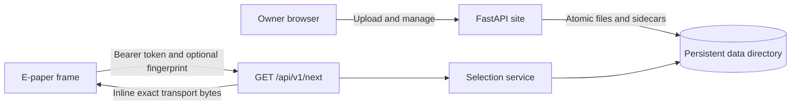

## Overview

The site stores source photos, pre-encodes frame-specific transport variants,
and serves the selected bytes inline through `GET /api/v1/next`. It has one
local filesystem backend and no external storage dependency.

The frame API implements the locked
[Photoframe Next Image Version 1 contract](../../docs/dev/photoframe-next-image/contract.md).
There is no unversioned endpoint and no redirect delivery mode.



## Data layout

The entire persistent state lives below `PHOTOFRAME_DATA_DIR`, which defaults
to `data/`:

```text
data/
  config/frames.json
  config/session-secret
  config/setup.lock
  config/users.json
  photos/<image-key>/source.<ext>
  photos/<image-key>/transport-<width>x<height>-<code>-<profile-key>.<ext>
  photos/<image-key>/thumb.png
  photos/<image-key>/sidecar.json
  state/queue.json
  state/schedule.json
  state/settings.json
```

Photo sidecars are durable truth. The application rebuilds its in-memory index
from them at startup. Queue, cadence, and UI settings are small atomic JSON
files. Container replacement does not alter this directory.

## First boot

Start the service, then open it in a browser. An empty data directory redirects
to `/setup`, where you create the administrator account and first frame. The
service generates the frame bearer token and shows it once after setup.

The first startup creates configuration files and a 256-bit session secret
under `data/config/`. Later startups load those files without changing them.
The `/setup` route returns `404 Not Found` after an administrator and frame
exist.

> [!IMPORTANT]
> Complete setup immediately on a trusted network. Before setup finishes, the
> first browser that submits the form claims the instance.

## Configure additional frames

The setup page creates `data/config/frames.json`. To add frames later, edit that
file. Each opaque token identifies one frame and binds its exact geometry and
ordered format preference:

```json
{
  "frames": {
    "e1003-living-room": {
      "token": "replace-with-at-least-32-random-hex-characters",
      "profile": {
        "width": 1872,
        "height": 1404,
        "format_codes": [3, 2]
      }
    }
  }
}
```

Generate additional tokens with a cryptographically secure source:

```bash
python3 -c 'import secrets; print(secrets.token_hex(32))'
```

Format codes are `1` for baseline JPEG, `2` for G16P, and `3` for G16Z. The
service selects the first available format in the configured list. Uploads
generate the union of all active frame capabilities, so one source can serve
frames with different geometry or format preferences.

Set `"revoked": true` to disable a token without deleting its frame profile.
Restart the process after changing either configuration file.

An authenticated owner can recover a frame token from that frame's **Config**
page by entering their current password. The page shows only a SHA-256
fingerprint until re-authentication succeeds. Revealed-token responses use
`Cache-Control: no-store` and return to the masked view on reload.

> [!WARNING]
> On a plain-HTTP LAN, the administrator password and any revealed token cross
> the wire in cleartext. Enable TLS before using the token-reveal feature.

## Configure additional users

The setup page also creates `data/config/users.json`. Human sessions and frame
credentials are separate. To add another user, generate a password hash:

```bash
cd tools/photoframe-site
./hash_password.py
```

Place the result in `password_hash` and list the frame IDs that the user can
manage. Keep `frames.json`, `users.json`, and `session-secret` out of source
control.

## Run locally

Python 3.11 or newer is required.

```bash
cd tools/photoframe-site
./run_local.sh
```

The launcher creates `.venv`, installs dependencies on first use, and listens
on <http://127.0.0.1:8080>. Open that address to complete first-boot setup.

For a local container:

```bash
cd tools/photoframe-site
docker build --platform linux/amd64 -t epaper-photoframe-site:local .
docker run --rm -p 8080:8080 \
  -v "$PWD/data:/app/data" \
  epaper-photoframe-site:local
```

The container bind-mounts `./data` at `/app/data`. Configuration, photos, and
the session secret persist there.

## Publish a development image

The public GHCR package is the transfer path between the devbox and Proxmox.
GitHub Actions is not involved in development publishes.

Authenticate once using a GitHub personal access token with `write:packages`:

```bash
docker login ghcr.io -u jantielens
```

Enter the token at Docker's password prompt. Then build and publish the `dev`
tag:

```bash
cd tools/photoframe-site
./publish-dev.sh
```

If the VS Code process still has stale Docker group membership, run:

```bash
sg docker -c './publish-dev.sh'
```

After the first push, open the package on GitHub, select **Package settings**,
then change its visibility to **Public**. The LXC can then pull it without a
GitHub login.

## Deploy to a fresh Proxmox LXC

Create an unprivileged Debian LXC in Proxmox with 2 CPU cores, 1 GB memory, and
8 GB storage. Enable the `Nesting` and `Keyctl` features, then start it and open
its console.

Install Docker, prepare persistent storage, and start the site:

```bash
apt-get update
apt-get install -y docker.io
mkdir -p /opt/epaper-photoframe/data
docker pull ghcr.io/jantielens/epaper-photoframe-site:dev
docker run -d \
  --name epaper-photoframe \
  --restart unless-stopped \
  -p 8080:8080 \
  -v /opt/epaper-photoframe/data:/app/data \
  ghcr.io/jantielens/epaper-photoframe-site:dev
```

Browse to `http://<LXC-IP>:8080` and complete setup. You can also verify the
process from the LXC console:

```bash
curl http://127.0.0.1:8080/healthz
docker logs epaper-photoframe
```

For each later development update, run `./publish-dev.sh` on the devbox. Then
run these commands in the LXC console:

```bash
docker pull ghcr.io/jantielens/epaper-photoframe-site:dev
docker rm -f epaper-photoframe
docker run -d \
  --name epaper-photoframe \
  --restart unless-stopped \
  -p 8080:8080 \
  -v /opt/epaper-photoframe/data:/app/data \
  ghcr.io/jantielens/epaper-photoframe-site:dev
```

Container replacement does not modify the bind-mounted data directory, so the
administrator account, frame token, session secret, settings, and photos remain
available. The setup page does not run again.

## Network trust

> [!WARNING]
> Plain HTTP is appropriate only on a trusted LAN. Anyone who can observe that
> traffic can steal and replay a frame bearer token. Use TLS when Wi-Fi clients,
> network infrastructure, or any routed segment are not fully trusted.

`COOKIE_SECURE=1` marks human session cookies as HTTPS-only. The service uses
the persistent session secret unless `SECRET_KEY` explicitly overrides it. This
setting does not encrypt frame API traffic; terminate TLS at the service or a
trusted reverse proxy.

Frame tokens are never accepted in query strings or written to application
logs. The setup completion page displays the generated token once. Frame API
responses never return it. Missing, unknown, and revoked tokens produce the
same `401 Unauthorized` response.

## Frame API

```http
GET /api/v1/next HTTP/1.1
Authorization: Bearer <frame-token>
Photoframe-Current-Image-Key: M7x4qQ2V0A
Photoframe-Current-Content-CRC32: 89abcdef
```

The advisory fingerprint headers must form a valid pair. A partial or malformed
pair is ignored after authentication. When another eligible pair exists, the
reported pair is excluded from that selection.

Responses are:

| Status | Meaning |
|--------|---------|
| `200` | Exact transport bytes are in the response body |
| `204` | Keep the current display unchanged |
| `401` | Bearer authentication failed |
| `404` | The requested major-version path is unsupported |
| `405` | The method is not `GET`; `Allow: GET` is present |

Every API response prevents shared-cache reuse with
`Cache-Control: private, no-cache` and `Vary: Authorization`. A `200` response
also carries `Photoframe-Image-Key` and the lowercase CRC-32 of the exact body
in `Photoframe-Content-CRC32`.

## Verify

Run all standalone site tests:

```bash
cd tools/photoframe-site
for test in tests/test_*.py; do .venv/bin/python "$test"; done
```

Verify the normative e1003 binary vectors:

```bash
.venv/bin/python \
  ../../docs/dev/photoframe-next-image/conformance/photoframe-next-image-v1/verify_vectors.py \
  e1003-landscape
```

Run the behavioral adapter:

```bash
SECRET_KEY=test .venv/bin/python conformance_adapter.py
```

The adapter executes every service-role assertion. It reports client and bridge
assertions as `SKIP` because this site does not implement those roles. Binary
vector success or service assertions alone do not claim full protocol
conformance.