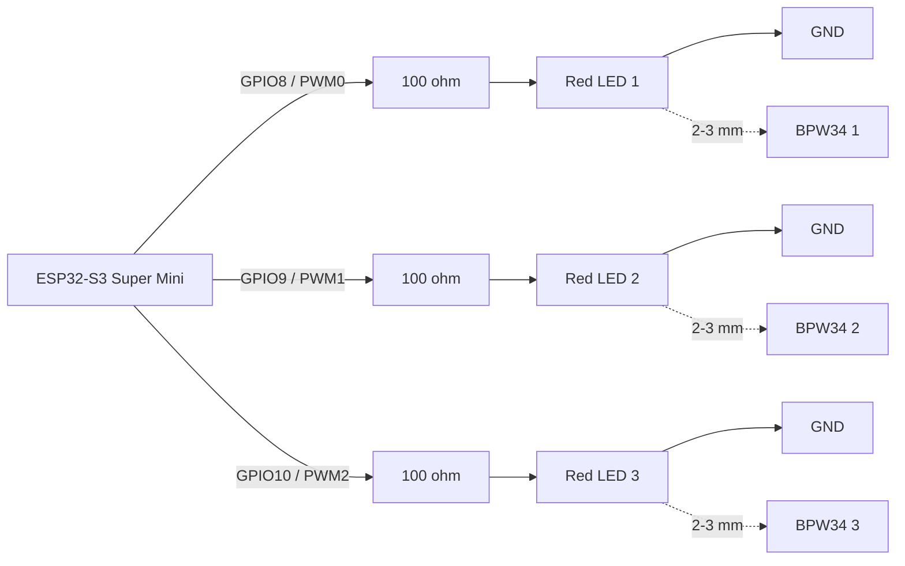

# LED Test Rig

Minimal ESP32-S3 Super Mini firmware that drives 3 red LEDs in shaped pulse
sweeps to validate the shutter tester capture pipeline with repeatable timing.

The sketch is fully self-contained: it does **not** use the root project build
system, has no shared dependencies with the macropad firmware, and ships with
its own `build.sh` / `upload.sh`.

## Hardware

| Component | Spec |
|---|---|
| Board | ESP32-S3 Super Mini |
| LEDs | 3 red 5 mm LEDs |
| Resistors | 3 100 ohm resistors, one per channel |
| Proximity | 2-3 mm LED-to-BPW34 sensor |

Per-channel wiring: `GPIOn -> 100 ohm -> LED anode -> LED cathode -> GND`.

| Channel | GPIO | PWM channel |
|---|---:|---:|
| LED1 / Sensor 1 | GPIO8 | 0 |
| LED2 / Sensor 2 | GPIO9 | 1 |
| LED3 / Sensor 3 | GPIO10 | 2 |



## Behavior

On boot the firmware:

1. Disables WiFi to reduce timer jitter.
2. Configures GPIO8/9/10 as LEDC PWM outputs and leaves all LEDs off.
3. Prints the active simulation mode, pin mapping, and PWM settings over USB CDC
   serial at 115200 baud.
4. Loops forever through an 11-speed sweep. Binary modes add a `1/2000` test
   at the end of the sweep.

| Speed | Requested exposure |
|---|---:|
| 1/1 | 1,000,000 us |
| 1/2 | 500,000 us |
| 1/4 | 250,000 us |
| 1/8 | 125,000 us |
| 1/15 | 66,667 us |
| 1/30 | 33,333 us |
| 1/60 | 16,667 us |
| 1/125 | 8,000 us |
| 1/250 | 4,000 us |
| 1/500 | 2,000 us |
| 1/1000 | 1,000 us |
| 1/2000 | 500 us, binary modes only |

Each speed is preceded by a `Simulating <speed>s ...` line. A 1-second pause
separates speeds, with an extra 1-second pause at the end of each full sweep
for a 2-second gap before the next cycle starts.

## Mode Selection

Select the active rig behavior at build time with `./build.sh <mode>`. The
script refuses to build without a mode and prints the available options.

Examples:

```bash
./build.sh binary          # LED_TEST_RIG_MODE_BINARY_SIMULTANEOUS
./build.sh binary-travel   # LED_TEST_RIG_MODE_BINARY_TRAVEL
./build.sh vertical        # LED_TEST_RIG_MODE_VERTICAL_SIM
./build.sh om1             # LED_TEST_RIG_MODE_OM1
./build.sh bad-camera      # LED_TEST_RIG_MODE_BAD_CAMERA
./build.sh m6              # LED_TEST_RIG_MODE_M6
```

| Mode | Behavior |
|---|---|
| `LED_TEST_RIG_MODE_BINARY_SIMULTANEOUS` | Previous all-sensors-at-once binary baseline. |
| `LED_TEST_RIG_MODE_BINARY_TRAVEL` | Previous-style binary travel baseline with 5 ms between sensors. |
| `LED_TEST_RIG_MODE_VERTICAL_SIM` | Generic vertical focal-plane simulation with shaped ramps and compact travel. |
| `LED_TEST_RIG_MODE_OM1` | Olympus OM-1-inspired vertical focal-plane mode with wider sensor separation. |
| `LED_TEST_RIG_MODE_BAD_CAMERA` | Deterministic known-bad vertical focal-plane mode with uneven travel and exposure skew. |
| `LED_TEST_RIG_MODE_M6` | Leica M6-inspired horizontal focal-plane mode with wider sensor separation. |

The default is `LED_TEST_RIG_MODE_VERTICAL_SIM`.

## Timing Model

The default profile is generic vertical focal-plane. In shaped modes, each LED
emits a trapezoid-shaped envelope with linear rise, plateau, and linear fall:

| Parameter | Value |
|---|---:|
| Rise time | 180 us |
| Fall time | 220 us |
| Sensor 1 -> Sensor 2 start offset | 300 us |
| Sensor 2 -> Sensor 3 start offset | 300 us |

OM-1 and M6 modes use the same scheduler with camera-inspired wider separation.
Binary modes set rise/fall to zero, so they provide hard-edged baseline pulses.
Bad-camera mode intentionally introduces repeatable per-sensor skew so the
shutter tester can validate uneven travel and duration reporting.

The requested shutter speed controls the per-sensor exposure duration. At slow
speeds the plateau dominates. At fast speeds the plateau shrinks; if a requested
duration cannot contain both ramps, the firmware proportionally collapses the
shape into a triangular pulse instead of switching back to binary edges.

Because the shutter tester measures threshold crossings rather than the physical
start and end of the LED envelope, shaped modes extend the generated envelope by
the expected threshold-crossing loss. The default compensation assumes a 50%
light threshold, so the measured duration stays close to the requested speed
while the optical stimulus still has realistic slopes. Binary modes do not need
threshold compensation.

The scheduler keeps the same timer-driven sweep shape as the earlier binary rig,
but LED brightness is now generated by LEDC PWM. The current build selects the
80 MHz APB LEDC clock and tries 300 kHz PWM at 8-bit duty resolution first,
falling back to lower 8-bit carrier settings only if attachment fails. This
keeps the carrier above the shutter tester ADC bandwidth target. Arduino's LEDC
fade helper is millisecond-based on the installed ESP32 core, so the rig uses an
`esp_timer` one-shot ramp engine to step `ledcWrite()` at scheduled ramp
instants. There are no busy waits, `delayMicroseconds()` ramp loops, or direct
GPIO pulse edges.

Pulse completion is signaled only after the final LED has reached duty 0 at the
end of its fall ramp.

## Validation

1. Build and upload the rig.
2. Open a serial monitor at 115200 baud and confirm the mode line reports
   the selected mode.
3. Confirm the sweep prints `Simulating 1/1s ...` through
   `Simulating 1/1000s ...` and repeats. Binary modes continue through
   `Simulating 1/2000s ...`.
4. On the shutter tester waveform view, inspect at least `1/125` and `1/1000`.
5. Confirm the ramps are visible, Sensor 1 leads Sensor 2, Sensor 2 leads Sensor
   3, and the reported measurements remain stable.

Add per-LED RC low-pass smoothing only if the captured waveform shows PWM
carrier ripple, stair-stepping, or threshold chatter that materially affects
measurement stability. The default build is resistor-only.

## Build

```bash
./build.sh vertical
```

Compiled artifacts land in `tools/led-test-rig/build/`.

Requires `arduino-cli` on `PATH` with the `esp32:esp32` core installed.

## Upload

```bash
./upload.sh                # default port: /dev/ttyACM0
./upload.sh /dev/ttyUSB0   # override port
```

## Monitor

```bash
arduino-cli monitor --port /dev/ttyACM0 --config baudrate=115200
```

## Pin / PWM Changes

Edit [boards/s3-super-mini/board_overrides.h](boards/s3-super-mini/board_overrides.h)
to remap `LED1_PIN` / `LED2_PIN` / `LED3_PIN` or the dedicated LEDC channel
constants.
